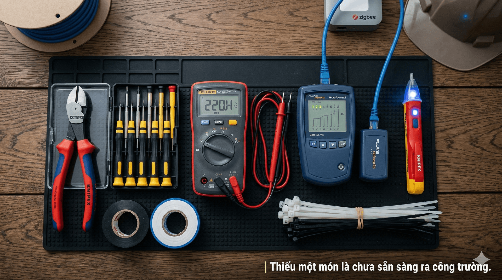

## Mục tiêu
- Trang bị đủ dụng cụ bắt buộc khi đi công trình.
- Dùng thành thạo thiết bị đo để đảm bảo an toàn và chính xác trước khi vận hành.

---

Thiếu một món là chưa sẵn sàng ra công trường.

## 1. Dụng cụ cơ bản

Thiếu một trong những thứ dưới đây thì coi như chưa sẵn sàng ra công trường.

| Dụng cụ | Dùng để làm gì | Lưu ý |
|:---|:---|:---|
| Tuốc-nơ-vít dẹt + bake | Tháo/lắp ốc vít | Bộ nhiều size, có đầu nam châm |
| Kìm cắt | Cắt dây điện, thít nhựa | Loại cách điện 1000V |
| Kìm tuốt dây | Tuốt vỏ dây điện | Chỉnh đúng tiết diện dây, tuốt thừa thì lõi đồng hở ra ngoài |
| Kìm bấm mạng (RJ45) | Bấm đầu mạng RJ45 | Chuẩn Cat5e/Cat6 |
| Máy khoan pin | Khoan bê tông, gỗ, bắt vít | Kèm bộ mũi khoan đa năng |
| Búa | Đóng tắc kê, đóng nở | Loại búa nhỏ (300g) |
| Thước cuộn (5m) | Đo khoảng cách, lấy dấu | Lấy dấu trước khi khoan |
| Đèn pin / Đèn đội đầu | Làm việc trong tủ, trần | Sạc đầy pin trước khi đi |
| Dây rút (thít nhựa) | Gom dây, cố định cáp | Nhiều kích cỡ |
| Băng keo điện | Cách điện mối nối | Quấn tối thiểu 3 lớp |
| Ống luồn / Nẹp điện | Bảo vệ và đi dây | Theo đúng kích thước thiết kế |

---

## 2. Thiết bị đo kiểm

Biết dùng thiết bị đo thì phân biệt được dây nào sống, mạch nào thông, cáp nào đạt. Không biết thì chỉ đoán mò — và đoán mò với điện 220V thì rất nguy hiểm.

### 2.1. Đồng hồ vạn năng

Đo được điện áp (xoay chiều và một chiều), dòng điện, điện trở và kiểm tra thông mạch.

Cách dùng phổ biến:
- Đo 220V xoay chiều: chuyển về thang ACV, cắm que đo vào nguồn.
- Kiểm tra thông mạch: chuyển về thang Ohm hoặc chế độ còi, chạm 2 đầu dây — có tiếng kêu là thông.
- Đo một chiều: dùng khi đo adapter, pin hoặc nguồn cấp cho camera.

Lưu ý: tuyệt đối không đo dòng xoay chiều khi đang để thang đo một chiều, sẽ hỏng máy.

### 2.2. Bút thử điện

Kiểm tra nhanh dây pha (dây lửa). Chạm đầu bút vào đầu dây hoặc cọc đấu — đèn sáng là có điện.

Trước khi dùng, luôn thử bút trên nguồn đang có điện đã biết trước. Bút hết pin hoặc hỏng mà không kiểm tra trước thì rất nguy hiểm.

### 2.3. Thiết bị test cáp mạng

Kiểm tra 8 sợi bên trong cáp mạng có đấu đúng thứ tự không. Cắm 2 đầu cáp vào bộ chính và bộ phụ, quan sát 8 đèn LED sáng lần lượt từ 1 đến 8 là đạt chuẩn T568B.

### 2.4. Thiết bị test mạng nâng cao

Kiểm tra tốc độ thực tế, nguồn cấp qua cáp mạng, cấu hình mạng và lệnh Ping. Thường dùng trong giai đoạn nghiệm thu hoặc khi cần xử lý sự cố phức tạp.

---

## 3. Sử dụng an toàn

1. Kiểm tra tình trạng dụng cụ (vỏ cách điện, pin máy đo) trước khi bắt đầu. Máy đo hết pin cho kết quả sai, nguy hiểm hơn là không đo.
2. Không cầm thiết bị đo khi tay ướt hoặc đứng trên nền ẩm.
3. Ngắt nguồn 220V trước khi dùng dụng cụ cầm tay tiếp xúc trực tiếp với lõi đồng.
4. Đeo kính bảo hộ khi khoan cắt. Bụi bê tông và mạt sắt văng vào mắt là tai nạn hay gặp nhất ở công trường.

---

## 4. Bảo dưỡng dụng cụ

| Thiết bị | Nội dung | Khi nào |
|:---|:---|:---|
| Đồng hồ vạn năng | Kiểm tra pin và vệ sinh que đo | Khi có cảnh báo pin yếu |
| Kìm các loại | Tra dầu, vệ sinh lưỡi cắt | Hàng tháng |
| Máy khoan pin | Vệ sinh bụi, kiểm tra đầu kẹp | Sau mỗi đợt công trình |
| Máy test cáp | Thay pin dự phòng | Khi đèn báo mờ |

Cất dụng cụ vào túi hoặc hộp đồ nghề chuyên dụng, tránh để ẩm ướt hoặc va đập. Khi dụng cụ có dấu hiệu hỏng hoặc cho kết quả sai, báo quản lý ngay — không tự sửa máy đo chính xác.
