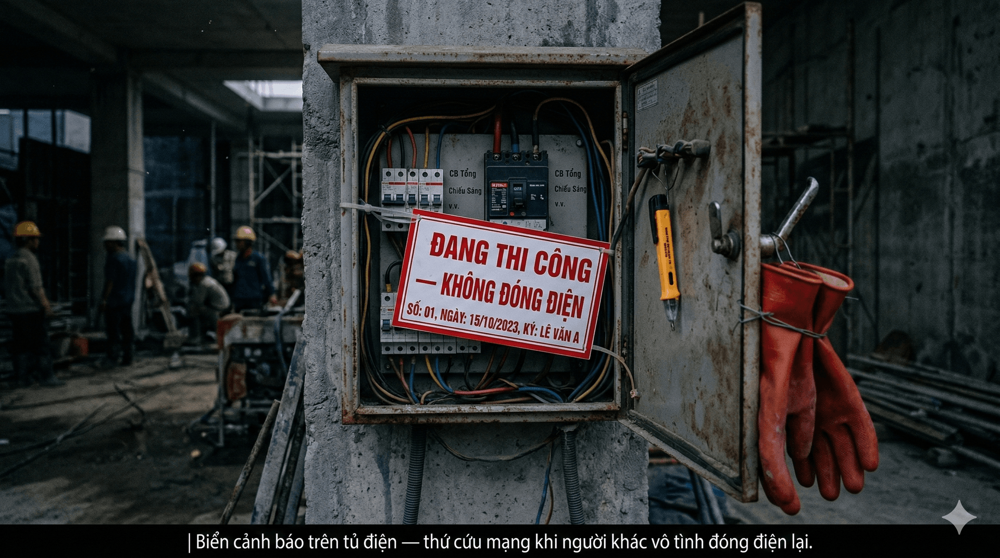

## Mục tiêu
- Thuộc các quy tắc an toàn điện và an toàn công trình trước khi thao tác.
- Biết xử lý tình huống khẩn cấp: điện giật, cháy chập, ngã cao.

---

Biển cảnh báo trên tủ điện — thứ cứu mạng khi người khác vô tình đóng điện lại.

## 1. An toàn điện

Điện 220V giật chết người. Nghe thì ai cũng biết, nhưng tai nạn điện ở công trường vẫn xảy ra đều đặn vì thợ chủ quan hoặc vội.

5 nguyên tắc bắt buộc:

1. Ngắt CB trước khi thao tác với dây điện 220V. Không có ngoại lệ.
2. Sau khi ngắt CB, dùng bút thử điện hoặc đồng hồ vạn năng kiểm tra lại xem còn điện không. CB có thể bị lỗi, hoặc ai đó đóng nhầm CB khác.
3. Không thao tác khi tay ướt hoặc đứng trên nền ẩm.
4. Không đóng CB khi chưa xác nhận an toàn với tất cả người trong khu vực.
5. Gắn biển "ĐANG THI CÔNG — KHÔNG ĐÓNG ĐIỆN" tại tủ điện. Đây là thứ cứu mạng khi có người khác vô tình đóng điện lại.

### Mức điện áp cần biết

| Loại | Điện áp | Mức nguy hiểm |
|------|---------|---------------|
| Điện lưới xoay chiều | 220V | Nguy hiểm chết người |
| Bus KNX | 29V một chiều | Thấp, nhưng vẫn cẩn thận |
| Bus DALI | 16V một chiều | Thấp |
| Nguồn cấp qua cáp mạng | 48V một chiều | Có thể gây giật nhẹ |
| Adapter | 5-24V một chiều | An toàn |

---

## 2. Trang bị bảo hộ

| Trang bị | Khi nào cần dùng |
|----------|------------------|
| Mũ bảo hộ | Tại công trình xây dựng |
| Kính bảo hộ | Khi khoan, cắt, mài |
| Găng tay cách điện | Khi thao tác với điện 220V |
| Găng tay vải | Khi kéo dây, lắp thiết bị |
| Giày bảo hộ | Tại công trường |
| Đai an toàn | Làm việc trên cao hơn 2m |
| Khẩu trang | Khi khoan bê tông (nhiều bụi) |

Thiếu bảo hộ mà xảy ra tai nạn thì trách nhiệm thuộc về cả người thợ lẫn người giám sát. Kiểm tra trước khi bắt đầu, không kiểm tra khi đã xong.

---

## 3. Xử lý sự cố khẩn cấp

### 3.1. Điện giật

1. Không chạm vào người bị giật khi chưa ngắt nguồn — nếu chạm thì cả hai cùng bị giật.
2. Ngắt CB hoặc rút phích cắm ngay.
3. Nếu không ngắt được, dùng vật cách điện (gậy gỗ, nhựa) tách nạn nhân ra khỏi nguồn điện.
4. Kiểm tra hô hấp. Nếu nạn nhân không thở, tiến hành hô hấp nhân tạo.
5. Gọi 115 (cấp cứu) ngay lập tức.

### 3.2. Cháy chập điện

1. Ngắt CB tổng.
2. Dùng bình chữa cháy CO2 hoặc bột. Tuyệt đối không dùng nước cho cháy điện.
3. Sơ tán khỏi khu vực.
4. Gọi 114 (cứu hỏa).

### 3.3. Ngã từ trên cao

1. Không di chuyển nạn nhân nếu nghi ngờ chấn thương cột sống.
2. Gọi 115 ngay.
3. Kiểm tra ý thức, hô hấp.
4. Cầm máu nếu có vết thương hở.

---

## 4. Phát hiện rủi ro thi công — Quy trình báo cáo

Không phải lúc nào công trường cũng sẵn sàng để thi công an toàn. Có khi đến nơi thấy nền ướt, dây điện hở, đồ đạc giá trị cao chưa che chắn, hoặc vị trí lắp đặt quá cao mà không có giàn giáo. Khi gặp tình huống như vậy, nguyên tắc số một là: **không thi công khi thấy không an toàn**.

### 4.1. Báo quản lý / công ty

Gửi báo cáo vào group hoặc chat trực tiếp, nội dung cần đủ 4 ý:

- **Công trình:** tên + địa chỉ.
- **Hạng mục đang làm:** ví dụ lắp đèn trần tầng 2, kéo dây tủ điện…
- **Vấn đề phát hiện:** nền ướt, dây điện hở, vị trí cao không có giàn giáo, đồ giá trị cao ngay khu vực thi công…
- **Đề xuất:** tạm dừng thi công / cần biện pháp bảo vệ / cần chủ nhà xác nhận.

Mẫu câu gửi nhanh:

> *"Phát hiện rủi ro thi công tại [công trình]. Khu vực [mô tả] có [vấn đề]. Đề xuất [tạm dừng / cần xác nhận]. Đã chụp hình hiện trạng."*

### 4.2. Báo chủ nhà

Nói ngắn, rõ, không làm chủ nhà hoang mang:

- Khu vực thi công hiện có rủi ro mất an toàn hoặc dễ ảnh hưởng tài sản.
- Kỹ thuật xin phép tạm dừng hoặc xác nhận phương án trước khi tiếp tục.
- Nhờ chủ nhà di dời đồ đạc / che chắn / xác nhận đồng ý cho thi công.

### 4.3. Nguyên tắc xử lý

1. **Dừng trước, hỏi sau.** Không cố thi công khi thấy nguy hiểm hoặc dễ gây thiệt hại tài sản.
2. **Chụp hình hiện trạng** ngay khi phát hiện — đây là bằng chứng bảo vệ mình và công ty.
3. **Báo cả hai bên** (quản lý + chủ nhà) trước khi quyết định làm tiếp hay dừng.

:::tip[Cụm từ nên dùng khi báo cáo]
- "Phát hiện rủi ro thi công"
- "Điều kiện thi công không an toàn"
- "Yêu cầu xác nhận trước khi thi công"

Dùng đúng cụm từ giúp quản lý hiểu ngay mức độ và xử lý nhanh hơn.
:::

---

## 5. Checklist an toàn công trường

- [ ] Trang bị bảo hộ đầy đủ.
- [ ] Biết vị trí tủ điện và CB tổng.
- [ ] Biết đường thoát hiểm.
- [ ] Biết vị trí bình chữa cháy.
- [ ] Đã gắn biển cảnh báo tại tủ điện (nếu thao tác điện).
- [ ] Có ít nhất 2 người khi làm việc trên cao.
- [ ] Không để dụng cụ hoặc vật liệu trên cao mà không có giá đỡ.
- [ ] Dây điện cắt ra phải cuộn gọn, không nằm dưới đất.
- [ ] Thang và giàn giáo phải ổn định trước khi leo.
- [ ] Sau khi xong: dọn vật liệu thừa, kiểm tra không có dây hở.
