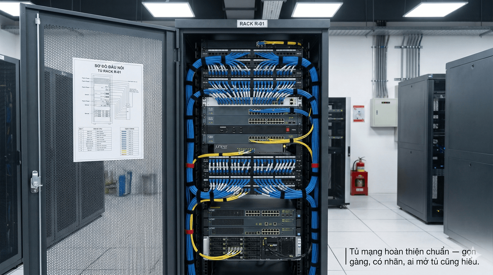

## Mục tiêu
- Nắm chiều cao lắp đặt và khoảng cách kỹ thuật chuẩn.
- Biết cách đi dây, đấu nối và hoàn thiện để bàn giao đẹp, dễ bảo trì.

---

Tủ mạng hoàn thiện chuẩn — gọn gàng, có nhãn, ai mở tủ cũng hiểu.

## 1. Chiều cao lắp thiết bị

Bảng này dùng cho trường hợp thông thường. Nếu bản vẽ thiết kế ghi khác thì theo bản vẽ, nhưng nếu sai lệch quá nhiều so với bảng dưới thì nên hỏi lại thiết kế.

| Thiết bị | Chiều cao (từ sàn) | Ghi chú |
|----------|-------------------|---------|
| Công tắc thông minh | 1.2m – 1.4m | Ngang tay khi đứng |
| Bảng điều khiển | 1.3m – 1.5m | Ngang tầm mắt |
| Camera trong nhà | 2.5m – 3.0m | Gắn trần hoặc tường |
| Camera ngoài trời | 3.0m – 4.0m | Tránh tầm tay với |
| Bộ phát WiFi | 2.5m – 3.0m | Gắn trần, ở giữa vùng phủ sóng |
| Cảm biến chuyển động | 2.2m – 2.5m | Thường gắn trần hoặc góc tường |
| Cảm biến cửa | Cạnh khung cửa | Thân trên khung, nam châm trên cánh |
| Bộ điều khiển trung tâm | 1.0m – 1.5m | Trên kệ hoặc ốp trần, gần giữa nhà |
| Tủ điện | 1.5m – 1.8m | Tâm tủ ngang tầm mắt |

---

## 2. Khoảng cách tối thiểu

| Quy tắc | Khoảng cách |
|---------|-------------|
| Cáp mạng chạy song song với cáp điện | ≥ 30cm |
| Cáp mạng giao nhau với cáp điện | Vuông góc 90° |
| Camera cách đèn chiếu sáng trực tiếp | ≥ 1m (tránh lóa) |
| Bộ phát WiFi cách nhau | 8m – 12m (tùy công suất) |
| Bộ điều khiển LifeSmart tới thiết bị xa nhất | ≤ 15m (qua tường) |
| Bus KNX — 2 thiết bị xa nhất | ≤ 700m |
| Bus DALI — tổng chiều dài | ≤ 300m |
| Bus CFLinks — tổng chiều dài | ≤ 500m (thực tế) |

---

## 3. Quy chuẩn kéo dây

### Tránh nhiễu

Cáp mạng (Cat6) và cáp bus (KNX) không đi chung ống với cáp điện 220V. Đi chung sẽ bị nhiễu, ảnh hưởng tín hiệu.

Cáp DALI được phép đi chung ống với cáp nguồn (theo tiêu chuẩn IEC 62386).

Cáp CFLinks phải tách khỏi cáp điện và dùng cáp xoắn đôi có chống nhiễu.

### Đi dây đúng cách

1. Đi theo tuyến thẳng, tránh bẻ góc nhọn. Bán kính uốn cong tối thiểu bằng 4 lần đường kính cáp.
2. Gom dây gọn gàng bằng thít nhựa, cứ 30-50cm thít một lần.
3. Dán nhãn ở cả 2 đầu cáp, ghi rõ điểm đầu và điểm cuối. Sau này bảo trì mà không có nhãn thì phải rò từng sợi, tốn rất nhiều thời gian.
4. Để dư 30-50cm tại mỗi đầu dây. Khi cần sửa chữa hoặc bấm lại đầu mạng thì có dây dự phòng.
5. Không kéo căng dây. Dây cần có độ chùng vừa đủ.

### Trong tủ điện và tủ mạng

Dây đi vào tủ từ phía dưới lên, gom gọn bằng nẹp hoặc ống. Dây ra thiết bị phải có nhãn rõ ràng. Trong tủ phải dán sơ đồ đấu nối để ai mở tủ cũng hiểu được. Dây thừa cuộn gọn, không để lộn xộn.

---

## 4. Checklist hoàn thiện

### Thẩm mỹ
- [ ] Thiết bị gắn thẳng hàng, không lệch.
- [ ] Mặt công tắc và ổ cắm ép sát tường, không hở khe.
- [ ] Camera gắn chắc, không lung lay.
- [ ] Bộ phát WiFi gắn gọn trên trần, cáp không lộ.
- [ ] Dây chạy nổi có nẹp hoặc ống, thẳng hàng.

### Gọn gàng
- [ ] Trong tủ: dây gom gọn, có nhãn, có sơ đồ.
- [ ] Không có dây thừa bên ngoài tủ.
- [ ] Không có vật liệu thừa tại vị trí lắp đặt.
- [ ] Khu vực thi công dọn dẹp sạch khi hoàn thành.

### Kỹ thuật
- [ ] Mối nối điện chắc chắn (dùng domino hoặc wago, không nối xoắn rồi quấn băng keo).
- [ ] Cáp mạng bấm đúng chuẩn T568B, test đạt 8/8.
- [ ] Ốc vít siết chặt, không lỏng.
- [ ] Không có dây điện hở, cách điện đầy đủ.

---

## 5. Bài tập thực hành

1. Đo và đánh dấu vị trí lắp 3 công tắc trong 1 phòng theo chiều cao chuẩn.
2. Kéo 1 tuyến cáp mạng từ tủ mạng đến vị trí camera, đúng quy chuẩn (tách cáp điện, nhãn 2 đầu).
3. Bấm 2 đầu cáp mạng Cat6 chuẩn T568B, test đạt 8/8.
4. Tổ chức 1 tủ điện mẫu: gom dây, nhãn, sơ đồ.
