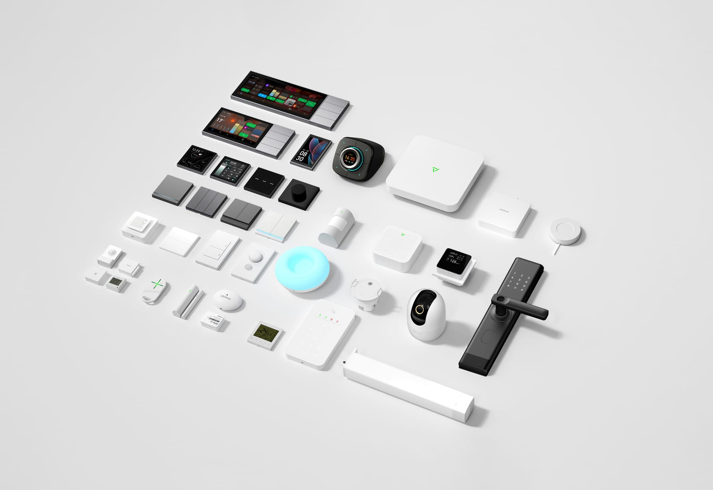
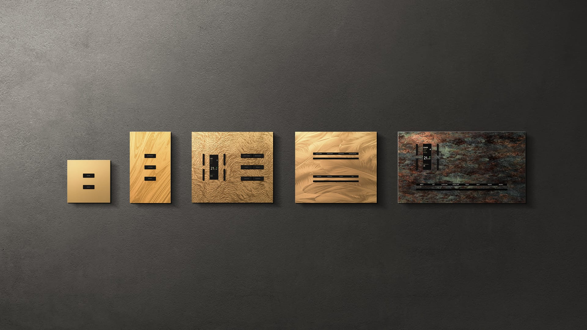
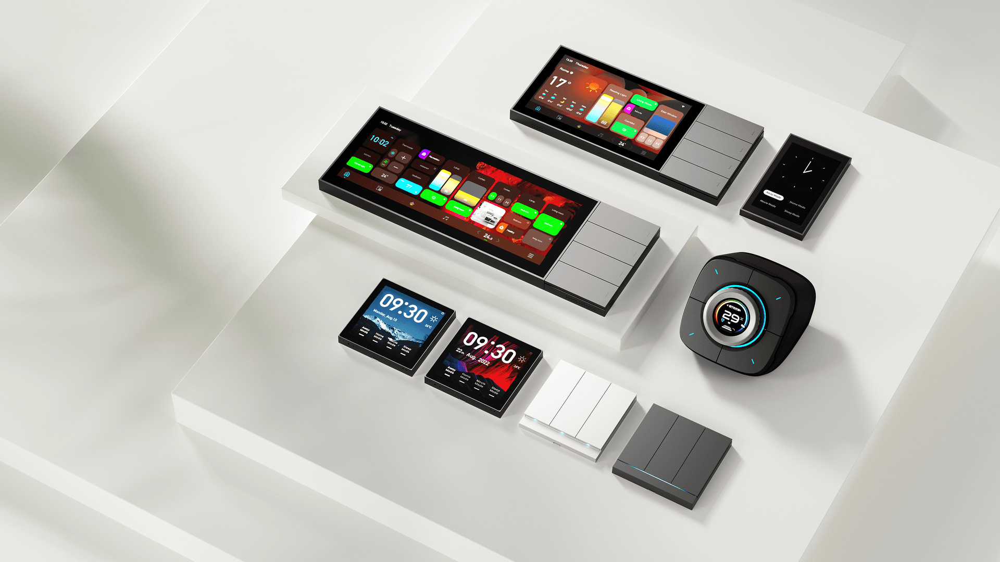
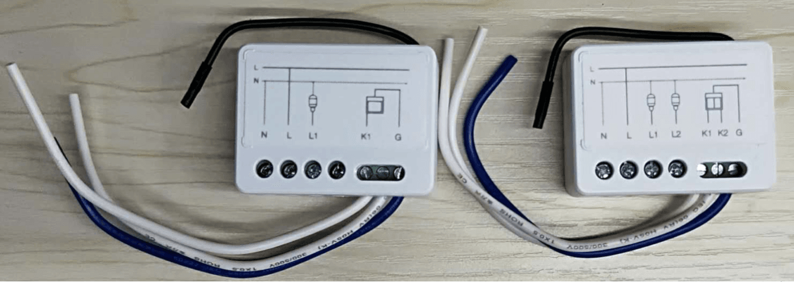
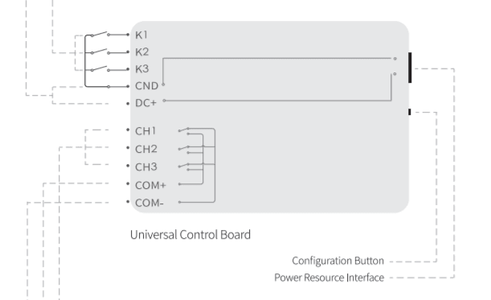
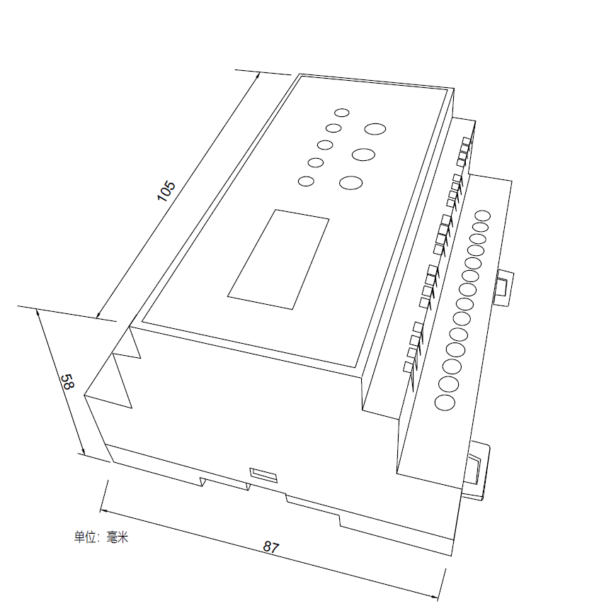
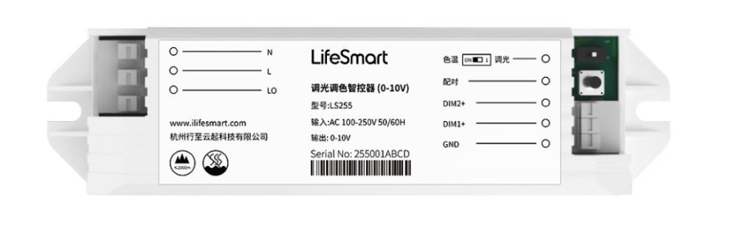
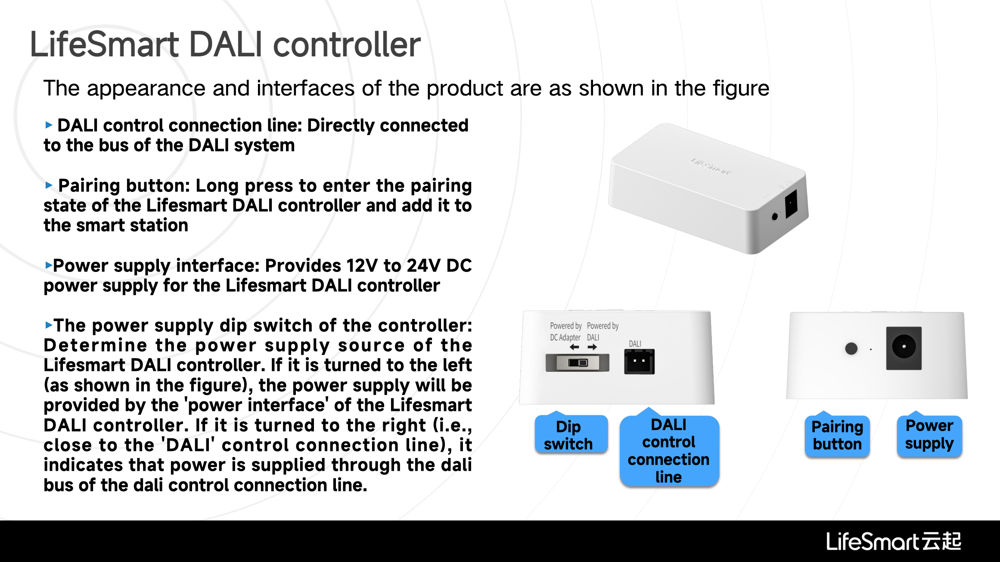

## Mục tiêu
- Phân loại thiết bị LifeSmart theo nhóm để biết chọn đúng cho từng công trình.
- Nhìn vào danh sách là phân biệt được đâu là bộ điều khiển, đâu là cảm biến, đâu là công tắc.

---

Các nhóm thiết bị LifeSmart: Từ bộ điều khiển trung tâm đến hệ thống an ninh và cảm biến.

## 1. Bộ xử lý trung tâm (Smart Station)

Smart Station là "bộ não" của hệ sinh thái LifeSmart, đóng vai trò kết nối, xử lý dữ liệu và điều phối mọi hoạt động tự động hóa trong ngôi nhà.

| thiết bị | Chức năng | Giao thức |
|---|---|---|
| Smart Station (Standard) | Bộ điều khiển chính, kết nối cảm biến và thiết bị đầu cuối | CoSS, Zigbee, Z-Wave, Ethernet |
| DEFED Smart Station | Chuyên dụng cho an ninh, có pin dự phòng, khe SIM 4G | CoSS, Zigbee, Ethernet, 4G |
| Nature Mini / PRO | Màn hình cảm ứng tích hợp chức năng Smart Station (Gateway) | CoSS, Zigbee, WiFi, Ethernet |

Xem chi tiết tính năng Smart Station

#### 1. Chức năng chính
- **Trái tim hệ thống**: Thu thập dữ liệu từ cảm biến gửi về (cửa, chuyển động, nhiệt độ...) và phát lệnh điều khiển đến thiết bị đầu cuối (công tắc, rèm, điều hòa...).
- **Tự động hóa**: Lưu trữ và vận hành các kịch bản AI Builder ngay cả khi mất kết nối mạng internet (với các lệnh nội bộ).

#### 2. Các phiên bản nổi bật
- **Bản tiêu chuẩn**: Phù hợp cho đa số căn hộ và hộ gia đình. Kết nối mạng qua cổng LAN RJ45 ổn định.
- **Bản DEFED**: Dòng sản phẩm an ninh chuyên sâu. Tích hợp sẵn pin dự phòng và cổng SIM 4G để hệ thống báo động vẫn hoạt động xuyên suốt ngay cả khi kẻ trộm cắt điện hoặc cắt cáp mạng.
- **Dòng Nature (Gateway mode)**: Các màn hình thông minh như Nature Mini hoặc Nature Mini PRO ngoài việc hiển thị điều khiển, còn hỗ trợ chức năng làm bộ trung tâm để kết nối các thiết bị con khác quanh khu vực lắp đặt.

---

## 2. Công tắc thông minh

### 2.1. Công tắc dòng SUBLIME

Dòng công tắc nghệ thuật cao cấp. Đa dạng số nút. Kích thước lắp đặt đa dạng từ chuẩn vuông 86x86 đến bộ trung tâm màn hình cỡ lớn.

Các phiên bản và kích thước đa dạng của dòng công tắc SUBLIME.

Xem thông số và tính năng

Dòng SUBLIME không đơn giản là công tắc treo tường. Đây là sự kết hợp giữa công nghệ thông minh và vẻ đẹp nghệ thuật, hướng tới phân khúc biệt thự và căn hộ cao cấp.

#### 1. Công nghệ lõi và cấu trúc phần cứng

Điểm nhấn kỹ thuật lớn nhất nằm ở cấu trúc chèn mô-đun đa lớp. Phần rơ-le chịu tải (đế âm) và mặt hiển thị được tách bạch hoàn toàn, giúp anh em thi công đấu nối dây và kiểm tra tải rơ-le trước. Đợi công trình qua giai đoạn bả sơn sạch sẽ rồi mới ráp mặt phím lên — tránh hư hao bề mặt. Hệ thống tương thích kép với cả bo mạch chạy mạng dây và không dây nên dễ kết hợp trong cùng một căn nhà.

#### 2. Thông số các phân khúc mặt công tắc

Hãng chia rành mạch các dải sản phẩm theo kích thước để anh em thả đế âm và đi cáp cho chuẩn ngay từ lúc làm thô:

| Phân khúc | Kích thước | Đặc điểm |
|---|---|---|
| The Line | 516×42 mm | Dạng thanh dài, gom chung phím cơ, màn hình và đầu cấp nguồn USB-C |
| Classic | 86×86 mm | Lắp vừa y đế âm vuông, trụ cột ở các khu vực sinh hoạt chung. Có thể tích hợp thêm mặt cắm LAN |
| Standard | 86×150 mm | Đế âm chữ nhật, phổ biến nhất cho căn hộ chung cư cao cấp |
| Bedside | Theo cấu hình | Chuyên cho cụm tủ đầu giường, cho phép tùy chọn rời mô-đun cấp nguồn và điều khiển |
| Air | 86×86 mm | Siêu mỏng chỉ 3.7 mm, lắp nổi tường |
| Pro | 172×150 mm | Bảng tích hợp phím cứng với màn hình lớn. Yêu cầu tính toán đế chôn tường chuẩn xác |
| Max | 258×150 mm | Bảng lai phím cứng + màn hình, phù hợp phòng khách lớn |
| Ultra | 316×170 mm | Bảng chỉ huy lớn nhất, trang bị màn hình 12.3 inch. Có thể vẽ toàn bộ mô hình nhà để điều khiển (RoomMap) |

Về chất liệu, mặt viền hoàn toàn có thể đặt tùy chỉnh riêng. Từ kim loại khắc CNC (Elite, Premium, Signature) cho đến ốp gỗ, bọc da theo đúng yêu cầu thiết kế nội thất, ẩn giấu hẳn công tắc vào kiến trúc căn biệt thự.

#### 3. Cấu trúc Actuator và giao thức CoSS cục bộ

Điều làm nên sự khác biệt của SUBLIME chính là kiến trúc tách rời giữa mặt hiển thị (Panel) và mô-đun chấp hành (Actuator). Hai thành phần này giao tiếp với nhau qua các chân ma trận tiếp điểm mạ vàng chống nhiễu.

#### 4. Thông số tải và giao thức truyền thông CoTP

Mỗi cấp độ thiết kế tương ứng một Actuator khác nhau.

| Dòng sản phẩm | Nút kịch bản | Chuẩn đế âm | Đặc trưng |
|---|---|---|---|
| SUBLIME Max | 8 | Đôi (120/150) | Tích hợp lai mặt chạm lớn và phím cơ |
| SUBLIME Pro | 6 | 86×86 / Vát | Phù hợp phòng khách lớn, cụm kết hợp |
| SUBLIME Standard | 4 | 86×86 | Phổ biến nhất cho căn hộ chung cư cao cấp |
| SUBLIME Classic | 2 | 86×86 | Dùng cho khu vệ sinh, hành lang hẹp |

#### 5. Cốt lõi dành cho đội ngũ triển khai

Với anh em kỹ thuật, công việc quan trọng nhất là tính toán kỹ thông số tải hệ thống, tránh trường hợp quá công suất tiếp điểm rơ-le ở các cụm đóng cắt. Nắm nguyên tắc kéo dây tín hiệu điều khiển đúng sơ đồ và cấp nguồn màn hình chuẩn định mức. Lúc lắp mặt, xem kỹ hình vẽ cấu trúc chèn ráp đa lớp để ốp khung chuẩn vào rãnh ngàm — sai một chút là gãy chân chốt.

Với đội ngũ bán hàng, giá trị của SUBLIME nằm ở khả năng tùy chỉnh mặt công tắc theo phong cách nội thất. Mỗi chiếc mặt bảng SUBLIME có thể hòa mình thành một phần không gian sống thay vì lộ ra như thiết bị điện. Đối với các dự án diện tích lớn, dòng Ultra với màn hình 12.3 inch rất trực quan, giao diện hiển thị lớn phù hợp cho các chủ nhà thích điều khiển ngay trên tường thay vì mở điện thoại.

### 2.2. Dòng màn hình Nature

Dòng màn hình cảm ứng gắn tường cho phép thao tác tập trung toàn bộ hệ thống nhà thông minh. Đặc biệt có trang bị phím bấm vật lý hỗ trợ thao tác nhanh. Hành vi sử dụng chân thực, rất tiện lợi cho người già và trẻ em trong nhà.

Màn hình Nature 7 và Nature Mini - Trung tâm điều khiển cảm ứng gắn tường.

Xem thông số và tính năng

Dòng Nature là niềm tự hào của LifeSmart trong phân khúc màn hình điều khiển gắn tường. Điểm khác biệt lớn nhất so với các dòng màn hình cảm ứng thuần túy trên thị trường là Nature giữ lại các phím bấm vật lý, giúp người dùng (đặc biệt là người già và trẻ em) có thể kích hoạt nhanh các kịch bản quan trọng mà không cần nhìn vào màn hình.

#### 1. Màn hình điều khiển trung tâm Nature 7

Nature 7 là dòng màn hình cao cấp nhất, đóng vai trò như một bộ não hiển thị cho toàn bộ căn nhà. Với kích thước 7 inch, không gian thao tác cực kỳ thoải mái.

Bên cạnh màn hình cảm ứng, thiết bị có dãy phím cơ bên dưới có thể cấu hình tùy ý. Thông thường anh em sẽ gán cho các kịch bản: Về nhà, Đi ngủ, hoặc Bật toàn bộ đèn phòng khách. Khung vỏ nhôm nguyên khối, chắc chắn và sang trọng khi chạm vào. Nature 7 còn tích hợp xem trực tiếp luồng camera Hikvision và điều khiển nhạc đa vùng ngay trên màn hình mà không cần mở điện thoại.

#### 2. Các dòng màn hình Nature Mini

Nếu Nature 7 phù hợp cho phòng khách hoặc sảnh chính, thì Nature Mini là giải pháp phù hợp cho phòng ngủ hoặc khu vực hành lang nhờ kích thước nhỏ gọn.

**Nature Mini (Bản tiêu chuẩn)**
Dùng để điều khiển các thiết bị trong phòng. Tuy nhỏ nhưng vẫn đảm bảo độ sắc nét và tốc độ phản hồi lệnh tức thì qua giao thức CoSS.

**Nature Mini Pro**
Điểm nâng cấp đáng giá nhất của dòng Pro là khả năng đa giao thức. Ngoài CoSS để giao tiếp với bộ điều khiển trung tâm, nó còn tích hợp sẵn Zigbee 3.0, Bluetooth (BLE) và Z-Wave.

Lợi ích thực tế: anh em có thể dùng Nature Mini Pro để kết nối trực tiếp với các thiết bị Zigbee của hãng khác (như đèn Philips Hue, cảm biến Aqara) mà không cần thêm bộ điều khiển trung gian của các hãng đó. Hệ thống gọn gàng và ổn định hơn rất nhiều.

### 2.3. Dòng mô-đun Công tắc (CUBE Switch Module)

Công tắc dạng hộp nhỏ xíu, thiết kế giấu lọt thỏm trong đế âm phía sau công tắc công nghiệp.

Xem thông số và ứng dụng CUBE Switch Module

Mô-đun CUBE có kích thước siêu nhỏ, thiết kế để nhét vừa vặn vào đế âm phía sau công tắc cơ.

#### 1. Môi trường lắp đặt và yêu cầu tải

CUBE Switch Module giấu mình hoàn toàn phía sau mặt nạ công tắc lẩy truyền thống. Do chia sẻ không gian hộp đế âm tường chật hẹp, anh em thi công cần đáp ứng các yêu cầu sau:

- Khoảng không gian sâu đáy hộp đế âm tối thiểu phải còn rỗng 16–20 mm tính từ mặt đít công tắc cơ để nhét được CUBE. Nếu hộp quá nông thì không cố ép — sức căng lớn sẽ bục chân terminal đồng trên mô-đun.
- Bắt buộc kéo dây nguội (N): Module cần được nuôi điện liên tục. Trong hộp công tắc phải có cả dây N (nguội) và dây L (lửa). Thiếu dây nguội thì hệ thống không chạy được.
- Tải trọng tối đa cho phép: với tải thuần trở (đèn sợi đốt) không quá 300W. Với tải cảm kháng hoặc dung kháng có dòng khởi động lớn (đèn LED phổ thông, quạt thông gió nhỏ) phải hạ xuống dưới 150W mỗi kênh. Không dùng Module để gánh bình nóng lạnh hay máy bơm cao áp.
- Ăng-ten: đoạn dây đen thò ra hông chính là ăng-ten bắt sóng CoSS lên bộ điều khiển trung tâm. Lúc nhồi Module vào tường, lựa chiều ăng-ten vểnh ra phía sát mặt nạ. Không cuộn tròn xoắn ăng-ten cho gọn, không bẻ gãy gập góc 90 độ, và tránh xa viền mặt nạ kim loại — kim loại sẽ chắn sóng như lồng Faraday làm thiết bị mất kết nối.

### 2.4. Các dòng công tắc khác

| Thiết bị | Chức năng | Ghi chú |
|---|---|---|
| BLEND | 1–3 nút | Nút bấm cơ, mặt nhựa hoặc kim loại |
| Polar | 1–3 nút | Nút bấm cơ, mặt nhựa (đơn giản) |
| 120 Switch | 1–3 nút | Đế chữ nhật |

## 3. Bộ điều khiển đa năng

Đây là nhóm thiết bị quan trọng nhất để tích hợp các hệ thống của bên thứ ba (cửa cuốn, cổng tự động, hệ thống tưới, cảm biến công nghiệp...) vào hệ sinh thái LifeSmart.

General Controller là hộp xử lý tiếp điểm khô thông minh, hỗ trợ cả việc điều khiển (ngõ ra) và nhận tín hiệu (ngõ vào).

Xem thông số và ứng dụng General Controller

Bảng mạch General Controller xử lý tốt thiết bị 3 trạng thái và cảm biến độc lập.

#### 1. Thông số thiết bị

General Controller là hộp rơ-le 3 kênh kết hợp thêm ngõ vào nhận tín hiệu. Mục đích chính là biến các thiết bị tự động bình thường (mô-tơ cổng, cửa cuốn, chuông báo) thành thiết bị thông minh điều khiển qua ứng dụng LifeSmart.

- **Nguồn cấp nuôi**: 12V hoặc 24V một chiều qua chân tròn tiêu chuẩn (5.5×2.5 mm) hoặc đấu dây trực tiếp vào chân domino DC+ / GND. Chỉ cắm 1 trong 2 đường nguồn, cắm cả hai cùng lúc sẽ hỏng bảng mạch.
- **Ngõ vào tín hiệu (Input)**: khung K1, K2, K3 — dùng nhận tín hiệu từ nút nhấn khẩn cấp, báo khói hoặc công tắc từ có dây.
- **Ngõ ra rơ-le (Output)**: khung CH1, CH2, CH3 — cụm đóng rơ-le qua chân COM- / COM+. **Lưu ý quan trọng:** mạch thiết kế để chân COM- nối chung cả 3 kênh (NC — Normally Closed). Nếu chỉ dùng 1 kênh duy nhất thì đấu thẳng được. Nhưng khi dùng từ 2 kênh trở lên đồng thời, tín hiệu điều khiển sẽ bị nhiễu chéo qua lại giữa các chân — rất dễ gây loạn lệnh hoặc cháy thiết bị đang được điều khiển. **Vì vậy, nếu sử dụng cả 2–3 kênh cùng lúc, bắt buộc phải đấu qua rơ-le trung gian để cách ly từng kênh riêng biệt.**
- **Tải tối đa**: kéo được 3A mỗi kênh. Các thiết bị công suất lớn (máy bơm tưới cây, van từ) thì phải thêm rơ-le trung gian.

## 4. Điều hòa

Thiết bị hỗ trợ kết nối hệ thống điều hòa trung tâm vào chung ứng dụng nhà thông minh.

### 4.1. Bộ điều khiển điều hòa trung tâm (HVAC Gateway)

Điều khiển điều hòa trung tâm VRV/VRF. Giúp các dàn lạnh hiển thị như một thiết bị riêng biệt trên ứng dụng LifeSmart.

Xem thông số và tính năng HVAC Gateway

Bảng cổng kết nối và màn hình hiển thị trực quan của bộ chuyển đổi điều hoà trung tâm.

#### 1. Thông số cốt lõi

HVAC Gateway giúp đưa dàn lạnh trung tâm của các hãng (Daikin, Toshiba, Hitachi, Mitsubishi, Panasonic...) vào chung hệ sinh thái LifeSmart.

Các thông số phần cứng anh em kỹ thuật cần lưu ý:

- Nguồn nuôi bắt buộc 12V một chiều. Đừng bao giờ cắm nhầm 24V hay 220V — cắm sai là đứt cầu chì luôn, có trường hợp cháy cả bo mạch.
- Dây kết nối điều hòa: dùng cáp tín hiệu 2 lõi xoắn có bọc chống nhiễu, tiết diện lớn hơn 0.75mm². Tránh để song song với dây cấp điện xoay chiều (L), khoảng cách cách ly khuyến cáo ít nhất 30cm để không rớt tín hiệu.
- Các cổng ra tín hiệu: có cụm cổng dữ liệu điều hoà (AIR CON Terminals).

### 4.2. Bộ điều khiển điều hòa PRO (LS212)

Bộ điều khiển có dây kết nối trực tiếp vào dàn lạnh (indoor unit) của hệ thống HVAC, biến từng dàn lạnh riêng lẻ thành thiết bị thông minh trên ứng dụng LifeSmart.

Xem thông số và tính năng LS212

#### 1. Khi nào dùng LS212 thay vì HVAC Gateway?

LS212 phù hợp cho những trường hợp đặc biệt mà HVAC Gateway thông thường không xử lý được:

- Hệ thống điều hòa lắp chung cho toàn tòa nhà, nhưng chỉ cần biến dàn lạnh ở một tầng hoặc vài văn phòng thành thiết bị thông minh — không cần (hoặc không được phép) can thiệp vào toàn bộ hệ thống HVAC.
- Hệ thống HVAC đã có sẵn bộ điều khiển tập trung (centralized control) của hãng điều hòa và không thể kết nối thêm HVAC Gateway vào đường bus chung.

#### 2. Cấu tạo và đèn báo trạng thái

Thiết bị bao gồm: nút SET (cài đặt), cổng giao tiếp điều hòa (AIR CON Interface), cổng kết nối panel nhiệt độ bên thứ 3 (Panel Interface) và cổng xuất nguồn cho panel bên thứ 3.

Hai đèn LED chỉ báo trạng thái:

| Đèn | Sáng cố định | Nháy nhanh | Nháy chậm | Tắt |
|---|---|---|---|---|
| RUN | Tìm thấy điều hòa, hoạt động bình thường | Đang tìm kiếm điều hòa | — | Không tìm thấy điều hòa |
| STA | Điều hòa đang bật | Điều hòa báo lỗi bất thường | Panel nhiệt độ bên thứ 3 bị lỗi | Điều hòa đang tắt |

#### 3. Thương hiệu tương thích

LS212 hỗ trợ hầu hết các thương hiệu điều hòa lớn trên thị trường: Daikin, Hitachi, Hisense, York, Toshiba, Panasonic, Mitsubishi Heavy/Electric, Midea, GREE, Haier...

Thiết bị cho phép dùng song song với panel điều khiển gốc của hãng điều hòa, nhưng phải thiết lập chế độ Master (Chính) và Slave (Phía) thông qua công tắc gạt DIP switch hoặc cài đặt trên panel gốc.

## 5. Rèm

| Thiết bị | Chức năng | Lưu ý |
|---|---|---|
| QuickLink Motor | Motor rèm + ray lắp ráp module | Nếu là rèm 2 lớp thì hộc rèm cần 25cm |
| Tubular Motor | Motor rèm cuốn ống | Dùng cho rèm cuốn |
| MINS Curtain Controller | Module điều khiển rèm trung gian | Dùng cho động cơ rèm truyền thống |

### 5.1. Động cơ rèm QuickLink (QuickLink Curtain Motor)

Động cơ rèm QuickLink là hệ thống rèm thông minh hoạt động độc lập. Một bộ sản phẩm tiêu chuẩn gồm 3 thành phần: động cơ rèm thông minh, hệ thống thanh ray QuickLink và điều khiển từ xa (remote).

Xem thông số và tính năng QuickLink

#### 1. Tính năng nổi bật

- **Điều khiển đa dạng**: hỗ trợ điều khiển từ xa qua ứng dụng khi ở ngoài nhà, điều khiển bằng giọng nói qua loa thông minh, và sử dụng remote cầm tay đi kèm.
- **Tự động hóa theo ngữ cảnh**: hẹn giờ mở/đóng rèm (ví dụ: tự mở rèm 8 giờ sáng), liên kết với cảm biến ánh sáng hoặc cảm biến chuyển động để kích hoạt tự động.
- **Khởi động nhẹ bằng tay (Manual Start-up)**: chỉ cần kéo nhẹ rèm một đoạn, động cơ sẽ tự nhận biết và tiếp tục kéo hết hành trình.
- **Tự dừng khi gặp vật cản (Obstacle Stop)**: bảo vệ động cơ và tránh hư hại rèm hoặc đồ vật xung quanh.
- **Khi mất điện**: vẫn kéo rèm bằng tay như rèm thường, không bị kẹt.

#### 2. Đặc điểm thanh ray (QuickLink Track)

Điểm khác biệt lớn nhất của dòng QuickLink so với motor rèm truyền thống là hệ thống ray tự lắp ráp dạng module. Không cần đo đạc và đặt xưởng cắt ray theo kích thước riêng — anh em mua ray theo các đoạn chuẩn rồi tự ghép thành bất kỳ chiều dài nào mong muốn.

Các đoạn ray module có sẵn:

| Loại | Kích thước |
|---|---|
| Ray chính | 1m, 0.5m, 0.2m, 0.1m |
| Thanh nối (Connector) | 0.2m, 0.1m |

Vỏ ray làm bằng nhôm, nhẹ và chắc chắn.

#### 3. Thông số kỹ thuật

| Thông số | Giá trị |
|---|---|
| Kích thước động cơ | 50×50×270 mm |
| Nguồn điện đầu vào | AC 100–240V, 50/60Hz |
| Công suất | 40W |
| Lực kéo (Torque) | 1.2 Nm |
| Độ ồn | 40 dB |
| Tải trọng (ray 0–4m) | Tối đa 50 kg |
| Tải trọng (ray 4–8m) | Tối đa 35 kg |
| Chuẩn bảo vệ | IP20 |

### 5.2. Bộ điều khiển rèm MINS (MINS Curtain Motor Controller)

Bộ điều khiển rèm MINS đóng vai trò là một module trung gian, giúp kết nối các loại động cơ rèm truyền thống vào hệ thống nhà thông minh LifeSmart.

Xem thông số và cơ chế điều khiển MINS

- **Smart hóa rèm truyền thống**: Biến các động cơ rèm điện thông thường (không có tính năng thông minh) thành rèm điều khiển qua ứng dụng, giọng nói và ngữ cảnh.
- **Lắp đặt linh hoạt**: Module có kích thước nhỏ, thường được đấu nối và giấu kín trên trần thạch cao gần động cơ hoặc giấu sau công tắc tường.

---

## 6. Cảm biến

| Thiết bị | Đo gì | Nguồn |
|---|---|---|
| Door Sensor | Cửa đóng/mở | Pin |
| Motion Sensor Pro | Chuyển động (hồng ngoại) | Pin (CR123A) |
| Human Presence Sensor | Hiện diện (Radar 24GHz) | AC 220V |
| CUBE Env | Nhiệt độ + độ ẩm + ánh sáng | Pin |
| Water Leak Sensor | Nước tràn | Pin |
| Smoke Sensor | Khói | Pin |
| Gas / CO2 / TVOC Sensor | Khí | USB |

### 6.1. Cảm biến cửa (Door/Window Sensor)

Dùng để nhận diện trạng thái đóng/mở của cửa chính, cửa sổ, tủ đồ hoặc ngăn kéo. Đây là thiết bị quan trọng nhất để làm điều kiện kích hoạt (Trigger) cho các kịch bản tự động hóa và an ninh.

Xem phân loại và thông số IO các dòng cảm biến cửa

#### 1. Cảm biến cửa CUBE (CUBE Door Sensor - SL_SC_BG)
Thiết kế vuông vức, tích hợp khả năng nhận diện rung chấn.
- **Cổng G**: Trạng thái Đóng/Mở.
- **Cổng B**: Trạng thái nút nhấn vật lý (0: không nhấn, 1: đang nhấn).
- **Cổng AXS**: Trạng thái rung chấn (Khác 0 khi phát hiện có rung/va chạm cửa).
- **Cổng V**: Mức pin.

#### 2. Cảm biến cửa DEFED (DEFED Window/Door Sensor - SL_DF_GG)
Dòng chuyên dụng cho an ninh, độ nhạy cao và chống tháo gỡ.
- **Cổng A**: Trạng thái cửa (Chẵn: Đóng, Lẻ: Mở).
- **Cổng A2**: Trạng thái cảm biến ngoài (khi đấu thêm dây tín hiệu ngoại vi).
- **Cổng T**: Nhiệt độ môi trường (Giá trị thực = Giá trị hệ thống * 10, đơn vị ℃).
- **Cổng TR**: Trạng thái chống tháo gỡ/Tamper (Lẻ: báo động có người phá/cạy cảm biến).
- **Cổng V**: Mức pin.

### 6.2. Cảm biến chuyển động (Motion Sensor)

Đóng vai trò là "mắt thần" giúp nhận diện sự hiện diện hoặc di chuyển của con người.

Xem phân loại và tính năng cảm biến chuyển động

#### 1. Motion Sensor Pro (LS235WH)
- **Công nghệ**: Hồng ngoại thụ động (PIR).
- **Phạm vi quét**: Khoảng cách 8 mét, góc quét bán cầu 120°.
- **Nguồn**: Pin CR123A, thời gian chờ lên đến 5 năm.
- **Thông số IO**: Cổng M hoặc P1 (0: Không chuyển động, 1: Có chuyển động).

#### 2. DEFED Motion Sensor
- Dòng chuyên dụng cho an ninh DEFED.
- Tích hợp thêm cảm biến nhiệt độ (Cổng T) và tính năng chống tháo gỡ Tamper (Cổng TR).

#### 3. Một số lưu ý kỹ lập trình
- Cổng **V** trả về mức pin (0-100%).

### 6.3. Cảm biến hiện diện Human Presence (MSA201 Z)

Khác với cảm biến chuyển động hồng ngoại (PIR) chỉ nhận diện được khi có người di chuyển, cảm biến hiện diện sử dụng sóng Radar 24GHz (Millimeter Wave) để nhận diện được cả người đang ngồi tĩnh, học bài hoặc đang ngủ dựa trên nhịp thở của lồng ngực.

Xem thông số kỹ thuật MSA201 Z

#### 1. Đặc điểm nổi bật
- **Công nghệ kép**: Kết hợp cảm biến vi sóng 24GHz và cảm biến ánh sáng (Illumination).
- **Giao thức**: ZigBee 3.0.
- **Nguồn điện**: AC 110-240V (đấu dây trực tiếp N-L).
- **Khả năng xuyên thấu**: Sóng radar có thể xuyên qua gỗ, kính, thạch cao (cần lưu ý khi lắp đặt để tránh trigger giả).

#### 2. Thông số kỹ thuật
- **Chiều cao lắp đặt**: 2.5 - 4m.
- **Bán kính phát hiện**: 
    - Chuyển động mạnh (Big motion): 3 - 4m.
    - Chuyển động nhẹ (Minor motion): 2.5 - 3.5m.
    - Nhịp thở/Hiện diện tĩnh (Breathing): 2.5 - 3.5m.
- **Kích thước khoét lỗ**: 55mm (âm trần).

---

## 7. An ninh

| Thiết bị | Chức năng |
|---|---|
| Yale Smart Lock | Module khóa Yale tích hợp |
| DEFED Siren | Còi báo động (Pin)|
| DEFED Key Fob | Điều khiển chế độ an ninh từ xa |

### 7.1. Khóa thông minh Yale (Yale/Gateman integration)

Khóa Yale (hoặc module kết nối khóa Yale/Gateman) được tích hợp sâu vào hệ sinh thái LifeSmart, cung cấp đầy đủ thông tin trạng thái và cảnh báo an ninh.

Xem thông số kỹ thuật và thuộc tính API Yale Lock

#### 1. Định danh thiết bị
Khóa Yale được nhận diện dưới các mã loại (Devtype/Cls):
- `SL_LK_GTM`: Khóa thông minh Yale.
- `SL_LK_YL`: Module kết nối khóa Yale/Gateman.

#### 2. Cấu hình mở khóa từ xa
Kỹ thuật viên có thể tùy chỉnh tính năng mở khóa qua tham số `enable_remote_unlock` (optarg):
- `1`: Cho phép mở khóa cửa từ xa qua ứng dụng.
- `0`: Vô hiệu hóa tính năng mở khóa từ xa.

#### 3. Giám sát và Cảnh báo (IO Ports)
Hệ thống nhận và xử lý chi tiết các thông số từ khóa:
- **Mức pin (BAT)**: Theo dõi % dung lượng pin còn lại.
- **Lịch sử truy cập (EVTLO, HISLK, EVTOP)**: Nhận biết chính xác người dùng và phương thức mở: Mật khẩu, Vân tay, Thẻ NFC, Chìa cơ, hoặc từ xa qua App.
- **Cảnh báo an ninh (ALM)**:
    - Nhập sai mật khẩu/vân tay quá 10 lần.
    - **Báo động bắt cóc (Kidnapping alarm)**: Kích hoạt khi dùng vân tay/mật khẩu "chống cưỡng ép". Khóa vẫn mở nhưng âm thầm gửi cầu cứu về hệ thống.
    - Cảnh báo cạy phá hoặc mở bằng chìa cơ trái phép.
    - Báo cháy, báo đột nhập, báo pin yếu.
    - Nhận tín hiệu chuông cửa từ khóa.

---

## 8. Điều khiển hồng ngoại

Dùng để thay thế các remote hồng ngoại thông thường (TV, quạt, máy lạnh rời).

| Thiết bị | Chức năng | Ghi chú |
|---|---|---|
| SPOT | Phát hồng ngoại thay remote | Có đèn tích hợp |
| SPOT Mini | Phiên bản nhỏ gọn | Gắn tường hoặc trần |

---

## 9. Điều khiển chiếu sáng (Dimmer)

Bộ điều khiển Dimmer giúp thay đổi cường độ sáng của đèn LED theo chuẩn 0-10V hoặc 1-10V.

### 9.1. Dimmer 0-10V Controller (LS180)

Thiết bị điều khiển Dimmer chuẩn cách ly an toàn, chuyên dụng cho các hệ thống đèn hỗ trợ giao thức dimming 0/1-10V.

Xem thông số và tính năng LS180

Dimmer Controller LS180 - Giải pháp điều khiển cường độ sáng chuyên dụng.

#### 1. Chức năng chính
- **Điều khiển 0/1-10V**: Thay đổi điện áp đầu ra từ 0V đến 10V để điều chỉnh độ sáng hệ thống đèn LED (Driver hỗ trợ 0-10V).
- **Điều khiển song song**: Một bộ LS180 có thể điều khiển song song lên đến 50 bộ đèn LED (tổng dòng điều khiển dưới 100mA).
- **Vận hành linh hoạt**: Hỗ trợ điều khiển qua ứng dụng, kịch bản (Scene), hẹn giờ (Schedule) và liên kết cảm biến (Trigger).

#### 2. Thông số kỹ thuật
- **Giao thức**: CoSS.
- **Ngõ ra**: 0-10V DC (Dòng điều khiển tối đa 100mA).
- **Khoảng cách dây tín hiệu**: Khuyến nghị không quá 20 mét để đảm bảo độ chính xác của điện áp dimming.
- **Nút vật lý**: Tích hợp nút bấm trên thân thiết bị để bật/tắt đèn trực tiếp khi cần thiết.

### 9.2. Dimmer DALI Controller

Bộ điều khiển DALI (Digital Addressable Lighting Interface) chuyên dụng cho các hệ thống chiếu sáng kỹ thuật số phức tạp, cho phép điều khiển chính xác từng đèn hoặc từng nhóm đèn riêng biệt.

Xem thông số và tính năng DALI Controller

DALI Controller - Giải pháp điều khiển chiếu sáng kỹ thuật số chuyên sâu.

#### 1. Chức năng chính
- **Địa chỉ định danh độc lập**: Mỗi đèn trong hệ thống DALI có một địa chỉ riêng, giúp điều khiển bật/tắt và dimming chính xác cho từng thiết bị hoặc nhóm bất kỳ.
- **Quy mô hệ thống**: Một đường bus DALI hỗ trợ tối đa 64 linh kiện, 16 nhóm và 16 kịch bản chiếu sáng.
- **Khoảng cách truyền tải**: Chiều dài cáp tối đa lên đến 300 mét. Hỗ trợ cấu trúc nối tiếp, hình sao hoặc hỗn hợp (không dùng dạng vòng).

#### 2. Thông số kỹ thuật
- **Giao thức**: CoSS (kết nối Hub) và DALI (kết nối đèn).
- **Nguồn cấp**: 12V - 24V DC.
- **Lưu ý**: Lệnh điều khiển từ DALI Controller là lệnh một chiều (unidirectional), không lấy được trạng thái phản hồi từ hệ thống DALI (do giới hạn giao thức DALI).

---

## Tài liệu tham khảo
- [LifeSmart Brochure 250929.pdf](https://drive.google.com/file/d/1fTBlvwOsanYKhR_P5AMORJnfAf_2o4uE/view?usp=drive_link)
- [Thư mục tài liệu tổng hợp LifeSmart (Drive)](https://drive.google.com/drive/folders/1RGZRgWJHFBUisvcJDJZeW6HBTIsZKWBy)
- [Thư mục tài liệu kỹ thuật LifeSmart (Drive)](https://drive.google.com/drive/folders/1B_znIzettzmx4HUYxsCR26Z_aZ9bF1Lm)
- [Bản vẽ kỹ thuật: Hệ thống Đèn](/drawings/MobiLife/MobiLife_Den.pdf)
- [Bản vẽ kỹ thuật: Hệ thống Máy nước nóng](/drawings/MobiLife/MobiLife_MayNuocNong.pdf)
- [Bản vẽ kỹ thuật: Dimmer 0-10V & Color](/drawings/MobiLife/MobiLife_Dimmer_0-10V_Color.pdf)
- [Bản vẽ kỹ thuật: Dimmer Dali](/drawings/MobiLife/MobiLife_Dimmer_Dali.pdf)
- [Bản vẽ kỹ thuật: Cửa cổng và Beam](/drawings/MobiLife/MobiLife_CuaCong_Beam.pdf)
- [Bản vẽ kỹ thuật: Cửa cuốn](/drawings/MobiLife/MobiLife_CuaCuon.pdf)

