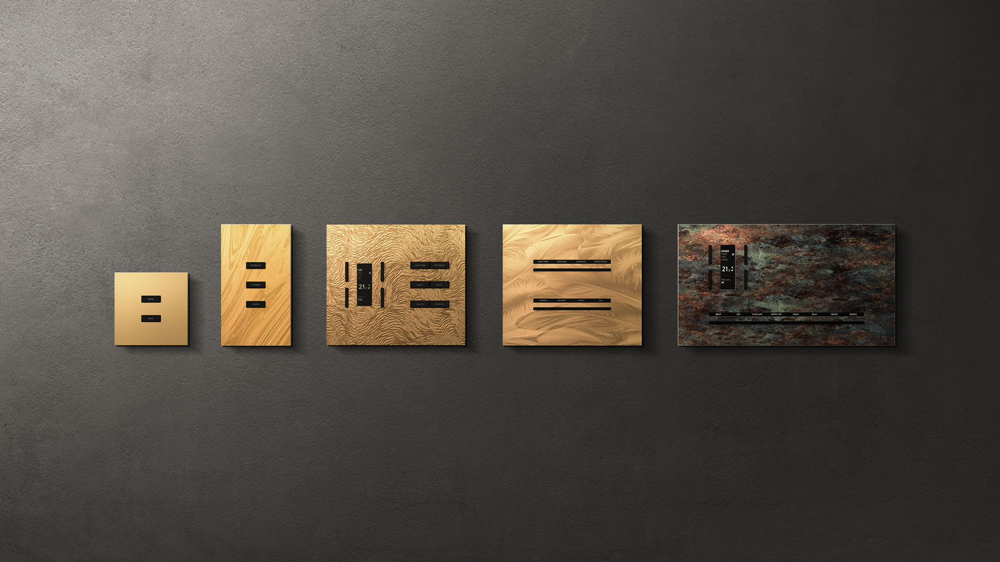
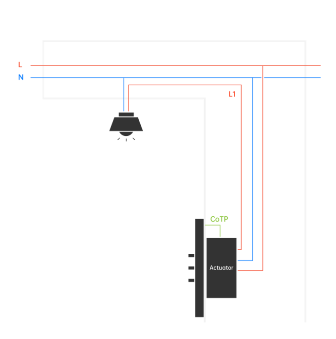

## Mục tiêu
- Nắm bắt điểm nhấn thiết kế và công nghệ lõi của dòng SUBLIME để tư vấn khách hàng cao cấp.
- Hiểu cấu trúc các phân khúc, khả năng tùy biến vật liệu và thông số các bộ chấp hành để triển khai kỹ thuật chuẩn xác.

---

Dòng SUBLIME: Tái định nghĩa không gian bằng bộ sưu tập nâng tầm công nghệ và chế tác mặt viền.

Chào mừng anh em kỹ thuật đến với dòng sản phẩm cao cấp mới của LifeSmart mang tên SUBLIME. Đây không chỉ là một chiếc công tắc treo tường thông thường mà là sự kết hợp tinh tế giữa công nghệ thông minh và vẻ đẹp nghệ thuật.

## 1. Công nghệ lõi và cấu trúc phần cứng

Điểm nhấn kỹ thuật lớn nhất của bề mặt SUBLIME nằm ở cấu trúc chèn mô-đun đa lớp (Multi-layer Post-defined Modular Insertion Structure). Thiết kế cơ khí này cho phép tách bạc hoàn toàn phần rơ le chịu tải (đế âm) và mặt hiển thị. Nhờ đó, anh em kỹ thuật thi công có thể đấu nối dây, kiểm tra tải rơ le trước, đợi công trình qua giai đoạn bả sơn sạch sẽ rồi mới ráp mặt phím lên để tránh hư hao. Hệ thống tương thích kép với cả bo mạch chạy mạng dây và không dây, rất dễ kết hợp trong một căn nhà.

## 2. Thông số các phân khúc mặt công tắc

Hãng chia rành mạch các dải sản phẩm theo kích thước để anh em thả đế âm và đi cáp cho chuẩn ngay từ lúc làm thô:

- **The Line (516x42 mm):** Dạng thanh dài, gom chung phím cơ, màn hình và đầu cấp nguồn USB-C.
- **Classic (86x86 mm) / Standard (86x150 mm):** Lắp vừa y đế âm vuông hoặc chữ nhật, là trụ cột ở các khu vực sinh hoạt chung. Có thể tích hợp thêm mặt cắm LAN.
- **Bedside:** Chuyên trị cụm tủ đầu giường, cho phép tùy chọn rời module cấp nguồn và điều khiển.
- **Air (86x86 mm):** Phân khúc panel siêu mỏng móp lề nổi tường chỉ 3.7 mm.
- **Pro (172x150 mm) / Max (258x150 mm):** Bảng tích hợp lai phím cứng với màn hình lớn. Yêu cầu tính toán đế chôn tường chuẩn xác.
- **Ultra (316x170 mm):** Bảng chỉ huy lớn nhất trang bị màn hình 12.3 inch, đủ sức vẽ toàn bộ mô hình nhà lên để điều khiển (RoomMap).

Về chất liệu, mặt viền hoàn toàn có thể đặt tùy chỉnh riêng. Từ kim loại khắc CNC (Elite, Premium, Signature) cho đến ốp gỗ, bọc da theo đúng spec thiết kế nội thất để ẩn giấu hẳn công tắc vào kiến trúc của căn biệt thự.

## 3. Cấu trúc Actuator và giao thức CoSS cục bộ

Điều làm nên sự khác biệt của SUBLIME chính là kiến trúc tách rời giữa **Mặt hiển thị (Panel)** và **Mô-đun chấp hành (Actuator)**. Hai thành phần này giao tiếp với nhau qua các chân ma trận tiếp điểm (coss) mạ vàng chống nhiễu.

### 3.1. Đấu nối Actuator (Phần âm tường)
Actuator đóng vai trò như một mini rơ-le chịu tải điện lưới trực tiếp (220V). Anh em kỹ thuật lưu ý:
- **Đấu nguồn:** Phải cấp đủ dây Fire (L) và Zero (N) để nuôi màn hình.
- **Đấu tải (Load):** Siết thật chặt ốc tại các lỗ terminal chia tải để ngăn hồ quang điện.
- **Tiếp điểm CoSS:** Không để bụi hay thạch cao rơi vào dàn chân đồng (coss). Đây là cầu nối duy nhất cấp nguồn DC nhỏ và truyền tín hiệu điều khiển trực tiếp lên mặt cảm ứng.

### 3.2. Quy trình ép học thiết bị vào mạng (Pairing)
Để SUBLIME "nhận diện" được Smart Station, hãy thao tác theo chuẩn sau:
1. Tháo mặt nạ ngoài ra để trơ lại phần cốt Actuator lộ trên tường.
2. Tìm **nút ghép nối** (Pairing Button) trên mặt Actuator.
3. Nhấn và giữ cứng nút này **hơn 5 giây** đến khi biểu tượng đèn trạng thái bắt đầu chớp nháy (chớp chậm hay nhanh tuỳ phiên bản, cơ bản là vào trạng thái chờ).
4. Mở app LifeSmart -> Dấu **"+"** -> **Add New Device** -> Chọn dòng SUBLIME và chờ App móc thiết bị vào hệ thống.

Vị trí nút nhấn cứng (pairing button) trên module Actuator cốt âm tường.

### 3.3. Cấu hình gán định nghĩa phím (Keypad Definition)
Ngay sau khi thiết bị ngoi lên App, anh em phải cài luồng hoạt động cho từng phím cơ/cảm ứng:
1. Vào trang điều khiển màn hình -> bấm **Settings (Bánh răng)**.
2. Nhấn vào **Keypad Settings / Keypad Definition** để đổi tên gợi nhớ (vd: Đèn trần, Rèm cửa) và thay icon tương ứng.
3. **Mẹo chí mạng - CoSSLink (Local Binding):** Khi gán kịch bản hoặc công tắc con, phần điều hướng hãy ưu tiên chọn giao thức nhánh cục bộ **CoSSLink** chứ đừng gọi Cloud cảnh. Làm thế thì bấm 1 cái mặt công tắc sẽ bắn thẳng lệnh nhấp điện ra rơ-le mà không cần chạy vòng qua internet hay Hub trung tâm. Đảm bảo tốc độ nhanh như công tắc cơ và mất wifi thì nhà vẫn sáng!

## 4. Thông số tải và giao thức mạng CoTP

Hệ thống SUBLIME rạch ròi giữa mặt điều khiển và đế rơ-le ngầm. Phân loại theo cấu hình:

### 4.1. Đặc tả các dòng sản phẩm
Mỗi cấp độ thiết kế sẽ tương ứng một bộ lòng Actuator khác nhau.

| Dòng sản phẩm | Nút ngữ cảnh (Scene) | Chuẩn đế âm | Đặc trưng |
|---|---|---|---|
| **SUBLIME Max** | 8 | Đôi (120/150) | Tích hợp lai mặt chạm khổng lồ và phím đàn |
| **SUBLIME Pro** | 6 | 86x86 / Vát | Lựa chọn hoàn hảo cho phòng khách lớn / Cụm kết hợp |
| **SUBLIME Standard** | 4 | 86x86 | Phổ biến nhất cho mọi layout căn hộ chung cư cao cấp |
| **SUBLIME Classic** | 2 | 86x86 | Dùng cho khu vệ sinh / Hành lang hẹp |

Sơ đồ đấu tải chuẩn cho loại thiết bị thông dụng nhất.

### 4.2. Chịu tải thực tế Rơ-le (Actuator)
- **Tải trở (đèn sợi đốt):** Kéo tối đa **500W/kênh** (chia khung 2 hoặc 4 kênh).
- **Tải LED (có dòng khởi động):** Bắt buộc hạ định mức xuống **200W/kênh** để chống dính tiếp điểm do phóng hồ quang.
- **Tải nặng:** Phải gắn thêm rơ-le ray 20A độc lập để gánh công suất dồn cục bộ.

### 4.3. Truyền thông kéo dây CoTP 
Khác với sóng vô tuyến, SUBLIME dùng giao thức CoTP (Communication of Token Pass) chạy trên cáp tín hiệu 4 lõi rvvsp hoặc cáp LAN đa lõi để đảm bảo không có độ trễ:
- **Linh hoạt dây cáp:** Ăn tạp mọi loại cáp tín hiệu chuẩn phổ thông chứ không đòi hỏi cáp xanh chuyên dụng đắt tiền nhức đầu như chuẩn KNX EIB.
- **Gỡ lỗi dễ dàng:** Không cần thợ có bằng cấp IT. Cắm dây là có đồ thị app dò đường, dùng điện thoại cấu hình ăn đứt cách gỡ lỗi lập trình khổ ải của RS-485.
- **Dung lượng khổng lồ:** Một nhánh mạng cõng 64 nút (khoảng 40 mặt, 16 hộp đóng cắt). Khi cắm mạng LAN liên phân khu, dự án lâu đài có thể scale nới rộng tận 30.000 điểm.

### 4.4. Luồng thi công thực chiến
Anh em có hai bài tủ khi kéo cáp CoTP công trình:
1. **Dồn tủ tập trung (Centralized):** Tống hết rơ-le đóng cắt vô tủ điện tổng (như pano làm móng). Chỉ kéo 1 line tín hiệu cáp mạng/rvvsp dạo vòng qua các mặt SUBLIME bấm tường. Cách này đẳng cấp và sạch sẽ nhất.
2. **Thi công phân bổ (Distributed):** Giấu rơ-le nằm trong đế âm giống hệt công tắc cơ thường. Áp dụng giải vây cho mấy nhà cũ cải tạo vướng ống ghen bít bùng.

## 5. Cốt lõi dành cho đội ngũ triển khai

Với anh em kỹ thuật: 
Công việc quan trọng nhất là tính toán kỹ thông số tải hệ thống, tránh trường hợp lố công suất tiếp điểm rơ le ở các cụm đóng cắt thiết bị. Đồng thời nắm nguyên tắc kéo dây mạng tín hiệu điều khiển đúng sơ đồ và cấp nguồn màn hình chuẩn mức chịu đựng quy định. Lúc lắp mặt bảng điều khiển, hãy xem thật cụ thể hình vẽ cấu trúc chèn ráp đa lớp mô-đun để ốp khung chuẩn vào rãnh ngàm, tránh sai lệch làm gãy chân chốt. 

Với đội ngũ bán hàng: 
Cần lôi kéo sự tập trung của khách hàng vô giá trị nghệ thuật tùy chỉnh mặt công tắc của hệ sinh thái hoàn thiện cao cấp thay vì chăm chăm nói tính năng bật tắt. Mỗi chiếc mặt bảng SUBLIME giờ đây giống một tuyên ngôn ngầm khẳng định gu thẩm mỹ thượng lưu, hòa mình thành món đồ nội thất tôn vinh vẻ đẹp của vách tường. Còn đối với các chủ dự án diện tích quá lớn, chốt luôn dòng Ultra với màn hình 12.3 inch siêu nét trình diễn sơ đồ nhà thông minh toàn cảnh vì rất trực quan, giao diện chữ hiển thị khổng lồ lấy lòng những chú bác khó tính xài màn hình nhỏ. 

Sự hiện diện của SUBLIME chính là thứ tách biệt căn nhà khỏi đám đông thiết kế chung phổ thông, anh em tự tin áp dụng và chốt đơn mạnh dạn.

---

## Tài liệu tham khảo
- [SUBLIME Catalog 260228 .pdf](https://drive.google.com/file/d/1hgFp9rl7HyK4aJ4U9_EG4qXJfZ7eLUr1/view?usp=drive_link)
- [SUBLIME Configuration Guide.pdf](https://drive.google.com/file/d/1U8AEgErdfXP5csqE_Qhsmtz7lMSaRhe7/view?usp=drive_link)
- [Sublime Training - CoTP.pdf](https://drive.google.com/file/d/1l5kP-1uUsMt_oM4oJ0ZLgyJPBhr1jTXg/view?usp=drive_link)
- [SUBLIME Training - Video](https://drive.google.com/file/d/1895jjRN6FLiV9SgTLCvUJIU_iAcz-VVo/view?usp=sharing)