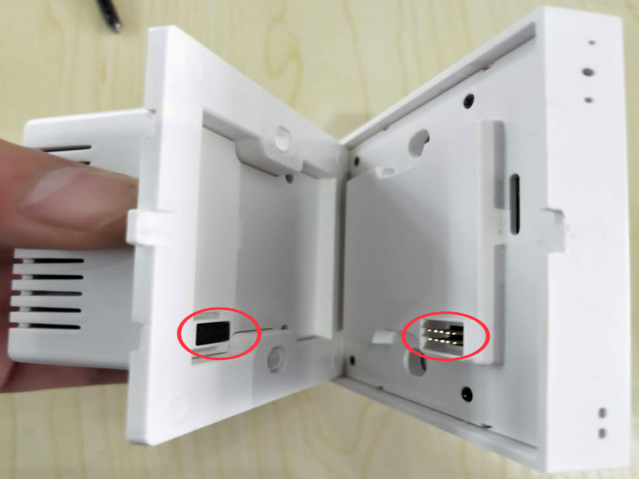
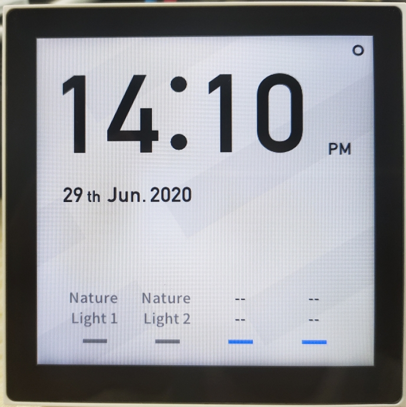
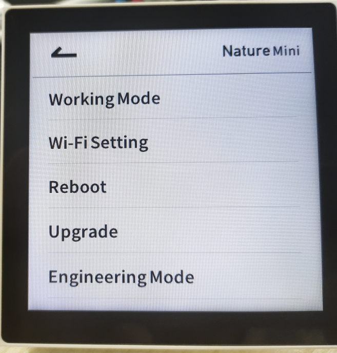

## Mục tiêu
- Phân biệt các dòng màn hình Nature 7 và Nature Mini để tư vấn giải pháp phù hợp mặt bằng.
- Hiểu khả năng mở rộng giao thức (Zigbee, Bluetooth) trên các dòng màn hình để tích hợp thiết bị bên thứ ba.

---

Nature Series: Dòng màn hình điều khiển trung tâm kết hợp phím cơ vật lý, mang lại trải nghiệm tương tác trực quan nhất.

Dòng Nature là niềm tự hào của LifeSmart trong phân khúc màn hình điều khiển gắn tường. Điểm khác biệt lớn nhất so với các dòng màn hình cảm ứng thuần túy trên thị trường là Nature giữ lại các phím bấm vật lý, giúp người dùng (đặc biệt là người già và trẻ em) có thể kích hoạt nhanh các kịch bản quan trọng mà không cần nhìn vào màn hình.

## 1. Màn hình điều khiển trung tâm Nature 7

Nature 7 là dòng màn hình cao cấp nhất, đóng vai trò như một bộ não hiển thị cho toàn bộ căn nhà. Với kích thước 7 inch, không gian thao tác cực kỳ thoải mái.

Bên cạnh màn hình cảm ứng, thiết bị có dãy phím cơ bên dưới có thể cấu hình tùy ý. Thông thường anh em sẽ gán cho các kịch bản: Về nhà, Đi ngủ, hoặc Bật toàn bộ đèn phòng khách. Khung vỏ nhôm nguyên khối, chắc chắn và sang trọng khi chạm vào. Nature 7 còn tích hợp xem trực tiếp luồng camera Hikvision và điều khiển nhạc đa vùng ngay trên màn hình mà không cần mở điện thoại.

## 2. Các dòng màn hình Nature Mini

Nếu Nature 7 phù hợp cho phòng khách hoặc sảnh chính, thì Nature Mini là giải pháp phù hợp cho phòng ngủ hoặc khu vực hành lang nhờ kích thước nhỏ gọn.

### 2.1. Nature Mini

Đây là bản tiêu chuẩn, dùng để điều khiển các thiết bị trong phòng. Tuy nhỏ nhưng vẫn đảm bảo độ sắc nét và tốc độ phản hồi lệnh tức thì qua giao thức CoSS.

### 2.2. Nature Mini Pro

Điểm nâng cấp đáng giá nhất của dòng Pro là khả năng đa giao thức. Ngoài CoSS để giao tiếp với bộ điều khiển trung tâm, nó còn tích hợp sẵn Zigbee 3.0, Bluetooth (BLE) và Z-Wave.

Lợi ích thực tế: anh em có thể dùng Nature Mini Pro để kết nối trực tiếp với các thiết bị Zigbee của hãng khác (như đèn Philips Hue, cảm biến Aqara) mà không cần thêm bộ điều khiển trung gian của các hãng đó. Hệ thống gọn gàng và ổn định hơn rất nhiều.

## 3. Quy trình lắp đặt và cấu hình Nature Mini (thực chiến)

Màn hình Nature chạy nền tảng hệ điều hành phức tạp và đấu điện lưới 220V trực tiếp. Để đảm bảo vận hành ổn định lâu dài, anh em kỹ thuật phải làm chuẩn các bước sau.

### 3.1. Các bước lắp ráp cơ khí và đấu điện

1. Cắt điện và kiểm tra an toàn: trước lúc can thiệp, dập hẳn CB cấp nguồn và dùng bút thử điện xác nhận không còn dòng tại vị trí hộp âm.

2. Tách rời đế và mặt cảm ứng: ngàm liên kết khá chặt. Chú ý điểm tiếp nối gờ nhựa, bẩy nhẹ nhàng để tách mạch hiển thị ra mà không gãy chốt.

Quá trình tách khớp giữa bộ điều khiển trung tâm và cụm đế âm cấp tải lưới.

3. Đấu cáp tải theo sơ đồ mặt sau: phải siết đủ ốc cáp N (nguội) và L (lửa). Nếu lộ L1, L2 không sử dụng thì để trống, tuyệt đối không đấu chập nhánh. Siết chặt ốc để tránh lỏng cáp sinh hồ quang. Đây là bước quyết định nguồn cấp cho màn hình bật ổn định hay không.

Đấu cáp tải N và L quyết định nguồn cấp màn hình bật ổn định.

4. Cố định hộp âm: lùa cáp gọn và ôm đế vào khu vực chôn chuẩn. Dùng ốc hai bên hông vặn chặt vừa tay.

5. Lên nguồn theo dõi khởi động: ráp khít mặt màn hình lại khớp cũ. Bật CB cấp điện trở lại. Thiết bị sẽ mất vài chục giây khởi động hệ điều hành cho đến khi màn sáng hiện giao diện chính.

### 3.2. Thiết lập chế độ hoạt động

Nature Mini có hai chế độ chạy mạng mà anh em kỹ thuật phải chọn ngay từ đầu:

- Chế độ bộ điều khiển trung tâm: màn hình hoạt động như một bộ điều khiển cục bộ độc lập. Tự nối WiFi, đăng nhập tài khoản, và phát sóng CoSS để kết nối các cảm biến rời vào cùng hệ thống. Chọn chế độ này khi dự án nhỏ và chưa có bộ điều khiển trung tâm riêng.
- Chế độ ngoại vi: màn hình hoạt động giống một công tắc thông minh kết nối vào bộ điều khiển trung tâm hiện có. Áp dụng cho các dự án lớn đã có bộ điều khiển ổn định.

Cách chỉnh chế độ qua màn hình cảm ứng:

1. Chạm vào biểu tượng ba dấu chấm ở góc phải trên để mở bảng menu.
2. Chọn mục cài đặt hệ thống.

Menu các tùy chọn lõi nằm phía trên bảng điều khiển giao diện hệ thống.

3. Chọn mục Working Mode và chọn chế độ phù hợp với dự án.

Cấu hình Working Mode.

## 4. Cốt lõi dành cho đội ngũ triển khai

Nature Mini là dòng thiết bị lai, kết hợp giữa công tắc thông minh, màn cảm ứng chạy hệ điều hành và bộ điều khiển mini. Nhớ khai báo Working Mode theo chuẩn sơ đồ thiết kế mạng trước rồi mới bắt đầu cài kịch bản. Nhiều anh em bỏ qua bước này, ghép nối hết thiết bị rồi mới phát hiện chọn sai chế độ — phải xóa hết làm lại từ đầu.

---

## Tài liệu tham khảo
- [Giới thiệu dòng Nature](https://drive.google.com/file/d/1fTBlvwOsanYKhR_P5AMORJnfAf_2o4uE/view?usp=drive_link)
- [Hướng dẫn cài đặt Nature](https://docs.google.com/document/d/1S0MaCi1mnk9KFl9eccn_drE-o1F8Iq-r/edit)
- [Thư mục hướng dẫn cài đặt Nature](https://drive.google.com/drive/folders/18Tr4YnW22HqCSOHBy8VgTpGbPkR8DLCo)
