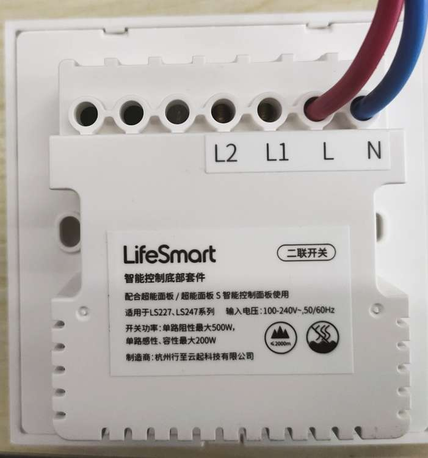
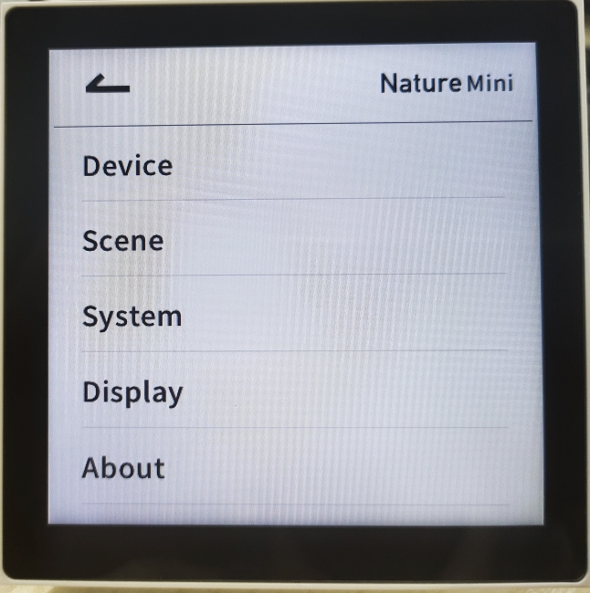

## Mục tiêu
- Phân biệt các dòng màn hình Nature 7 và Nature Mini để tư vấn giải pháp phù hợp mặt bằng.
- Hiểu khả năng mở rộng giao thức (Zigbee, Bluetooth) trên các dòng màn hình để tích hợp thiết bị bên thứ ba.

---

Nature Series: Dòng màn hình điều khiển trung tâm kết hợp phím cơ vật lý, mang lại trải nghiệm tương tác trực quan nhất.

Dòng Nature là niềm tự hào của LifeSmart trong phân khúc màn hình điều khiển gắn tường. Điểm khác biệt lớn nhất so với các dòng màn hình cảm ứng thuần túy trên thị trường là Nature giữ lại các phím bấm vật lý, giúp người dùng (đặc biệt là người già và trẻ em) có thể kích hoạt nhanh các kịch bản quan trọng mà không cần nhìn vào màn hình.

<video src="/wiki/assets/videos/Nature%20Series%20Introduction.mp4" controls class="hero-video"></video>

Video giới thiệu các dòng Nature: Sự liền mạch giữa công nghệ hiển thị và phím nhấn cơ học.

## 1. Màn hình điều khiển trung tâm Nature 7

Nature 7 là dòng màn hình cao cấp nhất, đóng vai trò như một "bộ não" hiển thị cho toàn bộ căn nhà. Với kích thước màn hình 7 inch cho không gian thao tác cực kỳ thoải mái.

- **Vô địch về tương tác:** Bên cạnh màn hình cảm ứng, thiết bị có dãy phím cơ bên dưới có thể cấu hình tùy ý. Thông thường anh em sẽ gán cho các kịch bản: Về nhà, Đi ngủ, hoặc Bật toàn bộ đèn phòng khách.
- **Vật liệu cao cấp:** Khung vỏ nhôm nguyên khối, mang lại cảm giác chắc chắn và sang trọng khi chạm vào.
- **Tích hợp giải trí & An ninh:** Xem trực tiếp luồng camera Hikvision hoặc điều khiển nhạc đa vùng ngay trên màn hình mà không cần mở điện thoại.

## 2. Các dòng màn hình Nature Mini

Nếu Nature 7 phù hợp cho phòng khách hoặc sảnh chính, thì Nature Mini là giải pháp hoàn hảo cho phòng ngủ hoặc khu vực hành lang nhờ kích thước nhỏ gọn.

### 2.1. Nature Mini
Đây là bản tiêu chuẩn, dùng để điều khiển các thiết bị trong phòng. Tuy nhỏ nhưng vẫn đảm bảo độ sắc nét và tốc độ phản hồi lệnh tức thì qua giao thức CoSS.

### 2.2. Nature Mini Pro
Điểm nâng cấp đáng giá nhất của dòng Pro là khả năng **đa giao thức**. Ngoài CoSS để nói chuyện với Hub chính, nó còn tích hợp sẵn Zigbee 3.0, Bluetooth (BLE) và Z-Wave.
- **Lợi ích kỹ thuật:** Anh em có thể dùng Nature Mini Pro để kết nối trực tiếp với các thiết bị Zigbee của hãng khác (như đèn Philips Hue, cảm biến Aqara...) mà không cần thêm Hub trung gian của các hãng đó. Điều này giúp hệ thống gọn gàng và ổn định hơn rất nhiều.

## 3. Quy trình lắp đặt và cấu hình Nature Mini (Thực chiến)

Màn hình Nature chạy nền tảng hệ điều hành phức tạp và đấu điện lưới 220V trực tiếp. Để đảm bảo vận hành ổn định lâu dài, anh em kỹ thuật phải làm chuẩn các bước sau:

### 3.1. Các bước lắp ráp cơ khí và đấu điện

1. **Cắt điện và kiểm tra an toàn:** Trước lúc can thiệp, dập hẳn aptomat/CB cấp nguồn và dùng bút thử điện xác nhận không còn dòng tại vị trí hộp âm.
2. **Tách rời đế và mặt cảm ứng:** Ngàm liên kết mặt trước và cụm nguồn khá chặt. Chú ý điểm tiếp nối gờ nhựa, bẩy nhẹ nhàng để tách mạch hiển thị ra mà không gãy chốt.

Quá trình tách khớp giữa bộ điều khiển trung tâm và cụm đế âm cấp tải lưới.

3. **Đấu cáp tải chuẩn kỹ thuật:** Theo sơ đồ mặt sau, phải siết đủ ốc cáp N (nguội) và L (lửa). Nếu lộ L1, L2 không sử dụng chiếu sáng thì để trống cốt đồng, tuyệt đối không đấu chập nhánh. Bắt buộc siết chặt ốc tránh lỏng cáp sinh hồ quang.

Đấu cáp tải N và L cực kỳ quan trọng, quyết định nguồn cấp màn hình bật ổn định.

4. **Cố định hộp âm:** Lùa cáp gọn và ôm đế vào khu vực chôn chuẩn. Dùng ốc hai bên hông vặn chặt vừa tay định hình khối thân vuông.
5. **Lên nguồn theo dõi khởi động:** Ráp khít mặt màn hình lại khớp cũ. Bật aptomat cấp điện trở lại. Thiết bị sẽ mất vài chục giây đẩy hệ điều hành từ mốc boot ban đầu đến lúc màn sáng hiện Home.

### 3.2. Thiết lập chế độ giao tiếp (Mode of Operation)

Nature Mini có điểm đặc thù linh hoạt nhờ vào hai chế độ chạy mạng cơ bản mà kỹ thuật triển khai phải định hình ngay từ đầu:

- **Chế độ Hub (Smart Station):** Màn hình bộ trung tâm cục bộ độc lập. Tự nối Wifi, cài thẳng vô tài khoản, và cấp sóng CoSS để rải mạng kết nối đám cảm biến rời rạc vô cùng một hệ thống nhỏ. 
- **Chế độ Ngoại vi (Device Mode):** Màn hình sẽ giống như 1 công tắc thông minh kết nối vào bộ trung tâm hiện có. Áp dụng cho các dự án rộng đã có bộ trung tâm ổn định.

**Cách chỉnh chế độ qua cảm ứng:**
1. Chạm điểm biểu tượng **ba dấu chấm** góc phải trên dải màn hình để đẩy bảng menu xuống.
2. Chọt vào thanh **System Settings** (Cài đặt hệ thống).

Menu gọi các phân cấp tuỳ chọn lõi nằm phía trên bảng điều khiển giao diện hệ thống.

3. Chọn mục **Working Mode** và chọn chế độ Smart Station hay Sub Device phụ thuộc vào dự án.

Cấu hình Working Mode.

## 4. Cốt lõi dành cho đội ngũ triển khai

Với anh em kỹ thuật: 
Nature Mini là dòng thiết bị lai, kết hợp giữa công tắc thông minh, màn cảm ứng chạy hệ điều hành và bộ trung tâm mini . Hãy nhớ khai báo **Working Mode** theo chuẩn sơ đồ thiết kế mạng trước rồi mới setup kịch bản.

---

## Tài liệu tham khảo
- [Giới thiệu dòng Nature (PDF)](/wiki/assets/pdf/LifeSmart%20Brochure%20250929.pdf)
- [Hướng dẫn cài đặt Nature (Google Docs)](https://docs.google.com/document/d/1S0MaCi1mnk9KFl9eccn_drE-o1F8Iq-r/edit)
- [Thư mục hướng dẫn cài đặt Nature (Drive)](https://drive.google.com/drive/folders/1B_znIzettzmx4HUYxsCR26Z_aZ9bF1Lm)
