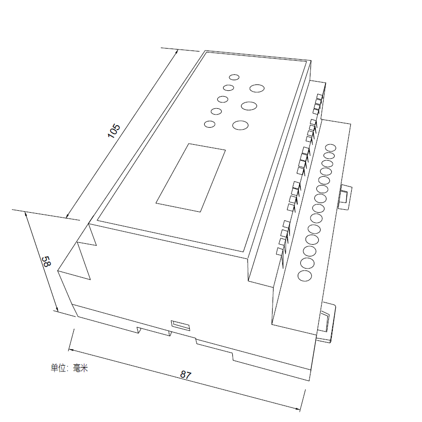

## Mục tiêu
- Hiểu cấu trúc và thông số bộ chuyển đổi điều hoà trung tâm (HVAC Gateway).
- Đấu nối đúng dây tín hiệu với dàn lạnh/dàn nóng AC và cấp nguồn 12V DC an toàn.
- Biết cách tìm kiếm thiết bị điều hòa (Sync) trên ứng dụng LifeSmart.

---

Bảng cổng kết nối và màn hình hiển thị trực quan của bộ chuyển đổi trung tâm nhiệt độ.

## 1. Thông số cốt lõi

Bộ thu thập tín hiệu điều hoà lưới mạch kín (HVAC Gateway) giúp "bẻ khóa" và đưa dàn lạnh trung tâm của các hãng (Daikin, Toshiba, Hitachi, Mitsubishi, Panasonic...) vào chung hệ sinh thái LifeSmart. 

Các thông số phần cứng anh em kỹ thuật lưu ý:
- **Nguồn nuôi:** Bắt buộc duy nhất **12V DC**. Đừng bao giờ cắm nhầm 24V hay 220V, cắm sai phát đứt luôn cầu chì.
- **Dây kết nối điều hòa (Communication Wire):** Nối giữa cổng Gateway và máy điều hòa cần dùng cáp tín hiệu 2 lõi xoắn có bọc nhiễu (Shielded twisted pair - STP). Tiết diện lớn hơn 0.75mm2. Tránh để song song với dây cấp điện xoay chiều (L), khoảng cách cách ly khuyến cáo ít nhất 30cm để không rớt gói tin tín hiệu.
- **Các cổng ra tín hiệu:** Có cụm **AIR CON Terminals** (Cổng dữ liệu điều hoà).

## 2. Cấu hình chọn hãng điều hòa qua Ứng dụng / Bluetooth

Các phiên bản HVAC Gateway đời mới nhất hiện nay không sử dụng chân gạt phần cứng (Dialing Switches) nữa mà đã chuyển sang thi công cấu hình hoàn toàn qua kết nối Bluetooth.

**Cách lấy mã cấu hình trên điện thoại (App):**
1. Lần đầu cắm điện (Power On), trên màn hình LCD của Gateway sẽ bung sẵn một tấm **mã QR (QR Code)**.
2. Anh em dùng điện thoại (qua WeChat) quét ngang tấm mã QR này — hoặc có thể tìm tài khoản Official Account tên là **"迈斯" (hoặc "迈斯maisi")** để nhảy thẳng vào Mini Program có mục "Bluetooth Configuration".
3. Nhấp dò kết nối qua Bluetooth với thiết bị "Gateway". Khi kết nối thành công, đèn Bluetooth (ST1) trên board sẽ báo sáng xanh lá cố định mượt mà.
4. Ở Webpage giao diện nhúng trên điện thoại, thợ thi công chọn khai báo cấu hình tên của hãng Điều hoà / Nhãn hiệu máy lạnh cần đọc mã (Daikin, Mitsubishi, Toshiba, Panasonic...).

Ngoài ra thao tác tay vật lý trên nút nhấn board mạch chỉ dùng cho 2 trường hợp khẩn cấp:
- **Nút SET:** Bấm đè gồng giữ nguyên 5 giây để Reset xả cấu hình khôi phục cài đặt gốc (nếu màn hình đang hiện ở trang Reset).
- **Phím lên / xuống (UP/DOWN):** Chuyển xem các tab thông báo số lượng máy quét được phát hiện, hoặc nhấn tổ hợp `UP+DOWN` để khởi động lại nhanh Gateway.

## 3. Luồng cấu hình lên ứng dụng (App)

Sau khi nguồn DC 12V được cấp, thiết bị sẽ Boot lên:
1. Chờ trên màn hình hiển thị chạy số hiệu đếm ngược. Nó cho 20 giây hiển thị chế độ Reset. Đừng bấm gì, cứ đợi để nó tự nhảy.
2. Màn hình báo **"Searching HVAC ..."**. Bước này Gateway sẽ tự càn quét thiết bị dàn lạnh. Quá trình tốn chừng 2 đến 5 phút.
3. Nếu quét xong, số lượng điều hòa tìm thấy sẽ hiển thị. Đèn **HBS** trên board sẽ chớp nháy (báo lấy được nhịp tín hiệu máy lạnh). Đèn STA tối đen là tín hiệu chạy bình thường đang quét mặt.
4. Mở ứng dụng LifeSmart -> Bấm **"+"** -> Thêm thiết bị cục bộ, loại **HVAC Gateway**.
5. Trong cài đặt HVAC trên ứng dụng -> mục **Address / Sync**, chọn các group dàn lạnh để đưa về màn hình hiển thị dưới dạng điều khiển máy lạnh riêng biệt, lúc này nhớ đặt lại tên các máy lạnh theo phòng.

*Báo lỗi:* Màn hình Gateway có sẵn chỗ hiển thị mã lỗi khi sự cố (ví dụ Error Code từ dàn nóng xả về). Thấy mã lỗi thì chụp và gửi thẳng cho kỹ thuật làm bên mảng cơ điện lạnh, đây là cách nhanh nhất chứng minh lỗi thuộc về hệ điều hoà hay nằm ổ hệ thông minh.

---

## Tài liệu tham khảo
- [Hướng dẫn cấu hình HVAC Gateway (Google Docs)](https://docs.google.com/document/d/10UfKaA0388Ols9M_CQSKtDEeTa9tBNiP/edit)
- [Hướng dẫn sử dụng AC Gateway 2024 (PDF)](/wiki/assets/pdf/AC%20Gateway%20Manual%202024.pdf)
