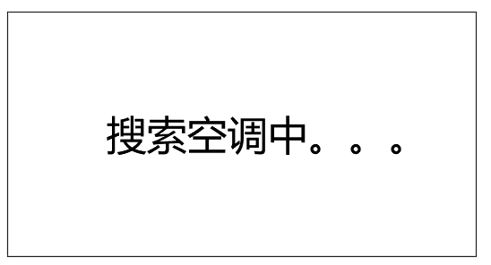
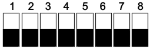

## Mục tiêu
- Hiểu cấu trúc và thông số bộ chuyển đổi điều hoà trung tâm (HVAC Gateway).
- Đấu nối đúng dây tín hiệu với dàn lạnh/dàn nóng AC và cấp nguồn 12V DC an toàn.
- Biết cách tìm kiếm thiết bị điều hòa (Sync) trên ứng dụng LifeSmart.

---

Bảng cổng kết nối và màn hình hiển thị trực quan của bộ chuyển đổi trung tâm nhiệt độ.

## 1. Thông số cốt lõi

Bộ thu thập tín hiệu điều hoà lưới mạch kín (HVAC Gateway) giúp "bẻ khóa" và đưa dàn lạnh trung tâm của các hãng (Daikin, Toshiba, Hitachi, Mitsubishi, Panasonic...) vào chung hệ sinh thái LifeSmart. 

Các thông số phần cứng anh em kỹ thuật lưu ý:
- **Nguồn nuôi:** Bắt buộc duy nhất **12V DC**. Đừng bao giờ cắm nhầm 24V hay 220V, cắm sai phát đứt luôn cầu chì.
- **Dây kết nối điều hòa (Communication Wire):** Nối giữa cổng Gateway và máy điều hòa cần dùng cáp tín hiệu 2 lõi xoắn có bọc nhiễu (Shielded twisted pair - STP). Tiết diện lớn hơn 0.75mm2. Tránh để song song với dây cấp điện xoay chiều (L), khoảng cách cách ly khuyến cáo ít nhất 30cm để không rớt gói tin tín hiệu.
- **Các cổng ra tín hiệu:** Có cụm **AIR CON Terminals** (Cổng dữ liệu điều hoà).

## 2. Giao diện chân gạt (Dialing / Dip Switch)

Các phiên bản bộ chuyển đổi đời cũ, anh em phải bật tắt thanh gạt trên bộ gạt díp (Dialing Terminals) cấu hình đúng hãng mã hóa.
- **Cụm CONFIG 1 (Màu đỏ):** Lựa chọn chuẩn giao tiếp loại điều hoà (Ví dụ: 1/2 cho Hitachi/York, F1/F2...).
- **Cụm CONFIG 2 (Màu xanh):** Cấu hình truyền thông tối ưu cho hệ điều hoà.

***Mẹo thực chiến:***  Các phiên bản Gateway mới ngày nay (loại vỏ kim loại/nhựa mới xám) thường có khả năng **Auto-Detect** — không cần gạt nút bằng tay nữa mà tự dò giao thức luôn. Tuy nhiên, nếu đấu vào mà màn hình bộ đọc không hiển thị trạng thái *"Searching HVAC"*, có thể thiết bị điều hoà đang không được dàn nóng cấp lệnh, vui lòng kiểm tra nguồn phía hệ VRV/VRF.

Chân gạt cấu hình (Config 1 và 2) và cổng nối cáp tới dàn lạnh.

## 3. Luồng cấu hình lên ứng dụng (App)

Sau khi nguồn DC 12V được cấp, thiết bị sẽ Boot lên:
1. Chờ trên màn hình hiển thị chạy số hiệu đếm ngược. Nó cho 20 giây hiển thị chế độ Reset. Đừng bấm gì, cứ đợi để nó tự nhảy.
2. Màn hình báo **"Searching HVAC ..."**. Bước này Gateway sẽ tự càn quét thiết bị dàn lạnh. Quá trình tốn chừng 2 đến 5 phút.
3. Nếu quét xong, số lượng điều hòa tìm thấy sẽ hiển thị. Đèn **HBS** trên board sẽ chớp nháy (báo lấy được nhịp tín hiệu máy lạnh). Đèn STA tối đen là tín hiệu chạy bình thường đang quét mặt.
4. Mở ứng dụng LifeSmart -> Bấm **"+"** -> Thêm thiết bị cục bộ, loại **HVAC Gateway**.
5. Trong cài đặt HVAC trên ứng dụng -> mục **Address / Sync**, chọn các group dàn lạnh để đưa về màn hình hiển thị dưới dạng điều khiển máy lạnh riêng biệt, lúc này nhớ đặt lại tên các máy lạnh theo phòng.

*Báo lỗi:* Màn hình Gateway có sẵn chỗ hiển thị mã lỗi khi sự cố (ví dụ Error Code từ dàn nóng xả về). Thấy mã lỗi thì chụp và gửi thẳng cho kỹ thuật làm bên mảng cơ điện lạnh, đây là cách nhanh nhất chứng minh lỗi thuộc về hệ điều hoà hay nằm ổ hệ thông minh.

---

## Tài liệu tham khảo
- [Hướng dẫn cấu hình HVAC Gateway (Google Docs)](https://docs.google.com/document/d/10UfKaA0388Ols9M_CQSKtDEeTa9tBNiP/edit)
