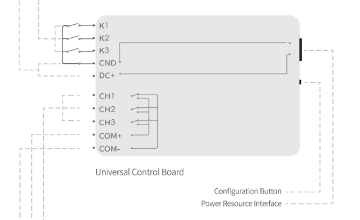

## Mục tiêu
- Biết cách đấu nối tiếp điểm khô và cấp nguồn một chiều an toàn.
- Thiết lập chế độ rơ-le (Jog / Follow) phục vụ đúng hệ thống cổng, rèm và cảm biến ngoại vi.

---

Bảng mạch General Controller xử lý tốt thiết bị 3 trạng thái và cảm biến độc lập.

## 1. Thông số thiết bị

General Controller là hộp rơ-le khô 3 nhánh kết hợp thêm ngõ vào đón tín hiệu. Mục đích chính là biến các thiết bị tự động bình thường (mô-tơ cổng, cửa cuốn, chuông báo) thành thiết bị thông minh điều khiển qua ứng dụng LifeSmart.

- Nguồn cấp nuôi: 12V hoặc 24V một chiều qua chân tròn tiêu chuẩn (5.5×2.5 mm) hoặc đấu dây trực tiếp vào chân domino DC+ / GND. Chỉ cắm 1 trong 2 đường nguồn, cắm cả hai cùng lúc sẽ hỏng bảng mạch.
- Ngõ vào tín hiệu (Input): khung K1, K2, K3 — dùng nhận tín hiệu từ nút nhấn khẩn cấp, cảm biến cháy hoặc công tắc từ ngoại vi.
- Ngõ ra rơ-le (Output): khung CH1, CH2, CH3 — cụm đóng rơ-le qua chân COM / COM- / COM+.
- Tải tối đa: kéo được 3A. Đồ nặng hơn (máy bơm tưới cây, van từ) thì phải quàng thêm rơ-le trung gian.

## 2. Ứng dụng đấu nối thực tế

### 2.1. Đưa thiết bị báo khói thường vào hệ thống thông minh

Cắm cảm biến khói loại công nghiệp chạy nguồn 12V một chiều:

- Đấu chân NC từ cảm biến khói vào ngõ K1. Nhớ nối thêm 1 chân GND về ngõ COM để khép kín mạch báo động.
- Khi cảm biến khói nhảy cắt tiếp điểm khô, ứng dụng sẽ bật cảnh báo thông qua kịch bản đã cài sẵn. Cách này đơn giản nhưng hiệu quả — biến hệ báo cháy công nghiệp thường thành hệ báo cháy thông minh gửi thông báo về điện thoại.

### 2.2. Điều khiển cổng tự động hoặc cửa cuốn

- Xác định tiếp điểm đóng mở cổng, đấu về CH1 và chân COM+.
- Nếu cổng hoặc cửa cuốn cần dùng nhiều kênh thì phải đấu qua rơ-le trung gian, sử dụng các chân CH1, CH2, CH3 kết hợp với COM+ để điều khiển rơ-le trung gian đó.

## 3. Cài đặt chế độ kích rơ-le trên ứng dụng

Phần quan trọng nhất khi cấu hình General Controller là chọn đúng chế độ hoạt động:

- Follow (đảo trạng thái): mỗi lần kích ngõ vào, ngõ ra sẽ lật trạng thái. Bấm 1 nhát thì rơ-le CH1 đảo mạch, bấm lại thì CH1 lật lại. Dùng khi cần thay thế công tắc cơ bằng phím cứng.
- Jog (bấm giữ - nhả buông): rơ-le chỉ duy trì khi giữ nút. Bấm giữ thì CH1 hít xuống COM+, nhả nút thì rơ-le tự buông ra. Chế độ này rất phù hợp cho nút nhấn khóa từ mở cửa, hoặc còi báo khẩn cấp — giữ tay thì kêu, bỏ tay thì tắt.

Ngoài ra còn có bảng chỉnh thông số trễ tự đóng cho mô-tơ. Ví dụ cổng rào mở mất 15 giây thì nhập 15 giây vào ứng dụng, sau khi mở hết hành trình rơ-le sẽ tự ngắt. Tùy lúc thi công, đo thời gian mô-tơ mở cánh rồi nhập số giây phù hợp.

---

## Tài liệu tham khảo
- [General Controller Document (PDF)](https://drive.google.com/file/d/16GgDRu02_inhcNZbczg0vs-mkS9ZyS7b/view?usp=sharing)
