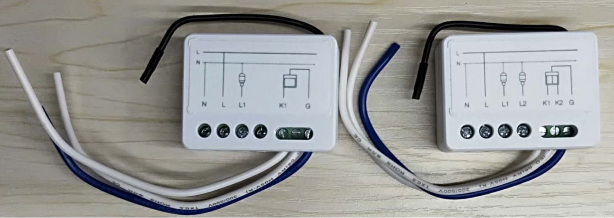
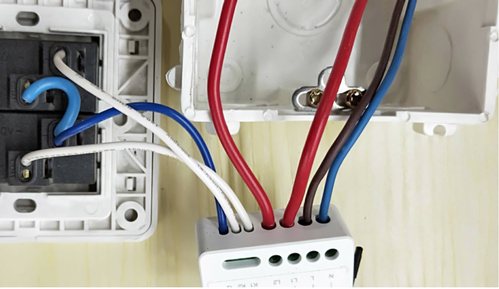
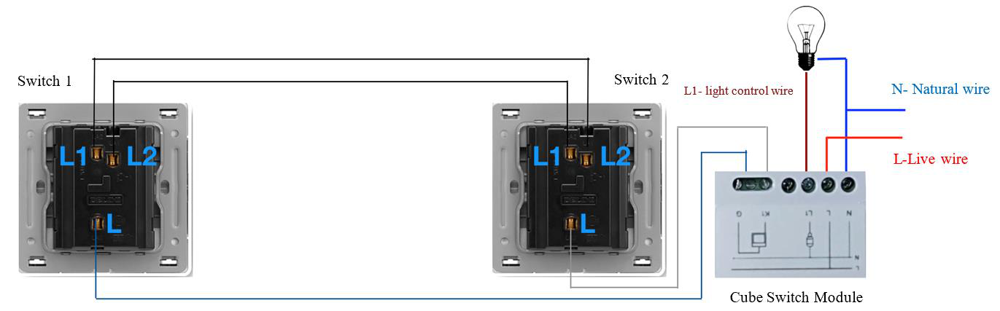
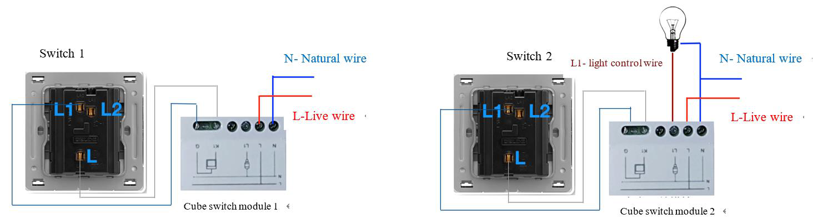

## Mục tiêu
- Nắm rõ cách đấu nối mô-đun CUBE 1 lộ và 2 lộ vào hộp công tắc âm tường.
- Hiểu nguyên lý cấp nguồn mạch và nguyên lý kích hoạt bằng công tắc cơ truyền thống (chân G / K1 / K2).
- Biết cách thi công công tắc đảo chiều dùng mô-đun CUBE tại chân cầu thang.
- Hiểu cách thiết lập kịch bản hẹn giờ và tự động hóa từ phím cơ qua ứng dụng.

---

Mô-đun CUBE có kích thước siêu nhỏ, thiết kế để nhét vừa vặn vào đế âm phía sau công tắc cơ.

## 1. Môi trường lắp đặt và yêu cầu tải

CUBE Switch Module giấu mình hoàn toàn phía sau mặt nạ công tắc lẩy truyền thống. Do chia sẻ không gian hộp đế âm tường chật hẹp, anh em thi công cần đáp ứng các yêu cầu sau:

- Khoảng không gian sâu đáy hộp đế âm tối thiểu phải còn rỗng 16–20 mm tính từ mặt đít công tắc cơ để nhét được CUBE. Nếu hộp quá nông thì không cố ép — sức căng lớn sẽ bục chân terminal đồng trên mô-đun.
- Bắt buộc kéo dây nguội (N): CUBE cần được nuôi điện liên tục. Trong hộp công tắc phải có cả dây N (nguội) và dây L (lửa). Thiếu dây nguội thì hệ thống không chạy được.
- Tải trọng tối đa cho phép: với tải thuần trở (đèn sợi đốt) không quá 300W. Với tải cảm kháng hoặc dung kháng có dòng khởi động lớn (đèn LED phổ thông, quạt thông gió nhỏ) phải hạ xuống dưới 150W mỗi kênh. Không dùng CUBE để gánh bình nóng lạnh hay máy bơm cao áp.
- Ăng-ten: đoạn dây đen thò ra hông chính là ăng-ten bắt sóng CoSS lên bộ điều khiển trung tâm. Lúc nhồi CUBE vào tường, lựa chiều ăng-ten vểnh ra phía sát mặt nạ. Không cuộn tròn xoắn ăng-ten cho gọn, không bẻ gãy gập góc 90 độ, và tránh xa viền mặt nạ kim loại — kim loại sẽ chắn sóng như lồng Faraday làm thiết bị mất kết nối.

## 2. Cách đấu dây cơ bản (1 kênh / 2 kênh)

CUBE Switch có loại điều khiển 1 lộ đèn và 2 lộ đèn. Cổng nguồn và cổng tín hiệu được cách ly rõ ràng.

### 2.1. Đấu cụm dây điện lưới (N, L, L1, L2)

- Chân N / L: cắm dây nguội và lửa của điện lưới 220V vào để nuôi bảng mạch.
- Chân L1 / L2 (Live Out): đây là ngõ ra cấp điện lên các lộ bóng đèn trên trần. Tách rời đấu nối với cáp đèn tại công trình.

Lưu ý an toàn: kìm tuốt vỏ chỉ cắt xén lõi đồng lộ tối đa 5 mm vừa chạm ngưỡng tiêu chuẩn, cắm thẳng vào lỗ terminal. Nhô đầu đồng cao quá sẽ dễ chạm chập phóng hồ quang.

### 2.2. Đấu dây tín hiệu với công tắc cơ (G, K1, K2)

Rời xa cụm điện lưới 220V nguy hiểm, chân G / K1 / K2 chỉ mang luồng tín hiệu điện áp rất thấp (một chiều), có mục đích "đọc" xem công tắc cơ đang ở vị trí bật hay tắt:

- Chân G (dây chung): đấu vào cực chung giữa của công tắc lẩy.
- Chân K1 / K2: đấu vào cực lộ L1 / L2 trên vỏ mặt công tắc cơ.

Khi bật công tắc lẩy, K1 sẽ chập kín mạch với chân G, vi xử lý CUBE nhận tín hiệu và lập tức đóng rơ-le cấp điện 220V qua cổng L1, bóng đèn sáng.

Cổng thu tín hiệu G/K1/K2 chỉ nối với công tắc cơ, cách ly hoàn toàn với cụm cáp 220V chân L, N, L1, L2.

## 3. Thực chiến: Lắp công tắc đảo chiều tại cầu thang

Tại các vị trí như cầu thang, thường có 2 công tắc ở đầu và cuối cùng điều khiển 1 đèn. Với CUBE có 2 cách xử lý.

### Cách 1: Đấu chéo vật lý dùng 1 CUBE (nhà đã có sẵn cáp liên lạc)

Áp dụng khi hai hộp công tắc trên dưới đã có sẵn 3 sợi dây liên lạc chạy thông với nhau trong tường. Một trong hai hộp phải có đủ dây N, L và dây kéo lên đèn.

Cách thi công: nhồi 1 CUBE duy nhất vào hộp đế có đủ cáp. Chân G và K1 nối vào cổng L và L1/L2 của hệ lẩy đấu 3 cực đảo chéo truyền thống. Bấm phím ở đầu nào, tín hiệu cũng chạy qua dây liên lạc chung về cổng G-K1, CUBE đọc được và đảo trạng thái đèn.

Cách đi chéo truyền thống: mượn 3 lõi cáp liên lạc báo gộp vào K1, chỉ cần 1 CUBE duy nhất.

### Cách 2: Dùng 2 CUBE kết nối không dây (nhà không có cáp liên lạc nối thông)

Áp dụng khi hai hộp công tắc ở xa nhau, không có đường cáp liên lạc nối thông giữa hai đầu. Điều kiện là cả 2 hộp đều phải có dây N và L. Một đầu nắm cáp kéo lên đèn, đầu còn lại không cần.

Cách thi công:

- Hộp đế phía trên (nơi nắm cáp kéo đèn): ép CUBE số 2 vào. Đấu G / K1 cho lẩy công tắc cơ, mắc N / L nuôi sống board, và đấu L1 lên bóng đèn.
- Hộp đế phía dưới (không có cáp đèn): ép CUBE số 1 vào. Đấu G / K1 cho lẩy công tắc cơ, mắc N / L cấp điện nuôi board. Chân L1 bỏ trống vì hộp này không nối bóng đèn.
- Mở ứng dụng LifeSmart, tạo lệnh liên kết logic (kịch bản điều kiện kích hoạt) giữa 2 CUBE: khi CUBE 1 phát hiện công tắc bật, gửi lệnh không dây cho CUBE 2 đóng rơ-le bật đèn, và ngược lại.

Dùng 2 CUBE tách biệt, liên kết bằng kịch bản không dây — giải pháp khi tường không có cáp liên lạc nối thông.

## 4. Cấu hình CUBE trên ứng dụng LifeSmart

Sau khi lắp xong phần cứng và bật CB cấp điện:

1. Mở ứng dụng LifeSmart → dấu "+" → chọn CUBE Switch Module.
2. Ghép nối: bật/tắt công tắc lẩy cơ liên tiếp khoảng 6 lần (tổng cộng 12 lần gạt lên gạt xuống). Lắng nghe tiếng rơ-le "tạch tạch" nhịp nhanh bên trong CUBE — đó là dấu hiệu thiết bị đã vào chế độ sẵn sàng ghép nối.
3. Chờ khoảng 1 phút, ứng dụng sẽ tự nhận thiết bị. Sau đó đặt tên theo quy tắc chuẩn (ví dụ: Đèn Cầu Thang T1).
4. Cài trạng thái mặc định (Save as Default): vào cài đặt (biểu tượng bánh răng) trong ứng dụng, tìm mục Save as Default. Tính năng này quyết định khi mất điện rồi có điện lại, rơ-le sẽ trở về trạng thái nào. Nên đặt mặc định là tắt — tránh tình huống 2 giờ sáng cúp điện rồi có lại, đèn cầu thang tự sáng chói làm cả nhà giật mình.
5. Nếu cần mở rộng, cấu hình thêm kịch bản hẹn giờ (Schedule) hoặc liên kết logic (điều kiện kích hoạt) để kết hợp CUBE với cảm biến chuyển động, cảm biến radar — ứng dụng LifeSmart có sẵn các mẫu trong mục lập trình thông minh.

---

## Tài liệu tham khảo
- [Hướng dẫn cấu hình CUBE Switch Module (Google Docs)](https://docs.google.com/document/d/1cKRfF86EJqfKZpqiMixE8-mg_dNi55Mg/edit)
- [Hướng dẫn đấu nối 2 chiều với CUBE (Folder)](https://drive.google.com/drive/folders/1VU0bIoj_8IDCaWMjkJF19XvU2f_JO2eO)
