## Mục tiêu
- Biết đấu nối dây đúng chuẩn cho công tắc có dây N và màn hình Nature.
- Thuộc các cảnh báo về nguồn điện, đặc biệt bộ điều khiển điều hòa trung tâm (cắm nhầm 220V sẽ cháy bo).

---

## 1. An toàn điện

Lắp đặt thiết bị 220V phải do thợ điện chuyên nghiệp thực hiện.

- Ngắt CB trước khi thao tác.
- Dùng bút thử điện kiểm tra xem còn điện không.
- Bọc băng keo điện các đầu ốc vít để chống chập với đế âm kim loại. Lỗi này hay xảy ra với đế âm inox — ốc vít chạm đế là chập ngay.

---

## 2. Lắp bộ điều khiển trung tâm (Smart Station)

### 2.1. Cấp nguồn và kết nối mạng
- **Nguồn điện**: Cắm bộ chuyển đổi nguồn (AC Adapter) đi kèm vào Smart Station. Thiết bị không có nút nguồn vật lý, sẽ tự động khởi động ngay khi có điện.
- **Kết nối mạng**: Bắt buộc cắm cáp mạng LAN (RJ45) từ Smart Station vào Router/Switch. 
    - *Lưu ý*: Với bản **DEFED Smart Station**, có hỗ trợ cấp nguồn qua cổng PoE hoặc dùng pin/SIM dự phòng.
- **Vị trí**: Đặt thiết bị ở nơi thoáng đãng, trung tâm nhà. Tránh đặt trong tủ điện kim loại kín hoặc sát các thiết bị gây nhiễu sóng mạnh (như lò vi sóng, router wifi công suất lớn) để sóng CoSS phát ổn định nhất.

### 2.2. Giải pháp cho công trình quy mô lớn (Cascade)
Nếu diện tích nhà quá rộng hoặc nhiều tầng khiến một bộ trung tâm không phủ hết sóng, anh em cần dùng giải pháp **Cascade Management**:
- Mua thêm Smart Station phụ cho các khu vực sóng yếu.
- **Yêu cầu quan trọng**: Tất cả Smart Station phải được cắm vào cùng một mạng LAN nội bộ thì mới có thể liên kết và chia sẻ thiết bị với nhau.

---

## 3. Lắp công tắc và màn hình Nature

### 3.1. Sơ đồ đấu dây

- L in: dây lửa từ CB.
- N: dây trung tính (nguội).
- L1/L2/L3: dây ra tải (đèn, quạt...).
[Bản vẽ kỹ thuật: Công tắc điều khiển Đèn](/drawings/MobiLife/MobiLife_Den.pdf)

**Tải nặng (bình nước nóng, bơm áp):** TUYỆT ĐỐI không đấu trực tiếp qua công tắc. Phải dùng qua khởi động từ (contactor) hoặc rơ-le trung gian 20A trở lên. 
[Bản vẽ kỹ thuật: Công tắc điều khiển Máy nước nóng](/drawings/MobiLife/MobiLife_MayNuocNong.pdf).

Nếu hộp công tắc cũ không có dây N thì phải kéo thêm dây N từ tủ điện (hoặc đèn gần nhất).

### 3.2. Trình tự lắp

1. Chụp hình sơ đồ dây cũ trước khi tháo. Nếu cần đấu lại về trạng thái cũ thì có hình để đối chiếu.
2. Đấu dây theo sơ đồ ở mục 3.1.
3. Bọc băng keo điện đầu ốc vít. (nếu đế âm kim loại)
4. Gắn thiết bị vào đế âm, siết ốc nhẹ tay. Siết mạnh quá sẽ làm hỏng đế công tắc. (Không nên sử dụng máy bắt vít)

### 3.3. Chi tiết cho dòng màn hình Nature

Xem hướng dẫn thi công chuyên sâu

**Bước 1: Cắt điện và kiểm tra an toàn**
- Trước lúc can thiệp đấu dây vào màn hình, hãy dập hẳn CB (Aptomat) cấp nguồn cục bộ nhánh đó. 
- BẮT BUỘC dùng bút thử điện xác nhận lại để chắc chắn không còn điện rò dây Lửa tại vị trí hộp âm tường.

**Bước 2: Tách rời đế âm và cụm mặt màn hình**
- Ngàm liên kết giữa 2 module này của LifeSmart ép khá chặt để tăng sự chắc chắn khi nhấn mặt cảm ứng.
- Chú ý điểm tiếp nối gờ nhựa ở cạnh dưới/trên, lấy que nạy dẹt bẩy nhẹ nhàng một phía ra trước. Tránh bóp sức vặn xoắn gây nứt mặt kính hoặc gãy chốt cài nhựa bên trong.

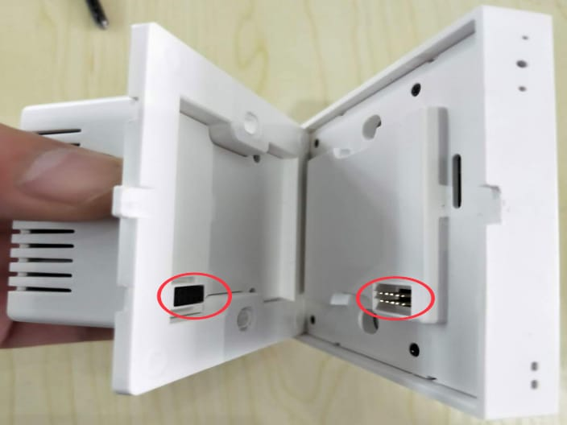

Quá trình tách khớp giữa bộ điều khiển trung tâm hiển thị và cụm đế âm cấp tải lưới.

**Bước 3: Đấu cáp tải vào terminal mặt sau**
- Đưa lõi đồng cáp từ tường ra cắm chặt vào terminal. Lõi đồng tuốt vỏ chỉ lộ tầm 6mm.
- Bắt buộc phải siết chặt ốc cáp N (nguội) và L (lửa) cấp nguồn cho bo mạch. 
- Nếu ngõ L1, L2 lộ ra mà không sử dụng thì để trống, tuyệt đối không đấu chập các nhánh này lại với nhau.

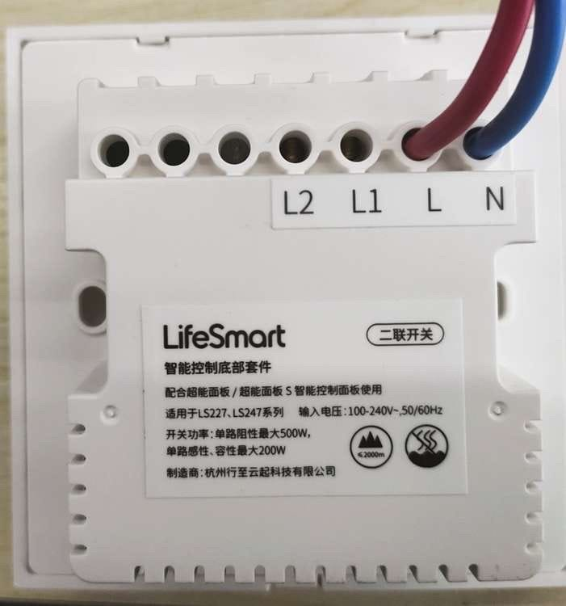

Đấu N và L cấp nguồn màn hình.

**Bước 4: Cố định cụm mạch nguồn vào hộp âm**
- Lùa các đoạn dây cáp dài xếp nếp gọn gàng ôm vào thành đế âm. Không để cáp đè ngay giữa.
- Đưa đế công tắc vào trong đế âm tường và dùng ốc hai bên hông vặn siết chặt vừa tay để mặt ngàm bám sát vách tường.

**Bước 5: Lên nguồn cấp điện rà soát**
- Ráp khít mặt màn hình khớp trở lại đế công tắc âm tường vừa gắn. 
- Bật CB cấp điện trở lại. 
- Màn hình sẽ sáng lên giao diện chọn ngôn ngữ và thử bật tắt các thiết bị.

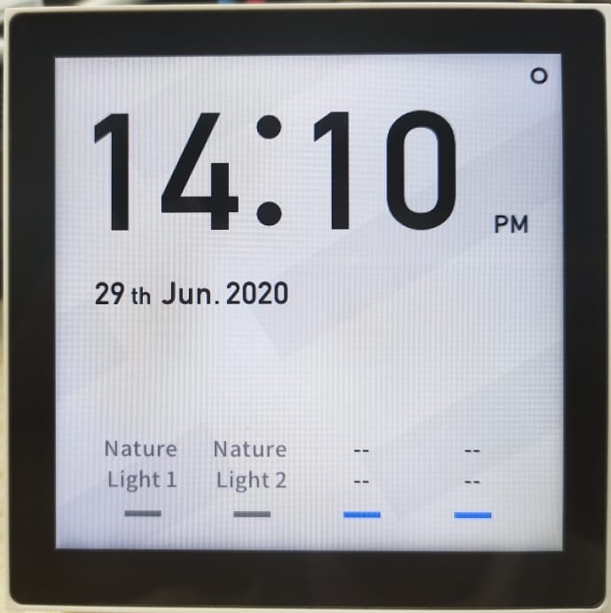

Màn hình khởi động sau khi cấp điện 220V.

### 3.4 Lắp mô-đun Công tắc CUBE (CUBE Switch Module)

Xem hướng dẫn thi công chuyên sâu

### 1. Đấu dây cơ bản (1 kênh / 2 kênh)

Module có loại điều khiển 1 đèn và 2 đèn. Cổng nguồn và cổng tín hiệu được cách ly rõ ràng.

#### Đấu cụm dây điện lưới (N, L, L1, L2)

- Chân N / L: cắm dây nguội và lửa của điện lưới 220V vào để nuôi bảng mạch.
- Chân L1 / L2 (Live Out): đây là ngõ ra cấp điện lên các line đèn trên trần. Tách rời đấu nối với cáp đèn tại công trình.

Lưu ý an toàn: tuốt vỏ dây điện sao cho lõi đồng lộ tối đa 5 mm là vừa, cắm thẳng vào lỗ terminal. Nhô đầu đồng cao quá sẽ dễ chạm chập phóng hồ quang.

#### Đấu dây tín hiệu với công tắc cơ (G, K1, K2)

Tuyệt đối không đấu điện 220V, chân G / K1 / K2 chỉ mang luồng tín hiệu điện áp rất thấp (Dry contact), có mục đích "đọc" xem công tắc cơ đang ở vị trí bật hay tắt:

- Chân G (dây chung): đấu vào cực chung giữa của công tắc cơ.
- Chân K1 / K2: đấu vào L1 hoặc L2 trên công tắc cơ.

Khi bật công tắc, K1 sẽ chập kín mạch với chân G, vi xử lý Module nhận tín hiệu và lập tức đóng rơ-le cấp điện 220V qua cổng L1, bóng đèn sáng.

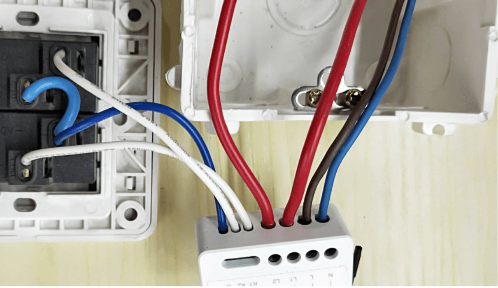

Cổng thu tín hiệu G/K1/K2 chỉ nối với công tắc cơ, cách ly hoàn toàn với cụm cáp 220V chân L, N, L1, L2.

### 2. Thực chiến: Lắp công tắc đảo chiều tại cầu thang

Tại các vị trí như cầu thang, thường có 2 công tắc ở đầu và cuối cùng điều khiển 1 đèn. Với Module có 2 cách xử lý.

#### Cách 1: Đấu chéo vật lý dùng 1 Module (nhà đã có sẵn cáp liên lạc)

Áp dụng khi hai hộp công tắc trên dưới đã có sẵn 3 sợi dây liên lạc chạy thông với nhau trong tường. Một trong hai hộp phải có đủ dây N, L và dây kéo lên đèn.

Cách thi công: Lắp 1 Module duy nhất vào hộp đế có đủ cáp. Chân G và K1 nối vào cổng L của công tắc cơ thứ nhất và thứ hai, Chân L1 và L2 của 2 công tắc đấu song song với nhau. Bấm phím ở đầu nào, tín hiệu cũng chạy qua dây liên lạc chung về cổng G-K1, Module đọc được và đảo trạng thái đèn.

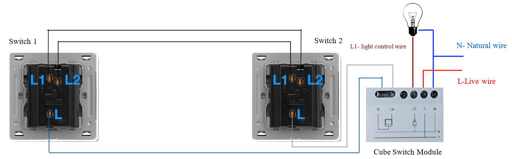

Cách đấu truyền thống: mượn 3 lõi cáp liên lạc báo gộp vào K1, chỉ cần 1 Module duy nhất.

#### Cách 2: Dùng 2 Module kết nối không dây (nhà không đủ cáp liên lạc nối thông)

Áp dụng khi hai hộp công tắc ở xa nhau, không có đường cáp liên lạc nối thông giữa hai đầu. Điều kiện là cả 2 hộp đều phải có dây N và L. Một đầu nắm cáp kéo lên đèn, đầu còn lại không cần.

Cách thi công:

- Vị trí 1 (nơi có line đèn): gắn Module số 1 vào. Đấu G / K1 cho lẩy công tắc cơ, mắc N / L nuôi sống board, và đấu L1 lên bóng đèn.
- Vị trí 2 (không có line đèn): gán Module số 2 vào. Đấu G / K1 cho lẩy công tắc cơ, mắc N / L cấp điện nuôi board. Chân L1 bỏ trống vì hộp này không nối bóng đèn.
- Mở ứng dụng LifeSmart, tạo lệnh liên kết logic (kịch bản điều kiện kích hoạt) giữa 2 Module: khi Module 1 phát hiện công tắc bật, gửi lệnh không dây cho Module 2 đóng rơ-le bật đèn, và ngược lại.

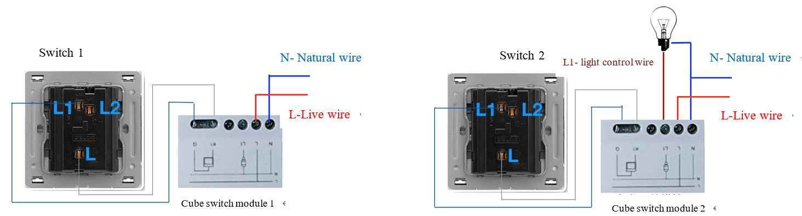

Dùng 2 Module tách biệt, liên kết bằng kịch bản không dây — giải pháp khi tường không có cáp liên lạc nối thông.

---

## 4. Lắp đặt dòng công tắc SUBLIME

Xem hướng dẫn thi công chuyên sâu

#### 1. Đấu nối Actuator (phần âm tường)

Công tắc SUBLIME được cấu tạo tách rời giữa mặt chạm hiển thị (Panel) và hộp tiếp điểm phía sau (Actuator). Actuator đóng vai trò như một mini rơ-le chịu tải điện lưới trực tiếp (220V). 

Anh em kỹ thuật thi công cần lưu ý:
- Phải kéo đủ dây **L (lửa)** và **N (nguội)** để nuôi module rơ-le và màn hình cảm ứng mặt trước.
- Rất quan trọng: phải siết thật chặt ốc tại các lỗ chia tải. Nếu ốc lỏng, khi chạy thiết bị công suất lớn sẽ dễ phát sinh tia lửa điện làm cháy hỏng vỏ nhựa.
- Tuyệt đối giữ sạch phần chân tiếp điểm mạ vàng. Đây là ngõ cắm duy nhất để truyền điện nhẹ một chiều và đẩy tín hiệu lên mặt cảm ứng. Bụi hoặc vôi thạch cao rơi vào sẽ gây ra lỗi chập chờn liệt cảm ứng.

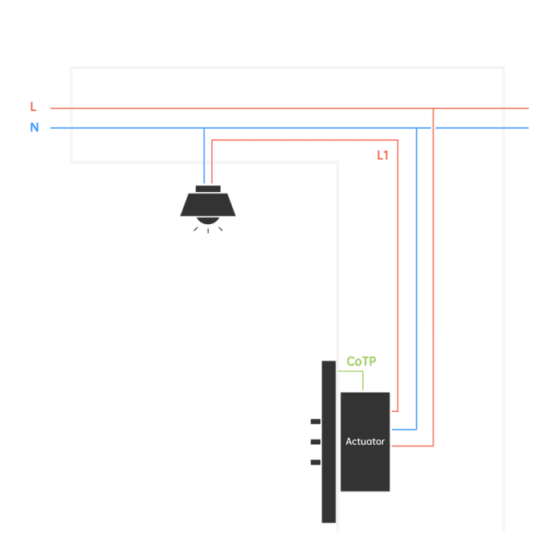

Sơ đồ đấu tải chuẩn cho loại thiết bị thông dụng nhất.

#### 2. Giới hạn chịu tải thực tế rơ-le

Việc tính đúng sức tải rơ-le trước khi thi công sẽ giúp hệ thống sống thọ hơn rất nhiều:

- **Tải thuần trở (đèn sợi đốt):** Chịu được tối đa 500W cho mỗi phím bấm (mỗi lộ đèn).
- **Tải LED (có xung kích dòng khởi động lớn):** Bắt buộc phải tính hạ tải xuống dưới 200W/lộ. Hiện nay hầu hết các công trình dùng đèn LED, và đèn LED rẻ tiền thường hay đánh xung dòng rất lớn khi vừa bật mí điện, gây "dính" tiếp điểm rơ-le.
- **Tải nặng (bình nước nóng, bơm áp):** TUYỆT ĐỐI không gánh trực tiếp qua Actuator. Phải dùng mạch qua khởi động từ (contactor) hoặc rơ-le trung gian 20A trở lên.

#### 3. Giao thức truyền thông CoTP (có dây) và luồng thi công

Khác với sóng không dây, SUBLIME dùng giao thức CoTP (Communication of Token Pass) chạy trên cáp tín hiệu 4 lõi để đồng bộ hệ thống không độ trễ. 

Giao thức này có lợi là:
- Dùng dây cáp linh hoạt (cáp mạng cat5e/cat6 hoặc RVVSP phổ thông).
- Không yêu cầu nhân sự kỹ thuật lập trình mã RS-485, cắm đúng màu cáp là hệ thống tự nhận ra nhau.

**Luồng thi công thực chiến:** Anh em có hai lựa chọn khi chạy dây cho SUBLIME:
1. **Kiểu phân tán (phổ biến nhất):** Giấu phần Actuator đóng cắt thẳng vào đế âm vuông giống hệt như công tắc cơ truyền thống. Áp dụng cho nhà ống cũ cải tạo hoặc các ngôi nhà thiết kế không tủ điện thông minh tổng. Chỉ cần đi 1 đường tín hiệu chạy vòng qua nối tay nối tay các mặt công tắc với nhau.
2. **Kiểu tập trung (chuyên nghiệp):** Kéo toàn bộ ruột Actuator dồn vào tủ điện tổng. Tại vị trí vách tường trong phòng khách/phòng ngủ, anh em chỉ gắn duy nhất mặt Panel màn hình mỏng (không có tiếp điểm 220V đằng sau, rất an toàn). Thi công tủ trung tâm sạch sẽ nhất và kiểm tra lỗi cục bộ cũng nhanh nhất.

---

## 5. Lắp bộ điều khiển điều hòa trung tâm (HVAC Gateway)

Xem hướng dẫn thi công chuyên sâu

### 1. Cảnh báo cháy nổ

**TUYỆT ĐỐI không được cắm nhầm nguồn AC 220V vào các chân tín hiệu (signal terminal).** Thao tác này sẽ cháy toàn bộ linh kiện điện tử trên bo mạch ngay lập tức. Hãng nghiêm cấm việc tự ý tháo mở thiết bị để sửa chữa — cháy do cắm nhầm nguồn không được bảo hành.

Nguồn điện yêu cầu: 12VDC. Chỉ cần đấu nối tín hiệu vào dàn nóng điều hòa, không cần đấu nối điện 220V.

### 2. Kiểm tra trước khi kết nối

Phải chắc chắn hệ thống điều hòa đang chạy bình thường, không có mã lỗi báo trên panel gốc trước khi kết nối Gateway vào. Nếu điều hòa đang lỗi mà vẫn đấu vào, Gateway sẽ nhận sai trạng thái và gây khó khăn cho việc xác định nguyên nhân sau này.

### 3. Cổng ra tín hiệu (AIR CON Terminals) và cáp

- Cổng dữ liệu điều hoà (AIR CON Terminals) dùng để kết nối với cục nóng. (Tuỳ hãng mà đấu dây và các cổng sẽ khác nhau, anh em tham khảo bảng bên dưới).

#### Bảng tra cứu cổng đấu nối tín hiệu (HVAC Gateway)

| Hãng (Brand) | Cổng Gateway | Cổng trên Điều hòa | Phân cực | Đấu từ dàn nóng | Địa chỉ trung tâm |
| :--- | :--- | :--- | :--- | :--- | :--- |
| **Daikin** (Multi outdoor) | F1, F2 | F1, F2 (Outside-Outside) | Không | Có | Có |
| **Daikin** (Single indoor) | F1, F2 | F1, F2 (Inside-Outside) | Không | Không | Có |
| **Hitachi** / **York-Qingdao** / **Hisense** | F1, F2 | 1, 2 | Không | Không | Không |
| **Toshiba** / **Panasonic** | F1, F2 | U1, U2 | Không | Không | Không |
| **Mitsu Electric** (Power Multi) | F1, F2 | M1, M2 (TB7/TB3/Switch box) | Không | Có/Không | Không |
| **Haier** | F1, F2 | P, Q | Không | Không | Không |
| **Gree** | H, L | G1, G2 hoặc D1, D2 | Có | Có/Không | Không |
| **MHI (Mitsubishi Heavy)** | X, Y | A1, B1 hoặc A2, B2 | Không | Không | Không |
| **TRANE** / **York-ATW** / **LG** | X, Y | A, B (hoặc CEN.) | X-A, Y-B | Có/Không | Có/Không |
| **Midea** / **Carrier** / **Bosch** | X, Y | X, Y hoặc P, Q | X-A, Y-B | Có/Không | Không |
| **Aux** | X, Y | X, Y | Có | Không | Không |
| **McQuay**-ATW / **Carrier**-ATW | X, Y | (Tùy model bàn nâng) | X-A, Y-B | Có | Không |

- Dùng cáp xoắn đôi có chống nhiễu, tiết diện tối thiểu 0.75mm².
- Không đi chung ống với đường điện xoay chiều 220V (L), khoảng cách cách ly khuyến cáo ít nhất 30cm để không rớt tín hiệu.

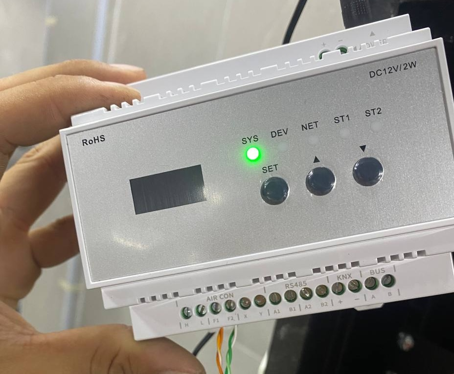

Đấu cáp tín hiệu cho bộ HVAC Gateway. (Daikin)

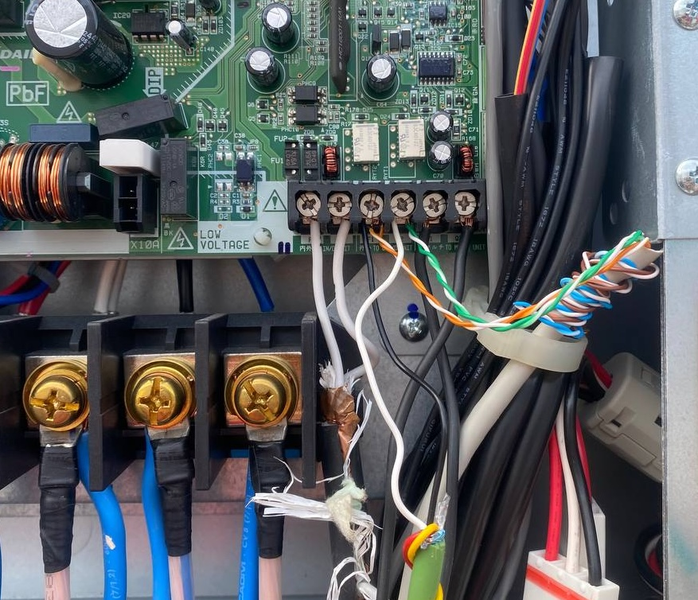

Kết nối bộ HVAC Gateway vào hệ thống điều hòa. (Daikin)

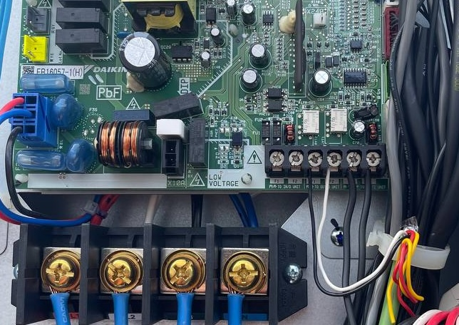

Đấu nối liên kết khi hệ thống có nhiều dàn nóng. (Daikin)

---

## 6. Lắp bộ điều khiển điều hòa PRO (LS212)

Xem hướng dẫn thi công chuyên sâu

LS212 kết nối trực tiếp vào dàn lạnh. Thiết bị này giao tiếp 1-1 với từng dàn lạnh riêng biệt.

### 1. Cảnh báo cháy nổ

**TUYỆT ĐỐI không được cắm nhầm nguồn AC 220V vào các chân tín hiệu (signal terminal).** Thao tác này sẽ cháy toàn bộ linh kiện điện tử trên bo mạch ngay lập tức. Hãng nghiêm cấm việc tự ý tháo mở thiết bị để sửa chữa — cháy do cắm nhầm nguồn không được bảo hành.

### 2. Kiểm tra trước khi kết nối

Phải chắc chắn hệ thống điều hòa đang chạy bình thường, không có mã lỗi báo trên panel gốc trước khi kết nối LS212 vào. Nếu điều hòa đang lỗi mà vẫn đấu vào, LS212 sẽ nhận sai trạng thái và gây khó khăn cho việc xác định nguyên nhân sau này.
### 3. Cắt điện hoàn toàn trước khi đấu nối

Bắt buộc ngắt điện cả hệ thống điều hòa lẫn thiết bị LS212 trước khi tiến hành bất kỳ thao tác đấu dây nào. Tuyệt đối không đấu nối khi hệ thống đang có điện — dòng tín hiệu trên bus điều hòa rất dễ phá hỏng mạch giao tiếp bên trong LS212.

### 4. Nguồn điện

Thiết bị có thể sử dụng nguồn 12VDC hoặc nguồn trực tiếp từ board mạch dàn lạnh (Cần tham khảo thêm tài liệu hướng dẫn của hãng).

### 5. Đấu cáp tín hiệu vào dàn lạnh

- Cáp tín hiệu đấu từ cổng AIR CON Interface trên LS212 vào cổng tín hiệu trên board mạch dàn lạnh.
- **Nếu đấu sai cực (đảo thứ tự dây)**: đèn RUN sẽ nháy nhanh mãi không dừng — thiết bị không tìm thấy điều hòa. Lúc này chỉ cần đảo lại 2 đầu dây tín hiệu là xong.
- Không đi chung cáp tín hiệu với cáp nguồn điện lưới.

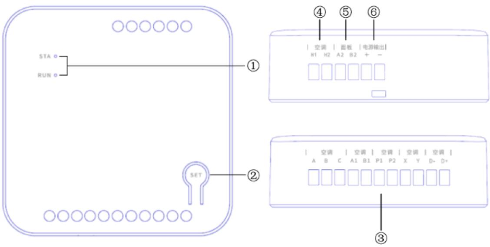

Mô tả phần cứng bộ LS212: (1) Đèn STA/RUN, (2) Nút SET, (3) Các cổng AIR CON, (4) Cổng H1/H2, (5) Cổng PANEL A2/B2, (6) Ngõ ra nguồn.

#### Bảng tra cứu cổng đấu nối tín hiệu (LS212)

| Hãng (Brand) | Cổng LifeSmart | Cổng trên dàn lạnh | Phân cực | Dùng song song remote gốc |
| :--- | :--- | :--- | :--- | :--- |
| **Daikin** VRV | P1, P2 | P1, P2 | Không | Có |
| **Hitachi** / **Hisense** / **York** (VRV) | P1, P2 | A, B | Không | Có |
| **Hitachi** (US) | A1, B1, D-, D+ | CN2 | Có | Không |
| **Toshiba** / **MHI** (VRV) | X, Y / P1, P2 | A, B / X, Y | Không | Có |
| **Panasonic** VRV | X, Y | CN041 (outside 2pin) | Không | Có |
| **MHI** (loại 3 dây) | A1&B1 song song, X, Y | CNB | Không | Có |
| **Midea** (Coolfree / Trung tâm) | A1, B1, D-, D+ | CN40 / CN20 | Có | Không / Có |
| **Gree** VRV | P1, P2 | H1, H2 | Không | Có |
| **Gree** (Giấu trần 2-4 dây) | H1, H2 / A1, B1, D-, D+ | COM_MANUAL / CN5-CN6 | Có | Có / Không |
| **Haier** (VRV / Giấu trần) | A, B, C / A1&B1 song song | CN22 / CONTROLLER / CN4 | Có | Không / Có |
| **Daikin** MX | A1, B1, D-, D+ | S21 | Có | Không |
| **Mitsu Electric** (Power Multi) | A1, B1, D-, D+ | CN105 | Có | Có |
| **Hisense** (Giấu trần N+) | A1, B1, D-, D+ | WIFI | Có | Có |

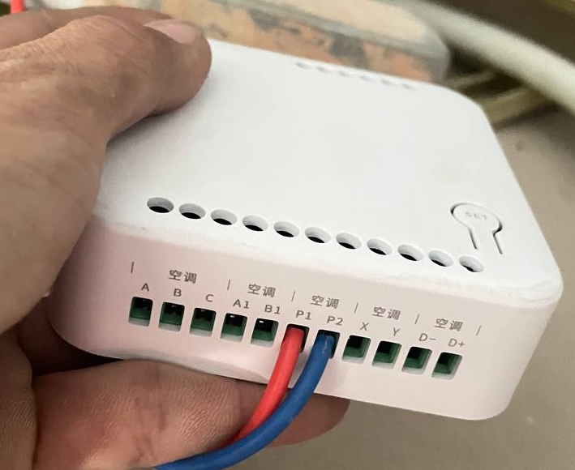

Các bước chuẩn bị và đấu nối cáp tín hiệu cho bộ LS212. (Daikin)

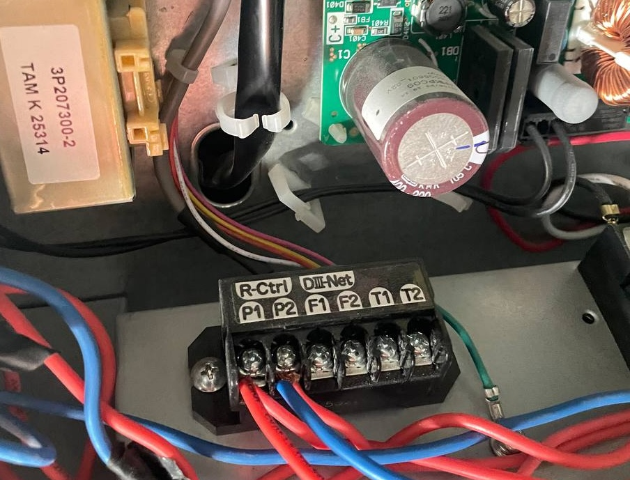

Hoàn thiện lắp đặt và cố định thiết bị LS212 vào vị trí dàn lạnh.

---

## 7. Lắp cảm biến

- **Cảm biến cửa (Door Sensor)**: Khoảng cách giữa thân và nam châm không quá 15mm. Nếu khe hở lớn hơn, cảm biến không nhận được tín hiệu đóng/mở. Tránh gắn trên cửa kim loại vì kim loại làm lệch từ trường. Nếu bắt buộc gắn cửa sắt, hãy dùng thêm miếng đệm nhựa cách ly.
- **Cảm biến chuyển động Pro (Motion Sensor Pro)**: 
    - Gắn ở độ cao 2.2 – 2.5m để đạt phạm vi quét tốt nhất (8 mét, góc 120°). 
    - Không hướng thẳng vào nguồn nhiệt (bếp, cửa gió điều hòa, ánh nắng trực tiếp) vì sẽ bị kích hoạt giả. 
    - Sử dụng pin CR123A.
- **Cảm biến tràn nước (Water Leak)**: Đầu dò đặt chạm mặt sàn (vị trí thấp nhất dễ đọng nước như gầm bồn rửa, cạnh máy giặt), thân gắn lên tường cao để tránh ngập mạch. Chỉ dùng trong nhà.
- **Cảm biến hiện diện Human Presence (MSA201 Z)**:
    - **Khoét lỗ**: Thiết bị âm trần, yêu cầu khoét lỗ đường kính **55mm**.
    - **Đấu nguồn**: Sử dụng nguồn xoay chiều AC 110-240V trực tiếp (chân L-N).
    - **Vị trí lắp đặt**: 
        - Phải gắn cố định chắc chắn trên trần. Nếu cảm biến bị rung lắc (do trần thạch cao lỏng hoặc gần máy móc rung), nó sẽ nhận diện nhầm thành có người.
        - Tránh xa các vật thể kim loại lớn, tường bê tông dày hoặc rầm (beam) vì chúng cản bước sóng microwave.
        - Tránh lắp gần cửa sổ có rèm vải mỏng (rèm phất phơ do gió sẽ bị nhận diện là chuyển động).
        - Tránh lắp gần cục nóng điều hòa, quạt thông gió hoặc các thiết bị không dây (router wifi) trong bán kính 1.5m để tránh nhiễu tín hiệu.
        - Khoảng cách tối thiểu giữa 2 cảm biến hiện diện là 2m để tránh gây nhiễu lẫn nhau.

---

## 8. Lắp bộ General Controller

Xem hướng dẫn thi công chuyên sâu

### 1. Đưa thiết bị báo khói thường vào hệ thống thông minh

Cắm cảm biến khói loại công nghiệp chạy nguồn 12V một chiều:

- Đấu chân NC từ cảm biến khói vào ngõ K1. Nhớ nối thêm 1 chân GND về ngõ COM để khép kín mạch báo động.
- Khi cảm biến khói nhảy cắt tiếp điểm khô, ứng dụng sẽ bật cảnh báo thông qua kịch bản đã cài sẵn. Cách này đơn giản nhưng hiệu quả — biến hệ báo cháy công nghiệp thường thành hệ báo cháy thông minh gửi thông báo về điện thoại.

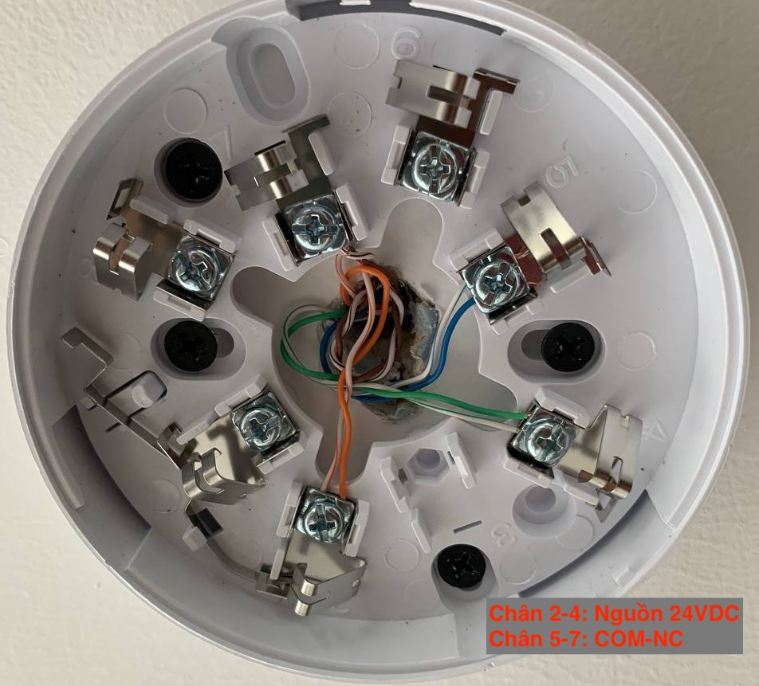

Hướng dẫn đấu nối tiếp điểm bộ báo khói về General Controller.

### 2. Điều khiển cổng tự động (tiếp điểm khô)

- Xác định tiếp điểm đóng mở cổng (thường là NO), đấu về cổng CH và chân COM+.
- Hầu hết các board mạch cổng tự động đều có ngõ vào cho nút nhấn tay (Push button), anh em đấu song song vào đó.
- Nếu cổng hoặc cửa cuốn cần dùng nhiều kênh thì phải đấu qua rơ-le trung gian, sử dụng các chân CH1, CH2, CH3 kết hợp với COM+ để điều khiển rơ-le trung gian đó.

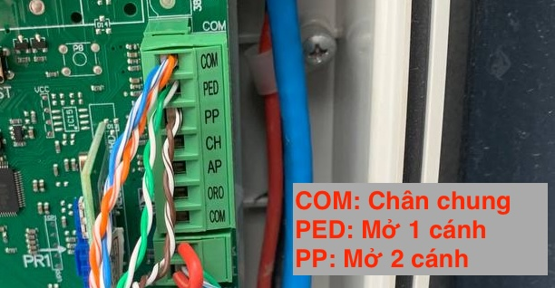

Hướng dẫn đấu nối tiếp điểm điều khiển cho motor cổng tự động.

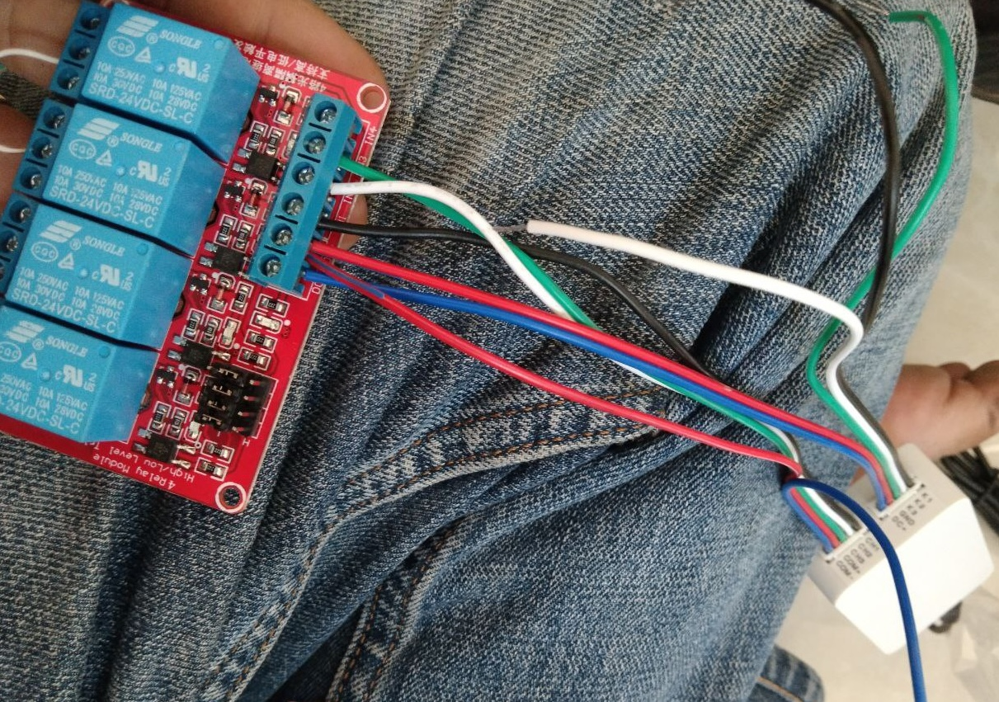

General Controller điều khiển thông qua rơ-le trung gian để đảm bảo an toàn và chịu tải.

### 3. Điều khiển cửa cuốn

Tùy vào loại board mạch motor, sơ đồ tiếp điểm điều khiển có thể khác nhau. Dưới đây là các dạng đấu nối thông dụng:

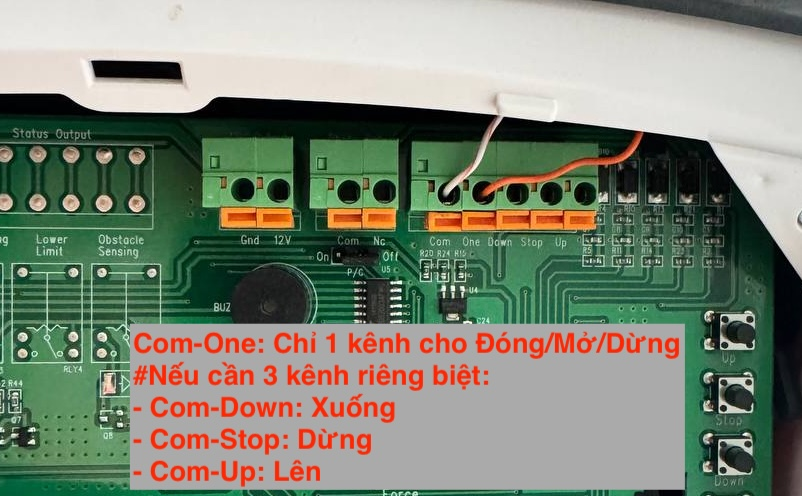
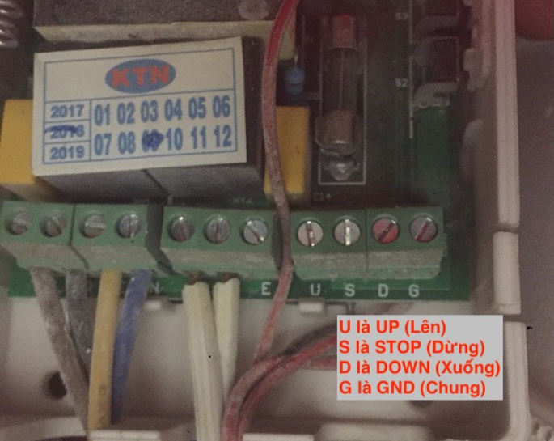
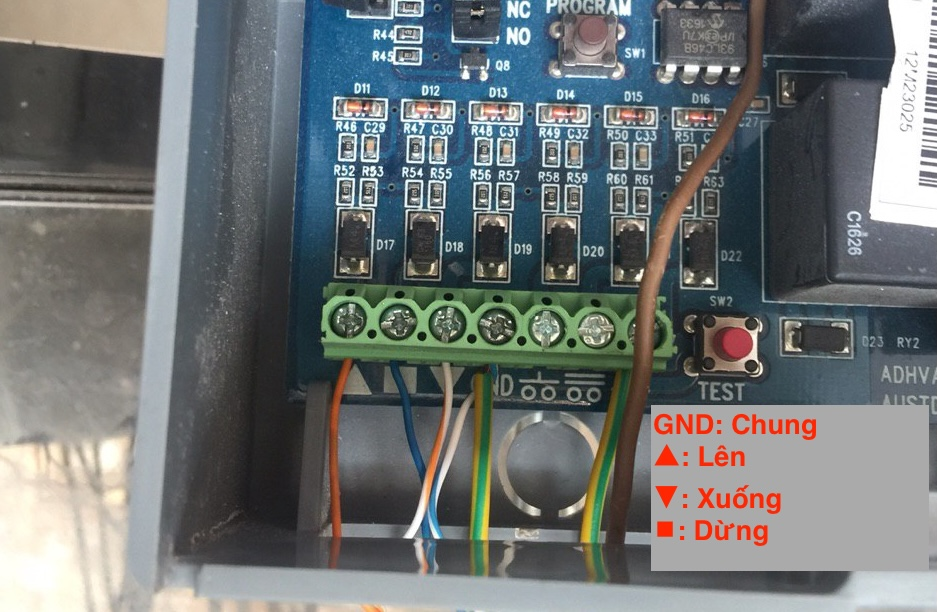
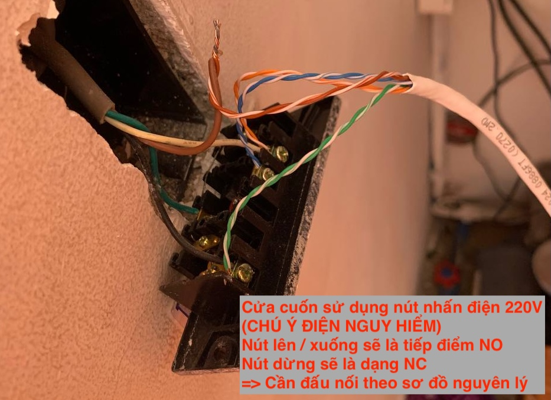

Tổng hợp các sơ đồ đấu nối tiếp điểm điều khiển cho các dòng motor cửa cuốn phổ biến trên thị trường.

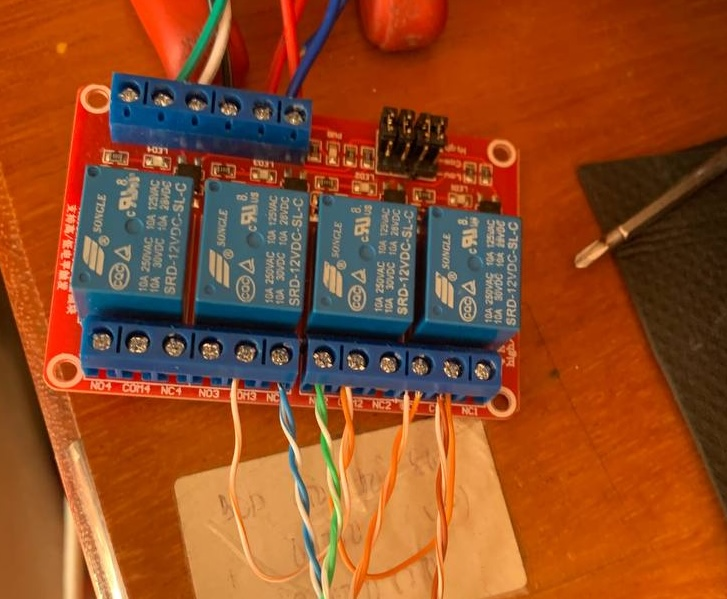

Sơ đồ đấu nối điều khiển cửa cuốn loại AC 220V qua bộ General Controller.

- Đối với của cuốn 220V chân Dừng (Stop) thường là dạng NC, chân Lên (Up) và Xuống (Down) là dạng NO.

### 4. Bản vẽ kỹ thuật (Sơ đồ đấu nối)
- [Cửa cổng và Beam](/drawings/MobiLife/MobiLife_CuaCong_Beam.pdf)
- [Cửa cuốn](/drawings/MobiLife/MobiLife_CuaCuon.pdf)

---

## 9. Lắp motor rèm

### 9.1. Lắp motor rèm QuickLink

Xem hướng dẫn thi công chuyên sâu

#### 1. Chuẩn bị hộc rèm

Trước khi thi công, phải kiểm tra kích thước hộc rèm trên trần:

- Rèm 1 lớp: hộc rèm tối thiểu 15cm chiều sâu.
- Rèm 2 lớp (rèm vải + rèm voan): hộc rèm tối thiểu 25cm chiều sâu để đủ chỗ cho 2 bộ ray + motor song song.
- Đảm bảo có ổ cắm điện hoặc nguồn dây cứng AC 220V sẵn bên trong hộc rèm. Nguồn đầu vào của motor QuickLink là AC 100–240V, 50/60Hz.

#### 2. Lắp ráp thanh ray QuickLink

Hệ thống ray QuickLink là dạng module tự ghép — không cần đặt xưởng cắt ray riêng:

1. Đo chiều dài cửa sổ hoặc vách kính cần lắp rèm.
2. Chọn các đoạn ray phù hợp (1m, 0.5m, 0.2m, 0.1m) và thanh nối (connector) để ghép thành đúng chiều dài mong muốn.
3. Lắp các đoạn ray vào nhau bằng cách trượt thanh nối vào rãnh nhôm — nghe tiếng "click" là đã khớp.
4. Lắp giá treo ray lên trần hoặc vào hộc rèm bằng vít nở. Khoảng cách giữa các giá treo khoảng 50–60cm.
5. Treo ray đã ghép xong lên giá treo.

#### 3. Lắp động cơ và kết nối nguồn

1. Gắn motor QuickLink vào đầu ray (phía có ổ cắm điện).
2. Cắm nguồn AC cho motor. Sau khi cấp điện, motor sẽ sẵn sàng ghép nối với hệ thống LifeSmart.
3. Lắp các móc treo rèm vào rãnh ray, sau đó treo rèm lên.

#### 4. Video hướng dẫn lắp đặt

- [Video hướng dẫn lắp ráp ray QuickLink](https://drive.google.com/file/d/1JLGIpZ6Uo-SaWTvAewWFdrA0LqwklRS_/view?usp=sharing)
- [Video hướng dẫn lắp ráp ray QuickLink](https://drive.google.com/file/d/1SUdmV5C4_-uyes6aIGcPJlekM9YoUmr4/view?usp=sharing)

### 9.2. Lắp bộ điều khiển rèm MINS

Bộ điều khiển rèm MINS là module rời, không gắn liền vào ray mà dùng để điều khiển động cơ rèm truyền thống.

Xem hướng dẫn thi công MINS

#### 1. Vị trí lắp đặt
Do kích thước nhỏ gọn, MINS thường được lắp tại các vị trí sau:
- **Trên trần thạch cao**: Đặt sát động cơ rèm để thuận tiện đấu nối dây tín hiệu.
- **Sau công tắc**: Giấu trong đế âm tường nếu anh em dùng công tắc cơ để kích hoạt lệnh tay.

#### 2. Đấu nối phần cứng
- **Dây tín hiệu**: Đấu nối các chân điều khiển từ MINS vào các cổng lệnh (Mở/Đóng/Dừng) trên động cơ rèm truyền thống theo sơ đồ đi kèm. 
- **Lưu ý**: Đảm bảo các mối nối được bọc cách điện an toàn, đặc biệt là khi lắp trên trần thạch cao.

## 10. Lắp SPOT (điều khiển hồng ngoại)

SPOT đặt trong tầm nhìn thẳng với thiết bị cần điều khiển (TV, máy lạnh). Nếu bị vật cản che thì hồng ngoại không truyền tới được.

---

## 11. Lắp bộ điều khiển Dimmer 0-10V

Xem hướng dẫn thi công chuyên sâu

### 1. Sơ đồ đấu nối dây

Thiết bị LS180 có 2 cụm dây chính cần lưu ý:

- **Cụm cấp nguồn (N, L)**:
    - **N**: Dây trung tính (nguội).
    - **L**: Dây lửa.
- **Cụm tín hiệu dimming (+ , -)**:
    - **+**: Nối vào cực dương (+) của bộ Driver điều khiển đèn.
    - **-**: Nối vào cực âm (-) của bộ Driver điều khiển đèn.

### 2. Lưu ý kỹ thuật quan trọng

- **Kiểm tra chuẩn Dimming**: LS180 chỉ tương thích với hệ thống đèn hỗ trợ chuẩn dimming 0-10V hoặc 1-10V.
- **Giới hạn khoảng cách**: Độ dài dây tín hiệu từ LS180 đến đèn không nên vượt quá **20 mét** để tránh sụt áp gây sai lệch độ sáng.
- **Khả năng tải**: Một bộ LS180 có thể điều khiển song song nhiều đèn (khoảng 50 đèn LED), miễn là tổng dòng điều khiển không quá **100mA**.
- **An toàn**: Luôn ngắt điện hoàn toàn trước khi đấu nối. Kiểm tra kỹ cực tính (+) và (-) của dây tín hiệu để tránh hỏng Driver đèn.
- [Bản vẽ kỹ thuật: Dimmer 0-10V & Color](/drawings/MobiLife/MobiLife_Dimmer_0-10V_Color.pdf)

---

## 12. Lắp bộ điều khiển Dimmer DALI

Xem hướng dẫn thi công chuyên sâu

### 1. Ý nghĩa các cổng kết nối

Thiết bị DALI Controller có các thành phần giao tiếp vật lý sau:

- **Cổng DALI (DALI control connection line)**: Kết nối trực tiếp vào đường bus của hệ thống DALI.
- **Cổng cấp nguồn (Power supply interface)**: Cấp nguồn DC từ 12V đến 24V.
- **Công tắc gạt (Dip switch)**:
    - Gạt sang trái (phía cổng nguồn DC): Sử dụng nguồn từ Adapter DC 12-24V.
    - Gạt sang phải (phía cổng DALI): Sử dụng nguồn trực tiếp từ đường bus DALI (nếu bus có tích hợp nguồn).
- **Nút ghép nối (Pairing button)**: Dùng để đăng ký thiết bị vào Smart Station.

### 2. Sơ đồ và cấu trúc mạng

- **Topology**: Hỗ trợ nối tiếp (series), hình sao (star) hoặc hỗn hợp. **Tuyệt đối không đấu nối dạng vòng (ring)** vì sẽ gây lỗi hệ thống truyền thông.
- **Khoảng cách**: Tổng chiều dài cáp DALI không vượt quá **300 mét**.
- [Bản vẽ kỹ thuật: Dimmer Dali](/drawings/MobiLife/MobiLife_Dimmer_Dali.pdf)

---

## 13. Tích hợp khóa thông minh Yale

Việc tích hợp khóa Yale thông qua module kết nối (SL_LK_YL) yêu cầu thao tác trực tiếp trên thân khóa.

Xem hướng dẫn lắp đặt module Yale

#### 1. Lắp bộ mặt khóa và kết nối module
- Kỹ thuật viên tiến hành lắp đặt bộ mặt khóa Yale lên cửa theo đúng quy trình của hãng khóa.
- Module LifeSmart dành cho khóa Yale sẽ được cắm trực tiếp vào cổng module trên bo mạch phía sau của khóa.

#### 2. Lưu ý về cấu hình
- Sau khi cắm module, cần thực hiện lệnh ghép nối (Pairing) trên khóa để khóa nhận diện module và truyền tín hiệu về Smart Station.
- Kiểm tra tính năng mở khóa từ xa trên App. Nếu không mở được, hãy kiểm tra lại tham số `enable_remote_unlock` trong cài đặt.

---

## Tài liệu tham khảo
- [LifeSmart Brochure 250929.pdf](https://drive.google.com/file/d/1fTBlvwOsanYKhR_P5AMORJnfAf_2o4uE/view?usp=drive_link)
- [Thư mục tài liệu tổng hợp LifeSmart (Drive)](https://drive.google.com/drive/folders/1RGZRgWJHFBUisvcJDJZeW6HBTIsZKWBy)
- [Thư mục tài liệu kỹ thuật LifeSmart (Drive)](https://drive.google.com/drive/folders/1B_znIzettzmx4HUYxsCR26Z_aZ9bF1Lm)

