## Mục tiêu
- Thêm Smart Station đúng cách và giữ Hub kết nối ổn định.
- Ghép nối thiết bị con nhanh, hạn chế lỗi hết thời gian chờ.

---

## 1. Thêm Smart Station

1. **Chuẩn bị**: Tải ứng dụng LifeSmart, đăng ký tài khoản mới (Mỗi nhà 1 tài khoản riêng). Cân nhắc cắm dây cáp mạng LAN vào Smart Station để đảm bảo kết nối ổn định nhất. Điện thoại của bạn phải đang kết nối vào cùng mạng Wi-Fi (cùng lớp mạng LAN) với Smart Station.

2. **Quét thiết bị**: Trong ứng dụng, nhấn dấu `+` → Chọn **Smart Station** → Chọn **Search (Khuyến nghị)**. Ứng dụng sẽ tự quét mạng nội bộ và liệt kê các Station đang online.
   
   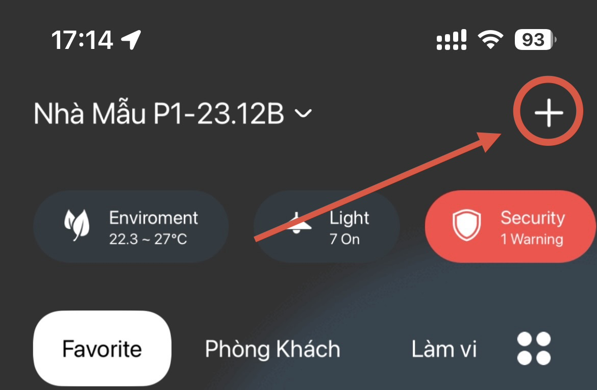
   
Thêm thiết bị

   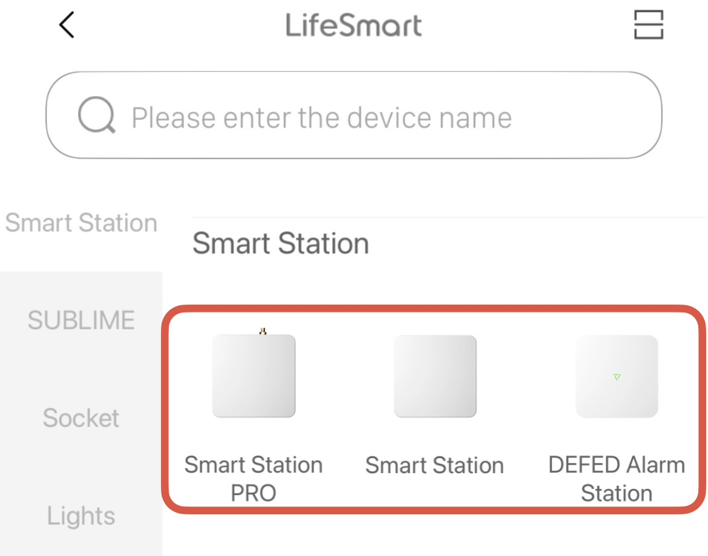
   
Chọn thêm Station

   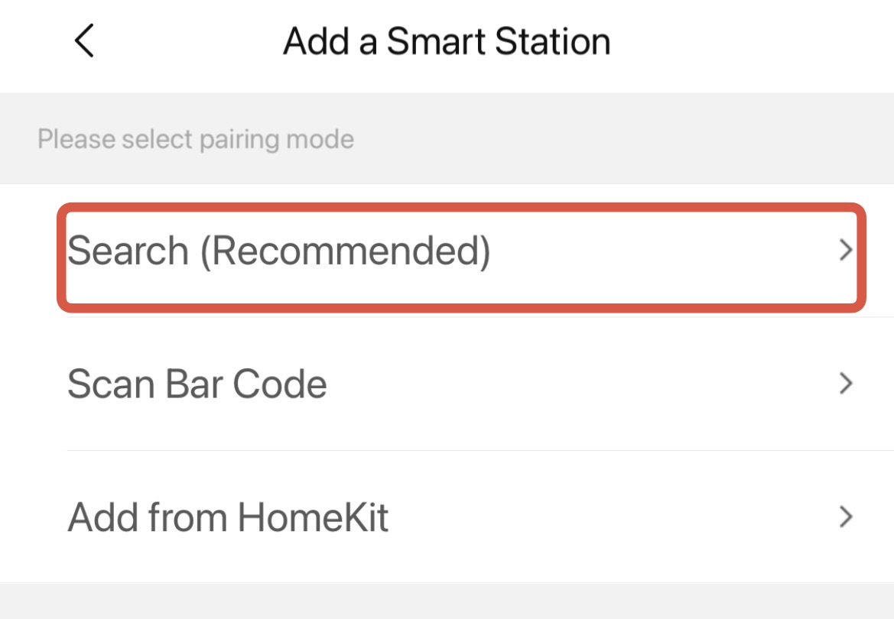
   
Sử dụng tính năng Search (khuyên dùng) để quét Smart Station trong mạng nội bộ.

3. **Thêm thiết bị**: Chọn Smart Station hiển thị trong danh sách để thêm vào tài khoản.

   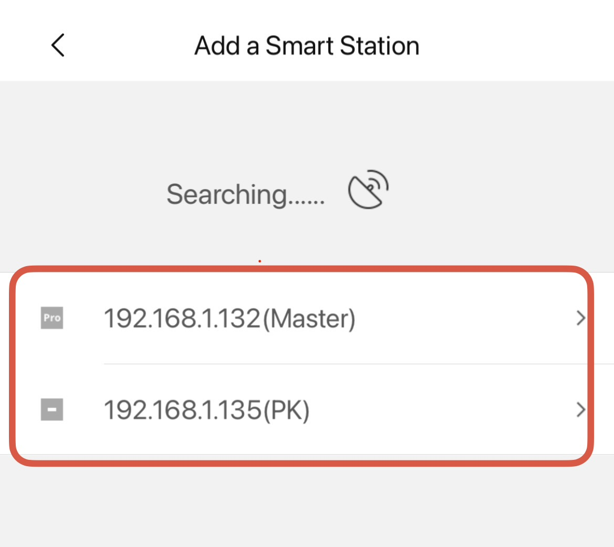
   
Danh sách các Smart Station tìm thấy trong mạng LAN

4. **Cập nhật Firmware (Bắt buộc)**: Ngay sau khi thêm thành công, anh em phải vào **Engineering Settings → Update Smart Device** để cập nhật Smart Station lên bản Firmware mới nhất. Bước này rất quan trọng để Station nhận diện được các thiết bị con đời mới và chạy kịch bản ổn định.

   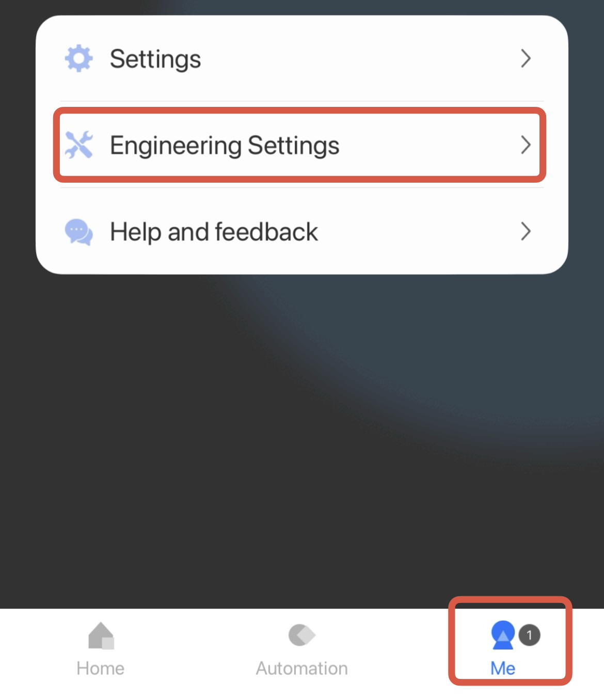
   
Truy cập Engineering Settings trong mục Station.

   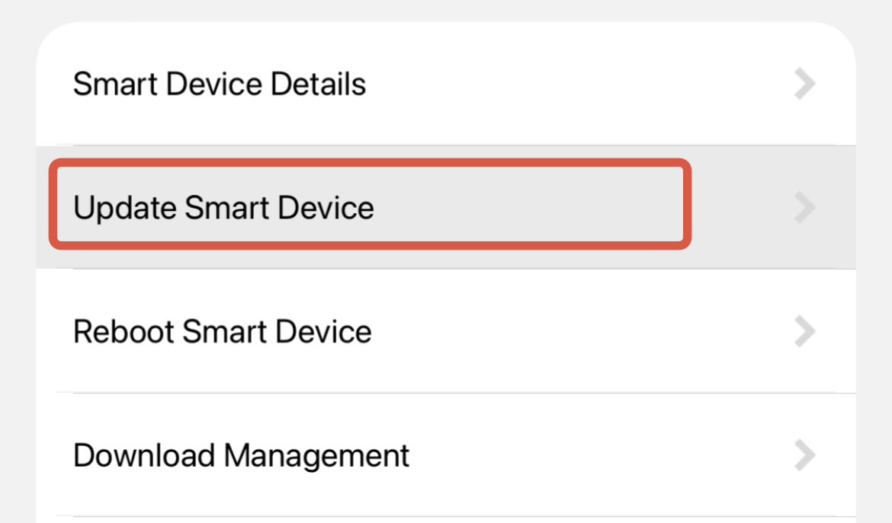
   
Chọn tính năng Update Smart Device.

   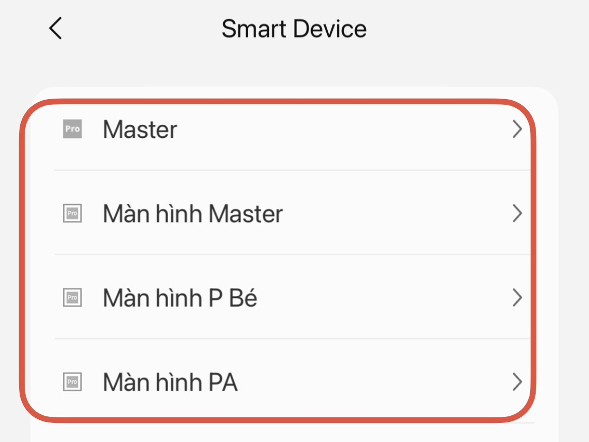
   
Danh sách các Station.

   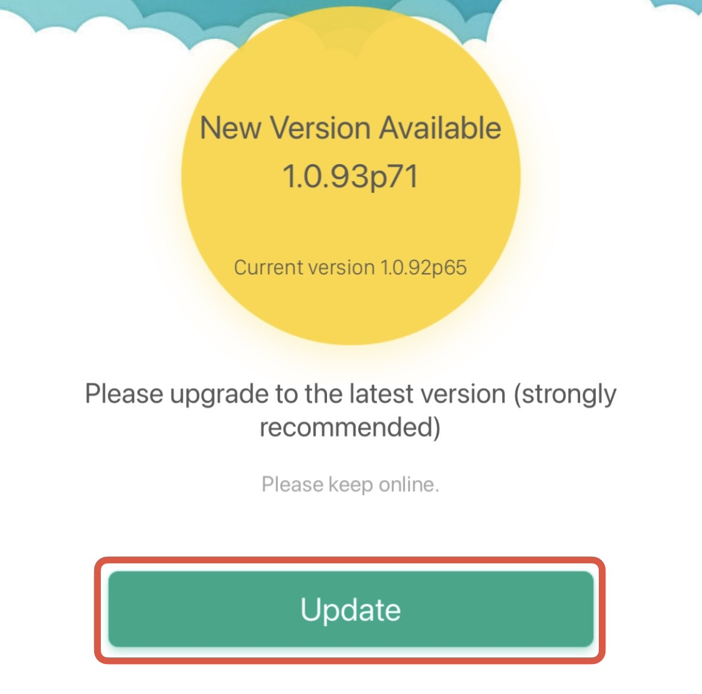
   
Cập nhật Firmware bản mới nhất.

---

## 2. Ghép nối thiết bị con

### 2.1. Các bước chung

1. Trong ứng dụng, chọn thêm thiết bị.
2. Chọn đúng loại thiết bị muốn thêm.
3. Trên thiết bị vật lý, nhấn giữ nút ghép nối khoảng 5 giây cho đến khi đèn nhấp nháy (sẵn sàng).
4. Đợi ứng dụng hoàn tất ghép nối.
5. Đặt tên thiết bị theo quy tắc (xem bài 04).

### 2.2. Mấy lỗi hay gặp

Nếu ứng dụng báo hết thời gian chờ, thường là do thiết bị chưa vào đúng chế độ ghép nối. Nhấn giữ nút lại từ đầu.

Khi ghép nối, đặt thiết bị gần Hub (dưới 5m). Ghép xong rồi mới đem ra vị trí lắp đặt thực tế. Nếu ghép nối khi đã gắn xa Hub, tín hiệu yếu dẫn đến ghép hoài không được.

---

## 3. Cấu hình SUBLIME

Xem hướng dẫn cài đặt chi tiết

### 3.1. Ghép nối thiết bị vào mạng (Pairing)

Sau khi cấp điện thành công ở phần cứng, SUBLIME chưa nhận ra bộ trung tâm. Hãy làm theo hướng dẫn sau trên Actuator.

1. **Tháo rời mặt cảm ứng Panel.** Để nguyên phần vi mạch rơ-le chịu điện (Actuator) chôn trong thạch cao/bê tông.
2. Tìm nút nhấn cơ vật lý chuyên dụng cho cấu hình (thường là cục nút nhỏ thụt sâu) trên mặt Actuator.

Vị trí nút nhấn cứng trên Actuator âm tường.

3. Dùng đầu tô vít nhỏ hoặc que nhấn cách điện chuyên dụng **nhấn và giữ hờ** nút đó trong hơn 5 giây. Ngay khi đèn led trạng thái chuyển sang màu nhấp nháy liên tục, thả tay ra — đây là chế độ sẵn sàng đón tín hiệu nhận thông báo cấu hình.
4. Mở ứng dụng LifeSmart → Nhấn dấu `+` → Chọn **Add Device** (Thêm thiết bị mới) → Lướt xuống chọn định dạng dải series SUBLIME và đợi thiết bị quét trong vòng một phút thiết lập.

### 3.2. Lập trình gán kịch bản và phím

Vừa quét lên ứng dụng thành công, tên các lộ đèn sẽ bị gắn mặc định lộn xộn (ví dụ: Button 1, Light 4). Hệ thống cần anh em quy hoạch tên gọi và phương thức giao tiếp thật kỹ lưỡng:

1. Chạm vào thông số bảng điều khiển giao diện chính của thiết bị này trên ứng dụng.
2. Bấm vào biểu tượng cấu hình (bánh răng) ở trang cài đặt chung.
3. Ở tính năng Button Configuration (Cấu hình nút chạm), đổi lại tên gợi nhớ như "Đèn Chùm", "Rèm 1 Lớp" kèm thay logo đúng nhận diện ánh sáng.

#### Mẹo quan trọng: Tận dụng CoSSLink
Để khách hàng có cảm giác hệ thống tốc độ phản hồi cực nhanh, ưu tiên nhóm các lộ bóng sáng/phím cứng theo nhánh độc lập (Local Device) gọi là **CoSSLink** thay vì cho kịch bản chạy vòng vèo qua đám mây Internet Cloud.

Nếu chọn chuẩn CoSSLink, bấm tạch một cái, thông điệp sẽ lao đi qua mạng WiFi hoặc trực tiếp rơ le điện một chiều truyền tải xuống tủ điện mà không tốn đường truyền xử lý, mang lại độ trễ tương đương với hệ công tắc ngàm cơ vặn tay và đặc biệt đứt quang cáp biển vẫn không sao.

---

## 4. Cấu hình Nature

### 4.1. Thiết lập cấu hình mạng Working Mode

Nature Mini có hai chế độ chạy mạng giao thức cục bộ để tương thích mọi không gian nhà cửa. Anh em kỹ thuật BẮT BUỘC phải chọn thống nhất đúng một chế độ ngay từ ngày đầu đi làm theo bản vẽ mạng chuẩn:

- **Chế độ Hub điều khiển trung tâm (Station Mode):** Màn hình hoạt động như một bộ não độc lập không cần mua thêm Smart Station phụ trợ ngoài. Nó sẽ tự tìm WiFi hoặc cắm cáp quang, cho phép đăng nhập tài khoản đám mây, và phát tín hiệu sóng CoSS ra môi trường xung quanh nhằm nhận dạng các cảm biến rời cắm vào cùng hệ thống khu vực phòng khách nhỏ. Rất phù hợp tối ưu ngân sách cho các dự án căn hộ studio 1 phòng khách, 1 phòng ngủ.
- **Chế độ thiết bị ngoại vi màn hình (Sub-device Mode):** Màn hình đóng vai trò giống như chiếc điện thoại thông minh, nhận lệnh hiển thị các phím tắt công tắc, hiển thị thiết bị đo lường được kéo từ bộ Hub trung tâm (ví dụ: DEFED Station) hiện đang treo trong tủ bảng điện. Áp dụng cho biệt thự khủng, nhà nhiều tầng cần sóng xa ổn định, phải tách bạch bộ não ra để chống rớt mạng nội bộ.

### 4.2. Thao tác trên giao diện màn hình cảm ứng

Trong lần đầu khởi động, hoặc nếu cần reset lại thiết bị:

1. Chạm lướt trên cùng góc bên phải màn hình Nature để móc ra biểu tượng Menu ba dấu chấm. Bấm chọn.
2. Tìm và chọn mục Cài đặt hệ thống lõi.

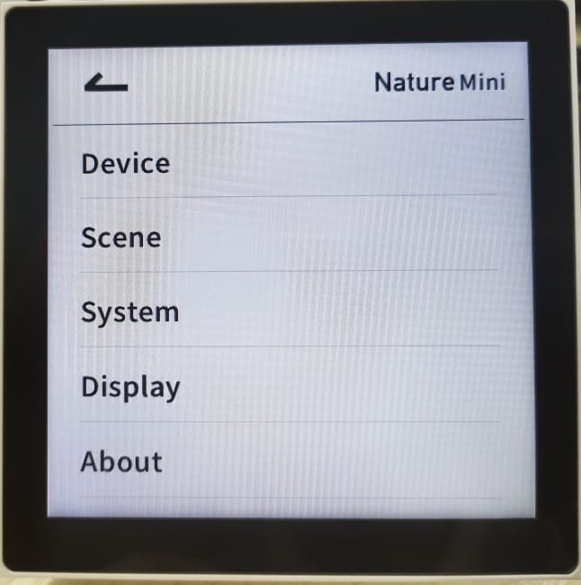

Menu cài đặt cấu hình nằm phía trên bảng điều khiển giao diện màn hình.

3. Chọn hạng mục **Working Mode** (Chế độ thiết bị).
4. Ở màn hình này, bấm dứt khoát 1 trong 2 chế độ phù hợp với hạ tầng mạng đã trình bày ở trên sơ đồ thiết kế. Sau khi xác nhận, thiết bị mất khoảng một hai phút để xóa thông số gốc, boot lại phần mềm rồi nhả màn hình QR ghép nối.

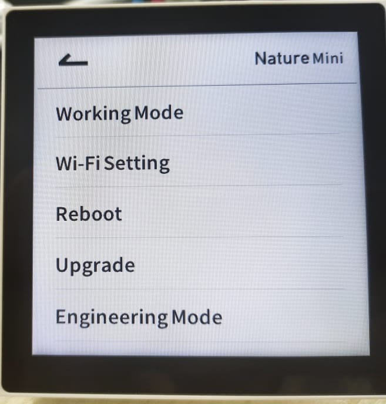

Cấu hình Working Mode - Quyết định mạng CoSS sẽ lan tỏa thế nào trong nhà.

#### Cảnh báo dành cho anh em triển khai
Nature Mini là thiết bị "lai", kết hợp công suất công tắc, não cá vàng xử lý hệ điều hành và bộ router mini. Nhớ khai báo Working Mode trước tiên để chọn hướng điều binh khiển tướng rồi mới đi kết nối camera hay cài đặt kịch bản rèm tắt mở. Nhiều anh em vô tính bấm lướt nhanh đồng bộ hết đồ đạc, xong một ngày mới ngã ngửa chế độ thiết lập sai, đành ngậm bồ hòn bấm factory reset xóa sạch làm lại vài tiếng đồng hồ.

---

## 5. Cấu hình điều hòa (HVAC Gateway)

### 5.1. Cấu hình chọn hãng điều hòa qua Bluetooth

Các phiên bản HVAC Gateway đời mới nhất không sử dụng chân gạt phần cứng nữa mà đã chuyển sang cấu hình hoàn toàn qua kết nối Bluetooth.

Cách lấy mã cấu hình trên điện thoại:

1. Lần đầu cắm điện, trên màn hình LCD của Gateway sẽ hiện một mã QR.
2. Dùng điện thoại (qua WeChat) quét mã QR này — hoặc tìm tài khoản Official Account tên "迈斯" (hoặc "迈斯maisi") để vào mục cấu hình qua Bluetooth.
3. Kết nối Bluetooth với thiết bị Gateway. Khi kết nối thành công, đèn Bluetooth (ST1) trên board sẽ sáng xanh lá cố định.
4. Trên giao diện điện thoại, chọn khai báo tên hãng điều hoà cần kết nối (Daikin, Mitsubishi, Toshiba, Panasonic...).

Ngoài ra, thao tác vật lý trên nút nhấn board mạch chỉ dùng cho 2 trường hợp khẩn cấp:

- Nút SET: bấm giữ 5 giây để khôi phục cài đặt gốc (khi màn hình đang hiện ở trang Reset).
- Phím lên/xuống: chuyển xem các tab thông báo số lượng máy quét được, hoặc nhấn tổ hợp lên + xuống để khởi động lại Gateway.

### 5.2. Luồng cấu hình lên ứng dụng

Sau khi cấp nguồn 12V một chiều, thiết bị sẽ khởi động:

1. Chờ trên màn hình hiển thị chạy số đếm ngược. Nó cho 20 giây hiển thị chế độ Reset — đừng bấm gì, cứ đợi để nó tự nhảy.
2. Màn hình báo "Searching HVAC ...". Gateway sẽ tự quét tìm thiết bị dàn lạnh. Quá trình này tốn chừng 2 đến 5 phút.
3. Nếu quét xong, số lượng điều hòa tìm thấy sẽ hiển thị. Đèn HBS trên board sẽ nhấp nháy (báo đã bắt được nhịp tín hiệu máy lạnh). Đèn STA tối là tín hiệu bình thường.
4. Mở ứng dụng LifeSmart → bấm "+" → thêm thiết bị, chọn loại Central Air-conditioner Smart Gateway.
5. Vào Engineering Settings -> All Devices ->  Station đã thêm thiết bị, chọn Central Air-conditioner Smart Gateway, vào phần Settings.
6. Ở mục Address Setting chọn No.1 Address điền 1, xong quay lại trượt màn hình từ phải sang trái (ở ô No.1 Address) để bắt đầu đồng bộ nhóm địa chỉ (Sync). Chọn tất cả các nhóm dàn lạnh (Group 0-3). Trong lúc đang đồng bộ, không thao tác gì trên HVAC Gateway.

   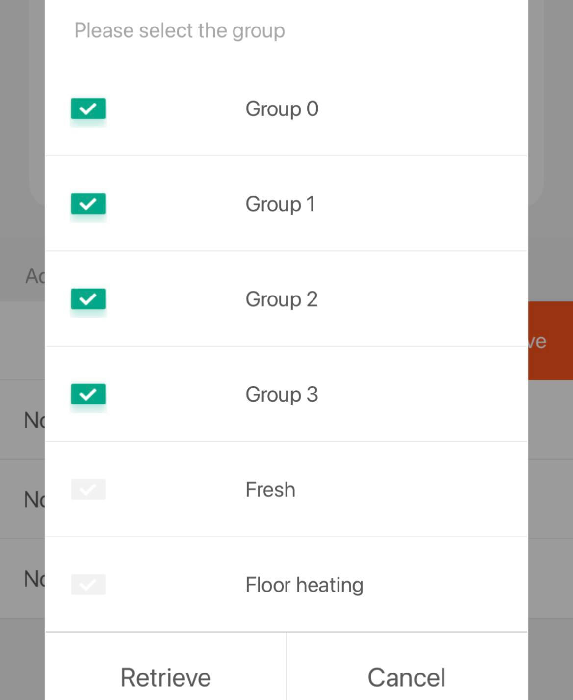
   
   <video autoplay muted loop playsinline width="100%">
     <source src="/wiki/assets/videos/hvac-sync.mp4" type="video/mp4">
     Trình duyệt của bạn không hỗ trợ phát video.
   </video>

   
Hình ảnh và video thực hiện thao tác đồng bộ (Sync) dữ liệu dàn lạnh từ HVAC Gateway lên ứng dụng LifeSmart.

7. Sau khi đồng bộ xong, các nhóm dàn lạnh sẽ hiển thị. Chọn các nhóm dàn lạnh để đưa về màn hình hiển thị dưới dạng điều khiển máy lạnh riêng biệt. Đặt lại tên từng máy lạnh theo phòng.

Khi gặp lỗi: màn hình Gateway có sẵn chỗ hiển thị mã lỗi. Thấy mã lỗi thì chụp lại và gửi thẳng cho kỹ thuật bên mảng cơ điện lạnh. Đây là cách nhanh nhất chứng minh lỗi thuộc về hệ điều hoà hay nằm ở hệ thống thông minh.

---

## 6. Cấu hình điều hòa PRO (LS212)

### 6.1. Cấu hình chọn hãng điều hòa

Tương tự HVAC Gateway, LS212 hỗ trợ cấu hình chọn hãng qua kết nối Bluetooth:

1. Cấp nguồn DC 12V cho LS212. Đèn RUN sẽ nháy nhanh — thiết bị đang tìm kiếm điều hòa.
2. Dùng điện thoại quét mã QR hoặc kết nối Bluetooth với thiết bị.
3. Chọn hãng điều hòa cần kết nối (Daikin, Hitachi, Toshiba, Panasonic, Mitsubishi, Midea, GREE, Haier...).
4. Đợi đèn RUN sáng cố định — thiết bị đã tìm thấy và kết nối thành công với dàn lạnh.

Nếu đèn RUN nháy nhanh mãi không dừng: kiểm tra lại thứ tự đấu dây tín hiệu (có thể bị đảo cực), hoặc xác nhận lại hãng điều hòa đã chọn đúng chưa.

### 6.2. Thiết lập Master/Slave (khi dùng song song panel gốc)

Nếu công trình vẫn muốn giữ lại panel điều khiển nhiệt độ gốc của hãng điều hòa, cần thiết lập chế độ ưu tiên:

- **Master (Chính)**: thiết bị nào ở chế độ Master sẽ được ưu tiên xử lý lệnh. Thường đặt LS212 làm Master để ứng dụng thông minh chiếm quyền điều khiển.
- **Slave (Phụ)**: panel gốc vẫn hoạt động nhưng ở vai trò phụ.

Cách thiết lập: tùy từng hãng điều hòa, việc chuyển Master/Slave được thực hiện qua công tắc gạt DIP switch trên LS212 hoặc cài đặt trực tiếp trên panel gốc. Tham khảo bảng tương thích đi kèm thiết bị để chọn đúng cách.

### 6.3. Ghép nối lên ứng dụng LifeSmart

1. Mở ứng dụng LifeSmart → bấm "+" → thêm thiết bị, chọn loại LS212.
2. Đợi ứng dụng quét và nhận thiết bị (chừng 1–2 phút).
3. Đặt tên thiết bị theo phòng (ví dụ: "Điều hòa Phòng họp T3").

## 7. Cấu hình General Controller

Phần quan trọng nhất khi cấu hình General Controller là chọn đúng chế độ hoạt động:

- **Follow (đảo trạng thái):** mỗi lần kích ngõ vào, ngõ ra sẽ lật trạng thái. Bấm 1 nhát thì rơ-le CH1 đảo mạch, bấm lại thì CH1 lật lại. Dùng khi cần thay thế công tắc cơ bằng phím cứng.
- **Jog (bấm giữ - nhả buông):** rơ-le chỉ duy trì khi giữ nút. Bấm giữ thì CH1 hít xuống COM+, nhả nút thì rơ-le tự buông ra. Chế độ này rất phù hợp cho nút nhấn khóa từ mở cửa, hoặc còi báo khẩn cấp — giữ tay thì kêu, bỏ tay thì tắt.

Ngoài ra còn có bảng chỉnh thông số trễ tự đóng cho mô-tơ. Ví dụ cổng rào mở mất 15 giây thì nhập 15 giây vào ứng dụng, sau khi mở hết hành trình rơ-le sẽ tự ngắt. Tùy lúc thi công, đo thời gian mô-tơ mở cánh rồi nhập số giây phù hợp.

---

## 8. Cấu hình CUBE Module

Sau khi lắp xong phần cứng và bật CB cấp điện:

1. Mở ứng dụng LifeSmart → dấu "+" → chọn CUBE Switch Module.
2. Ghép nối: bật/tắt công tắc lẩy cơ liên tiếp khoảng 6 lần (tổng cộng 12 lần gạt lên gạt xuống). Lắng nghe tiếng rơ-le "tạch tạch" nhịp nhanh bên trong Module — đó là dấu hiệu thiết bị đã vào chế độ sẵn sàng ghép nối.
3. Chờ khoảng 1 phút, ứng dụng sẽ tự nhận thiết bị. Sau đó đặt tên theo quy tắc chuẩn (ví dụ: Đèn Cầu Thang T1).
4. Cài trạng thái mặc định (Save as Default): vào cài đặt (biểu tượng bánh răng) trong ứng dụng, tìm mục Save as Default. Tính năng này quyết định khi mất điện rồi có điện lại, rơ-le sẽ trở về trạng thái nào. Nên đặt mặc định là tắt — tránh tình huống 2 giờ sáng cúp điện rồi có lại, đèn cầu thang tự sáng chói làm cả nhà giật mình.
5. Nếu cần mở rộng, cấu hình thêm kịch bản hẹn giờ (Schedule) hoặc liên kết logic (điều kiện kích hoạt) để kết hợp Module với cảm biến chuyển động, cảm biến radar — ứng dụng LifeSmart có sẵn các mẫu trong mục lập trình thông minh.

---

## 9. Cấu hình motor rèm QuickLink

### 9.1. Ghép nối motor vào ứng dụng

1. Cấp nguồn AC cho motor QuickLink.
2. Mở ứng dụng LifeSmart → bấm "+" → chọn thêm thiết bị, tìm loại QuickLink Curtain Motor.
3. Đợi ứng dụng quét và nhận motor (chừng 1 phút).
4. Đặt tên theo vị trí lắp đặt (ví dụ: "Rèm Phòng khách", "Rèm Phòng ngủ Master").

### 9.2. Cài đặt hành trình (Travel Set)

Sau khi ghép nối thành công, motor cần được dạy nhận biết điểm đầu và điểm cuối:

1. Trong ứng dụng, vào cài đặt motor rèm → tìm mục Travel Set.
2. Bấm nút Delete all the setting trên App để reset hành trình.
3. Điều khiển motor chạy đến vị trí mở hết rèm → bấm lưu điểm mở (Set start stroke).
4. Điều khiển motor chạy đến vị trí đóng hết rèm → bấm lưu điểm đóng (Set up the trip).
5. Kiểm tra lại bằng cách bấm mở/đóng vài lần, motor phải dừng đúng vị trí đã lưu.

Nếu rèm dừng chưa đúng vị trí, vào lại Travel Set và chỉnh lại.

### 9.3. Cài đặt đảo chiều (Reverse)

Nếu điều khiển rèm bị ngược
Vào trong ứng dụng, vào cài đặt motor rèm → tìm và bấm chọn mục Operation reverse.

---

## 10. Ứng dụng & Kịch bản (Scene) với Cảm biến

Cảm biến đóng vai trò là điều kiện kích hoạt (Trigger) trong AI Builder để tạo ra các kịch bản tự động hóa.

### 10.1. Kịch bản với Cảm biến cửa

- **Chiếu sáng tự động**: Bật đèn khi mở cửa (ví dụ: cửa kho, cửa toilet).
    - *Thiết lập*: AI Builder → Trigger: Guard Sensor (Window/Door Sensor) chọn "Open" → Action: Chọn bóng đèn/công tắc, lệnh "Turn On".
- **An ninh tích hợp Camera**: Khi ở chế độ an ninh (Arm mode), nếu cửa bị mở bất thường → gửi lệnh đến Camera Indoor chụp ảnh (Snapshot) và gửi thông báo khẩn về điện thoại.
- **Tiết kiệm năng lượng**: Nếu phát hiện cửa sổ đang mở (Open) → tự động tắt Điều hòa/Lò sưởi qua HVAC Gateway hoặc Thermostat để tránh lãng phí điện.

### 10.2. Kịch bản với Cảm biến chuyển động

- **Chiếu sáng hành lang/cầu thang**: Bật đèn khi phát hiện người bước vào. Có thể lập trình độ trễ tắt đèn (warning_duration) từ 6 đến 814 giây sau khi không còn chuyển động.
- **Báo động đột nhập**: Khi kích hoạt chế độ vắng nhà, nếu cảm biến phát hiện chuyển động → đẩy thông báo (Push Notification) tức thì và Snapshot hình ảnh từ camera về di động.

### 10.3. Kịch bản với Cảm biến hiện diện

Vì có khả năng nhận diện người ngay cả khi không cử động, kịch bản của cảm biến hiện diện sẽ "thông minh" hơn cảm biến chuyển động thông thường:

- **Giữ sáng đèn khi đứng yên**: Bật đèn khi bước vào phòng và **duy trì sáng** ngay cả khi người dùng ngồi đọc sách, làm việc hoặc ngồi toilet trong thời gian dài mà không cần "khua tay" để kích hoạt lại.
- **Tối ưu hóa Điều hòa/Năng lượng**: Chỉ tắt điều hòa khi thực sự không còn ai trong phòng (kể cả người đang ngủ).

**Lưu ý cấu hình thông số trên App:**
- **Độ nhạy (Sensitivity)**: Gợi ý đặt 30-50% cho phòng khách/bếp, và 80% cho phòng ngủ để bắt được nhịp thở.
- **Thời gian giữ (Hold Time / Warning Duration)**: Đặt từ 3-5 phút để trạng thái luôn ổn định, tránh việc đèn chớp tắt khi người dùng tạm thời ra khỏi vùng quét cốt lõi.
- **Phòng ngủ**: Nên lắp cảm biến hướng thẳng vào vị trí lồng ngực của người nằm để bắt tín hiệu hô hấp tốt nhất.

---

## 11. Cấu hình đèn Dimmer

### 11.1. Dimmer 0-10V Controller

1. **Ghép nối**: Trong ứng dụng, nhấn dấu **"+"** → chọn **Add Device** → tìm icon **Dimming Controller**. Trên thiết bị, nhấn giữ nút ghép nối **5 giây** cho đến khi đèn nhấp nháy.
2. **Điều chỉnh độ sáng**: Trên giao diện điều khiển, trượt thanh cuộn từ **0 đến 100**.
3. **Xử lý nhiễu (Background Noise)**: Nếu thiết bị báo "không phản hồi" liên tục, vào **Equipment Information** → chọn **Modify communication parameters**. Tăng **Background threshold** lên mức 90 hoặc 100 để ổn định tín hiệu.

### 11.2. Dimmer DALI Controller

1. **Ghép nối**: Trong ứng dụng, chọn **Add Device** → mục **Controller** → chọn **PSM Device**. Nhấn giữ nút ghép nối trên thiết bị cho đến khi đèn nhấp nháy nhanh, sau đó bấm ghép nối trên App.
2. **Thao tác**: Vào trang chi tiết thiết bị, chọn phạm vi điều khiển (**All**, **Group** hoặc **Device**) và lệnh tương ứng, sau đó bấm **Send Command**.
3. **Lập trình kịch bản (Scene)**: Khi chỉnh nhiều thông số cùng lúc (độ sáng, màu sắc), bắt buộc thêm khoảng trễ (**Delay**) giữa các lệnh để tránh xung đột bus DALI.
4. **Lưu ý**: Phải điều khiển DALI thông qua việc gọi kịch bản (Scene), không điều khiển trực tiếp từ trang thiết bị trên màn hình.

---

## 12. Quản lý nhiều Smart Station (Cascade)

Đây là giải pháp cho nhà có diện tích quá lớn hoặc nhiều tầng khiến 1 Smart Station không phủ sóng hết. Việc bật tính năng **Cascade Management** giúp các Smart Station liên kết, chia sẻ thiết bị và chạy ngữ cảnh chéo một cách mượt mà.

**Yêu cầu**: Các thiết bị phải cắm chung vào một mạng LAN nội bộ.

1. Vào ứng dụng → Chế độ kỹ thuật/Cấu hình nâng cao → Chọn quản lý Cascade.
2. Chọn Hub nguồn (Hub có thiết bị cần chia sẻ).
3. Chọn Hub đích (Hub muốn nhận thiết bị).
4. Chia sẻ. Thiết bị sẽ xuất hiện trên Hub nguồn.

---

## 13. Tích hợp thiết bị hãng khác

Sonos: để Sonos và Smart Station cùng mạng LAN, ứng dụng sẽ tự phát hiện.

Philips Hue: cần Hue Bridge cùng mạng LAN. Thêm Hue Bridge vào ứng dụng rồi chọn bóng đèn muốn điều khiển.

Camera Hikvision: vào trang quản trị web của camera, bật UPnP và Hikvision-CGI. Sau đó thêm camera trong ứng dụng LifeSmart.

---

## 14. Cấu hình khóa thông minh Yale

Sau khi module Yale đã được cắm và ghép nối cơ khí với Smart Station:

### 13.1. Kích hoạt mở khóa từ xa
Vì lý do bảo mật, tính năng mở khóa qua App mặc định có thể bị tắt. Để kích hoạt:
1. Vào mục cài đặt thiết bị khóa Yale trên ứng dụng LifeSmart.
2. Tìm tham số cấu hình nâng cao hoặc mục **Remote Unlock**.
3. Thiết lập giá trị là **1** (Enable) để cho phép mở cửa từ xa.

### 13.2. Quản lý người dùng và an ninh
- **Lịch sử**: Bạn có thể xem chi tiết ai đã mở cửa và mở bằng phương thức nào (vân tay, mật khẩu...).
- **Cảnh báo**: Nên bật thông báo đẩy cho các sự kiện quan trọng như: Nhập sai pass nhiều lần, báo động cạy khóa, hoặc dùng mật khẩu chống cưỡng ép.

---

## 15. Chia sẻ quyền

1. Vào cài đặt, chọn quản lý thành viên.
2. Mời thành viên bằng email hoặc mã QR.
3. Chọn quyền: Quản trị hoặc Thành viên.

Chỉ cấp quyền Quản trị cho người thực sự cần. Nếu chưa bàn giao đầy đủ mà đã cấp quyền Quản trị cho khách hàng, họ có thể vô tình xóa hoặc thay đổi cấu hình mà kỹ thuật đã thiết lập.

---

## Tài liệu tham khảo
- [LifeSmart Brochure 250929.pdf](https://drive.google.com/file/d/1fTBlvwOsanYKhR_P5AMORJnfAf_2o4uE/view?usp=drive_link)
- [Thư mục tài liệu tổng hợp LifeSmart (Drive)](https://drive.google.com/drive/folders/1RGZRgWJHFBUisvcJDJZeW6HBTIsZKWBy)
- [Thư mục tài liệu kỹ thuật LifeSmart (Drive)](https://drive.google.com/drive/folders/1B_znIzettzmx4HUYxsCR26Z_aZ9bF1Lm)
