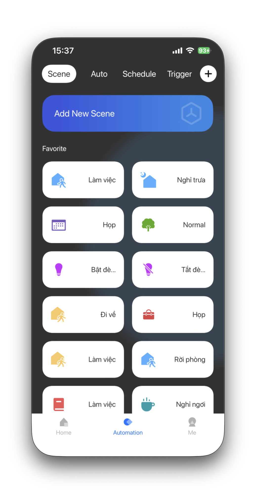
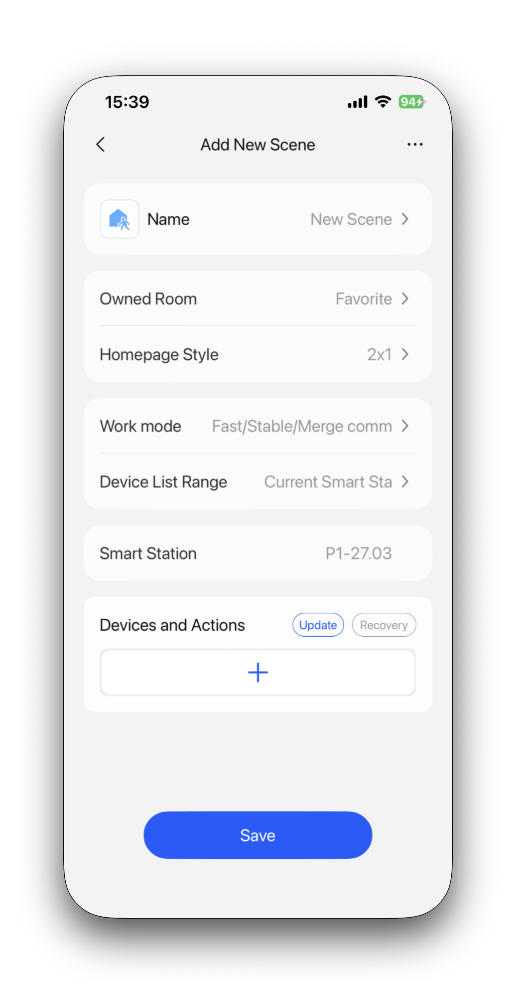
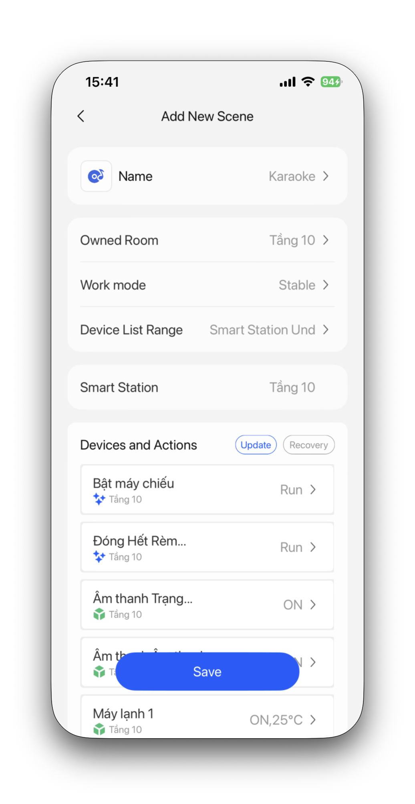
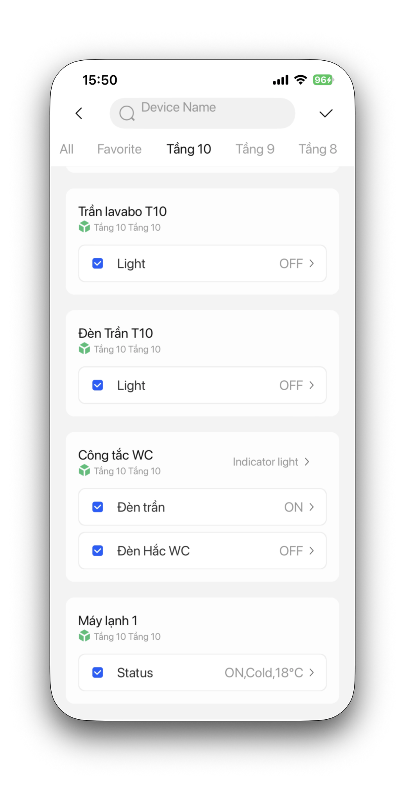
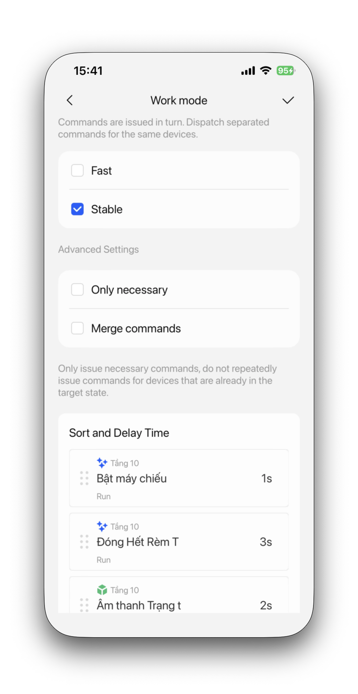
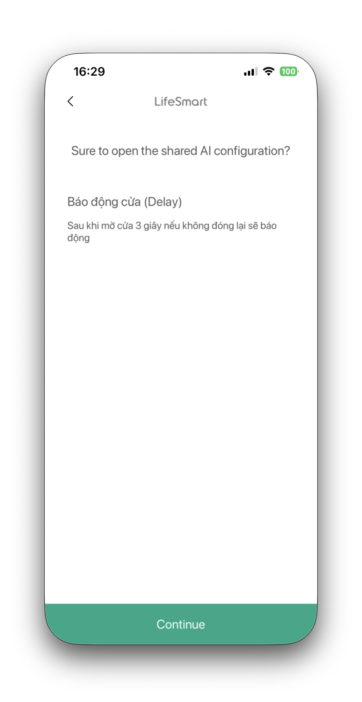
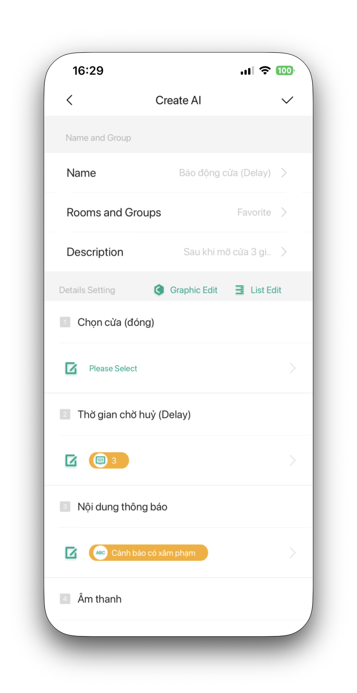

## Mục tiêu

- Hiểu bản chất của kịch bản (Scene) để cấu hình cho khách hàng.
- Nắm chắc 2 thành phần lõi trong Scene: Action (Hành động) và Delay (Độ trễ).
- Biết cách gán điều kiện kích hoạt (Trigger): thủ công, hẹn giờ, cảm biến hoặc trạng thái công tắc.
- Nắm được các Scene tiêu chuẩn luôn phải có khi đi công trình.

> **Lưu ý:** Bài viết này chỉ tập trung vào kịch bản cơ bản (Scene). Việc thiết lập các kịch bản phức tạp đòi hỏi logic chéo (AND/OR, IF/THEN/ELSE) sẽ sử dụng công cụ **AI Builder** và được hướng dẫn riêng ở module nâng cao.

---

## Kịch bản (Scene) cơ bản là gì?

Trong app LifeSmart, **Scene** là cách nhóm nhiều lệnh điều khiển lại với nhau để chạy cùng lúc hoặc theo trình tự. 

Thay vì khách phải mở điện thoại tắt từng cái công tắc đèn, kéo từng rèm, chỉnh từng máy lạnh, anh em cài sẵn một kịch bản tên là "Đi ngủ". Khách chỉ cần nhấn 1 nút, hệ thống sẽ tự quét và thực thi toàn bộ luồng thao tác đó.

---

## Các thành phần cấu thành Scene

Để tạo một Scene chạy đúng ý đồ, mình dùng 2 luồng thao tác chính:

### Action (Hành động)
Là phần gửi lệnh trực tiếp xuống phần cứng.
- Bật/tắt đèn chiếu sáng, cụm công tắc.
- Kéo rèm đóng/mở bao nhiêu phần trăm.
- Chỉnh máy lạnh (mở điều hòa, set nhiệt độ 24°C, quạt mức 2).
- Chỉnh độ sáng đèn dimmer hoặc đổi màu đèn LED.

### Delay (Độ trễ thời gian)
Là khoảng thời gian hệ thống đứng đợi giữa các Action. Delay rất quan trọng để kịch bản chạy mượt và đúng logic thực tế.
- **Ví dụ 1 (Phòng giải trí):** Khi bấm cảnh Xem phim -> Rèm từ từ đóng lại -> Delay 3 giây -> Đèn chiếu sáng chính tắt dần -> Bật hắt trần đèn LED.
- **Ví dụ 2 (Nhà vệ sinh):** Khi ra khỏi WC và tắt đèn -> Quạt hút không tắt ngay mà **Delay thêm 3 phút** để hút hết mùi rồi mới tự tắt.

---

## Các bước tạo kịch bản (Scene) thực tế trên App

1. **Chuẩn bị ngữ cảnh:** Sử dụng App để bật, tắt các thiết bị smarthome theo đúng trạng thái của kịch bản mong muốn (ví dụ: mở 2 đèn, đóng rèm). Việc này giúp app tự động bắt trạng thái ở bước sau.
2. **Tạo Scene mới:** Bấm chọn **Automation** (ở thanh menu bên dưới ứng dụng), chuyển sang tab **Scene** rồi bấm chọn nút **Add New Scene**.
   
3. **Thiết lập thông tin chung:**
   - Chọn **Smart Station** sẽ lưu và chạy scene này (nếu nhà chỉ có 1 station thì app sẽ tự chọn).
   - Đặt tên cho Scene (nên đặt tên tiếng Việt có ý nghĩa, dễ hiểu cho khách hàng).
   - Chọn **Owned Room** để chỉ định phòng sẽ hiển thị nút bấm scene này.
   - Chọn **Device List Range**: chọn *Current Smart Station* nếu chỉ điều khiển các thiết bị ở trạm hiện tại, hoặc chọn *Smart Station Under The Same Network* nếu cần lấy thiết bị ở các trạm khác cùng mạng LAN nội bộ.
   - Xong bấm dấu **+** ở phần Action để tiến hành thêm các thiết bị.
   
   
4. **Thêm thiết bị vào Scene:** Chọn các thiết bị cần điều khiển trong kịch bản này. Vì bạn đã chuẩn bị trạng thái ở bước 1, chỉ cần tích chọn ở đầu thiết bị, App sẽ tự động lấy trạng thái hiện tại đó gán vào kịch bản.
   
5. **Cấu hình Work Mode và Delay:** Chọn **Work Mode** cho phù hợp. Nếu cần thêm thời gian chờ (delay) giữa các lệnh (ví dụ: rèm kéo 3 giây sau mới tắt đèn), hãy bỏ dấu tích ở mục **Fast** và bấm thiết lập thêm độ trễ ở từng thiết bị tương ứng.
   

---

## 3 phương pháp kích hoạt kịch bản (Trigger)

Scene thiết lập xong thì vẫn chỉ nằm đó. Để nó chạy, anh em phải gán cho nó nguồn kích hoạt (Trigger). Có 3 dạng kích hoạt cơ bản:

### 1. Kích hoạt thủ công (Manual)
Kịch bản chờ người dùng tự bấm để chạy.
- Bấm phím kịch bản trên màn hình Nature.
- Bấm vào Scene trên giao diện app LifeSmart.

### 2. Kích hoạt hẹn giờ (Schedule)
Hệ thống căn theo đồng hồ để tự chạy kịch bản đến giờ.
- **Ví dụ:** Cứ 23:30 đêm tự động kích hoạt kịch bản "Mở an ninh ban đêm".
- **Ví dụ:** 06:00 sáng tự kích hoạt cảnh "Chào buổi sáng" (mở rèm, tắt đèn sân vườn).

### 3. Kích hoạt theo trạng thái thiết bị (Device Status)
Lấy trạng thái của một thiết bị làm cò súng (trigger) bắn lệnh chạy kịch bản. Chức năng này cực kỳ phổ biến trong smarthome.
- **Theo cảm biến cửa:** Mở cửa kho -> Tự bật đèn kho.
- **Theo cảm biến chuyển động:** Đi vào hành lang -> Phát hiện chuyển động -> Bật đèn.
- **Theo trạng thái phím cơ:** Khách nhấn phím số 1 trên công tắc phòng khách -> Kích hoạt Scene tắt toàn cảnh.

---

## Các kịch bản tiêu chuẩn bắt buộc cài đặt

Gần như dự án nào cũng cần cài sẵn 3 kịch bản cơ bản sau. Kỹ thuật viên nên chủ động thiết lập sẵn rồi cho khách hàng dùng thử, sau đó mới tinh chỉnh lại theo ý khách.

### 1. Kịch bản "Về nhà"
- **Trigger khuyên dùng:** Bấm phím thủ công ngay cửa ra vào hoặc kích hoạt theo trạng thái "Mở khóa vân tay cửa chính".
- **Action mẫu:**
  - Bật đèn sảnh, đèn hành lang và chiếu sáng cơ bản phòng khách.
  - Mở rèm kéo phòng khách.
  - Bật máy lạnh phòng khách (nếu khách yêu cầu).

### 2. Kịch bản "Ra ngoài"
- **Trigger khuyên dùng:** Bấm phím kịch bản trên công tắc gần cửa rào / cửa ra vào nhất.
- **Action mẫu:**
  - Tắt toàn bộ đèn chiếu sáng, máy lạnh, thiết bị media.
  - Đóng rèm.
  - **Delay 15-30 giây** (cho khách có thời gian mang giày, mở khóa cửa đi ra ngoài).
  - Bật chế độ an ninh (Arm) cho toàn nhà.

### 3. Kịch bản "Đi ngủ"
- **Trigger khuyên dùng:** Phím bấm đầu giường ngủ hoặc bấm trên app điện thoại.
- **Action mẫu:**
  - Tắt sạch đèn sinh hoạt chung (khách, bếp, hành lang).
  - Đóng rèm phòng ngủ.
  - Chỉnh điều hòa phòng ngủ về mức dễ chịu (VD: 26°C).
  - Bật cảm biến vòng ngoài khu vực trệt để cảnh báo an ninh đêm.

---

## Thư viện AI Builder Templates (Cài đặt nhanh)

Việc thiết lập các kịch bản tự động hóa nâng cao (Logic chéo AND/OR, IF/THEN/ELSE) thường được thực hiện qua công cụ AI Builder. Anh em kỹ thuật có thể sử dụng các mẫu (template) đã được tổng hợp sẵn dưới đây để rút ngắn thời gian cấu hình tại công trình.

### 1. Hướng dẫn sử dụng Template

1. Bôi đen và **Copy** trọn vẹn đoạn mã (link) của kịch bản cần dùng trong bảng bên dưới.
2. Mở App LifeSmart trên điện thoại.
3. App sẽ tự động nhận diện đoạn mã từ bộ nhớ đệm (clipboard) và hiển thị bảng **AI Configuration**.
4. Tiến hành cài đặt và gán thiết bị thực tế vào các vị trí đã được dọn sẵn trong mẫu.




### 2. Danh sách Templates

#### An Ninh: Báo động hở cửa (Có Delay bỏ qua)
Báo động trên App khi mở cửa (có delay để nếu đóng lại liền không bị thông báo). Chạy theo khung giờ, có thể kích hoạt bật còi hú/đèn và tự tắt sau một khoảng thời gian.
```text
lifesmartapp://?cgy=aibt&cont=ApksAqtZEaPpKoU0OCPpOqPmEqUhOq38EqEoXbIx1HyoVCtZ1FLtUCemKoMpEbunEqUlEaEpKaI8Xb7y&sign=Aps0KhNOcLts9CTD4xJquP
```

#### An Ninh: Báo động cửa (Kết hợp General Controller)
Báo động trên App khi mở cửa (kết hợp điều kiện nút bấm hiển thị thông báo và alarm từ General Controller). Kích hoạt còi/đèn tự tắt, hỗ trợ link thông báo hệ thống MobiEyes và KNX.
```text
lifesmartapp://?cgy=aibt&cont=ApksAqtZEaPpKoU0OCPpOqPmEqU8XoMpOC3hO4Ix1HyoVCtZ1FLtUCemKoMpEbunEqUlEaEpKaI8Xb7y&sign=U1TXqaKJGBuyX1lvHoyryh
```

#### An Ninh: Báo cháy / Báo khói lập tức
Tự động bắn thông báo khẩn cấp về App và kích hoạt lập tức hệ thống còi hú báo động ngay khi phát hiện khói, hỗ trợ link thông báo hệ thống MobiEyes và KNX.
```text
lifesmartapp://?cgy=aibt&cont=ApksAqtZEaPpKoU0OCPpOqPmEqUoXqctEq3nX4Ix1HyoVCtZ1FLtUCemKoMpEbunEqUlEaEpKaI8Xb7y&sign=Q8z7mEisyNgb2NHDkPILgP
```

#### Chiếu sáng: Bật đèn tự động theo chuyển động
Bật đèn tự động từ cảm biến chuyển động. Hỗ trợ khung giờ hoạt động và độ trễ sáng (kết hợp delay từ AI và delay gốc của bản thân cảm biến).
```text
lifesmartapp://?cgy=aibt&cont=ApksAqtZEaPpKoU0OCPpOqPmEqcvOCIpECE8ObIx1HyoVCtZ1FLtUCemKoMpEbunEqUlEaEpKaI8Xb7y&sign=V7C9j4U5H%5FwRr4eoZFetfP
```

#### Chiếu sáng: Đèn thông minh Cầu thang (2 Cảm biến)
Bật/tắt đèn thông minh cho cầu thang. Logic: chỉ tắt đèn khi **cả 2** cảm biến (đỉnh và chân cầu thang) đều hết chuyển động. Hỗ trợ khung thời gian cấu hình.
```text
lifesmartapp://?cgy=aibt&cont=ApksAqtZEaPpKoU0OCPpOqPmEqShOCYpXCSvXZIx1HyoVCtZ1FLtUCemKoMpEbunEqUlEaEpKaI8Xb7y&sign=%5FgCgdsTHglq9t%5FXom%2DvrH3
```

#### Chiếu sáng: Đèn phòng WC (Cửa + Chuyển động)
Tự động hóa ánh sáng phòng vệ sinh. Kết hợp điều kiện giữa cảm biến chuyển động và trạng thái cảm biến cửa đóng/mở. Hỗ trợ khung giờ hoạt động.
```text
lifesmartapp://?cgy=aibt&cont=ApksAqtZEaPpKoU0OCPpOqPmEqShOCrpOqIuXbIx1HyoVCtZ1FLtUCemKoMpEbunEqUlEaEpKaI8Xb7y&sign=XVIHiM7G3t7YirmOHJkjuY
```

---

## Lỗi thường gặp khi thiết lập Scene

| Hiện tượng lỗi | Nguyên nhân | Cách xử lý |
|---|---|---|
| **Đèn bật tắt liên tục (nhấp nháy)** | Khai báo kịch bản bị lặp hoặc có sự đá nhau (VD: Vừa có Action tắt đèn theo chuyển động, vừa thao tác đóng mở cửa kích hoạt bật). | Tạm tắt các Scene liên quan để cô lập lỗi. Hạn chế gán nhiều trigger có tính chất ngược nhau vào cùng 1 bóng đèn trong lúc set cơ bản. |
| **Bấm app thì chạy, nhưng bấm trên công tắc lại không ăn** | Quên gán (Trigger) kịch bản vào phím vật lý của công tắc. | Vào Scene chọn phần Trigger và chọn công tắc tương ứng để gán lại. |
| **Delay không hoạt động chính xác** | Đặt khối lệnh Delay không đúng vị trí, thay vì chờ trước Action thì lại đặt sau nó. | Chuyển vị trí Delay lên nằm ngay phía trước phần thiết bị định tạo trễ. |
| **Hẹn giờ trễ hơn hoặc sớm hơn thực tế** | Smart Station lưu sai múi giờ (mặc định China). | Vào Settings của Smart Station -> Time Zone -> Chọn lại chuẩn `UTC+7` ngay từ bước đầu cấu hình. |

---

## Checklist trước khi bàn giao

Phải rà soát kỹ các ý sau để tránh việc vừa bàn giao xong lại bị gọi khách hàng gọi mắng vốn:

- [ ] Đặt tên Scene bằng tiếng Việt dễ hiểu, phân định rõ (ví dụ "Xem phim phòng khách" thay vì "Scene 1").
- [ ] Đã bấm test thực tế từng chức năng ngay trên điện thoại và xác nhận toàn bộ Action thực thi đầy đủ.
- [ ] Test trực tiếp các Trigger từ công tắc phần cứng hoặc thiết bị (mở cửa, thử vẫy tay ở cảm biến).
- [ ] Timezone của hệ thống chắc chắn đã thiết lập đúng `UTC+7` để chạy các lịch Schedule.
- [ ] Đã chỉ cho khách bước cơ bản nhất để tự thêm bớt đèn trong nhánh Action nếu khách có nhu cầu.
