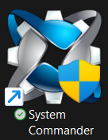
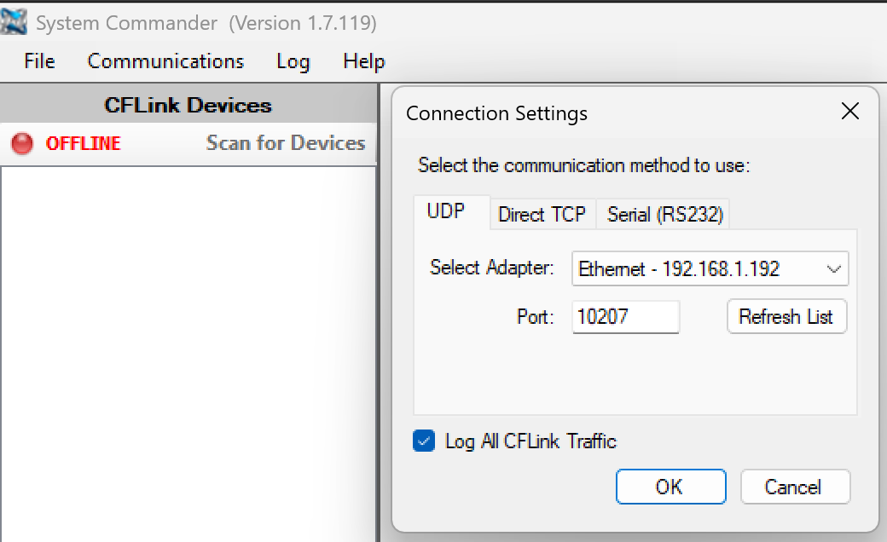
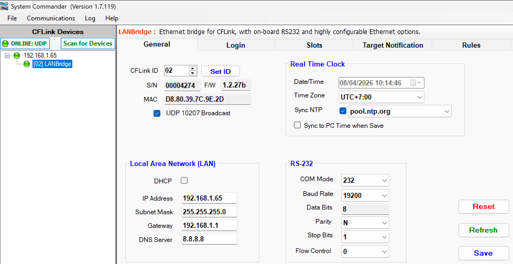
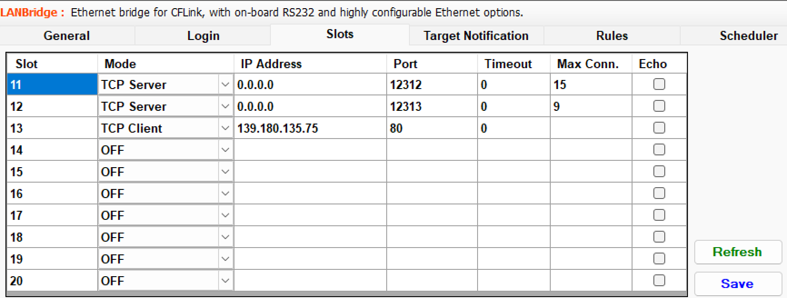
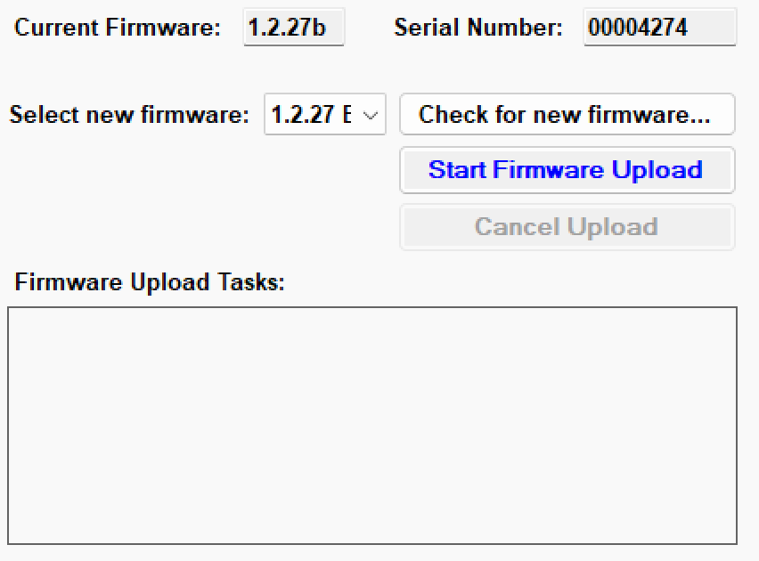
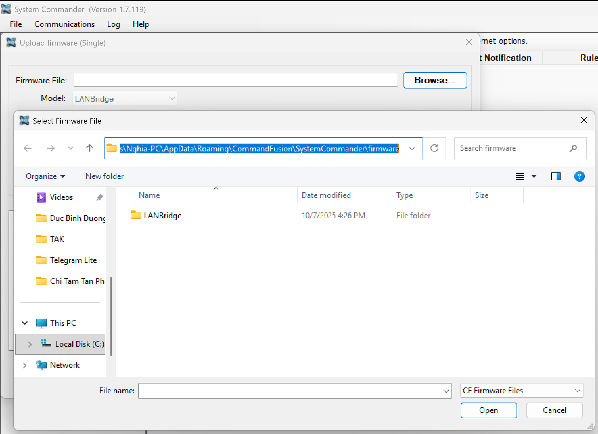
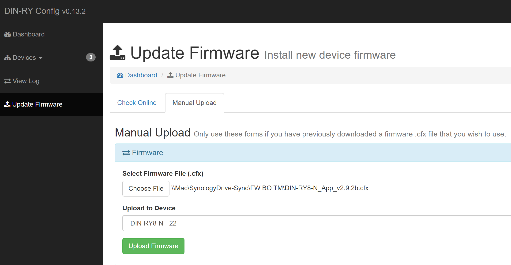
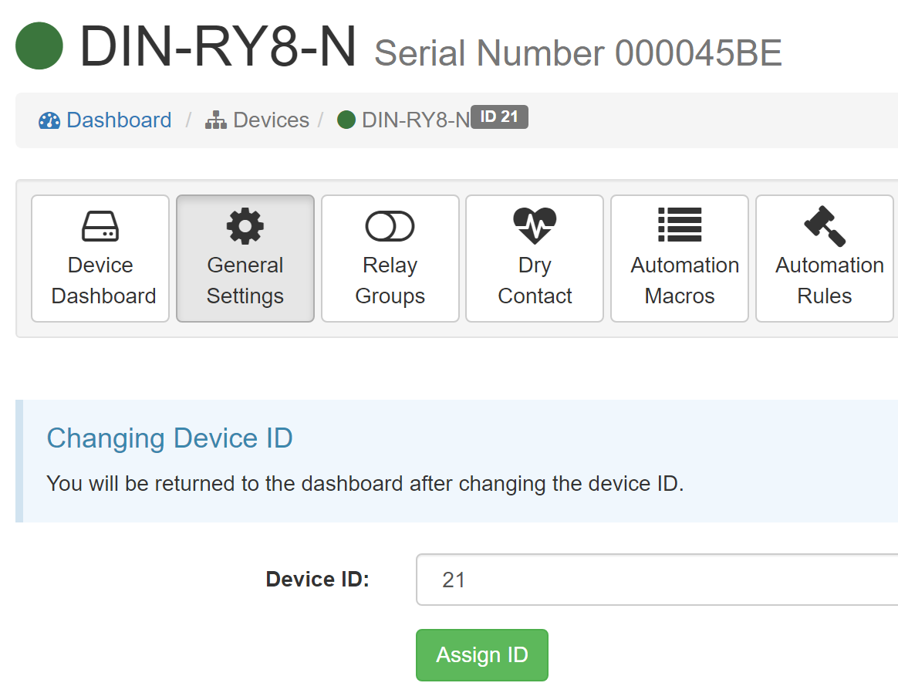
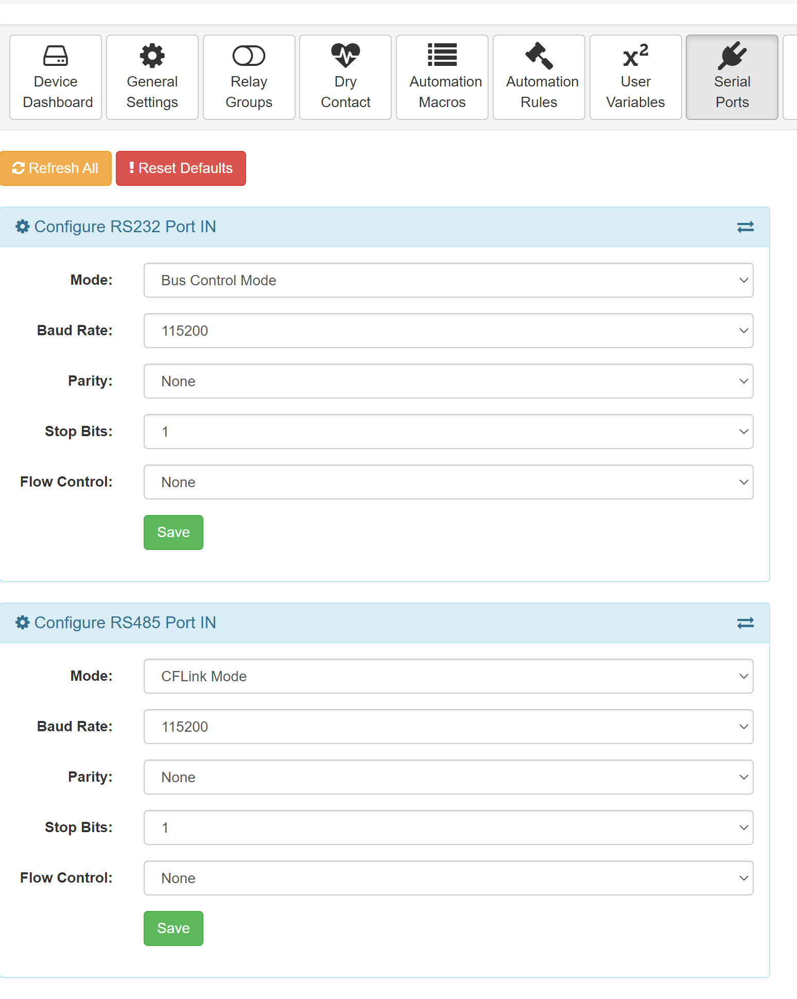

## Mục tiêu
- Gán IP tĩnh cho LAN Bridge và thiết lập thời gian thực chính xác.
- Gán Board ID duy nhất cho từng module DIN-RY8-N trên bus.

---

## 1. Cài đặt và kết nối System Commander

1. **Tải phần mềm:**
   Tải **System Commander** tại: [https://scbeta.commandfusion.com/](https://scbeta.commandfusion.com/)

   
   
Giao diện phần mềm System Commander.

### 1.1. Thiết lập kết nối UDP để quét thiết bị

Để máy tính và phần mềm tìm thấy LAN Bridge trong mạng nội bộ, bạn cần chọn đúng card mạng đang kết nối.

1. Vào menu **Communications** → **Settings...**
2. Chọn tab **UDP**.
3. Tại mục **Adapter**, chọn card mạng (WiFi hoặc Ethernet) đang kết nối chung mạng với LAN Bridge.
4. Bấm **OK**.

Chọn đúng adapter mạng đang sử dụng để có thể quét thấy LAN Bridge.

5. Bấm nút **OFFLINE (F12)** trên thanh công cụ để chuyển sang chế độ Scan. Phần mềm sẽ tự động tìm thấy các LAN Bridge đang có trong mạng.

Nếu vẫn không tìm thấy: hãy kiểm tra dây mạng, đảm bảo đèn LED trên cổng LAN Bridge có sáng và đặc biệt là phải **tắt tường lửa (Firewall)** trên máy tính.

### 1.2. Cấu hình IP tĩnh, Thời gian và Bảo mật (Tab General)

Sau khi Scan và phần mềm đã tìm thấy thiết bị, hãy chọn dòng **[02]LANBridge** trong danh sách để vào giao diện cấu hình chính. Việc đầu tiên là gán IP tĩnh, cập nhật thời gian và cài đặt port bảo mật tại tab **General**.

1. Chuyển sang tab **General**.
2. **Gán IP tĩnh**: 
   - Nên gán IP tĩnh nằm ngoài dải DHCP của router (thông thường từ `.100` đến `.200`) để tránh xung đột IP. IP tĩnh khuyến nghị đặt là `192.168.1.65` (hoặc `.6x` tùy dự án).
   - *Lý do*: Ứng dụng điện thoại kết nối trực tiếp đến IP của LAN Bridge. Nếu để DHCP, router khởi động lại cấp IP khác sẽ làm mất kết nối ứng dụng.
3. **Thiết lập thời gian**: 
   - Chọn đúng Time Zone và tích chọn Sync NTP và chọn server NTP phù hợp để hệ thống tự kiểm tra và cập nhật thời gian cho đúng.
   - **Lưu ý quan trọng**: Ở bước này, hãy kiểm tra phiên bản Firmware hiện tại hiển thị. Nếu Firmware thấp hơn **1.2.27b**, thiết bị sẽ không lưu được ngày giờ chính xác sau khi mất điện. Trong trường hợp này, cần phải cập nhật Firmware (xem mục 1.4).
4. **Thay đổi Port kết nối**:
   - Khuyến nghị đổi Port mặc định sang số khác để tăng cường bảo mật.
5. **Lưu và khởi động lại**:
   - Bấm nút **Save** để lưu.
   - Bấm nút **Reset** để khởi động lại (Reboot) LAN Bridge ngay lúc này, giúp thiết bị bắt đầu nhận mác IP và Port vừa đổi.

Cấu hình IP, thời gian và Port trong tab General.

### 1.3. Cấu hình định tuyến (Tab Slots)

Khi thiết bị khởi động lại sau bước 1.2, bạn kết nối lại bằng IP và Port mới. Sau đó, tiến hành định tuyến kết nối cho hệ thống.

Chuyển sang tab **Slots**:
- **Đối với hệ thống dùng CFLink (phổ biến nhất):**
  - **Slot 11 (CFLink)**: Đây là slot giao tiếp chính. Bạn cần đổi **Port** thành số khác cho bảo mật và đặc biệt cần chỉnh **Max Connect** lên **15** (để nhiều thiết bị di động có thể điều khiển đồng thời).
  - **Slot 12 (RS232)**: Đây chỉ là kết nối dự phòng. Bạn đổi Port và giảm **Max Connect** xuống thấp vì gần như không dùng đến, chỉ dành cho lúc slot 11 gặp sự cố cần cắm dự phòng.
  
- **Đối với hệ thống dùng RS232/RS485 để liên kết module:**
  - Bạn cấu hình **ngược lại** mục trên. Chỉnh Max Connect của **Slot 12** lên 15, vì mọi lưu lượng từ ứng dụng đều sẽ đi thông qua slot này để truyền lệnh đến các thiết bị module.

Điều chỉnh Max Connect dựa trên chuẩn kết nối của hệ thống.

### 1.4. Cập nhật Firmware (Chỉ khi cần)

Nếu ở bước trước bạn phát hiện Firmware thấp hơn **1.2.27b**, thì bắt buộc phải upload bản mới nhất để lỗi đồng bộ thời gian được xử lý dứt điểm.

**Cách nâng cấp:**
1. Chuyển sang tab **Upload Firmware**.
2. Chọn đúng file firmware rồi thực hiện quá trình Upload.

Giao diện tab Upload Firmware.

**Trường hợp không thấy file để chọn:**
Nếu phần mềm không hiển thị danh sách firmware:
1. Vào menu **Communications** → chọn **Upload Firmware (Single)**.
2. Bấm nút **Browse** để kiểm tra thư mục mặc định chứa firmware.

Kiểm tra đường dẫn lưu firmware của System Commander.

3. Thường là `C:\Users\<Tên_Máy_Tính>\AppData\Roaming\CommandFusion\SystemCommander\firmware`.
4. Hãy tải file [LANBridge.zip](/wiki/assets/zip/LANBridge.zip), giải nén toàn bộ vào vị trí thư mục đang mở trên.
5. Quay lại phần **Upload Firmware** để chọn và cập nhật.

---

## 2. Cấu hình module DIN-RY8-N

Mỗi module DIN-RY8-N trên cùng bus phải có Board ID riêng, không được trùng.

### 2.1. Quy trình gán Board ID

Có 2 cách để gán Board ID và cấu hình module.

Cách 1 — gán thủ công bằng nút bấm trực tiếp. Dùng trong trường hợp không muốn cắm cáp USB hoặc cần xử lý nhanh tại tủ:
1. Bấm nút Setup trên module.
2. Bấm các nút Lên/Xuống để chọn số hàng chục.
3. Bấm Setup để chuyển sang hàng đơn vị, tiếp tục bấm Lên/Xuống để chọn số.
4. Bấm Setup lần nữa để lưu lại.

Cách 2 — dùng phần mềm DIN-RY Config Tool (khuyên dùng). Dùng để gán ID và cập nhật phần mềm điều khiển mới nhất:

1. **Tải phần mềm:**
   Tải **DIN-RY Config** tại: [DIN-RY Config Setup](https://commandfusion.com/download/CommandFusion.DIN-RY.Config.Setup.0.13.2.exe)

2. **Kết nối Board với máy tính:**
   Cắm cáp USB riêng vào từng bo (không cắm chung bus khi cấu hình cách này).
   Mở phần mềm lên, vào **Connection Settings** → **Manual Entry**:
   - **Mode:** Serial/USB
   - **Serial Port:** Chọn cổng COM xuất hiện khi cắm Board
   - **Baud Rate:** 115200
   
   Xong bấm **Connect** để kết nối.

3. **Cập nhật Firmware (Nếu cần):**
   Ở **Dashboard** sẽ nhìn thấy board. Nếu firmware dưới bản `v2.9.2b` thì vào mục **Update Firmware** để tiến hành nâng cấp.

   
   
Giao diện nâng cấp firmware cho DIN-RY8-N.

   Chọn đúng file firmware để tải lên: tải file [DIN-RY8-N_App_v2.9.2b.cfx.zip](/wiki/assets/zip/DIN-RY8-N_App_v2.9.2b.cfx.zip) (đây là firmware dành cho Board 8).

4. **Gán ID thiết bị:**
   Xong bước sửa firmware, chờ cho board khởi động lại rồi kết nối lại. Chọn board ở phần Dashboard rồi chọn tab **General Setting**, ở mục **Changing Device ID** chọn ID cần gán rồi nhấn **Assign ID**.

   
   
Cấu hình cấp Device ID trong tab General Setting.

5. **Cài đặt cổng RS485 thành cổng CFLink:**
   Yêu cầu cần thiết đối với hệ thống sử dụng kết nối CFLink. Chọn tab **Serial Ports** và chọn **Configure RS485 Port IN**:
   - **Mode:** CFLink Mode
   - **Baud Rate:** 115200
   - **Parity:** None
   - **Stop Bits:** 1
   - **Flow Control:** None
   
   Xong chọn **Save** để lưu lại.

   
   
Cấu hình RS485 Port IN trong tab Serial Ports.

Sau khi đã gán ID và cập nhật cho từng board xong, ta cắm toàn bộ dây tín hiệu hệ thống vào bus. Sử dụng DIN-RY Config để kết nối và quét lại toàn bộ bus xem đã hiển thị đầy đủ các Board ID và thiết bị chưa.

### 2.2. Quy ước đánh số Board ID

Để dễ quản lý, ta quy ước đánh số theo tầng:

- Tầng 1: bắt đầu từ 11, 12, 13...
- Tầng 2: bắt đầu từ 21, 22, 23...
- Tầng 3: bắt đầu từ 31, 32, 33...

Cách đánh này giúp nhìn vào Board ID là biết ngay thiết bị đó thuộc tầng nào.

---

## 3. Sao lưu cấu hình

Sau khi hoàn tất, bắt buộc phải sao lưu cấu hình. Có 2 loại cần lưu:

1. Sao lưu LAN Bridge: dùng System Commander để xuất cấu hình (Rule, Macro, hẹn giờ).
2. Sao lưu module: dùng DIN-RY Config để lưu cấu hình riêng từng bo.

Lưu file theo chuẩn: `<ten_du_an-dia_chi>-config-<ngay>.cfg`. Nếu hệ thống gặp sự cố hoặc thay mới thiết bị, chỉ cần nhập lại file sao lưu là xong, không phải lập trình lại từ đầu.
