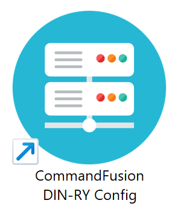
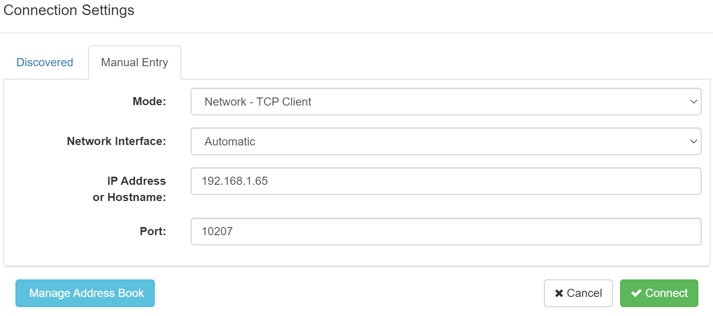
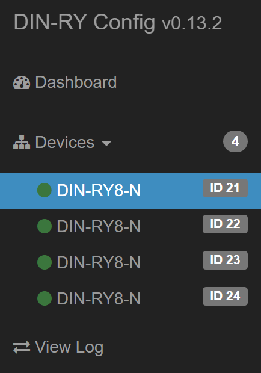
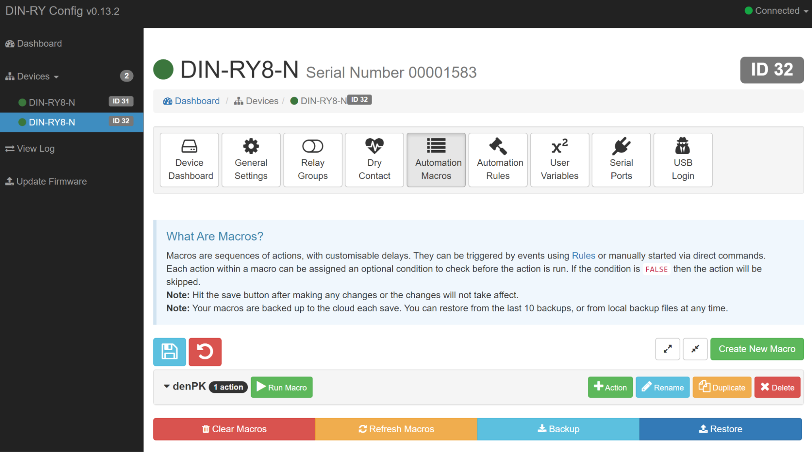
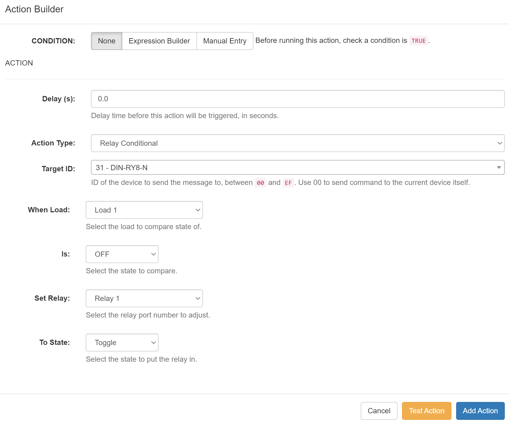
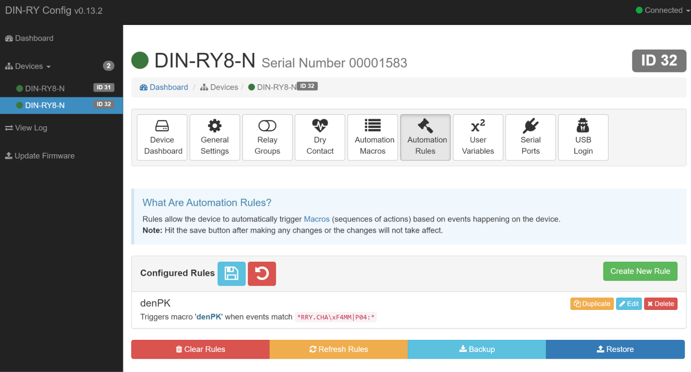
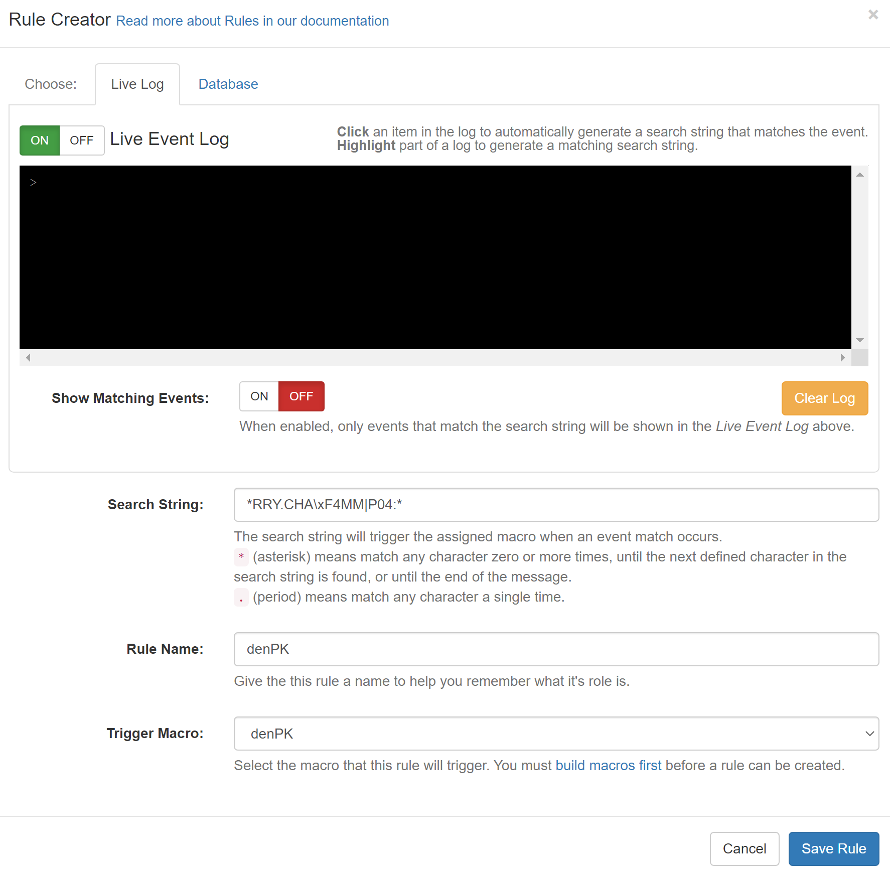

## Mục tiêu
- Nắm cơ chế Rule (điều kiện kích hoạt) gọi Macro (tập hợp hành động) của MobiEyes.
- Viết được các kịch bản phổ biến: công tắc đảo, cảm biến chuyển động nhà vệ sinh, giám sát.

---

## 1. Bốn khái niệm cơ bản

Toàn bộ lập trình MobiEyes xoay quanh bốn khái niệm. Nắm vững bốn cái này thì viết được mọi kịch bản.

| Khái niệm | Là gì | Ví dụ |
|---|---|---|
| Rule | Theo dõi một sự kiện. Khi sự kiện xảy ra thì gọi Macro | Ngõ vào kênh 23-1 đổi trạng thái → gọi macro đảo đèn |
| Macro | Tập hợp hành động chạy theo thứ tự | Bật relay 21-1 → chờ 1s → bật relay 21-2 |
| Hẹn giờ | Tự động gọi Macro theo lịch | 23:00 hàng ngày → gọi macro bật giám sát |
| Biến trạng thái | Biến do người lập trình tự tạo, lưu trạng thái | alarm = 0 (tắt) hoặc alarm = 1 (bật) |

Rule là "tai mắt" — lắng nghe sự kiện. Macro là "tay chân" — thực hiện hành động. Hẹn giờ là "đồng hồ" — kích hoạt tự động theo giờ. Biến trạng thái là "trí nhớ" — lưu trạng thái để các rule khác kiểm tra.

---

## 2. Kịch bản thực tế

### 2.1. Công tắc đảo trạng thái

Đây là kịch bản cơ bản nhất. Nhấn công tắc trên tường thì đèn bật, nhấn lần nữa thì đèn tắt.

Cách lập trình:
- Rule: theo dõi ngõ vào kênh tương ứng (ví dụ 23-1). Khi ngõ vào thay đổi trạng thái (từ đóng sang mở hoặc ngược lại) thì gọi macro.
- Macro: đảo trạng thái relay kênh tương ứng (ví dụ 21-1). Nếu relay đang bật thì tắt, đang tắt thì bật.

Đơn giản vậy thôi, nhưng nhớ kiểm tra bảng mapping để chắc chắn ngõ vào 23-1 ứng với đúng công tắc phòng khách, và relay 21-1 ứng với đúng đèn trần phòng khách. Sai kênh là nhấn công tắc phòng khách mà đèn phòng ngủ sáng.

### 2.2. Cảm biến chuyển động nhà vệ sinh — tự tắt sau 3 phút

Kịch bản này rất phổ biến: bước vào nhà vệ sinh thì đèn tự sáng, ra khỏi 3 phút thì đèn tự tắt.

Cách lập trình:
- Rule bật: cảm biến chuyển động phát hiện có người → gọi macro bật đèn WC.
- Rule tắt: cảm biến không còn phát hiện chuyển động → gọi macro tắt đèn WC.
- Macro tắt: delay 180 (3 phút) → tắt relay đèn WC.

Lưu ý quan trọng về đơn vị: trong phần mềm DIN-RY Config, đơn vị của delay là giây (s). Để chờ 3 phút, ta nhập giá trị 180. Nhập 180000 sẽ khiến hệ thống treo lệnh chờ cực lâu.

### 2.3. Giám sát kết hợp biến trạng thái

Kịch bản nâng cao: chỉ kích còi khi hệ thống đang ở chế độ giám sát. Ban ngày chủ nhà đi ra đi vào, cảm biến cửa kích hoạt liên tục nhưng không muốn còi kêu.

Cách lập trình:

1. Tạo biến trạng thái tên `alarm` (giá trị 0 = tắt, 1 = bật).
2. Macro `bao_dong`: dùng lệnh kiểm tra điều kiện kết hợp hành động — nếu biến alarm bằng 1 thì chạy lệnh Pulse kênh còi 30 giây.
3. Rule cửa cổng: khi công tắc từ cửa cổng chuyển sang trạng thái mở, gọi macro `bao_dong`.

Khi cửa mở, rule gọi macro `bao_dong`. Macro này chỉ chứa một dòng lệnh: kiểm tra biến `alarm`, nếu đang bật (alarm = 1) thì kích hoạt lệnh Pulse cho còi hú đúng 30 giây rồi tự tắt. Nếu alarm = 0, lệnh này không thực hiện gì cả. Cách làm này giúp macro gọn nhẹ và logic thực thi nhanh.

---

## 3. Lưu ý khi lập trình

Test từng Rule/Macro riêng lẻ trước khi ghép thành kịch bản lớn. Nếu ghép cả chục rule rồi mới test, khi có lỗi sẽ không biết lỗi ở bước nào.

Luôn đối chiếu bảng mapping khi viết rule/macro. Nhầm Board-Kênh thì kịch bản chạy sai mà debug rất mất thời gian vì logic đúng, chỉ sai kênh.

Sao lưu cấu hình sau mỗi lần chỉnh sửa lớn. Nếu lập trình sai và hệ thống rối loạn, có thể nhập lại bản sao lưu trước đó.

Bảng quy đổi delay (đơn vị: giây):
- 30 giây = 30
- 1 phút = 60
- 3 phút = 180
- 5 phút = 300
- 10 phút = 600

---

## 4. Thiết lập kịch bản trên DIN-RY Config

Ngoài System Commander, CommandFusion còn có phần mềm **DIN-RY Config** dùng để tạo Macro và Rule trực tiếp cho LAN Bridge. Phần mềm này phù hợp khi cần cấu hình chi tiết từng board.

### 4.1. Cài đặt và kết nối

1. **Tải phần mềm:**
   Tải **CommandFusion DIN-RY Config** tại: [DIN-RY Config Setup](https://commandfusion.com/download/CommandFusion.DIN-RY.Config.Setup.0.13.2.exe)

   
   
Phần mềm CommandFusion DIN-RY Config.

2. **Kết nối đến LAN Bridge:**
   Máy tính và LAN Bridge phải cùng mạng LAN (cắm chung switch hoặc router).
   - Vào **Connection Settings** → **Manual Entry**.
   - **Mode:** Network - TCP Client.
   - **Network Interface:** Automatic.
   - **IP Address or Hostname:** Nhập IP tĩnh của LAN Bridge.
   - **Port:** Nhập port của LAN Bridge.

   
   
Điền IP và Port của LAN Bridge để kết nối.

   - Bấm **Connect** để bắt đầu kết nối.
   - Sau khi kết nối thành công, chọn thiết bị cần cấu hình trong danh sách **Devices** (chọn theo Board ID).

   
   
Chọn đúng Board ID của thiết bị cần lập trình.

   - Chuyển sang tab **Automation Macros** để bắt đầu tạo kịch bản.

### 4.2. Tạo Macro

1. Trong tab **Automation Macros**, bấm **Create New Macro** để tạo macro mới.

   
   
Nút tạo Macro mới.

2. Đặt tên macro cho dễ nhận biết (ví dụ: `denPK` cho đèn phòng khách).
3. Chọn macro vừa tạo, bấm **+ Action** để thêm hành động.
4. Điền thông số trong cửa sổ **Action Builder**:

   
   
Cửa sổ cấu hình Action cho relay.

   - **CONDITION:** Chọn `None` (hoặc thêm điều kiện nếu kịch bản cần logic phức tạp hơn).
   - **Delay (s):** Thời gian chờ trước khi chạy lệnh, tính bằng giây.
   - **Action Type:** Loại hành động — ví dụ *Relay Conditional* nghĩa là điều khiển relay có kèm điều kiện.
   - **Target ID:** Board ID của thiết bị cần điều khiển.
   - **When Load:** Kênh cần kiểm tra trạng thái hiện tại.
   - **Is:** Trạng thái cần so sánh (ví dụ: kiểm tra relay đang tắt hay bật).
   - **Set Relay:** Kênh relay cần đóng/mở.
   - **To State:** Lệnh cần thực hiện (ví dụ: Toggle = đảo trạng thái).
   - Điền xong thì bấm **Add Action** để lưu hành động vào macro.

   > **Mẹo:** Bấm **Test Action** để thử chạy lệnh ngay tại công trình, kiểm tra đúng kênh chưa.

5. Nếu macro cần điều khiển nhiều thiết bị cùng lúc, lặp lại bước thêm Action cho từng kênh.
6. Bấm **Save Macro Changes** (biểu tượng đĩa mềm góc trên trái) để lưu và ghi xuống thiết bị.

> **Quan trọng:** Luôn Backup cấu hình ra file trên laptop trước khi bấm Save. Nếu mất kết nối giữa chừng khi đang ghi, cấu hình trên thiết bị có thể bị lỗi.

### 4.3. Tạo Rule (sự kiện tự động)

Rule giúp hệ thống tự kích hoạt macro khi có sự kiện xảy ra — ví dụ ai đó bấm công tắc, cảm biến phát hiện chuyển động, hoặc cửa được mở.

1. Chuyển sang tab **Automation Rules**, bấm **Create New Rule**.

   
   
Tab quản lý Rule — nơi thiết lập sự kiện tự động.

2. Điền thông số trong cửa sổ **Rule Creator**:

   
   
Ví dụ: cấu hình Rule theo dõi Drycontact kênh 4 để kích macro đèn.

   - **Search String:** Chuỗi mà hệ thống dùng để nhận biết sự kiện. Ví dụ `*RRY.CHA\xF4MM|P04:*` nghĩa là "khi Drycontact kênh 4 thay đổi trạng thái (đóng ↔ mở)".
   - **Rule Name:** Đặt tên gợi nhớ cho rule (ví dụ: `CT_PhongKhach`).
   - **Trigger Macro:** Chọn macro sẽ chạy khi rule được kích.
   - Bấm **Save Rule** để thêm rule vào danh sách.
   - Bấm **Save Rule Changes** (biểu tượng đĩa mềm) để ghi cấu hình xuống thiết bị. Nhớ Backup trước khi Save.
