## Mục tiêu
- Kết nối phần mềm System Commander vào LAN Bridge.
- Tạo Macro cho các thiết bị cần hẹn giờ.
- Thiết lập lịch trình tự động và lưu cấu hình vào bộ trung tâm.

---

## 1. Cài đặt và kết nối System Commander

1. **Tải phần mềm:**
   Tải **System Commander** tại: [https://scbeta.commandfusion.com/](https://scbeta.commandfusion.com/)

   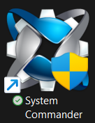
   
Giao diện phần mềm System Commander.

2. **Kết nối đến LAN Bridge:**
   Mở System Commander, vào **Communications** → **Settings…** → **Direct TCP**.
   - **LAN Bridge IP/Hostname:** Nhập IP tĩnh của LAN Bridge.
   - **Port:** Nhập port của LAN Bridge.

   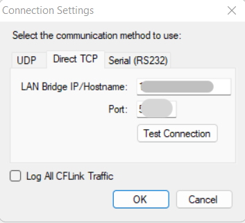
   
Nhập IP và Port để kết nối LAN Bridge.

   Bấm nút **OFFLINE** để chuyển sang trạng thái kết nối.

   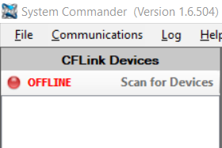
   
Bấm nút này để bắt đầu kết nối.

3. **Chọn LAN Bridge:**
   Chọn `[02]LANBridge` trong danh sách thiết bị để vào giao diện điều khiển.

   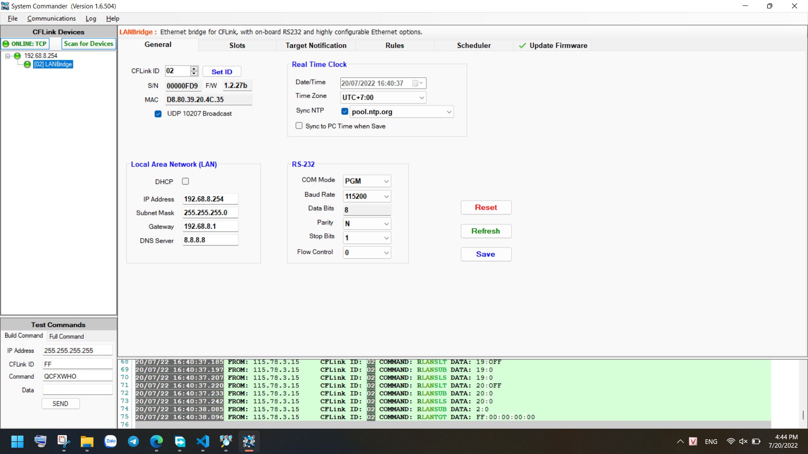
   
Chọn LAN Bridge để bắt đầu cấu hình.

4. **Kiểm tra lịch trình hiện tại:**
   Chuyển sang tab **Scheduler** để xem các lịch hẹn giờ đang hoạt động.

---

## 2. Tạo Macro cho hẹn giờ

Hẹn giờ hoạt động bằng cách gọi Macro tại thời điểm đã đặt. Vì vậy trước khi hẹn giờ, ta cần tạo Macro chứa các hành động cần thực hiện.

### 2.1. Tạo Macro mới

1. Trong tab **Macro**, bấm **Add Macro**.

   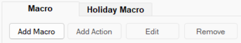
   
Nút thêm Macro.

2. Đặt tên dễ nhận biết (ví dụ: `DenTEST_ON` cho bật đèn test).

   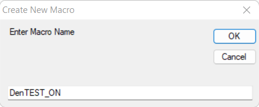
   
Đặt tên gợi nhớ cho Macro.

3. Chọn macro vừa tạo, bấm **Add Action** để thêm hành động vào.

   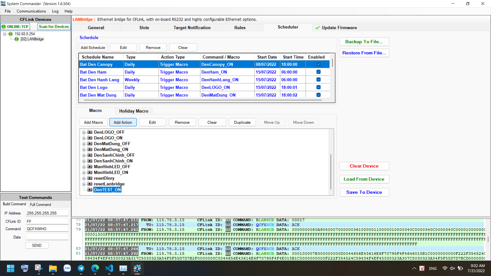
   
Thêm hành động vào Macro.

### 2.2. Nhập lệnh cho Action

Tại ô **Command**, nhập lệnh theo cú pháp của hệ thống.

**Ví dụ:** `\xF2\x31\xF3TRLYCON\xF4S04:0|P04:T\xF5\xF5`

Giải thích từng phần:
- **31** — Board ID (số hiệu mạch cần điều khiển).
- **04** — Kênh trên board đó (lộ/thiết bị).
- **0** — Trạng thái hiện tại cần kiểm tra (0 = đang tắt, 1 = đang bật).
- **T** — Lệnh Toggle (đảo trạng thái: tắt thì bật, bật thì tắt).

Nghĩa là: kiểm tra kênh 4 trên board 31 — nếu đang tắt thì đảo relay để bật lên.

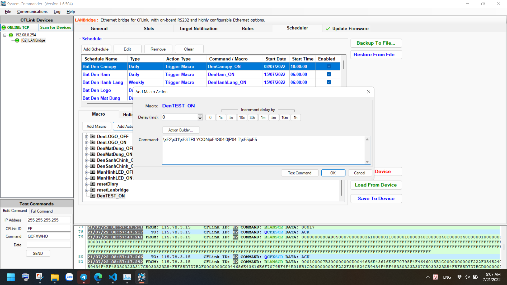

Ô nhập lệnh Command cho Action.

> **Mẹo:** Bấm **Test Command** bên cạnh để thử chạy lệnh ngay, xem thiết bị có phản hồi đúng kênh không. Nếu cần chờ giữa các lệnh, nhập thời gian vào ô **Delay (ms)**.

Nếu macro cần điều khiển nhiều thiết bị, lặp lại bước thêm Action cho từng kênh.

Nhập sai? Chọn Action hoặc Macro đó rồi bấm **Remove** để xóa.

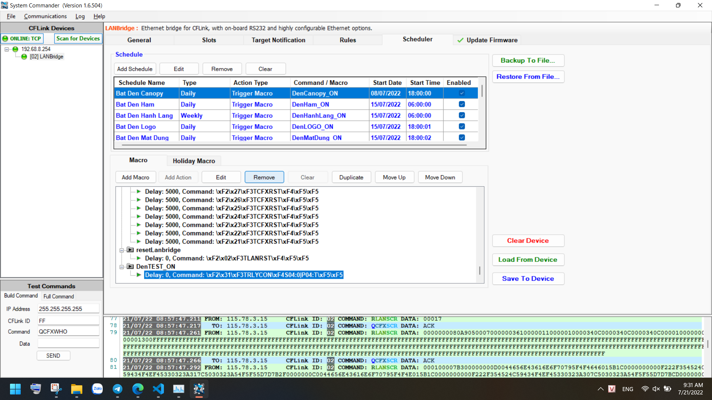

Xóa Macro hoặc Action nhập sai.

---

## 3. Thiết lập hẹn giờ (Schedule)

Sau khi có Macro, ta cần đặt lịch để hệ thống tự gọi Macro vào đúng thời điểm.

Hẹn giờ dựa vào đồng hồ trên LAN Bridge. Nếu giờ trên LAN Bridge chưa chính xác (xem bài B2.05 mục 1.3 về đồng bộ thời gian), thì lịch hẹn giờ sẽ chạy sai.

Một số ví dụ thường gặp:
- **23:00 hàng ngày** → gọi macro `bao_dong_on` (bật chế độ giám sát ban đêm).
- **05:00 sáng** → gọi macro `bao_dong_off` (tắt giám sát).
- **18:00 chiều** → gọi macro `chieu_toi` (bật đèn sân, hành lang).

1. Chuyển sang tab **Schedule**, bấm **Add Schedule** để tạo lịch mới.

   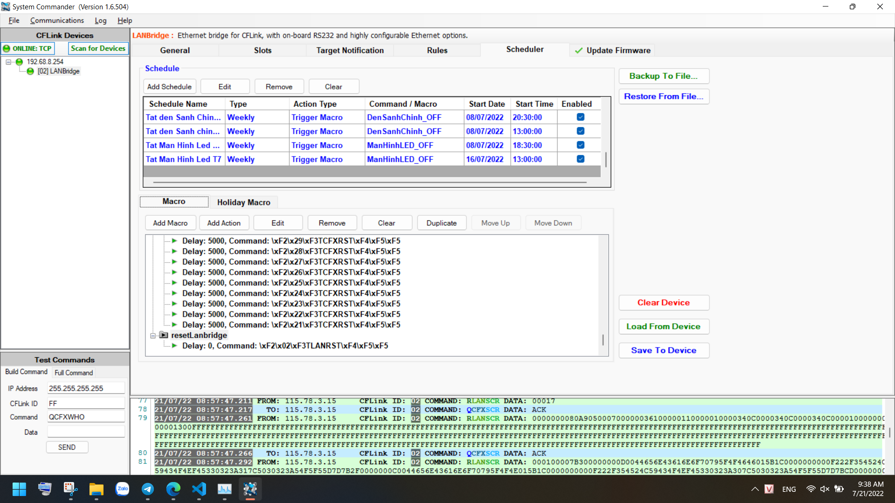
   
Tạo lịch hẹn giờ mới.

2. Điền các thông số:

   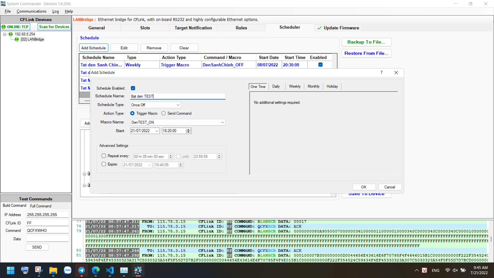
   
Bảng cấu hình lịch hẹn giờ.

   - **Schedule Enabled**: Tích để bật lịch (bỏ tích nếu muốn tạm dừng).
   - **Schedule Name**: Đặt tên rõ ràng (ví dụ: "Bật đèn chùm 6h tối").
   - **Loại lịch (Frequency)**:
     - **Once Off**: Chạy một lần duy nhất.
     - **Daily**: Chạy hàng ngày.
     - **Weekly**: Chạy vào các ngày trong tuần được chọn.
     - **Monthly**: Chạy theo ngày cố định trong tháng.
         - *Cách 1*: Chọn ngày cụ thể (ví dụ: mùng 1, 15, 30).
           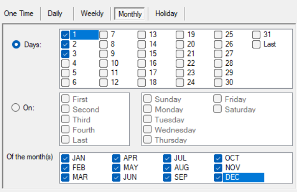
         - *Cách 2*: Chọn theo thứ (ví dụ: Thứ Hai tuần đầu tiên mỗi tháng).
           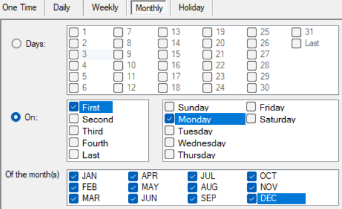
   - **Trigger Macro**: Chọn loại sự kiện — ở đây chọn gọi Macro.
   - **Macro Name**: Chọn macro đã tạo ở Bước 2.
   - **Start**: Ngày giờ bắt đầu chạy lịch.
   - **Repeat every**: Tần suất lặp lại trong ngày (để trống nếu chỉ chạy 1 lần/ngày).
   - **Expire**: Ngày giờ lịch tự hết hạn.

> **Xóa lịch:** Chọn lịch cần xóa, bấm nút **Remove** (biểu tượng thùng rác đỏ).
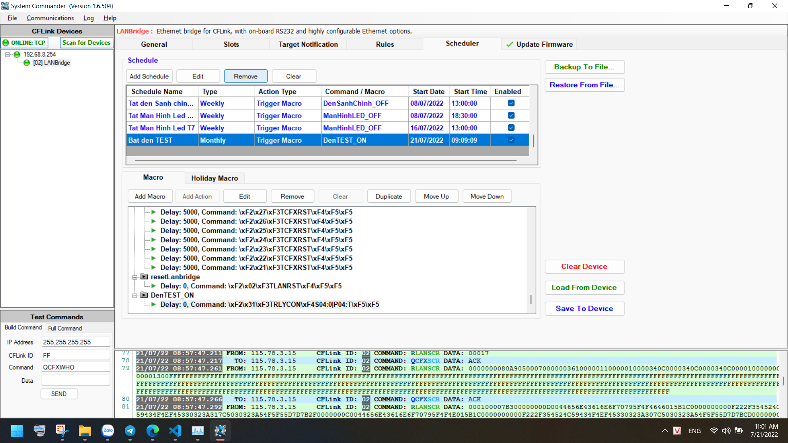

---

## 4. Lưu cấu hình và sao lưu dự phòng

Bước này bắt buộc. Nếu chỉ thiết lập trên phần mềm mà không ghi xuống thiết bị, khi mất điện thì toàn bộ cấu hình sẽ mất.

### 4.1. Backup ra file (nên làm trước)

Bấm **Backup To File…** để xuất toàn bộ cấu hình ra file trên máy tính.

Nếu sau này thiết bị bị lỗi hoặc cần khôi phục, chỉ cần bấm **Restore From File…** rồi chọn file backup là xong.

Lưu file backup lên máy tính.

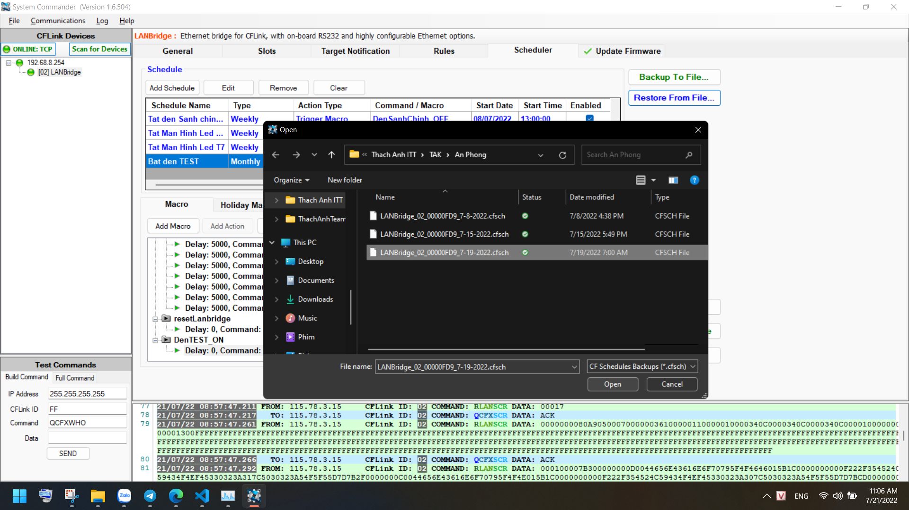

Khôi phục cấu hình từ file backup.

### 4.2. Ghi xuống thiết bị (Save To Device)

Bấm **Save To Device** để ghi cấu hình từ phần mềm xuống LAN Bridge. Đây là bước cuối cùng — sau bước này thiết bị mới thực sự chạy theo cấu hình mới.

Ghi cấu hình xuống LAN Bridge.

Sau khi Save xong, nên tắt phần mềm rồi mở lại để kiểm tra cấu hình đã được lưu đúng chưa.
