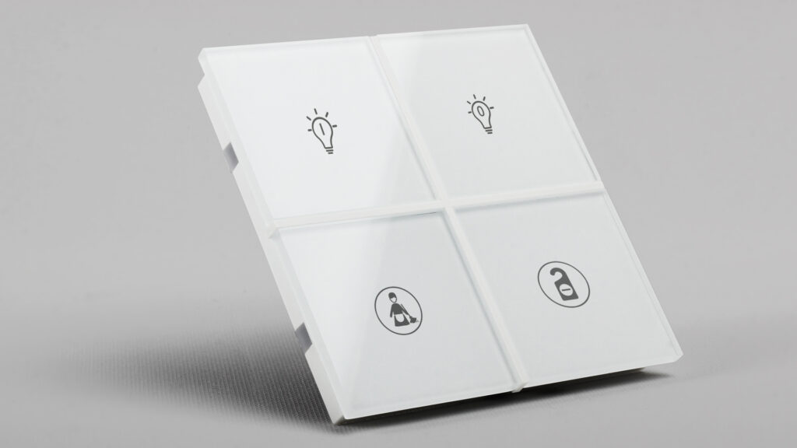

## Mục tiêu

- Hiểu KNX là gì và tại sao ngành smart home chuyên nghiệp vẫn dùng nó sau 30 năm
- Phân biệt được KNX với Zigbee, WiFi, RS485 — biết khi nào chọn cái nào
- Nắm được kiến trúc bus: Line, Area, Backbone
- Hiểu phạm vi ứng dụng KNX tại Thạch Anh IT: tập trung vào push button và KNX-DALI Gateway

---

## KNX là gì

KNX là chuẩn mạng bus dành cho tự động hoá toà nhà và nhà ở, được quản lý bởi Hiệp hội KNX (Brussels). Chuẩn này được chuẩn hoá theo ISO 14543-3 — tức là một chuẩn quốc tế thực sự, không phải giao thức độc quyền của một hãng.

Nguồn gốc: KNX ra đời năm 1999 từ sự hợp nhất ba chuẩn châu Âu: EIB (Siemens/Gira), EHS (Philips/Miele), và BatiBUS (Legrand). Từ đó đến nay, hơn 500 nhà sản xuất đã có sản phẩm KNX được chứng nhận, tổng cộng hơn 8.000 sản phẩm có mặt trên thị trường.

Điều khiến KNX khác biệt so với các giao thức smart home khác là tính **phi tập trung** (decentralised). Không có một bộ điều khiển trung tâm nào phải "sống" để hệ thống hoạt động. Mỗi thiết bị KNX đều có bộ xử lý riêng, lưu cấu hình riêng trong bộ nhớ EEPROM. Khi bấm nút tắt đèn, push button gửi telegram trực tiếp lên bus, actuator nhận và thực thi — không thông qua server, không cần cloud, không phụ thuộc mạng Internet.

Đây là lý do các công trình nghiêm túc như khách sạn, bệnh viện, biệt thự cao cấp dùng KNX: độ bền và tính ổn định 20–30 năm là thực tế, không phải marketing.

---

## Tại sao KNX tồn tại lâu như vậy

Bốn lý do kỹ thuật:

**1. Vật lý tách biệt với ứng dụng.** Cáp KNX bus (LIYCY 2×2×0.8mm, điện áp 29V DC) chạy riêng với cáp điện 220V. Nếu có sự cố ở lớp ứng dụng (cài đặt sai, firmware lỗi), thiết bị vẫn giữ cấu hình cũ và tiếp tục hoạt động.

**2. Giao thức S-mode (Standard mode).** Mọi thiết bị KNX của mọi hãng đều tương thích với nhau qua ETS (Engineering Tool Software). Push button EAE Turkey có thể nói chuyện với actuator Siemens, DALI Gateway Siemens/EAE — không cần cầu nối, không cần middleware.

**3. Tốc độ phù hợp.** 9.600 bit/s có vẻ chậm, nhưng một lệnh bật đèn chỉ cần 2–3 telegram, thời gian phản hồi dưới 100ms. Với ứng dụng điều khiển nhà, đây là đủ.

**4. Thiết bị lưu cấu hình onboard.** Mỗi thiết bị chứa Group Address và tham số trong bộ nhớ nội bộ. Thay PSU, thay router không mất cấu hình. Thay một thiết bị hỏng chỉ cần nạp lại Physical Address và download.

---

## So sánh KNX với các giao thức khác

| Tiêu chí | KNX | Zigbee | WiFi | RS485/Modbus |
|---|---|---|---|---|
| Kiến trúc | Phi tập trung | Cần coordinator | Cần router + cloud | Thường master-slave |
| Môi trường vật lý | Cáp bus 2 dây | Radio 2.4 GHz | Radio 2.4/5 GHz | Cáp xoắn 2 dây |
| Nguồn cho thiết bị | Từ bus 29V DC | Pin hoặc nguồn riêng | Nguồn 5V USB/adapter | Cấp nguồn riêng |
| Độ bền | 20–30 năm | 3–7 năm (thực tế) | 2–5 năm (thực tế) | 10–20 năm |
| Tương thích đa hãng | Có (ISO 14543-3) | Có nhưng hạn chế | Không (mỗi app riêng) | Cần tích hợp thủ công |
| Khả năng chịu nhiễu RF | Không bị ảnh hưởng | Dễ bị nhiễu | Dễ bị nhiễu | Tốt với cáp chất lượng |
| Chi phí thiết bị | Cao | Trung bình | Thấp–Trung bình | Trung bình |
| Lập trình | ETS (chuyên nghiệp) | App hoặc cloud | App cloud | Manual config |
| Phù hợp dự án | Biệt thự, khách sạn, thương mại | Nhà ở phổ thông, retrofit | Nhà ở phổ thông | Công nghiệp, toà nhà đơn giản |

Kết luận thực tế: với công trình từ 300m² trở lên, hoặc có yêu cầu độ tin cậy cao (biệt thự, nghỉ dưỡng), KNX là lựa chọn đúng. Với căn hộ 60–100m² ngân sách hạn chế, Zigbee hoặc WiFi kết hợp MobiEyes có thể phù hợp hơn về chi phí.

---

## Kiến trúc bus KNX

### Đơn vị cơ bản: Line

Một KNX Line là một đoạn bus gồm:
- 1 bộ nguồn bus (Power Supply) cấp 29V DC
- Tối đa 64 thiết bị
- Tổng chiều dài cáp tối đa 1.000m
- Khoảng cách tối đa giữa 2 thiết bị xa nhất: 700m

### Cấu trúc phân cấp

```
Backbone Line (Area Coupler)
│
├─── Line Coupler ──► Line 1.1 (tầng 1, chiếu sáng)
│                     ├── Push Button [1.1.1]
│                     ├── Push Button [1.1.2]
│                     ├── DALI Gateway [1.1.50]
│                     └── KNX/IP Gateway [1.1.60]
│
├─── Line Coupler ──► Line 1.2 (tầng 1, rèm)
│                     ├── Push Button [1.2.1]
│                     └── Blind Actuator [1.2.20]
│
└─── Line Coupler ──► Line 2.1 (tầng 2, chiếu sáng)
                      ├── Push Button [2.1.1]
                      └── DALI Gateway [2.1.50]
```

Mỗi thiết bị có địa chỉ vật lý dạng `Area.Line.Device` — ví dụ `1.1.5` là Area 1, Line 1, Device 5.

Trong dự án quy mô nhỏ (ví dụ 1 villa), thường chỉ cần 1 Line duy nhất (hoặc 2–3 Line nếu nhiều tầng). Area và Backbone chỉ cần khi quy mô lớn hơn.

### Topology hợp lệ

KNX bus hỗ trợ ba kiểu đi dây:

- **Bus (đường thẳng):** Thiết bị đấu nối tiếp từ đầu đến cuối — đơn giản nhất, phổ biến nhất
- **Star (hình sao):** Từ một điểm trung tâm đi nhiều nhánh — thường dùng khi PSU ở trung tâm
- **Tree (cây):** Kết hợp bus và star — phù hợp công trình phức tạp

**Không bao giờ dùng Ring topology.** Bus KNX hoạt động dựa trên nguyên lý collision detection (CSMA/CA) — mỗi telegram có điểm đầu và điểm cuối. Nếu đi dây vòng tròn, tín hiệu phản xạ từ hai phía sẽ gây nhiễu telegram, toàn bộ bus có thể tê liệt.

---

## Sơ đồ hệ thống KNX điển hình

```
         ┌─────────────────────────────────────────────┐
         │              Tủ điện (Panel)                │
         │                                             │
         │  ┌──────────┐    ┌──────────────────────┐  │
         │  │  KNX PSU │    │   KNX/IP Gateway      │  │
         │  │  29V DC  │    │  (Siemens N 148/23)   │  │
         │  │  640mA   │    │  ──► LAN ──► ETS /    │  │
         │  │          │    │      Home Assistant    │  │
         │  └────┬─────┘    └──────────┬────────────┘  │
         │       │                     │               │
         │       └──────────┬──────────┘               │
         │              KNX Bus                        │
         └──────────────────┼──────────────────────────┘
                            │
              ┌─────────────┼──────────────┐
              │             │              │
         ┌────┴────┐  ┌─────┴─────┐  ┌───┴──────┐
         │  Push   │  │ KNX-DALI  │  │  Switch  │
         │ Button  │  │  Gateway  │  │ Actuator │
         │(EAE/    │  │(Siemens   │  │(nếu có)  │
         │Vimar/   │  │5WG1141 /  │  │          │
         │Ekinex)  │  │EAE)       │  └──────────┘
         └─────────┘  └─────┼─────┘
                            │ DALI bus
                     ┌──────┼──────┐
                  [Driver] [Driver] [Driver]
                  (đèn LED, downlight, track light)
```

---

## Phạm vi áp dụng tại Thạch Anh IT


<p class="hero-image-caption">Push button EAE Rosa Crystal — dòng kính cường lực thường dùng trong dự án KNX tại Thạch Anh IT.</p>

Tại Thạch Anh IT, KNX được triển khai theo mô hình kết hợp:

**Thiết bị KNX trọng tâm:**
- Push Button KNX (EAE Technology, Vimar, Ekinex) — điều khiển trực tiếp từ tường
- KNX-DALI Gateway (Siemens 5WG1141-1AB31, EAE) — điều khiển dimmer DALI
- KNX/IP Gateway (Siemens N 148/23) — kết nối bus với mạng LAN để ETS lập trình qua IP

**Không dùng Switch Actuator và Binary Input KNX nhiều** vì hệ thống MobiEyes đã có module relay và input riêng. Tuy nhiên, với dự án KNX thuần (không có MobiEyes hoặc công trình thương mại lớn), Switch Actuator và Binary Input KNX vẫn là lựa chọn hợp lý.

**Ví dụ thực tế — Villa Nha Trang:**
Dự án gồm các phòng: Sân vườn, Phòng khách, Phòng bếp, Phòng Master, Phòng ngủ 2, Phòng ngủ 3. Mỗi phòng có 1–2 push button KNX (EAE Rosa hoặc Ekinex), tất cả kết nối về tủ điện chạy qua KNX/IP Gateway (Siemens). Hệ thống KNX và MobiEyes không giao tiếp trực tiếp với nhau — Thạch Anh IT sử dụng Home Assistant để đồng bộ hai hệ thống, chi tiết sẽ được hướng dẫn trong Module D (Lập trình). DALI Gateway điều khiển toàn bộ đèn LED downlight và track light. push button KNX điều khiển đèn DALI trực tiếp qua Group Address.

---

## Tại sao Thạch Anh IT chọn 3 hãng push button này

- **EAE Technology (Thổ Nhĩ Kỳ):** Giá cạnh tranh, thiết kế glass/metal đẹp, hỗ trợ RGB LED và cảm biến nhiệt độ tích hợp. Hãng có Training Center KNX từ 2012, tài liệu kỹ thuật đầy đủ. Dòng Rosa Crystal và Rosa Metal phù hợp với thị trường biệt thự cao cấp Việt Nam.

- **Vimar (Italy):** Thương hiệu lâu đời, thiết kế Ý tinh tế. Điểm mạnh là module KNX 01580/01585 có thể ghép với nhiều dòng mặt công tắc (Eikon, Arké, Plana) — linh hoạt khi khách hàng muốn thẩm mỹ riêng. RGB LED trên mỗi nút, KNX Secure tuỳ chọn.

- **Ekinex (Italy):** Cũng là Italian brand, thiết kế vuông góc hiện đại. Điểm khác biệt là rocker có thể tháo lắp để thay màu/vật liệu, hỗ trợ cảm biến lux (dòng 71 series). File manual MAED2E13TP và MAEKE73TP có sẵn trên Google Drive công ty.

---

## Ghi nhớ cho kỹ thuật viên

Khi bước vào một dự án KNX mới, ba câu hỏi cần trả lời trước:

1. Có bao nhiêu Line? Mỗi Line tối đa 64 thiết bị, 1.000m cáp.
2. KNX chạy độc lập hay tích hợp MobiEyes? Điều này quyết định cần lập trình kịch bản ở đâu.
3. Thiết bị push button dùng hãng nào? Mỗi hãng có file .knxprod và quy trình nạp địa chỉ khác nhau.

Các file chi tiết về từng chủ đề được viết riêng trong B3.01 đến B3.07.
