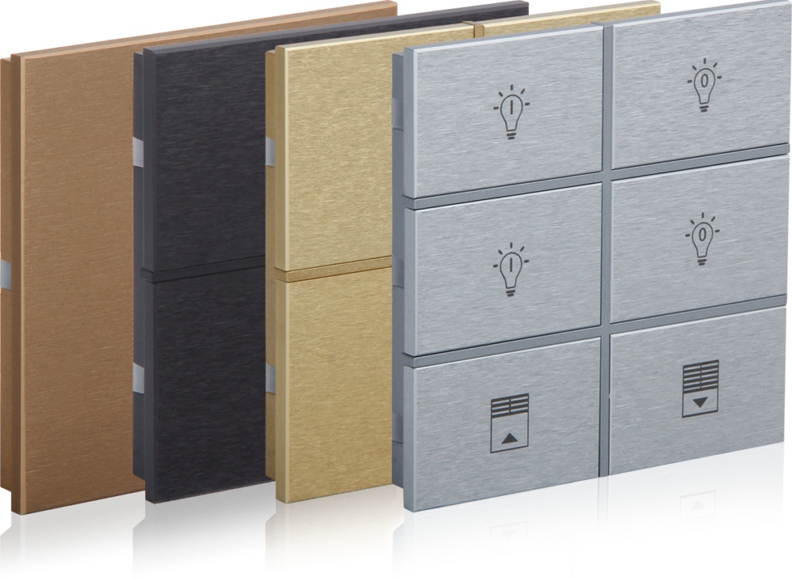
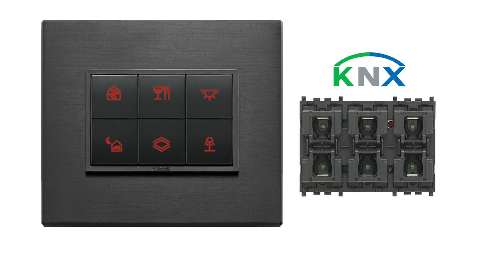

## Mục tiêu

- Nắm được danh sách thiết bị KNX theo hai tier: trọng tâm và bổ sung
- Biết thông số kỹ thuật chính của từng dòng push button (EAE, Vimar, Ekinex)
- Hiểu khi nào dùng nguồn bus 320mA, khi nào dùng 640mA
- Biết tên model cụ thể của KNX/IP Gateway, DALI Gateway để tra tài liệu

---

## Tier 1 — Thiết bị trọng tâm

Đây là các thiết bị Thạch Anh IT sử dụng trong hầu hết dự án KNX. Hiểu rõ từng loại này là bắt buộc.

---

### 1. KNX Power Supply (Nguồn bus)

Nguồn bus cấp điện áp 29V DC SELV lên toàn bộ dây bus KNX. Không có nguồn, bus không hoạt động — đây là thiết bị đầu tiên cần lắp.

Nguồn bus có tích hợp cuộn cảm (choke) để tách nguồn DC khỏi tín hiệu data. Nếu không có choke, nguồn sẽ "nuốt" tín hiệu KNX và toàn bộ bus câm lặng. Đây là nguyên nhân hay gặp khi thay nguồn bằng loại không đúng.

#### Khi nào dùng 320mA, khi nào dùng 640mA

| Tiêu chí | 320 mA | 640 mA |
|---|---|---|
| Số thiết bị thực tế | ~25–30 thiết bị | ~55–64 thiết bị |
| Dự án nhỏ (1 villa 1 line) | Đủ dùng | Có thể dư |
| Dự án lớn (nhiều phòng) | Không đủ | Phù hợp |
| Chi phí | Thấp hơn | Cao hơn ~20% |
| Khuyến nghị | Dự án <20 thiết bị | Dự án >20 thiết bị hoặc muốn dự phòng |

Mỗi thiết bị KNX tiêu thụ khoảng 5–15mA từ bus. Push button thường 8–10mA, actuator DIN rail 10–12mA. Tính tổng current trước khi chọn PSU.

**Model tham khảo:**
- Meanwell KNX-20E-640: 640mA, compact, giá tốt — lựa chọn thường dùng
- Meanwell KNX-20E-320: 320mA, cho dự án nhỏ
- Siemens N 125/22 (5WG1125-1AB22): 640mA, thương hiệu Đức, chất lượng cao
- Siemens N 125/12 (5WG1125-1AB12): 320mA

**Lắp đặt:** DIN rail 35mm, vào tủ điện. Input 230V AC, output 29V DC lên bus. Khoảng cách tối thiểu 200m (chiều dài cáp bus) nếu có 2 nguồn trên cùng 1 line.

---

### 2. KNX/IP Gateway

Thiết bị kết nối bus KNX với mạng LAN/Ethernet. Có hai chức năng chính:

- **Lập trình qua mạng:** ETS kết nối tới bus qua IP thay vì cáp USB — tiện hơn nhiều khi làm việc từ xa hoặc tủ điện đặt xa máy tính
- **Tích hợp hệ thống:** Home Assistant có thể kết nối với KNX bus qua KNXnet/IP tunneling để đồng bộ với MobiEyes

Hai loại cần phân biệt:
- **IP Interface (không routing):** Chỉ tunneling, không thể làm line/area coupler
- **IP Router (có routing):** Vừa tunneling vừa coupler — loại này dùng cho dự án chuyên nghiệp

#### Model sử dụng tại Thạch Anh IT

**Siemens N 148/23 (5WG1148-1AB23):**
- Loại: IP Interface (tunneling)
- Tunneling đồng thời: 4 kết nối
- KNX Secure: Có
- Nguồn: PoE — cắm vào PoE switch, không cần nguồn riêng
- ETS lập trình qua IP — tiện lợi khi làm việc từ xa hoặc tủ điện đặt xa máy tính

Thạch Anh IT lập trình chủ yếu qua IP, không sử dụng USB Interface.

---

### 3. KNX-DALI Gateway

Thiết bị cầu nối giữa KNX bus và DALI bus. Nhận lệnh dimming/switching từ KNX, chuyển thành lệnh DALI cho driver đèn.

**Tại sao cần DALI Gateway thay vì dimmer trực tiếp?** Vì DALI cho phép điều khiển từng driver đèn riêng lẻ (địa chỉ 0–63), nhóm 16 nhóm, 16 scene — tất cả chạy trên 2 dây bus. Một DALI Gateway thay thế được 64 dimmer riêng lẻ.

DALI Gateway đồng thời cấp nguồn cho bus DALI (không cần nguồn DALI riêng), phát hiện lỗi ballast/driver và báo về KNX, hỗ trợ DT8 (Tunable White, RGBW).

#### Model tham khảo

**Siemens 5WG1141-1AB31** (có manual trên Google Drive công ty):
- 1 kênh DALI, tối đa 64 ballast
- Hỗ trợ DALI DT6 (LED ballast), DT8 (colour/tunable white)
- Cấp nguồn DALI tích hợp (không cần PSU DALI riêng)
- Lắp DIN rail, cần cấp 230V AC riêng cho DALI

**EAE KNX-DALI Gateway** (phương án thay thế):
- Tương thích KNX/DALI, giá cạnh tranh
- Dùng khi Siemens 5WG1141-1AB31 không có sẵn hoặc dự án cần tối ưu ngân sách

**Lưu ý thực tế:** DALI bus tối đa 300m với cáp 1.5mm², 100m với 0.5mm². Điện áp DALI khoảng 16V DC — đo bằng đồng hồ để kiểm tra.

---

### 4. Push Button KNX

Push button KNX là công tắc tường tích hợp bộ ghép bus (BCU), chỉ cần đấu 2 dây bus để hoạt động, không cần 220V. Nhấn nút → gửi telegram lên bus → actuator nhận và thực thi.

Thạch Anh IT dùng 3 hãng chính, chi tiết dưới đây.

---

## Push Button — Chi tiết 3 hãng

### EAE Technology (Thổ Nhĩ Kỳ)

Dòng push button EAE Rosa — các biến thể Glass, Metal và Crystal.

Thành viên KNX Association, có Training Center KNX từ 2012. Sản phẩm sản xuất tại Istanbul. Ba dòng chính:

#### Dòng Rosa (premium, glass/aluminium)

Hai loại bề mặt:
- **Rosa Metal:** Nhôm anodised dòng 7000, màu: Natural (bạc), Gold, Bronze, Anthracite
- **Rosa Crystal:** Kính cường lực 4mm, màu theo mã RAL tùy chọn

Kích thước: 85×85mm, lắp hộp âm tường 60×60mm.

| Thông số | Giá trị |
|---|---|
| Nguồn | 21–30V DC từ bus KNX |
| Dòng tiêu thụ | ≤10mA |
| Số nút | 2 nút (1 fold), 4 nút (2 fold), 6 nút (3 fold) |
| Cảm biến nhiệt độ | Có, ±0.4°C |
| Cảm biến độ ẩm | Có (dòng Crystal) ±5% RH |
| LED | Status LED (feedback) + Navigation LED (sáng trong bóng tối) |
| ETS | ETS5 trở lên |
| IP | IP20 |

Dòng Rosa Thermostat có thêm LCD hiển thị setpoint nhiệt độ, hỗ trợ điều khiển FCU (fan coil), VRF/VRV, pi proportional.

Nhấn kiểu: short press, long press, double press, triple press — 4 kiểu nhấn khác nhau trên 1 nút.

#### Dòng Oria (mid-range, plastic)

- Bề mặt: Polycarbonate, màu Pearl White / Anthracite / Mustang Gray
- Kích thước: 90×90mm, hộp 60×60mm
- 1 đến 6 fold (tối đa 12 nút trong một frame)
- Cảm biến nhiệt độ ±0.3°C
- Giá thấp hơn Rosa, phù hợp dự án ngân sách hạn chế

#### Dòng Mona (khách sạn, luxury)

- Kính nguyên tấm không viền, monoblock
- Kết hợp switch + thermostat + card holder + DND/MUR trong một tấm liên tục (tới 5 module)
- RGB LED — mỗi nút cấu hình màu riêng
- Đọc thẻ từ 1K/2K/4K và RFID
- Web configurator cho tích hợp viên cài trước khi giao hàng

---

### Vimar (Italy)

Bộ điều khiển KNX Vimar — tương thích với các dòng mặt Eikon, Arké và Plana.

Vimar tích hợp KNX vào các dòng công tắc nội thất của họ. Điểm đặc biệt: module điện tử KNX (01580/01585) là **chung** cho tất cả dòng thiết kế — chỉ thay mặt nút và viền theo dòng Eikon, Arké, hoặc Plana.

#### Model KNX core

| Model | Số nút | Ghi chú |
|---|---|---|
| 01580 | 4 nút | RGB LED, cho Eikon/Arké/Plana |
| 01583 | 4 nút | Bản KNX Secure |
| 01585 | 6 nút | RGB LED, 3 module |
| 01588 | 6 nút | Bản KNX Secure |
| 21840 | 4 nút | Eikon Tactil (thế hệ cũ) |

#### Thông số kỹ thuật (01580/01585)

| Thông số | Giá trị |
|---|---|
| Nguồn | Bus KNX |
| Chuẩn | KNX S-Mode |
| Nút | 4 (01580) hoặc 6 (01585), lập trình độc lập |
| LED | RGB — chỉnh màu và độ sáng theo nút trong ETS |
| Actuator tích hợp | Tùy chọn: light actuator hoặc roller shutter actuator |
| Lắp | Âm tường, hộp tiêu chuẩn Ý/Châu Âu |
| ETS | ETS5/ETS6 |

#### Dòng thiết kế

| Dòng | Phong cách | Vật liệu |
|---|---|---|
| Eikon | Tròn/vuông, premium Italy | Nhựa, tùy chọn kim loại |
| Arké | Góc cạnh, hiện đại | Nhựa |
| Plana | Tối giản, phẳng | Nhựa (mỏng hơn) |

RGB LED trên 01580/01585 có thể cài màu riêng từng nút, 3 mức độ sáng — rất hữu ích để phân biệt chức năng (ví dụ: đèn = xanh, rèm = vàng).

Có tuỳ chọn khắc laser tên/biểu tượng lên mặt nút (thời gian sản xuất 20 ngày).

---

### Ekinex (Italy)

Thương hiệu Italy, chuyên về KNX push button với thiết kế vuông hiện đại. Điểm khác biệt: rocker (mặt nút) có thể tháo lắp để thay màu/vật liệu (nhựa, kim loại, Fenix NTM® matte).

Công ty có manual EK-ED2-TP (MAED2E13TP_EN_v.4.3.pdf) và EK-E73-TP (MAEKE73TP_EN_v.4.0.pdf) trên Google Drive.

#### Dòng FF Series

**EK-ED2-TP** (full-featured) và **EK-E32-TP** (basic):

| Thông số | EK-ED2-TP | EK-E32-TP |
|---|---|---|
| LED | 4 LED/channel, 2 màu | Không có |
| Cảm biến nhiệt độ | Có | Không |
| Rocker | 2 hoặc 4 rockers | 2 hoặc 4 rockers |
| Kích thước | 82×79×19mm | 82×79×19mm |
| Dòng tiêu thụ | <15mA | <15mA |

Rocker FF series: 40×80mm (2 nút), 40×40mm (4 nút vuông), 80×20mm (4 nút ngang).

#### Dòng 71 Series

**EK-E12-TP** (có LED, cảm biến nhiệt độ **và cảm biến lux**):

| Thông số | Giá trị |
|---|---|
| Cảm biến | Nhiệt độ + **cường độ ánh sáng (lux)** |
| Rocker | 1, 2 hoặc 4 rockers |
| Kích thước | 81×77×21mm |
| LED | 2 màu, lập trình tự do |
| ETS | ETS5/ETS6 |

Cảm biến lux là điểm cộng riêng của 71 series — có thể gửi giá trị lux lên bus cho logic tự động điều chỉnh độ sáng hoặc điều khiển rèm theo ánh sáng tự nhiên.

**Cách lắp Ekinex:** Lắp thân thiết bị vào hộp âm tường trước, cấm kết nối bus (đỏ = +, đen = -), ấn nút lập trình trên mặt trước (LED đỏ sáng), nạp địa chỉ vật lý qua ETS, download, rồi mới gắn rocker và frame vào.

---

### So sánh 3 hãng push button

| Tiêu chí | EAE Rosa | Vimar 01580/01585 | Ekinex EK-ED2-TP |
|---|---|---|---|
| Xuất xứ | Thổ Nhĩ Kỳ | Italy | Italy |
| Bề mặt | Glass/Aluminium | Nhựa (nhiều dòng) | Nhựa/Kim loại (rocker thay được) |
| Số nút tối đa (1 unit) | 6 (3 fold) | 6 | 8 (4 rocker) |
| RGB LED | Navigation LED (không RGB) | RGB | 2 màu |
| Cảm biến nhiệt | Có ±0.4°C | Không (cần module riêng) | Có (ED2-TP) |
| Cảm biến lux | Không | Không | Có (71 series) |
| Cảm biến độ ẩm | Có (Crystal) | Không | Không |
| Khả năng thermostat | Có (dòng Thermostat) | Không tích hợp | Có (software) |
| KNX Secure | Không | Có (01583/01588) | Không |
| Hộp âm tường | 60×60mm | Hộp Ý/EU standard | 60mm hoặc Italian |
| File .knxprod | Từ eaetechnology.com | Từ vimar.com | Từ ekinex.com |

---

## Tier 2 — Thiết bị bổ sung

Các thiết bị này ít dùng tại Thạch Anh IT do hệ thống MobiEyes đã có module relay và input riêng. Tuy nhiên, với dự án KNX thuần (không có MobiEyes, hoặc thương mại lớn), các thiết bị sau vẫn cần biết.

---

### Switch Actuator (Bộ đóng ngắt)

Nhận telegram KNX on/off, đóng/ngắt tải điện (đèn, ổ cắm, điều hoà). Mỗi kênh là một relay độc lập.

Model tham khảo:
- **Siemens N 567/22 (5WG1567-1AB22):** 16 kênh, 10A, DIN rail
- **EAE SW108:** 8 kênh, 16A/20AX, lắp wall box — nhỏ gọn hơn cho lắp tường

Chức năng thường dùng: switching, staircase (tắt tự động sau N giây), scene recall, logic AND/OR, reaction on bus failure.

Ít dùng tại Thạch Anh IT vì: MobiEyes đã có relay module riêng, giá rẻ hơn và tích hợp sâu hơn với hệ thống automation.

---

### Binary Input (Đầu vào nhị phân)

Chuyển đổi tín hiệu từ công tắc thường (dry contact) thành telegram KNX. Dùng khi muốn tích hợp công tắc nội thất không phải KNX vào hệ thống, hoặc kết nối cảm biến tiếp điểm (cửa, cửa sổ, PIR).

Hai loại:
- **DIN rail:** MDT BE-04000.02 (4 kênh), BE-08000.02 (8 kênh) — lắp tủ điện, nối cáp về
- **Flush-mount:** MDT BE-04001.02 (4 kênh) — lắp sau công tắc tường, không cần kéo cáp về tủ

Ít dùng tại Thạch Anh IT vì: MobiEyes có input module riêng. Nhưng hữu ích khi khách hàng muốn giữ công tắc cơ truyền thống bên cạnh hệ thống smart.

---

### Blind/Shutter Actuator (Bộ điều khiển rèm/mành)

Điều khiển động cơ rèm UP/DOWN. Mỗi kênh gồm 2 relay (lên + xuống) được khóa chéo cơ học để tránh cấp điện đồng thời (sẽ phá motor).

Model tham khảo:
- **Siemens N 523/23 (5WG1523-1AB23):** 4 kênh, 230V AC, DIN rail — lựa chọn chuẩn cho dự án Siemens
- **MDT JAL-0410D.02:** 4 kênh, 230V, DIN rail

Chức năng: vị trí lên/xuống (0–100%), góc cánh (slat), preset vị trí, bảo vệ gió/mưa/sương, sun protection automation.

Ít dùng tại Thạch Anh IT vì: MobiEyes điều khiển motor rèm qua module riêng.

---

## Cáp Bus và phụ kiện

### Cáp KNX Bus

- Loại: LIYCY 2×2×0.8mm (hoặc YCYM 2×2×0.8mm)
- Màu vỏ: Xanh lá (standard KNX)
- Cấu tạo: 2 cặp xoắn, cặp 1 (đỏ/đen = data+power), cặp 2 (vàng/trắng = dự phòng)
- Điện áp định mức: 50V DC SELV
- Chỉ đấu 2 dây đỏ (+) và đen (-) cho bus KNX

### Lập trình qua IP

Thạch Anh IT lập trình chủ yếu qua KNX/IP Gateway (Siemens N 148/23). ETS kết nối đến bus qua IP — không cần USB Interface. Đây là phương pháp tiện lợi hơn nhiều: có thể lập trình từ bất kỳ vị trí nào trong mạng LAN, không cần ngồi cạnh tủ điện.

---

## Ghi nhớ khi chọn thiết bị

Khi lên bill of material cho một dự án KNX, cần có ít nhất:
- 1 nguồn bus (320mA hoặc 640mA tùy số thiết bị)
- 1 KNX/IP Gateway Siemens N 148/23 (để ETS lập trình qua IP)
- Push button (số lượng theo phòng, chọn hãng theo ngân sách và thẩm mỹ)
- DALI Gateway (nếu có đèn LED cần dim)
- Cáp LIYCY 2×2×0.8mm (tính toán chiều dài + dư 20%)
