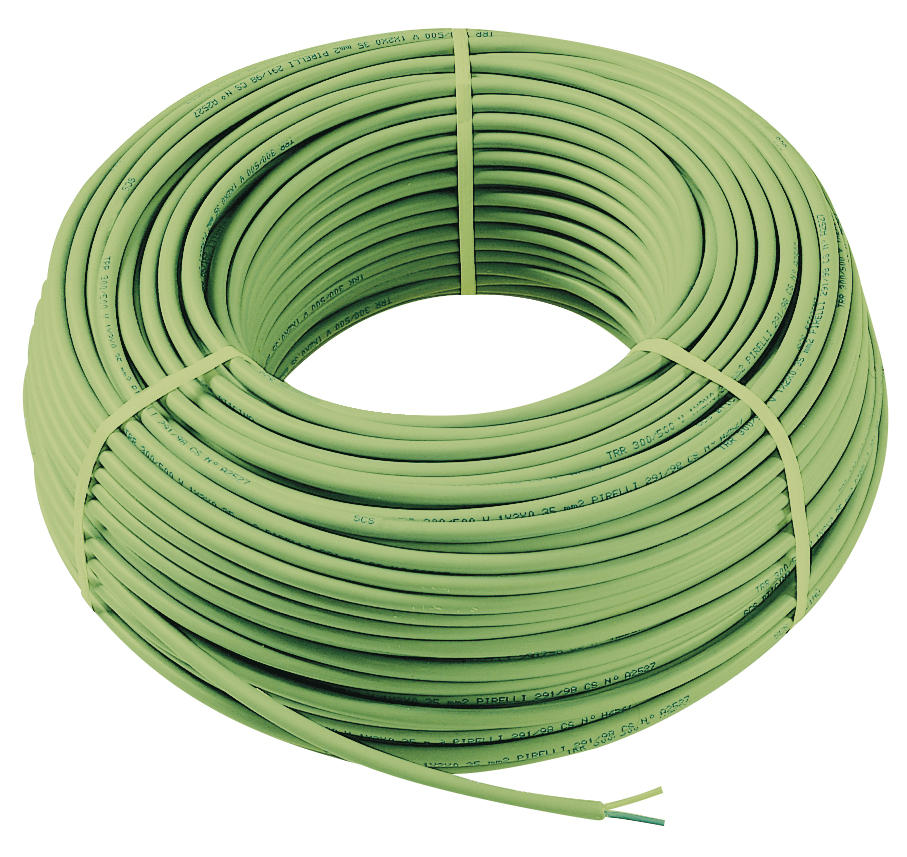

<p class="hero-image-caption">Cáp KNX bus LIYCY 2×2×0.8mm — vỏ xanh lá chuẩn, 2 cặp dây xoắn.</p>

## Mục tiêu

- Biết đúng loại cáp KNX bus cần dùng và tại sao
- Hiểu các giới hạn vật lý: chiều dài, số thiết bị, khoảng cách
- Nắm rõ 3 topology hợp lệ và tại sao không được đi Ring
- Thuộc quy tắc đấu nối cực tính — sai là cháy thiết bị
- Có checklist thi công để kiểm tra trước khi bật nguồn

---

## Cáp KNX Bus

### Loại cáp dùng

Cáp chuẩn cho KNX TP (Twisted Pair): **LIYCY 2×2×0.8mm**

Các ký hiệu khác cũng gặp: YCYM 2×2×0.8mm, CYY 2×2×0.8mm. Về kỹ thuật tương đương, nhưng LIYCY là loại có lớp chống nhiễu (screened) — chuẩn hơn cho môi trường có nhiều thiết bị điện.

**Màu vỏ ngoài:** Xanh lá (Green) — đây là màu chuẩn của KNX Association. Không phải vỏ cáp màu xanh lá = không phải cáp KNX.

**Cấu tạo bên trong:**
- Cặp 1 (pair 1): Dây đỏ (+) và dây đen (-) — đây là cặp data+power chính
- Cặp 2 (pair 2): Dây trắng và vàng — dự phòng (không dùng trong KNX TP thông thường)
- Lõi: 0.8mm², đủ cho 29V DC và tín hiệu 9.6kbps
- Lớp shield: Lưới đồng, nối đất ở một đầu

**Không dùng cáp thường thay thế** dù trông giống nhau. Cáp điện thường không có đặc tính điện dung/inductance phù hợp, sẽ gây suy giảm tín hiệu và bus không ổn định ở chiều dài dài.

---

## Thông số kỹ thuật giới hạn

### Giới hạn một Line

| Tham số | Giới hạn |
|---|---|
| Tổng chiều dài cáp (toàn line) | Tối đa 1.000m |
| Khoảng cách xa nhất giữa 2 thiết bị | Tối đa 700m |
| Khoảng cách từ PSU đến thiết bị xa nhất | Tối đa 350m |
| Số thiết bị tối đa | 64 thiết bị (chuẩn TP1-64) |
| Điện áp bus bình thường | 21–29V DC tại đầu cuối |
| Dòng bus tối đa | Theo PSU (320mA hoặc 640mA) |

Lý do giới hạn 700m giữa 2 thiết bị: điện trở dây tăng theo chiều dài, điện áp tại điểm cuối giảm xuống dưới 21V DC thì thiết bị không khởi động được. Với cáp 0.8mm², điện trở khoảng 58 Ohm/km — tại 700m tổng điện trở hai chiều ~81 Ohm, vẫn trong giới hạn an toàn với dòng tiêu thụ thực tế.

**Ví dụ thực tế Villa Nha Trang:** Line 1 (tầng trệt) có 18 thiết bị: 8 push button, 2 DALI Gateway, 1 KNX/IP Gateway, 1 PSU, 6 thiết bị khác. Tổng cáp khoảng 180m — thoải mái trong giới hạn.

---

## Topology

### Ba kiểu đi dây hợp lệ

**1. Bus (đường thẳng)**

Thiết bị đấu nối tiếp dọc theo một đường cáp từ đầu đến cuối. Đơn giản nhất, phổ biến nhất.

```
PSU ─── Thiết bị A ─── Thiết bị B ─── Thiết bị C ─── Thiết bị D
```

Ưu điểm: dễ hiểu, dễ kiểm tra, tốn ít cáp. Nhược: nếu đứt cáp ở giữa, toàn bộ phía sau mất kết nối.

**2. Star (hình sao)**

Từ một điểm phân phối trung tâm (thường là tủ điện), kéo nhiều nhánh độc lập đến từng khu vực.

```
            ┌── Nhánh phòng khách (6 thiết bị)
            │
PSU ──Hub──┼── Nhánh phòng master (4 thiết bị)
            │
            └── Nhánh sân vườn (3 thiết bị)
```

Ưu điểm: cô lập sự cố — hỏng một nhánh không ảnh hưởng nhánh khác. Nhược: tốn cáp nhiều hơn.

**3. Tree (cây)**

Kết hợp bus và star — có điểm phân nhánh nhưng mỗi nhánh có thể tiếp tục đi thẳng.

```
PSU ─── Hub ─── Bus A ─── Hub B ─── Bus B1
                     └── Bus B2
```

Phù hợp công trình phức tạp nhiều tầng, nhiều khu vực.

### Tại sao KHÔNG được đi Ring

Ring topology (vòng tròn — điểm cuối nối trở về điểm đầu) bị cấm tuyệt đối trong KNX TP.

Lý do kỹ thuật: KNX dùng giao thức CSMA/CA (Carrier Sense Multiple Access / Collision Avoidance). Khi một thiết bị phát telegram, nó đồng thời "nghe" lại tín hiệu trên bus để kiểm tra collision. Với Ring topology, một telegram sẽ đi theo hai hướng và gặp lại chính nó ở phía đối diện — tạo ra tín hiệu phản xạ liên tục. Kết quả: thiết bị không phân biệt được telegram hợp lệ với phản xạ, bus liên tục báo collision, không telegram nào qua được.

Nói đơn giản hơn: bus TP không có khái niệm "vòng tròn". Nó chỉ biết "tôi đang ở đầu" hoặc "tôi đang ở giữa" hay "tôi đang ở cuối" — không biết xử lý khi nó ở cả đầu lẫn cuối cùng một lúc.

Trong thực tế, lỗi này hay xảy ra khi thợ thi công tự ý nối đầu cuối trở về nguồn vì "tiện cáp". Kiểm tra kỹ trước khi bật nguồn.

---

## Đấu nối cực tính — Quan trọng

### Màu dây

- **Đỏ (+):** Cực dương, 29V DC
- **Đen (-):** Cực âm, GND

**Đấu ngược cực là sai hoàn toàn.** Hầu hết thiết bị KNX có bảo vệ ngược cực, nhưng một số thiết bị giá rẻ hoặc lỗi thời có thể hỏng ngay lập tức. Quan trọng hơn, đấu ngược cực làm thiết bị không khởi động và rất khó debug nếu bạn không biết đã đấu ngược.

### Tại các đầu nối bus (bus terminal)

Mỗi thiết bị KNX có 2 đầu nối bus: thường là terminal màu đỏ (+) và màu đen (-), hoặc ký hiệu "+" và "-", hoặc "KNX+" và "KNX-".

Cáp bus kết nối song song (parallel) không nối tiếp qua thiết bị. Tức là dây đỏ (bus+) đi thẳng từ PSU qua từng terminal "+" của các thiết bị. Dây đen (bus-) tương tự.

**Không đấu in-line (serial) qua terminal của thiết bị trừ khi thiết bị có pass-through terminal.** Một số push button và actuator nhỏ có 1 cặp terminal vào + 1 cặp ra để đi dây kiểu bus — lúc đó OK. Nhưng nếu thiết bị chỉ có 1 terminal thì phải dùng đầu nối Y hoặc junction box riêng.

---

## Quy tắc thi công thực tế

### Tách ống với cáp 220V

Cáp KNX bus **không được đi chung ống với cáp điện lực 220V AC**. Lý do: điện từ trường từ cáp điện sẽ gây nhiễu tín hiệu KNX, đặc biệt ở những đoạn dài.

Khoảng cách tối thiểu:
- Đi song song: ≥20–30cm
- Bắt chéo vuông góc: không cần khoảng cách (chỉ khi bắt chéo, không đi song song)

Thực tế thi công: dùng ống riêng màu khác (ví dụ ống đen cho KNX, ống trắng hoặc xám cho 220V), dán nhãn "KNX BUS" tại đầu ống.

### Nhãn và đánh số

Dán nhãn ngay khi thi công, đừng để đến cuối:
- Mỗi đầu cáp: "L1.1" (Line 1, khu 1), "L1.2" (Line 1, khu 2)...
- Trong tủ điện: nhãn trên thanh terminal ghi rõ "KNX BUS +" và "KNX BUS -"
- Trên từng thiết bị DIN: dán nhãn physical address sau khi nạp (ví dụ "1.1.5")

### Dự phòng chiều dài

Tại mỗi vị trí thiết bị (push button trong tường, actuator trong tủ), để dư ít nhất 30–50cm cáp bus. Lý do: nếu cần thay thiết bị sau này, cần đủ chiều dài để cắt đầu cáp cũ và làm đầu nối mới.

### Vị trí đặt PSU

PSU nên đặt ở vị trí trung tâm của line để điện áp phân phối đều nhất. Tránh đặt PSU ở cuối line vì thiết bị ở đầu dây sẽ nhận điện áp cao hơn và thiết bị ở cuối nhận thấp hơn — không ổn định.

Nếu phải đặt ở đầu tủ điện (vì lý do thiết kế tủ), cần tính toán xem điện áp tại thiết bị xa nhất có còn ≥21V không.

**Trường hợp cần 2 PSU trên cùng 1 line:** Khoảng cách tối thiểu giữa 2 PSU là 200m (đo theo chiều dài cáp bus). Nếu gần hơn, 2 PSU sẽ "tranh" nhau cấp dòng, dẫn đến dao động điện áp không ổn định.

### Test trước khi đấu thiết bị

Sau khi đi dây xong, trước khi gắn thiết bị:
1. Cấp nguồn PSU
2. Đo điện áp tại đầu cuối bus: phải trong khoảng 27–30V DC
3. Đo điện áp tại điểm xa nhất: phải ≥21V DC
4. Nếu thấp hơn: kiểm tra đấu nối, kiểm tra ngắn mạch

---

## Sai lầm phổ biến ngoài thực tế

**1. Đấu ngược cực một đoạn:** Hay xảy ra khi thợ không để ý màu dây trong hộp junction. Triệu chứng: thiết bị không sáng đèn, không phản hồi. Giải pháp: đo điện áp tại terminal của từng thiết bị.

**2. Đi Ring vô tình:** Thợ thấy còn thừa cáp, nối đầu cuối vào điểm gần PSU cho "gọn". Triệu chứng: bus hoàn toàn câm lặng, đo điện áp vẫn đủ nhưng không thiết bị nào phản hồi. Giải pháp: tìm và cắt điểm nối vòng.

**3. Dùng cáp điện thường thay cáp KNX:** Triệu chứng: bus hoạt động nhưng không ổn định ở khoảng cách dài, telegram thỉnh thoảng mất. Khó debug vì không xảy ra liên tục.

**4. Không dán nhãn đầu cáp:** Vài tuần sau không ai biết cáp nào là line nào. Phải trace từng đầu — mất hàng tiếng đồng hồ.

**5. Quên tính tổng dòng tiêu thụ:** Dùng PSU 320mA cho 35 thiết bị. Bus hoạt động lúc đầu nhưng PSU overload sau vài giờ, trigger thermal protection, bus reset định kỳ — rất khó tìm nguyên nhân.

---

## Checklist thi công KNX Bus

Dùng checklist này trước khi bật nguồn lần đầu:

- [ ] Cáp dùng đúng loại: LIYCY 2×2×0.8mm, vỏ xanh lá
- [ ] Không đi chung ống với cáp 220V (hoặc có khoảng cách ≥20cm)
- [ ] Tất cả đầu nối: đỏ (+) vào KNX+, đen (-) vào KNX-
- [ ] Không có điểm nối vòng (ring) — kiểm tra sơ đồ và thực địa
- [ ] Topology là Bus, Star, hoặc Tree — không phải Ring
- [ ] PSU đặt đúng vị trí (trung tâm line hoặc gần nhóm tải nặng nhất)
- [ ] Nếu có 2 PSU: khoảng cách cáp ≥200m
- [ ] Tổng số thiết bị không vượt 64 trên 1 line
- [ ] Tổng cáp không vượt 1.000m
- [ ] Đo điện áp tại đầu cuối bus trước khi gắn thiết bị: 27–30V DC
- [ ] Đo điện áp tại điểm xa nhất: ≥21V DC
- [ ] Tất cả đầu cáp được dán nhãn (Line, khu vực, hướng)
- [ ] Thiết bị DIN rail được cố định chắc trên rail
- [ ] Cáp bus trong tủ không bị gấp khúc góc nhọn
- [ ] Dư 30–50cm cáp tại mỗi vị trí thiết bị

---

## Sau khi bật nguồn

Khi bật PSU lần đầu, quan sát:
- LED trên PSU phải sáng (nếu có LED bus voltage indicator)
- Đo điện áp bus: 29V DC ±1V
- Nếu PSU có LED dòng điện (ABB SV/S 30.320.2.1): số LED sáng tương ứng với dòng bus — dùng để estimate số thiết bị đang draw current

Chỉ sau khi điện áp ổn định mới bắt đầu gắn thiết bị và nạp địa chỉ qua ETS.

Quy trình lắp đặt từng loại thiết bị được hướng dẫn chi tiết trong B3.03.
