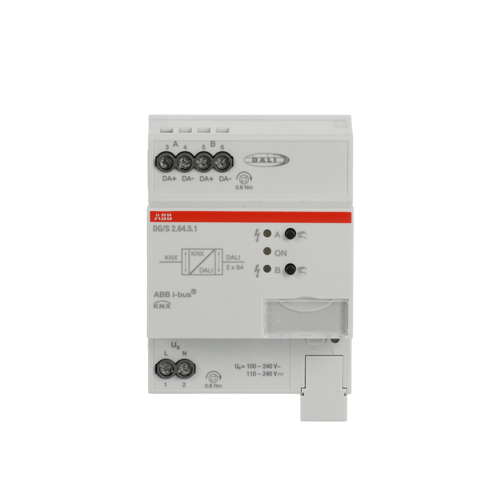

<p class="hero-image-caption">ABB KNX-DALI Gateway DG/S 2.64.5.1 — lắp DIN rail, cầu nối giữa KNX bus và DALI bus.</p>

## Mục tiêu

- Biết cách lắp đặt đúng từng loại thiết bị KNX
- Nắm yêu cầu hộp âm tường cho push button theo từng hãng
- Hiểu cách đấu nối nguồn và bus cho thiết bị DIN rail
- Có checklist tổng hợp để kiểm tra sau khi lắp

---

## 1. Push Button KNX

Push button KNX chỉ cần 2 dây bus (đỏ + đen) — không cần dây 220V. Đây là điểm khác biệt cơ bản so với công tắc truyền thống.

### Yêu cầu hộp âm tường

| Hãng/Dòng | Kích thước hộp tối thiểu | Chiều sâu | Ghi chú |
|---|---|---|---|
| EAE Rosa (1–3 fold) | 60×60mm | ≥45mm | Flush box tiêu chuẩn Châu Âu |
| EAE Oria (1–6 fold) | 60×60mm | ≥45mm | Cùng hộp với Rosa |
| Vimar 01580/01585 | Hộp tiêu chuẩn Ý/EU | ≥45mm | Ý = 3/4 module gang box |
| Ekinex EK-ED2-TP (FF series) | 60mm tâm vít | ≥45mm | Hộp tròn hoặc vuông đều được |
| Ekinex EK-E12-TP (71 series) | 60mm tâm vít | ≥45mm | Cần frame riêng (không kèm) |

Lưu ý: "60mm" là khoảng cách giữa 2 lỗ vít (fixing centers). Chiều sâu hộp cần ≥45mm vì phần điện tử của push button KNX dày hơn công tắc thường.

### Quy trình lắp push button (áp dụng chung)

1. Đi cáp bus LIYCY 2×2×0.8mm đến vị trí hộp âm tường
2. Chừa dư 25–30cm cáp trong hộp
3. Lắp hộp âm tường vào tường (trước khi trát)
4. Sau khi trát xong và sơn xong: lấy cáp ra, bỏ vỏ ngoài 8–10cm
5. Bóc lớp insulation: đỏ và đen khoảng 6–8mm
6. Đấu vào terminal bus của thiết bị: đỏ vào "+", đen vào "-"
7. Gắn thân thiết bị vào hộp (dùng vít kèm theo)
8. **Chưa gắn mặt nút** — để nguyên để lập trình địa chỉ vật lý

### Lắp EAE Technology

**Rosa Crystal/Metal:**
- Thân thiết bị (electronic module) được đặt vào hộp trước
- Terminal bus có màu: đỏ = +, đen = -
- Nút lập trình (programming button) nằm ở mặt trước của thân thiết bị — dễ tiếp cận trước khi gắn mặt kính
- Sau khi download ETS xong: gắn mặt kính bằng cách nhấn nhẹ vào 4 góc (clip-on)
- Không vặn vít mặt ngoài — cơ chế clip

**Oria:**
- Tương tự Rosa nhưng có vít cố định khung nhựa vào hộp
- Nút lập trình ở cạnh dưới thân thiết bị
- Mặt nút gắn sau cùng bằng clip

**Mona:**
- Panel kính lớn, cần kiểm tra khoảng cách giữa các hộp âm tường nếu module nhiều (2–5 module)
- Web configurator cho phép set trước một số tham số trước khi giao hàng
- Lắp theo thứ tự: hộp → thân module → nạp địa chỉ → gắn kính

### Lắp Vimar

**01580/01585:**
- Module điện tử lắp vào khung gang (gangbox frame)
- Chọn button cap theo dòng thiết kế (Eikon / Arké / Plana) và đặt riêng
- Terminal bus: ký hiệu "+" và "-" trên PCB
- Nút lập trình ở mặt trước module
- Sau download: snap button cap vào module, sau đó lắp cover plate (ốp mặt)

**Lưu ý Vimar:** Nếu module có tích hợp actuator (light actuator hoặc shutter actuator), cần đấu thêm dây tải điện (L, N, output). Đọc kỹ wiring diagram vì có dây 230V trong hộp — nguy hiểm.

### Lắp Ekinex

**EK-ED2-TP / EK-E32-TP (FF series):**
- Lắp thân thiết bị vào hộp trước (trước khi gắn rocker)
- Cổng bus: 2 terminal, đỏ = +, đen = -
- Nút lập trình: mặt trước, nhỏ — dùng bút hoặc đầu nhọn để ấn
- Sau download: snap rocker (tấm nút bấm) vào thân — có khớp nhựa
- Cuối cùng snap frame vào (nếu có frame)

**EK-E12-TP (71 series):**
- Tương tự nhưng cần chọn đúng loại rocker (EK-T1Q, EK-T2R, EK-T4Q, EK-T4R) phù hợp với số nút cần
- Frame phải đặt riêng (form series hoặc flank series)
- Lưu ý: thiết bị có cảm biến lux ở góc — không che tắc sau khi lắp

**Quan trọng với thiết bị có cảm biến nhiệt:** Lắp ở độ cao 1.5m ±0.3m so với sàn. Không lắp gần cửa sổ trực tiếp nắng, không gần điều hoà thổi thẳng vào, không gần nguồn nhiệt. Cảm biến nhiệt sai sẽ làm thermostat hoạt động không đúng.

---

## 2. KNX/IP Gateway

### Vị trí lắp

DIN rail 35mm trong tủ điện. Cần:
- Khe DIN rail: 2 SU (36mm) phần lớn các model
- Kết nối Ethernet: cáp Cat5e/Cat6 đến switch mạng
- Kết nối bus: 2 dây từ bus KNX (đỏ + đen)
- Nguồn: tùy model — Bus powered (Weinzierl 5263, MDT SCN-IP100.03) hoặc cần 12–30V DC / PoE (ABB IPR/S 3.5.1)

### Đấu nối

```
Tủ điện
│
├── DIN Rail
│   └── [KNX/IP Gateway]
│       ├── Terminal KNX+  ←── Dây đỏ từ bus
│       ├── Terminal KNX-  ←── Dây đen từ bus
│       └── RJ45 Ethernet  ←── Patch cord đến switch
│
└── Switch mạng (LAN)
    └── ←── MobiEyes controller, máy tính ETS
```

**Nếu model dùng PoE (ABB IPR/S 3.5.1):** Cắm cáp Ethernet vào PoE switch — gateway nhận cả data và nguồn từ một cáp. Không cần cấp thêm 12V. Đây là lợi thế lớn khi lắp xa tủ nguồn.

### Cấu hình IP

Mặc định: DHCP — gateway tự xin IP từ router/DHCP server. Sau khi lắp, dùng phần mềm của hãng hoặc ETS để tìm gateway trên mạng (scan IP multicast 224.0.23.12).

Với hệ thống production: nên đặt IP tĩnh để MobiEyes không mất kết nối khi DHCP lease thay đổi. Đặt IP trong ETS → Properties → IP Address.

### Số kết nối tunneling đồng thời

Weinzierl 5263 và ABB IPR/S: 5 kết nối. MDT SCN-IP100.03: 4 kết nối. Nếu MobiEyes + ETS + 1 app giám sát đều kết nối cùng lúc, 3 slot đã bị chiếm. Thêm 1–2 slot dự phòng là đủ.

---

## 3. KNX Power Supply

### Vị trí lắp

DIN rail trong tủ điện. Chiếm 4 SU (72mm) cho cả 320mA lẫn 640mA.

```
Input 230V AC:
  L (pha)  → Terminal L
  N (neutral) → Terminal N
  PE (đất) → Terminal PE (vỏ kim loại)

Output 29V DC:
  Bus+ (đỏ) → Thanh terminal KNX+
  Bus- (đen) → Thanh terminal KNX-
```

**Không đấu ngược L và N:** Mặc dù PSU thường có bảo vệ, nhưng đấu ngược làm hiệu quả chống nhiễu giảm.

**Đặt PSU gần trung tâm line** (xem B3.02 cho giải thích). Trong tủ điện, PSU thường đặt ở giữa DIN rail, với các thiết bị DIN (DALI GW, actuator) hai bên.

### Mẹo đấu bus PSU kiểu Star

Nếu đi dây Star (nhiều nhánh từ tủ ra), dùng thanh terminal trung gian:

```
PSU Bus+ → Thanh terminal "KNX+" → [nhánh 1+] [nhánh 2+] [nhánh 3+] ...
PSU Bus- → Thanh terminal "KNX-" → [nhánh 1-] [nhánh 2-] [nhánh 3-] ...
```

Thanh terminal cách điện với DIN rail (không đất vào PSU-). Giữ KNX bus tách biệt hoàn toàn với đất (PE) — KNX bus là SELV (Safety Extra Low Voltage), không được nối đất.

---

## 4. KNX-DALI Gateway

### Vị trí lắp và kết nối kép

DALI Gateway cần 2 kết nối bus riêng: KNX bus và DALI bus. Đây là điểm cần chú ý vì thợ mới hay nhầm.

```
Tủ điện
│
└── [KNX-DALI Gateway] (DIN rail, 4 SU)
    ├── KNX Terminal:
    │   ├── KNX+  ←── Bus đỏ
    │   └── KNX-  ←── Bus đen
    ├── Mains Supply (230V AC):
    │   ├── L  ←── Pha 230V
    │   └── N  ←── Neutral
    └── DALI Terminal:
        ├── DA+  ──► Dây DALI đến driver đèn
        └── DA-  ──► Dây DALI đến driver đèn
```

DALI gateway cần nguồn 230V AC **riêng** (ngoài bus KNX 29V). Nguồn 230V này cấp cho mạch DALI internal power supply và relay mains.

### Lưu ý DALI bus wiring

- DALI bus không phân cực — DA+ và DA- có thể đấu theo hướng nào cũng được
- Tuy nhiên, thực tế nên đấu đúng theo ký hiệu trên gateway để dễ debug
- Cáp DALI: không cần loại đặc biệt — cáp điện thường 0.75–1.5mm² là đủ
- Chiều dài tối đa: 300m với 1.5mm², 100m với 0.5mm²
- Điện áp DALI khoảng 16V DC — đo kiểm tra bằng đồng hồ tại đầu cuối bus DALI

### Sau khi đấu nối

1. Bật nguồn DALI gateway
2. Kiểm tra LED trạng thái (thường có LED "KNX", "DALI", "Error")
3. Mở ABB i-bus Tool (với ABB DG/S) hoặc ETS để thực hiện DALI commissioning (auto-assign address)
4. DALI commissioning bắt buộc phải làm trước khi nạp ETS đầy đủ — xem B3.06 cho quy trình

---

## 5. Switch Actuator (sơ lược)

Switch Actuator lắp DIN rail. Cần đấu:
- Bus KNX: 2 dây (đỏ/đen)
- Nguồn chung (L/N): đầu vào chung cho tất cả relay
- Dây tải: từ mỗi output đến từng thiết bị (đèn, ổ cắm...)

```
L (pha 230V) → Terminal L_COM (common cho tất cả kênh)
N (neutral)  → thẳng đến tải (bypass actuator)

Output channel 1 → Tải 1 (đèn phòng khách)
Output channel 2 → Tải 2 (đèn hành lang)
...
```

**Lưu ý:** Neutral (N) đi thẳng đến tải, không qua actuator. Pha (L) đi qua relay của actuator trước khi đến tải. Đây là mạch relay kiểu "switching L".

Manual operation: mỗi kênh thường có lever (cần gạt) cho phép đóng/ngắt thủ công mà không cần KNX. Hữu ích khi debug.

Ít dùng tại Thạch Anh IT — MobiEyes có relay riêng.

---

## 6. Binary Input (sơ lược)

**DIN rail type:** Lắp tủ điện, kéo cáp công tắc (dry contact) về từ các vị trí tường.

```
[Binary Input DIN] ─── terminal C (common)
                   ─── terminal I1 (input 1)  ←── công tắc 1
                   ─── terminal I2 (input 2)  ←── công tắc 2
```

Không cần nguồn riêng — thiết bị cấp 12V DC nội bộ cho vòng dry contact (safe to touch).

**Flush-mount type (MDT BE-04001.02):** Lắp sau công tắc trong hộp âm tường. Dây công tắc nối trực tiếp vào terminal của BE, không cần kéo về tủ. Tiết kiệm cáp và công sức đi dây.

Cấu hình trong ETS: từng kênh có thể set là NO (Normally Open) hoặc NC (Normally Closed), set chức năng (switch, dim, scene, blind...).

---

## 7. Blind Actuator (sơ lược)

Lắp DIN rail. Mỗi kênh có 2 terminal output: UP và DOWN (motor direction).

```
Motor cable:
  Brown (Brown wire từ motor)  → Terminal UP
  Blue (Blue wire từ motor)    → Terminal DOWN
  Yellow/Green (PE)            → PE bar
```

Cơ chế khóa chéo (interlock): phần cứng đảm bảo không bao giờ UP và DOWN đóng cùng lúc. Kể cả khi có lỗi phần mềm, motor không bị phá.

Auto travel detection (ABB JRA/S x.y.5.1): sau khi lắp, chạy lệnh "Identify" từ ETS — actuator tự chạy motor đến cuối hành trình, đo thời gian, lưu lại. Không cần nhập thủ công travel time.

---

## Checklist lắp đặt tổng hợp

### Trước khi lắp

- [ ] Đã kiểm tra điện áp bus: 27–30V DC (xem B3.02)
- [ ] Tất cả cáp bus đã dán nhãn
- [ ] Hộp âm tường đúng kích thước cho từng loại push button

### Khi lắp thiết bị

- [ ] Đấu bus đúng cực: đỏ = +, đen = -
- [ ] Thiết bị DIN được vào rail chắc chắn (nghe tiếng click)
- [ ] Các vít terminal đã xiết đủ (không lỏng — lỏng = điện áp sụt, thiết bị reset bất thường)
- [ ] DALI Gateway: đã cấp cả 230V và KNX bus
- [ ] KNX/IP Gateway: đã cắm Ethernet, đèn link sáng
- [ ] Push button: nút lập trình accessible trước khi gắn mặt ngoài

### Sau khi lắp xong

- [ ] Bật nguồn PSU — kiểm tra LED trạng thái
- [ ] Đo bus voltage tại điểm xa nhất: ≥21V DC
- [ ] Tất cả thiết bị trên bus: LED power (nếu có) đã sáng
- [ ] DALI Gateway: LED "DALI" xanh (không đỏ/error)
- [ ] KNX/IP Gateway: tìm thấy được từ ETS qua LAN
- [ ] Ghi nhận physical address dự kiến cho từng thiết bị vào spreadsheet trước khi nạp

### Mẹo từ thực tế

Test bus voltage trước khi đấu thiết bị: bất kỳ đoạn cáp nào cũng có thể bị ngắn mạch do thi công cẩu thả (vít hộp đâm qua cáp, đầu nối kẹp nhầm). Bật PSU trước, đo, rồi mới đấu thiết bị vào từng điểm.

Dán nhãn physical address ngay sau khi nạp: ký hiệu "1.1.5" dán lên vỏ thiết bị hoặc cạnh DIN. Sáu tháng sau khi bảo hành, không ai nhớ thiết bị nào là gì nếu không có nhãn.
