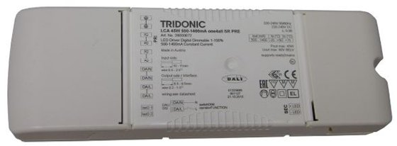

<p class="hero-image-caption">DALI LED driver Tridonic — nhận lệnh dim số qua bus 2 dây thay vì điều chỉnh điện áp.</p>

## Mục tiêu

- Hiểu DALI là gì và tại sao nó được dùng trong hệ thống chiếu sáng thông minh cao cấp
- Phân biệt DALI-1 và DALI-2, biết khi nào cần quan tâm đến sự khác biệt này
- Nắm các thông số kỹ thuật cơ bản của bus DALI: điện áp, dòng điện, số thiết bị, chiều dài tối đa
- Phân biệt Device Type: DT6 (LED thường), DT8 (Tunable White / màu sắc)
- Biết 3 con đường tích hợp DALI tại Thạch Anh IT: KNX, MobiEyes, LifeSmart
- So sánh được DALI với 0-10V và cắt pha để tư vấn đúng giải pháp cho từng dự án

---

## DALI là gì?

DALI — Digital Addressable Lighting Interface — là giao thức điều khiển chiếu sáng kỹ thuật số được chuẩn hóa theo **IEC 62386**. Nó cho phép điều khiển từng bóng đèn (hoặc driver) độc lập qua một bus 2 dây duy nhất.

Điểm khác biệt lớn nhất so với dimmer thông thường: thay vì điều chỉnh điện áp hay dạng sóng để thay đổi độ sáng, DALI gửi lệnh số — giống như giao tiếp qua mạng — đến từng driver. Mỗi driver có địa chỉ riêng (0 đến 63), có thể nhận lệnh độc lập hoặc theo nhóm, và có thể phản hồi trạng thái ngược lại về controller.

Tổ chức quản lý chuẩn DALI là **DALI Alliance (DiiA — Digital Illumination Interface Alliance)**. Sản phẩm đạt chứng nhận DALI-2 của DiiA đảm bảo tương thích chéo giữa các nhà sản xuất — đây là điểm quan trọng khi mix driver Tridonic với gateway Siemens hay controller MobiEyes.

---

## Tại sao dùng DALI thay vì dim thường?

Câu hỏi này thực tế khách hàng hay hỏi khi nghe báo giá. Đây là cách giải thích ngắn gọn cho kỹ thuật viên:

**Cắt pha (phase-cut / triac)** là cách đơn giản nhất: dimmer cắt bớt chu kỳ AC trước khi vào đèn. Rẻ, dễ lắp, nhưng không có địa chỉ — toàn bộ đèn trên một mạch đều sáng/tối như nhau. Flicker cao. Không tích hợp được với hệ thống thông minh một cách linh hoạt.

**0-10V** tốt hơn: dùng điện áp analog 0-10V để điều chỉnh độ sáng driver. Vẫn là 1 chiều (controller → driver), không có phản hồi. Không có địa chỉ — mọi driver cùng trên một đường 0-10V sẽ đều nhận cùng mức dim. Mỗi vùng chiếu sáng cần thêm cặp dây điều khiển riêng.

**DALI** giải quyết cả hai vấn đề trên:
- **Địa chỉ hóa (addressable):** 64 driver độc lập trên 1 bus 2 dây
- **2 chiều (bi-directional):** driver báo ngược trạng thái (đèn hỏng, mức dim hiện tại, tuổi thọ)
- **Chẩn đoán (diagnostics):** hệ thống biết khi nào đèn hỏng, driver lỗi
- **Group & Scene:** lập trình nhóm đèn và kịch bản ánh sáng linh hoạt, không cần đi dây lại

Ở biệt thự, DALI cho phép phòng khách có 3-4 vùng chiếu sáng độc lập (đèn trần, đèn hắt, đèn tranh, đèn bàn), tất cả trên 1 bus duy nhất, điều khiển riêng từng vùng hoặc gọi scene "Xem phim" để tất cả về đúng mức đã cài đặt.

---

## DALI-2 vs DALI-1: Sự khác biệt quan trọng

| Tính năng | DALI phiên bản 1 | DALI-2 |
|-----------|-----------------|--------|
| Control gear (driver, ballast) | Có | Có |
| Control devices (cảm biến, nút bấm) | Không có | Có (IEC 62386-103 + Parts 3xx) |
| Nguồn bus DALI | Không có yêu cầu kiểm thử | Chuẩn hóa và kiểm thử |
| Xác minh tương thích | Tự công bố (nhà sản xuất) | Kiểm thử độc lập bởi DiiA |
| Kiến trúc multi-master | Không định nghĩa | Có |
| Phạm vi fade time | Giới hạn | 100ms đến 16 phút |
| Không phân cực | Khuyến nghị | Bắt buộc |
| DT8 màu sắc (Tunable White) | Có nhưng ít thiết bị | Phổ biến, nhiều driver DALI-2 DT8 |
| Tương thích ngược | — | Driver DALI-2 chạy được trên bus DALI-1 |

Thực tế tại công ty: hầu hết driver hiện đại (Tridonic LCA, OSRAM OTi, Mean Well ELG-DA) đều là DALI-2 rồi. Khi mua driver, tìm ký hiệu **DALI-2** hoặc **IEC 62386-207 (DT6)** / **IEC 62386-209 (DT8)** trên datasheet là đủ. Còn driver cũ DALI-1 vẫn dùng được trên bus DALI-2, chỉ không dùng được tính năng mới.

---

## Thông số kỹ thuật bus DALI

Đây là các thông số cần thuộc lòng khi thiết kế và thi công:

| Thông số | Giá trị |
|----------|---------|
| Số dây | 2 dây, không phân cực (DA / DA) |
| Điện áp bus (idle) | ~16V DC |
| Dải điện áp hợp lệ | 9.5 – 22.5V DC |
| Dòng điện bus tối đa | 250mA mỗi line |
| Số thiết bị tối đa | 64 control gear (driver) + đến 64 control device (DALI-2) |
| Số Group tối đa | 16 (Group 0 – 15) |
| Số Scene tối đa | 16 (Scene 0 – 15) |
| Chiều dài bus tối đa | 300m (cáp 1.5mm²) |
| Số nguồn bus mỗi line | Chỉ 1 (không được đấu 2 PSU trên cùng 1 line) |
| Topology | Bus, Star, Tree — KHÔNG Ring |
| Termination | Không cần điện trở termination (khác với RS-485, DMX) |

Dòng điện mỗi driver rút từ bus khoảng **2mA**. Với 64 driver: 64 × 2mA = 128mA — vẫn trong giới hạn 250mA. Nhưng nếu có thêm cảm biến và nút bấm DALI-2 trên bus, phải tính thêm.

---

## DALI Device Types: DT6 và DT8

DALI phân loại driver theo **Device Type (DT)** — mỗi DT quy định driver điều khiển loại tải gì và hỗ trợ tính năng gì.

| DT | IEC Part | Mô tả |
|----|----------|-------|
| DT0 | 201 | Đèn huỳnh quang (T5, T8) — ít dùng mới |
| DT1 | 202 | Chiếu sáng khẩn cấp self-contained |
| DT5 | 206 | Giao tiếp 0-10V (converter) |
| **DT6** | **207** | **Driver LED — dimming trắng thông thường** |
| DT7 | 208 | Relay (switching) |
| **DT8** | **209** | **Driver LED màu: Tunable White, RGB, RGBW** |
| DT51 | 252 | Báo cáo năng lượng |
| DT52 | 253 | Diagnostics & bảo trì |

**DT6** là loại phổ biến nhất: downlight, spotlight, đèn panel — bất kỳ đèn LED trắng nào chỉ cần dim sáng/tối. Một địa chỉ DALI = một driver DT6.

**DT8** dùng cho Tunable White (điều chỉnh nhiệt độ màu từ 2700K ấm đến 5000-6500K lạnh) và RGBW. Quan trọng: DT8 dùng **1 địa chỉ DALI** cho toàn bộ driver kể cả driver dual-channel (WW + CW). So sánh:

| Loại đèn | DT6 cần bao nhiêu địa chỉ? | DT8 cần bao nhiêu địa chỉ? |
|----------|--------------------------|--------------------------|
| Trắng thuần (dimming only) | 1 | 1 |
| Tunable White (WW + CW) | 2 | 1 |
| RGBW | 4 | 1 |

Một bus 64 địa chỉ với DT8 có thể điều khiển 64 đèn Tunable White. Nếu dùng DT6 cho cùng ứng dụng đó, chỉ được 32 đèn.

Tại biệt thự cao cấp, đèn hắt trần (đèn strip ánh sáng gián tiếp), đèn đọc sách đầu giường, đèn ambient thường là Tunable White — cần driver DT8. Đèn downlight chính, đèn spotlight trưng bày thường là DT6.

---

## Kiến trúc tổng quát hệ thống DALI

```
┌─────────────────┐
│  HỆ ĐIỀU KHIỂN  │
│  (KNX / MobiEyes│
│   / LifeSmart)  │
└────────┬────────┘
         │ (KNX TP / LAN / Wi-Fi)
         ▼
┌─────────────────┐
│  DALI GATEWAY   │
│  (KNX-DALI GW / │
│  MobiEyes Dimmer│
│  / LS DALI GW)  │
│  [DALI Master]  │
└────────┬────────┘
         │ DALI Bus (2 dây DA/DA, 16V DC)
         │ ─────────────────────────────────────
         ├──────────┬──────────┬──────────┬──────
         ▼          ▼          ▼          ▼
    [Driver 0] [Driver 1] [Driver 2] [Driver 3]
     Addr: 0    Addr: 1    Addr: 2    Addr: 3
         │          │          │          │
        [LED]      [LED]      [LED]      [LED]
      Đèn trần  Đèn hắt   Downlight  Đèn tranh
```

Gateway đóng vai trò **DALI Application Controller (Master)**: nhận lệnh từ hệ thống điều khiển chính (KNX, MobiEyes, LifeSmart) và chuyển thành lệnh DALI gửi đến từng driver hoặc nhóm driver. Driver lưu cấu hình (địa chỉ, group, scene, min/max level) trong bộ nhớ non-volatile — mất điện không mất cấu hình.

---

## 3 hệ thống tích hợp DALI tại Thạch Anh IT

| Hệ thống | Thiết bị Gateway | Commissioning Tool | Ghi chú |
|----------|-----------------|-------------------|---------|
| **KNX** | ABB DG/S hoặc Siemens 5WG1141-1AB31 | ETS 5/6 (KNX) + Tridonic masterCONFIGURATOR (DALI) | Tài liệu Siemens 5WG1141 có trong Google Drive |
| **MobiEyes** | MobiEyes Dimmer Module DALI (MobiEyes_Dimmer_Dali.pdf) hoặc MobiLife Dimmer DALI (MobiLife_Dimmer_Dali.pdf) | MobiEyes app / phần mềm cấu hình MobiEyes | Cũng có module 0-10V riêng |
| **LifeSmart** | LifeSmart DALI Gateway | LifeSmart app + cấu hình Gateway | Xem thêm LS174 Dimmer Switch, LS180 Dimmer Controller |

Khi bắt đầu dự án, xác định ngay hệ thống điều khiển chính là gì → chọn gateway phù hợp → thiết kế DALI bus theo gateway đó. Đừng để thi công xong mới hỏi dùng gateway nào.

---

## So sánh DALI vs 0-10V vs Cắt pha

| Tiêu chí | DALI | 0-10V | Cắt pha |
|----------|------|-------|---------|
| Loại tín hiệu | Số (digital) 2 chiều | Analog DC 1 chiều | Biến dạng AC |
| Địa chỉ hóa | 64 thiết bị/line | Không | Không |
| Phản hồi trạng thái | Có (2 chiều) | Không | Không |
| Phạm vi dim | 0.1% – 100% | ~10% – 100% | ~5% – 100% |
| Group & Scene | Lập trình được (16G, 16S) | Theo mạch vật lý | Theo mạch vật lý |
| Cảnh báo đèn hỏng | Có | Không | Không |
| Giám sát năng lượng | Có (DALI-2 Part 252) | Không | Không |
| Dây bổ sung | 2 dây bus DALI | 2 dây tín hiệu + dây nguồn | Không cần thêm dây |
| Nguy cơ flicker | Rất thấp | Thấp | Trung bình – cao |
| Tích hợp BMS/SmartHome | Trực tiếp qua gateway | Cần actuator analog | Khó |
| Chi phí đầu tư | Cao hơn | Trung bình | Thấp nhất |
| Thay driver khi hỏng | Cần re-commission | Cắm vào là chạy | Cắm vào là chạy |

Tóm tắt thực tế: DALI dùng khi cần kiểm soát từng đèn riêng, tích hợp vào hệ thống thông minh, và muốn scene ánh sáng linh hoạt. 0-10V dùng khi ngân sách hạn chế nhưng vẫn cần dim mượt. Cắt pha chỉ dùng trong phòng đơn giản, không tích hợp smarthome.

---

## Ứng dụng thực tế: Khi nào dùng DALI?

**Biệt thự cao cấp** là ứng dụng phù hợp nhất với DALI. Lý do:
- Nhiều vùng chiếu sáng trong mỗi phòng (trần, hắt, tranh, đọc sách, trang trí)
- Khách hàng muốn scene ánh sáng theo từng hoạt động (tiếp khách, thư giãn, xem phim, lãng mạn)
- Tích hợp với KNX hoặc MobiEyes để điều khiển từ touch panel, voice, app
- Đèn Tunable White ở phòng ngủ, phòng làm việc — cần DT8

Tại Villa Nha Trang (dự án tham chiếu): mỗi phòng có từ 2 đến 4 DALI group. Phòng khách có Group 0 (đèn trần), Group 1 (đèn hắt trần). Phòng Master có Group 3 (đèn chính), Group 4 (đèn đầu giường). Tổng cộng toàn villa dùng 1 DALI line với khoảng 30+ driver.

**Văn phòng và không gian làm việc**: DALI kết hợp cảm biến hiện diện (DALI-2 Part 303) và cảm biến ánh sáng (Part 304) tự động điều chỉnh độ sáng theo ánh sáng tự nhiên — tiết kiệm điện và đạt chuẩn LEED/BREEAM.

**Nhà hàng, khách sạn**: Scene ánh sáng thay đổi theo giờ (bữa sáng sáng trưng, tối lãng mạn, dọn dẹp 100%) — DALI làm được mà không cần đi thêm dây.

---

## Lưu ý quan trọng trước khi bắt đầu module

Toàn bộ module B4 này được viết theo thứ tự công việc thực tế:

1. **B4.00** (file này): Hiểu tổng quan
2. **B4.01**: Thi công bus DALI — cáp, topology, đấu nối
3. **B4.02**: Commissioning — gán địa chỉ, cấu hình driver
4. **B4.03**: Đặt tên DALI — quy ước naming chuẩn công ty
5. **B4.04**: Lập trình Group và Scene
6. **B4.05**: Xử lý sự cố

Đọc theo thứ tự này khi bắt đầu với dự án DALI đầu tiên. Kỹ thuật viên có kinh nghiệm có thể tra cứu từng phần khi cần.
