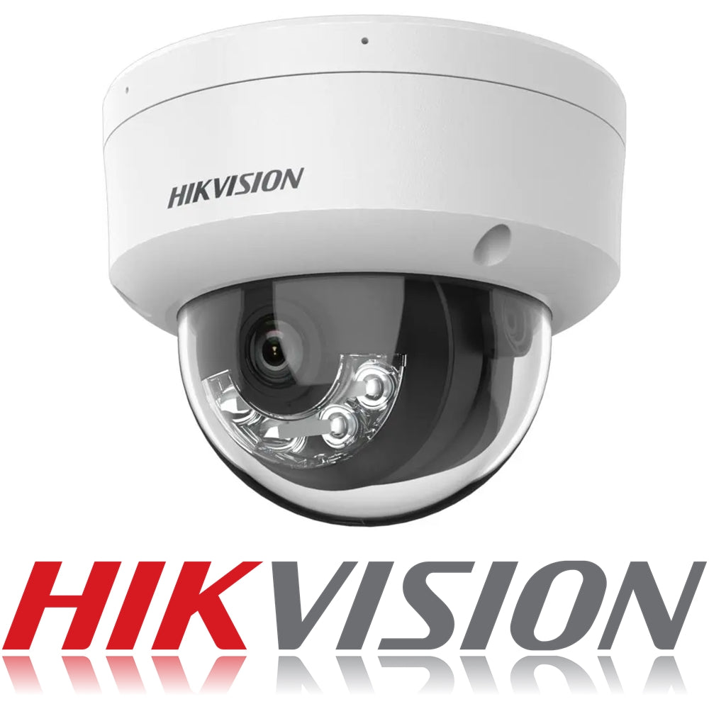
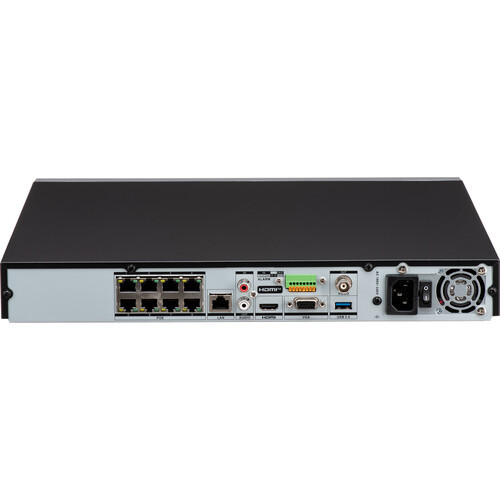

## Mục tiêu
- Biết chọn đúng model camera theo vị trí (trong nhà, ngoài trời, ngược sáng).
- Biết chọn NVR phù hợp theo số kênh và nhu cầu ghi hình.
- Chọn đúng loại HDD chuyên dụng cho ghi hình liên tục 24/7.

---

## 1. Camera phổ biến

### 1.1. Dòng Value (DS-2CD10xx) — Phổ thông

Dòng camera giá tốt, phù hợp cho các vị trí không yêu cầu cao về xử lý ngược sáng. Dùng nhiều trong căn hộ chung cư và nhà phố.

| Model | Loại | Độ phân giải | PoE | WDR | Gợi ý vị trí |
|---|---|---:|:--:|:--:|---|
| DS-2CD1043G2-LIU | Thân (Bullet) | 4MP | ✅ | — | Ngoài trời: bãi xe, hành lang ngoài |
| DS-2CD1143G2-LIU | Dome | 4MP | ✅ | — | Trong nhà: sảnh, hành lang, phòng chung |

Chi tiết kỹ thuật dòng Value

- **Cảm biến**: 1/3" Progressive Scan CMOS
- **Độ phân giải tối đa**: 2688 x 1520 (4MP)
- **Hồng ngoại**: EXIR lên đến 30m (Dome) / 40m (Bullet)
- **Nén video**: H.265+ / H.265 / H.264+ / H.264
- **Nguồn**: PoE (IEEE 802.3af) hoặc DC 12V
- **Bảo vệ**: IP67 (chống nước, chống bụi)
- **Lưu trữ cục bộ**: Khe microSD tích hợp (tối đa 256GB)

Dòng này phù hợp khi ngân sách có hạn và vị trí lắp đặt không bị ngược sáng nặng. Hình ảnh ban đêm với hồng ngoại EXIR rõ nét, không bị hiệu ứng "bóng ma" như IR đời cũ.

Camera Dome DS-2CD1143G2-LIU — gọn gàng, phù hợp lắp trong nhà.

### 1.2. Dòng AcuSense (DS-2CD2x43G2) — Trung cao cấp

Dòng camera tích hợp AI phân loại người/xe — giảm báo động giả từ lá cây, chó mèo, ánh sáng. Có WDR 120dB, xử lý tốt cảnh ngược sáng.

| Model | Loại | Độ phân giải | PoE | WDR | Gợi ý vị trí |
|---|---|---:|:--:|:--:|---|
| DS-2CD2043G2-IU | Thân (Bullet) | 4MP | ✅ | 120dB | Ngoài trời: cổng chính, lối vào (ngược sáng) |
| DS-2CD2143G2-IU | Dome | 4MP | ✅ | 120dB | Trong nhà cao cấp: sảnh chính, phòng họp |

Chi tiết kỹ thuật dòng AcuSense

- **Cảm biến**: 1/3" Progressive Scan CMOS
- **Độ phân giải tối đa**: 2688 x 1520 (4MP)
- **WDR**: 120dB — quan trọng cho vị trí có cửa kính, cổng ra vào hướng nắng
- **AcuSense**: Phân loại người và xe bằng deep learning, chỉ gửi cảnh báo khi phát hiện đúng đối tượng
- **Hồng ngoại**: EXIR 2.0 lên đến 30m (Dome) / 40m (Bullet)
- **Nén video**: H.265+ / H.265 / H.264+ / H.264
- **Micro tích hợp**: Có (model IU) — thu âm trực tiếp
- **Bảo vệ**: IP67, IK10 (Dome)

Đây là dòng được khuyến nghị sử dụng tại công ty cho hầu hết các dự án, nhờ WDR mạnh và AI giảm báo động giả. Khi camera phát hiện người lạ vào khu vực, nó gửi cảnh báo chính xác hơn hẳn so với motion detection thông thường — giúp khách hàng không bị làm phiền bởi thông báo liên tục từ lá cây bay hoặc mèo đi ngang.

---

Đầu ghi NVR Hikvision dòng K2 — mặt trước với cổng USB và đèn trạng thái.

## 2. NVR phổ biến

NVR (Network Video Recorder) là đầu ghi hình mạng, nhận tín hiệu từ camera IP qua mạng LAN và lưu trữ vào HDD. Công ty sử dụng dòng NVR không tích hợp PoE (dòng K1/K2 thuần), kết hợp với Switch PoE riêng để linh hoạt hơn trong thi công.

| Model | Số kênh | Số khe SATA | HDD tối đa/khe | Băng thông vào | Gợi ý |
|---|---:|---:|---|---|---|
| DS-7604NI-K1 | 4 | 1 | 6TB | 40 Mbps | Căn hộ nhỏ, 2-4 camera |
| DS-7608NI-K2 | 8 | 2 | 10TB | 80 Mbps | Nhà phố, biệt thự nhỏ |
| DS-7616NI-K2 | 16 | 2 | 10TB | 160 Mbps | Biệt thự lớn, cửa hàng |
| DS-7632NI-K2 | 32 | 2 | 10TB | 256 Mbps | Tòa nhà, dự án lớn |

Thực tế tại công ty: đầu ghi 4/8/16 kênh thường chỉ lắp 1 HDD. Chỉ đầu 32 kênh mới sử dụng cả 2 khe HDD vì số camera nhiều, cần dung lượng lưu trữ lớn.

Lưu ý khi chọn NVR

### Chọn theo số camera

Quy tắc đơn giản: chọn NVR có số kênh bằng hoặc lớn hơn số camera dự kiến + 1-2 kênh dự phòng. Ví dụ, nhà có 6 camera thì chọn NVR 8 kênh, đừng ép vào NVR 4 kênh.

### Tại sao dùng Switch PoE riêng thay vì NVR có PoE tích hợp?

Công ty không sử dụng dòng NVR có PoE tích hợp (model có chữ "P" như DS-7604NI-K1/4P). Lý do:

- **Linh hoạt**: Switch PoE đặt gần cụm camera, giảm chiều dài cáp. NVR thường đặt trong tủ rack ở phòng kỹ thuật — nếu dùng NVR PoE, mọi đường cáp camera đều phải kéo về đến NVR.
- **Dễ mở rộng**: Thêm camera chỉ cần thêm port Switch, không phụ thuộc vào số port PoE trên NVR.
- **Dễ thay thế**: Switch PoE hỏng thì thay Switch, NVR hỏng thì thay NVR — không ảnh hưởng lẫn nhau.
- **Chi phí**: Dòng NVR không PoE (K1/K2) rẻ hơn dòng có PoE. Switch PoE riêng có nhiều lựa chọn thương hiệu và công suất.

### Băng thông (Bandwidth)

Mỗi camera 4MP ghi Main Stream ~4-6 Mbps. NVR 4 kênh có băng thông vào 40 Mbps → ghi đủ 4 camera 4MP mà không bị nghẽn. Khi chọn NVR, luôn tính tổng bitrate camera phải nhỏ hơn băng thông vào của NVR.

---

## 3. HDD khuyến nghị

Camera ghi hình 24/7 là tải khắc nghiệt nhất đối với ổ cứng — HDD PC thông thường không được thiết kế cho việc đọc/ghi liên tục hàng tháng trời. Dùng HDD sai loại sẽ bị bad sector sau vài tháng, mất dữ liệu ghi hình.

| Dòng HDD | Hãng | Đặc điểm | Ghi chú |
|---|---|---|---|
| **WD Purple** | Western Digital | Tối ưu cho ghi hình 24/7, hỗ trợ lên 64 camera | Khuyến nghị chính |
| **Seagate SkyHawk** | Seagate | Thiết kế cho workload 180TB/năm, health management | Lựa chọn thay thế |

### Quy tắc chọn dung lượng

- **NVR 4 kênh**: 1 HDD 2TB (lưu ~15-20 ngày với 4 camera 4MP, H.265+)
- **NVR 8 kênh**: 1 HDD 4TB (lưu ~15-20 ngày với 8 camera 4MP)
- **NVR 16 kênh**: 1 HDD 4-6TB (lưu ~10-15 ngày với 16 camera 4MP)
- **NVR 32 kênh**: 2 HDD (ví dụ 2 x 4TB hoặc 2 x 6TB — tùy yêu cầu lưu trữ)

Con số trên là ước tính với Main Stream 4Mbps, ghi liên tục 24/7. Nếu khách yêu cầu lưu 30 ngày trở lên, cần tăng dung lượng tương ứng. Xem chi tiết cách tính tại bài B5.05.

---

## Tài liệu tham khảo
- [Hikvision Product Selector](https://www.hikvision.com/en/products/)
- [Hikvision Network & Storage Calculator](https://tools.hikvision.com/calculatorTool/)
