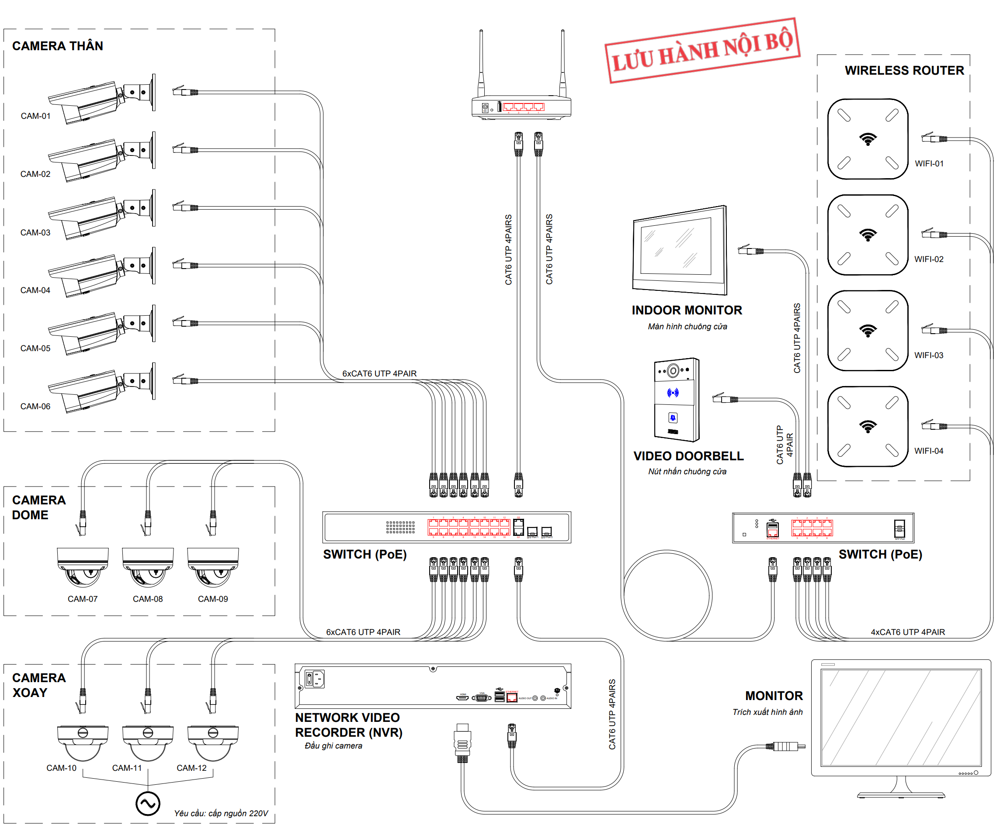
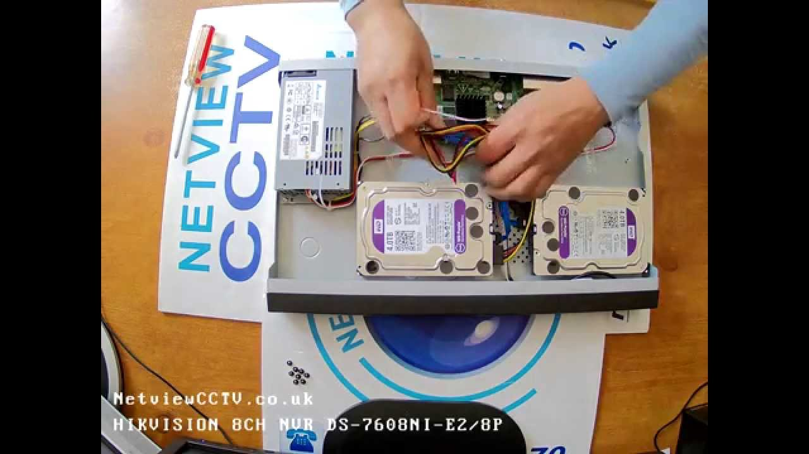

## Mục tiêu
- Lắp đặt NVR tại vị trí tối ưu về nhiệt độ, thông gió và kết nối mạng.
- Thực hiện đúng quy trình lắp HDD, format ổ cứng để đảm bảo ghi hình không lỗi.
- Cấu hình cơ bản ban đầu: mật khẩu, IP tĩnh, thêm camera.

---

## 1. Vị trí đặt NVR

NVR chạy liên tục 24/7 và tỏa nhiệt đáng kể, đặc biệt khi có 2 HDD và nhiều camera ghi hình đồng thời. Chọn sai vị trí sẽ dẫn đến NVR quá nhiệt, HDD hỏng sớm, hoặc mất ghi hình.

### Nguyên tắc đặt NVR

| Nên | Không nên |
|---|---|
| Trong tủ mạng (rack) có quạt thông gió | Trong tủ kín không lỗ thoáng |
| Gần Switch trung tâm / Router | Xa hạ tầng mạng (phải kéo dây dài) |
| Kệ riêng, cố định, không rung | Đặt trên nền không bằng phẳng |
| Nhiệt độ phòng dưới 35°C | Gần nguồn nhiệt: bình nóng lạnh, ánh nắng trực tiếp |

Nhiệt độ vận hành của NVR Hikvision: -10°C đến +55°C. Tuy nhiên trên thực tế, nếu nhiệt độ môi trường vượt 40°C liên tục, HDD sẽ giảm tuổi thọ đáng kể. Tại Việt Nam, đặc biệt vào mùa hè, tủ kỹ thuật kín trên sân thượng có thể lên đến 50-60°C — rất nguy hiểm cho NVR.

---


<p class="hero-image-caption">Sơ đồ kết nối hệ thống camera IP qua Switch PoE đến NVR.</p>

## 2. Sơ đồ kết nối

Công ty sử dụng NVR không tích hợp PoE, kết hợp với Switch PoE riêng. Đây là sơ đồ chuẩn cho mọi dự án:

```
[Camera] ──Cat6──→ [Switch PoE] ──Cat6──→ [NVR LAN port] ──→ [HDD ghi hình]
                                              ↓
                                        [Router/Internet]
                                              ↓
                                   [Hik-Connect → App điện thoại]

[Màn hình HDMI/VGA] ←── [NVR]
```

Switch PoE vừa cấp nguồn cho camera qua cáp Cat6, vừa trung chuyển dữ liệu về NVR. NVR chỉ việc nhận dữ liệu và ghi hình — không liên quan đến việc cấp nguồn camera.

Khi dự án có nhiều cụm camera phân bố xa nhau, có thể dùng nhiều Switch PoE đặt gần từng cụm, rồi kéo 1 đường uplink về Switch/NVR trung tâm.

---


<p class="hero-image-caption">Lắp ổ cứng vào NVR Hikvision — cắm cáp SATA tín hiệu và nguồn.</p>

## 3. Quy trình lắp HDD

Tất cả NVR mới đều chưa có HDD — phải mua và lắp riêng. Quy trình:

1. **Tắt nguồn NVR hoàn toàn** — rút phích cắm, không chỉ nhấn nút power.
2. **Mở nắp vỏ**: Tháo các ốc vít ở mặt sau và bên hông. Trượt nắp ra phía sau.
3. **Gắn HDD vào khay**: Đặt HDD lên khay bên trong, siết 4 ốc cố định từ mặt dưới. HDD phải nằm chắc, không rung lắc.
4. **Cắm cáp**: 
   - Cáp SATA tín hiệu (nhỏ, dẹt) từ bo mạch chủ vào HDD.
   - Cáp SATA nguồn (rộng hơn) từ bo mạch vào HDD.
   - Cả 2 đầu cắm chỉ vào được 1 chiều — không cần lo cắm ngược, nhưng nhẹ tay tránh gãy chân.
5. **Đóng nắp, khởi động NVR.**
6. **Format HDD (bắt buộc)**: Vào Menu → Storage Management → HDD Management → chọn HDD → nhấn "Init" (Initialize/Format). NVR sẽ không ghi hình nếu HDD chưa format.

### Lưu ý quan trọng

- DS-7604NI-K1 (4 kênh): 1 khe SATA → tối đa 1 HDD (đến 6TB).
- DS-7608NI-K2 / DS-7616NI-K2 (8/16 kênh): 2 khe SATA, nhưng thực tế công ty thường chỉ lắp 1 HDD là đủ.
- DS-7632NI-K2 (32 kênh): 2 khe SATA → lắp cả 2 HDD (mỗi khe tối đa 10TB).
- Sau khi format xong, trạng thái HDD phải hiện "Normal". Nếu hiện "Uninitialized" hoặc "Error" → HDD lỗi hoặc cáp SATA chưa cắm chặt.

---

## 4. Cấu hình cơ bản sau khi khởi động

### 4.1. Kích hoạt và đổi mật khẩu

NVR mới lần đầu bật sẽ yêu cầu tạo mật khẩu Admin. Đây là bước bắt buộc — NVR sẽ không cho vào giao diện nếu chưa kích hoạt.

Quy tắc mật khẩu:
- Tối thiểu 8 ký tự, khuyến nghị 12 ký tự trở lên.
- Kết hợp chữ hoa, chữ thường, số và ký tự đặc biệt.
- **Ghi nhận mật khẩu** vào biên bản bàn giao hoặc hệ thống quản lý mật khẩu nội bộ. Mất mật khẩu NVR = phải reset toàn bộ, mất cấu hình.
- Không dùng chung mật khẩu giữa các công trình.

### 4.2. Cấu hình mạng

Vào Configuration → Network → TCP/IP:
- **IP Address**: Gán IP tĩnh. Công ty dùng `192.168.1.30` cho NVR.
- **Subnet Mask**: `255.255.255.0`.
- **Default Gateway**: IP của Router/Gateway. Ví dụ: `192.168.1.1`.
- **DNS Server**: `8.8.8.8` (Google DNS) — cần cho Hik-Connect hoạt động.

Tại sao phải dùng IP tĩnh: Nếu NVR dùng DHCP, khi router khởi động lại có thể gán IP khác → camera mất kết nối với NVR.

### 4.3. Thêm Camera

Vào Camera Management:
- **Tự động quét**: NVR quét mạng LAN, liệt kê camera tìm thấy. Chọn camera → nhấn Add → nhập mật khẩu camera.
- **Thủ công**: Nhập IP camera (lấy từ SADP Tool) → nhập username/password camera → Add.

Nếu camera và NVR nằm cùng subnet, quét tự động luôn tìm thấy. Nếu khác subnet (qua VLAN), cần cấu hình thêm route hoặc thêm thủ công bằng IP.

---

## 5. Checklist sau lắp đặt NVR

- [ ] HDD đã format, trạng thái "Normal"
- [ ] IP tĩnh đã gán, ping được từ laptop cùng LAN
- [ ] Mật khẩu Admin đã ghi nhận vào hệ thống quản lý
- [ ] Tất cả camera hiện Live View trên NVR
- [ ] Ghi hình đang chạy (kiểm tra biểu tượng ghi hình ở góc kênh)
- [ ] NVR đặt nơi thông thoáng, không bị che kín
- [ ] Cáp mạng từ NVR đến Router đã kết nối (cho truy cập từ xa)
