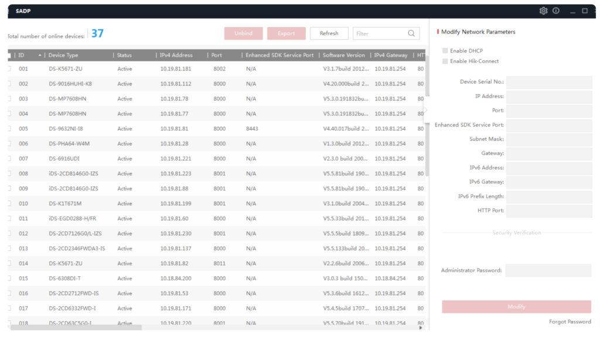

## Mục tiêu
- Dùng SADP Tool để quét, kích hoạt và gán IP cho camera/NVR trong mạng LAN.
- Biết cách reset mật khẩu khi mất quyền truy cập thiết bị.
- Hiểu nguyên lý hoạt động của SADP để debug khi tool không quét thấy thiết bị.

---

## 1. SADP Tool là gì?

SADP (Search Active Devices Protocol) là phần mềm miễn phí của Hikvision, chạy trên Windows và macOS. Đây là công cụ không thể thiếu khi thi công camera Hikvision — kỹ thuật viên nào cũng cần cài sẵn trên laptop.

### Công dụng chính
- **Quét thiết bị**: Tìm tất cả camera, NVR, DVR Hikvision đang online trong mạng LAN.
- **Kích hoạt thiết bị mới**: Camera/NVR xuất xưởng ở trạng thái "Inactive" — phải kích hoạt và đặt mật khẩu trước khi sử dụng.
- **Gán IP tĩnh**: Đổi IP hàng loạt theo quy hoạch mạng.
- **Reset mật khẩu**: Khi mất mật khẩu, dùng SADP tạo file reset gửi Hikvision hoặc nhà phân phối.

### Nguyên lý hoạt động

SADP lắng nghe bản tin broadcast ở tầng Layer 2 (ARP). Nghĩa là laptop chạy SADP Tool **bắt buộc phải cùng mạng vật lý** (cùng Switch, cùng VLAN) với thiết bị cần cấu hình. Nếu laptop ở VLAN khác, hoặc kết nối qua VPN — SADP sẽ không tìm thấy bất kỳ thiết bị nào.

---

Giao diện SADP Tool — liệt kê thiết bị Hikvision trong mạng LAN.

## 2. Cài đặt

1. Tải SADP Tool từ trang chủ Hikvision: [hikvision.com → Support → Tools](https://www.hikvision.com/en/support/tools/).
2. Cài đặt: Chạy file setup với quyền Administrator (chuột phải → Run as Administrator).
3. Khởi động SADP → phần mềm tự động quét mạng và liệt kê thiết bị tìm thấy.

---

## 3. Kích hoạt thiết bị mới

Camera và NVR Hikvision xuất xưởng đều ở trạng thái **Inactive**. Không kích hoạt thì không thể gán IP, không thể xem hình, không thể ghi hình.

### Kích hoạt từng thiết bị

1. Mở SADP → chọn thiết bị có trạng thái "Inactive" trong danh sách.
2. Ở panel bên phải, nhập mật khẩu mới cho thiết bị (tối thiểu 8 ký tự, kết hợp chữ + số + ký tự đặc biệt).
3. Tùy chọn: Bật Hik-Connect ngay khi kích hoạt → nhập verification code.
4. Nhấn **Activate** → trạng thái chuyển sang "Active".

### Kích hoạt hàng loạt

Khi có nhiều camera cùng lúc (dự án lớn):
1. Tick chọn tất cả thiết bị Inactive.
2. Nhập mật khẩu chung.
3. Nhấn **Activate** → tất cả thiết bị được kích hoạt cùng một mật khẩu.

Lưu ý: Mật khẩu kích hoạt hàng loạt sẽ là mật khẩu Admin của tất cả camera và NVR trong lô. Ghi nhận lại ngay.

---

## 4. Gán IP tĩnh

Sau khi kích hoạt, camera/NVR mặc định nhận IP từ DHCP hoặc dùng IP mặc định `192.168.1.64`. Cần gán IP tĩnh theo quy hoạch mạng của công trình.

### Gán IP từng thiết bị

1. Chọn thiết bị đã Active trong danh sách SADP.
2. Ở panel bên phải → tick "Enable DHCP" để bỏ (nếu đang bật).
3. Nhập IP Address, Subnet Mask, Gateway theo quy hoạch.
4. Nhập mật khẩu Admin của thiết bị.
5. Nhấn **Modify** (hoặc **Save**).

### Gán IP hàng loạt theo dải

1. Tick chọn nhiều thiết bị.
2. Nhấn nút "Batch IP" hoặc "Modify Network Parameters".
3. Nhập IP bắt đầu, Subnet Mask, Gateway.
4. SADP sẽ tự gán IP tăng dần cho từng thiết bị.

### Ví dụ quy hoạch IP (theo chuẩn công ty)

| Thiết bị | IP | Ghi chú |
|---|---|---|
| NVR | 192.168.1.30 | Đầu ghi — cố định .30 |
| CAM-PK-01 | 192.168.1.31 | Phòng khách |
| CAM-HL-02 | 192.168.1.32 | Hành lang tầng 1 |
| CAM-BX-03 | 192.168.1.33 | Bãi xe |
| CAM-Cong-04 | 192.168.1.34 | Cổng chính |

Quy ước công ty: NVR luôn đặt IP `192.168.1.30`, camera bắt đầu từ `.31` trở đi và tăng dần.

---

## 5. Reset mật khẩu

Khi mất mật khẩu thiết bị (quên hoặc không ai ghi lại từ kỹ thuật viên trước):

### Cách 1: Reset qua SADP + file XML (phổ biến nhất)

1. Mở SADP → chọn thiết bị cần reset.
2. Nhấn "Forgot Password" → SADP tạo file XML chứa thông tin thiết bị.
3. Gửi file XML cho Hikvision hoặc nhà phân phối chính hãng.
4. Nhận lại file XML phản hồi (có thời hạn 24-48 giờ).
5. Import file phản hồi vào SADP → nhập mật khẩu mới.

### Cách 2: Reset bằng Security Code (một số model mới)

Một số model camera/NVR đời mới cho phép gửi mã xác thực qua email đã đăng ký khi kích hoạt. Nhập mã → đặt mật khẩu mới.

Bài học rút ra: luôn ghi nhận mật khẩu ngay sau khi kích hoạt, lưu vào biên bản bàn giao hoặc hệ thống quản lý mật khẩu nội bộ. Reset mất thời gian và phụ thuộc bên thứ ba.

---

## 6. Khi SADP không quét thấy thiết bị

Đây là tình huống hay gặp khi đi công trình. Kiểm tra theo thứ tự:

1. **Laptop có cùng mạng vật lý không?** SADP dùng broadcast Layer 2 — phải cùng Switch, cùng VLAN. Nếu laptop cắm WiFi mà camera cắm cáp vào Switch khác → không tìm thấy.
2. **Tắt Firewall trên laptop**: Windows Firewall hoặc phần mềm diệt virus có thể chặn bản tin broadcast của SADP.
3. **Chọn đúng network adapter**: Nếu laptop có cả WiFi và LAN, vào SADP → chọn đúng adapter đang kết nối cùng mạng với camera.
4. **Camera/NVR có nguồn chưa?** Kiểm tra LED trên Switch PoE hoặc adapter nguồn.
5. **Thử khởi động lại SADP**: Đóng rồi mở lại, đợi 10-15 giây để quét xong.

Nếu đã kiểm tra hết mà vẫn không thấy: thử cắm laptop trực tiếp vào camera bằng 1 sợi cáp (không qua Switch) → nếu SADP thấy thì lỗi nằm ở Switch hoặc cáp.
