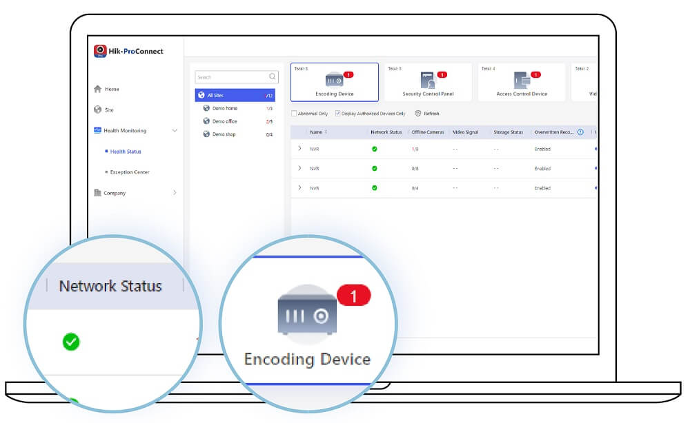
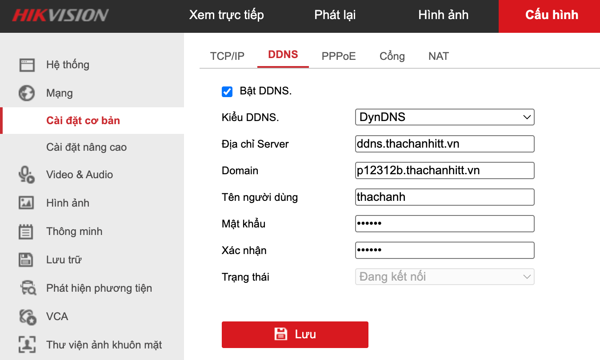

## Mục tiêu
- Phân biệt Hik-ProConnect (dành cho kỹ thuật viên) và Hik-Connect (dành cho khách hàng).
- Cấu hình truy cập từ xa qua IP tĩnh/domain (DDNS + port forwarding) — phương pháp chính tại công ty.
- Nắm quy trình bàn giao tài khoản đúng cách, tránh mất quyền quản trị.

---

## 1. Hai nền tảng, hai vai trò

Hikvision cung cấp 2 nền tảng riêng biệt cho 2 đối tượng khác nhau:

| | Hik-ProConnect | Hik-Connect |
|---|---|---|
| **Đối tượng** | Kỹ thuật viên / Installer | Khách hàng (end-user) |
| **Mục đích** | Cấu hình, quản lý, bảo trì thiết bị từ xa | Xem camera từ xa, nhận cảnh báo |
| **Nền tảng** | Web portal + App mobile | App mobile (iOS/Android) |
| **Tính năng nổi bật** | Kích hoạt hàng loạt, gán IP, cấu hình template, cập nhật firmware từ xa | Xem live, playback, chia sẻ thiết bị |
| **URL** | [hik-proconnect.com](https://www.hik-proconnect.com) | App Store / Google Play |

### Quy trình tại công ty

1. Kỹ thuật viên dùng **Hik-ProConnect** để kích hoạt, cấu hình camera/NVR tại công trình (hoặc từ xa sau khi thiết bị đã online).
2. Sau khi hoàn tất, bàn giao cho khách hàng xem camera qua **Hik-Connect**.
3. Truy cập từ xa chủ yếu qua **IP tĩnh hoặc domain (DDNS)**, không phụ thuộc vào P2P cloud.

---

## 2. Hik-ProConnect — Dành cho kỹ thuật viên

Hik-ProConnect — giao diện quản lý thiết bị từ xa dành cho kỹ thuật viên.

### 2.1. Đăng ký và đăng nhập

1. Vào [hik-proconnect.com](https://www.hik-proconnect.com) hoặc tải app Hik-ProConnect.
2. Đăng ký tài khoản bằng email công ty.
3. Đăng nhập → thêm thiết bị bằng serial number hoặc quét QR trên NVR/camera.

### 2.2. Tính năng chính

- **Quản lý thiết bị từ xa**: Xem trạng thái online/offline, thông tin firmware, cấu hình mạng của tất cả thiết bị trong các dự án.
- **Cấu hình hàng loạt**: Tạo template cấu hình (độ phân giải, bitrate, lịch ghi hình, motion detection) rồi áp dụng cho nhiều thiết bị cùng lúc.
- **Cập nhật firmware từ xa**: Kiểm tra và cập nhật firmware cho camera/NVR mà không cần đến công trình.
- **Health monitoring**: Nhận cảnh báo khi thiết bị offline, HDD lỗi, hoặc mất kết nối mạng.
- **Quản lý theo dự án (Site)**: Nhóm các thiết bị theo từng công trình, dễ tra cứu.

### 2.3. Khi nào dùng Hik-ProConnect?

- Khi cần kiểm tra tình trạng thiết bị tại công trình mà không đến hiện trường.
- Khi cần đổi cấu hình hàng loạt cho nhiều camera (ví dụ: chuyển từ H.264 sang H.265+ cho toàn bộ dự án).
- Khi cần cập nhật firmware cho NVR từ xa sau khi Hikvision phát hành bản vá bảo mật.

---

## 3. Truy cập từ xa qua IP/Domain

Công ty chủ yếu bàn giao cho khách xem camera từ xa qua IP tĩnh hoặc domain name, thay vì phụ thuộc hoàn toàn vào dịch vụ P2P cloud. Lý do:

- **Không phụ thuộc server bên thứ 3**: Nếu server Hik-Connect bảo trì, xem qua IP/domain vẫn hoạt động bình thường.
- **Tốc độ**: Truy cập trực tiếp thường nhanh hơn đi qua cloud, đặc biệt khi playback (xem lại).
- **Chủ động**: Khách hàng và công ty kiểm soát hoàn toàn đường truyền.

### 3.1. Port chuẩn của công ty

Công ty đổi port mặc định của Hikvision để giảm rủi ro bị bot quét tự động:

| Mục đích | Port mặc định Hikvision | Port công ty dùng | Ghi chú |
|---|---:|---:|---|
| HTTP (Web) | 80 | **81** | Truy cập giao diện NVR qua trình duyệt |
| RTSP (Video stream) | 554 | **8554** | Luồng video cho app, iVMS, tích hợp hệ thống |
| SDK/App (Server port) | 8000 | **8100** | Dùng cho iVMS-4200, Hik-Connect qua IP |

Cấu hình trên NVR: Configuration → Network → Basic Settings → đổi HTTP Port, RTSP Port, Server Port theo bảng trên.

### 3.2. Phương án 1 — IP tĩnh công cộng (WAN IP)

Nếu nhà mạng cấp IP tĩnh (hoặc IP tĩnh qua gói cước doanh nghiệp):

1. Trên router, cấu hình **port forwarding** các port sau đến IP NVR (`192.168.1.30`):
   - Port **81** (HTTP Web)
   - Port **8554** (RTSP)
   - Port **8100** (SDK/App)
2. Truy cập từ xa: `http://[IP-WAN]:81` trên trình duyệt, hoặc nhập IP WAN + port 8100 vào app.

### 3.3. Phương án 2 — DDNS (Dynamic DNS)

Khi nhà mạng cấp IP động (thay đổi mỗi lần restart modem) — đây là trường hợp phổ biến với gói cước gia đình. Công ty có sẵn dịch vụ DDNS riêng.

Màn hình cấu hình DDNS trên NVR Hikvision.

#### Cấu hình DDNS trên NVR

Vào Configuration → Network → DDNS:

| Trường | Giá trị |
|---|---|
| **DDNS Type** | DynDNS |
| **Server** | `ddns.thachanhitt.vn` |
| **Domain** | `[têncongtrình].thachanhitt.vn` (ví dụ: `ktxanha.thachanhitt.vn`) |
| **Username** | Theo tài khoản được cấp (ví dụ: `thachanh`) |
| **Password** | Theo tài khoản được cấp |

Sau khi lưu, NVR sẽ tự động cập nhật IP WAN hiện tại lên server DDNS. Khi IP thay đổi (modem restart), NVR cập nhật lại mà không cần can thiệp.

Cấu hình port forwarding trên router giống phương án 1 (port 81, 8554, 8100 forward về `192.168.1.30`).

Truy cập từ xa: `http://ktxanha.thachanhitt.vn:81` trên trình duyệt.

### 3.4. Lưu ý bảo mật khi mở port

Khi dùng IP/domain + port forwarding, cần đặc biệt chú ý bảo mật vì thiết bị được truy cập trực tiếp từ Internet:

| Bắt buộc | Lý do |
|---|---|
| Mật khẩu NVR mạnh (≥ 12 ký tự, kết hợp chữ hoa/thường/số/ký tự đặc biệt) | Port mở ra Internet = bị quét (scan) liên tục |
| Đã đổi port khác mặc định (81, 8554, 8100) | Giảm rủi ro bị bot quét port tự động |
| Cập nhật firmware NVR thường xuyên | Hikvision liên tục vá lỗi bảo mật |
| Tách VLAN Camera riêng | Nếu NVR bị tấn công, không ảnh hưởng các thiết bị khác trong mạng |
| Bật HTTPS nếu NVR hỗ trợ | Mã hóa dữ liệu trên đường truyền |

---

App Hik-Connect — khách hàng xem camera từ xa trên điện thoại.

## 4. Hik-Connect — Bàn giao cho khách hàng

Sau khi kỹ thuật viên cấu hình xong (qua Hik-ProConnect hoặc trực tiếp tại NVR), bàn giao cho khách hàng xem camera qua app Hik-Connect.

### 4.1. Cấu hình Hik-Connect trên NVR

1. Configuration → Network → Platform Access.
2. Chọn **Type**: Hik-Connect → tick **Enable**.
3. Nhập **Verification Code** (6-12 ký tự) — mã này cần khi thêm NVR vào app.
4. Apply → kiểm tra **Status: Online**.

Nếu Status: Offline → kiểm tra: NVR có Internet không? DNS đã cấu hình chưa? Router có chặn traffic outbound không?

### 4.2. Thêm thiết bị vào App

1. Khách tải app **Hik-Connect** từ App Store / Google Play.
2. Đăng ký tài khoản (dùng email hoặc SĐT của khách).
3. Nhấn **+** → quét QR Code trên NVR (mặt sau/dưới) hoặc nhập serial thủ công.
4. Nhập Verification Code → thiết bị xuất hiện trong danh sách.

### 4.3. Phương án bàn giao

**Phương án 1 — Tạo tài khoản riêng cho khách (khuyến nghị)**
1. Dùng email/SĐT của khách đăng ký tài khoản Hik-Connect mới.
2. Đăng nhập tài khoản khách → thêm NVR bằng serial + verification code.
3. Khách hàng tự quản lý.

**Phương án 2 — Chia sẻ từ tài khoản công ty**
1. Công ty giữ tài khoản Hik-Connect chính.
2. Trong app → chọn thiết bị → Share → nhập email/SĐT khách.
3. Khách nhận lời mời, thêm thiết bị vào tài khoản cá nhân.

Phương án 2 giúp công ty giữ quyền quản trị, tiện cho bảo trì sau này.

---

## 5. Thông tin bàn giao cho khách hàng

Dù chọn phương án nào, đảm bảo khách nhận được:

- [ ] Tài khoản Hik-Connect (email + mật khẩu)
- [ ] Mật khẩu Admin NVR
- [ ] Verification Code của NVR
- [ ] Thông tin truy cập qua domain (ví dụ: `ktxanha.thachanhitt.vn:81`), port web 81, port app 8100
- [ ] Hướng dẫn cơ bản: cách xem live, cách xem lại (playback)
- [ ] Số hotline hỗ trợ kỹ thuật

---

## Tài liệu tham khảo
- [Hik-ProConnect Portal](https://www.hik-proconnect.com)
- [Hikvision Hik-ProConnect Product Page](https://www.hikvision.com/en/products/software/hik-proconnect.html/)
- [Hik-Connect App](https://www.hik-connect.com)
