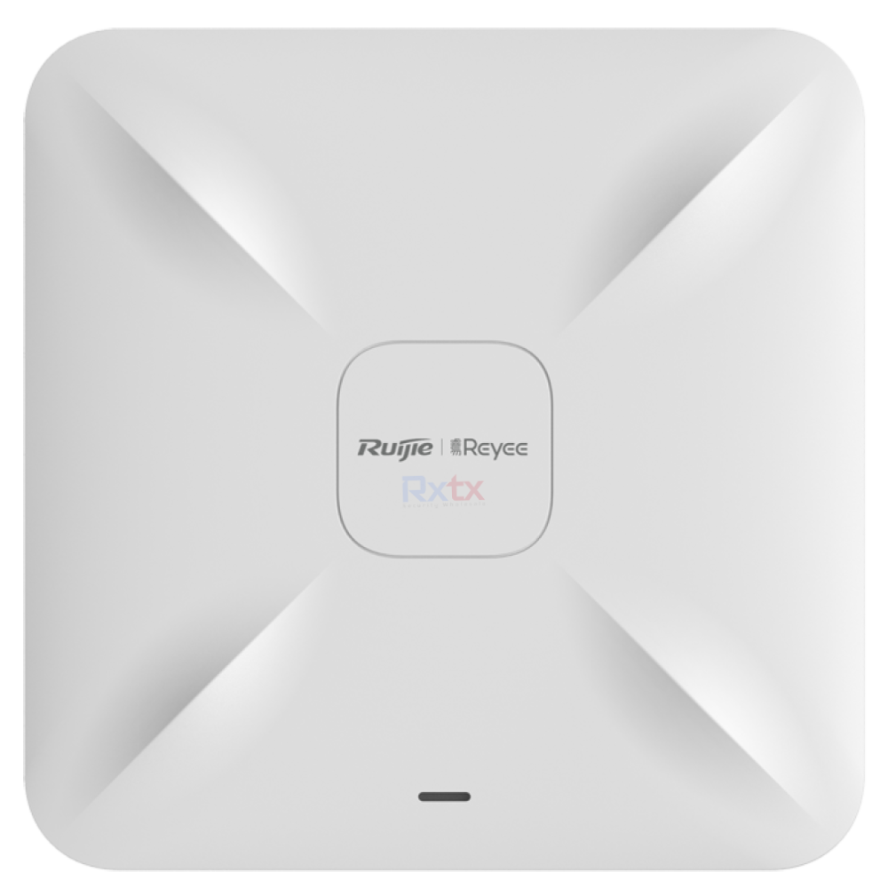
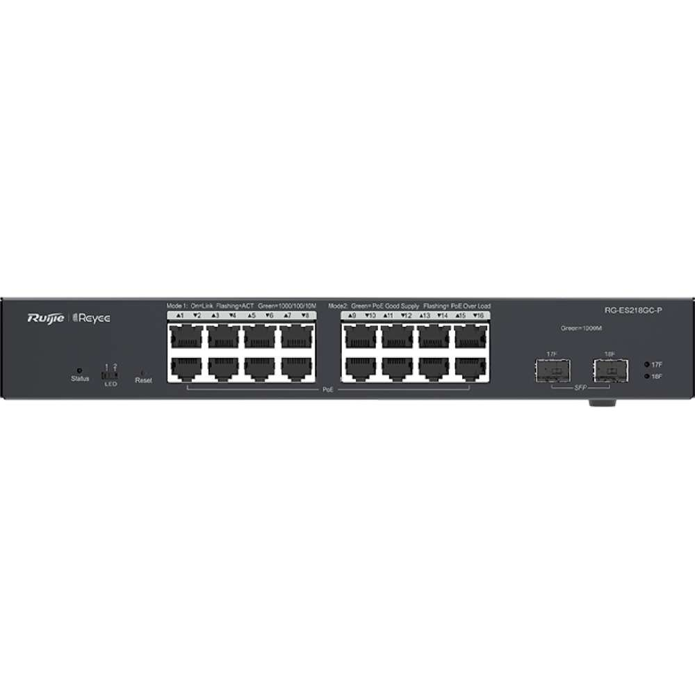

## Mục tiêu
- Hiểu kiến trúc triển khai WiFi phủ sóng toàn nhà: Router → Switch PoE → AP.
- Phân biệt vai trò của từng thành phần: AP, Switch PoE, Controller.
- Nắm được lý do chọn hệ Ruijie/Reyee thay vì WiFi mesh hoặc router thông thường.

---

## 1. Tại sao cần hệ WiFi chuyên dụng?

Router WiFi thông thường (combo modem/router của nhà mạng) chỉ phủ được 1-2 phòng. Khi nhà có 2-3 tầng hoặc diện tích trên 80m², tín hiệu yếu dần — thiết bị IoT rớt kết nối, camera WiFi mất hình, điện thoại chuyển tầng thì mất sóng vài giây.

Giải pháp: dùng Access Point (AP) chuyên dụng gắn trần/tường tại từng khu vực, kết nối về Switch PoE trung tâm qua cáp Cat6. Mỗi AP phủ sóng một vùng, khi di chuyển giữa các AP thì thiết bị tự chuyển (roaming) mà không mất kết nối.

So với WiFi Mesh (như Google Nest, TP-Link Deco):
- AP có dây hoạt động ổn định hơn vì không phụ thuộc đường truyền không dây giữa các node.
- PoE chỉ cần 1 sợi cáp Cat6 cho cả dữ liệu và nguồn, không cần ổ cắm điện gần AP.
- Quản lý tập trung qua Controller: cấu hình SSID, VLAN, firmware update từ một giao diện duy nhất.

---

## 2. Ruijie/Reyee là gì?

Ruijie Networks là hãng thiết bị mạng từ Trung Quốc (thành lập năm 2000), chuyên cung cấp giải pháp mạng cho doanh nghiệp, trường học và khách sạn. Dòng **Reyee** là dòng SMB (Small & Medium Business), giá hợp lý, phù hợp cho nhà ở và công trình vừa.

Tại công ty, Ruijie/Reyee được chọn làm giải pháp WiFi chính vì:
- **Giá tốt so với hiệu năng**: AP Reyee WiFi 6 giá chỉ bằng 50-70% so với UniFi hoặc Aruba cùng phân khúc.
- **Ruijie Cloud miễn phí**: quản lý không giới hạn thiết bị, không cần mua license.
- **Hỗ trợ WiFi 6 (802.11ax)**: tốc độ cao, phục vụ nhiều thiết bị đồng thời tốt hơn WiFi 5.
- **Roaming mượt**: hỗ trợ 802.11k/v/r — quan trọng cho VoIP và thiết bị IoT.

---


<p class="hero-image-caption">AP gắn trần Ruijie Reyee — thiết kế tròn gọn, dễ lắp đặt trên trần thạch cao.</p>

## 3. Kiến trúc hệ thống

```
[Internet/Modem] → [Router MikroTik] → [Switch PoE Ruijie]
                                             ├── [AP #1 - Tầng 1 Phòng khách]
                                             ├── [AP #2 - Tầng 2 Hành lang]
                                             ├── [AP #3 - Tầng 3 Phòng ngủ]
                                             └── [AP #4 - Sân vườn (Outdoor)]
                    [Ruijie Cloud] ← quản lý tập trung qua Internet
```

### Vai trò từng thành phần

| Thành phần | Vai trò | Ví dụ |
|---|---|---|
| **Router** | Cấp DHCP, NAT, firewall, chia VLAN | MikroTik hEX hoặc RB750Gr3 |
| **Switch PoE** | Trung chuyển dữ liệu + cấp nguồn PoE cho AP | RG-ES218GC-P (16 port, 240W) |
| **Access Point** | Phát sóng WiFi cho thiết bị kết nối | RG-RAP2260(G) (ceiling), RG-RAP6262(G) (outdoor) |
| **Ruijie Cloud** | Quản lý SSID, firmware, monitor client từ xa | cloud.ruijienetworks.com hoặc app Reyee |


<p class="hero-image-caption">Switch PoE Ruijie RG-ES218GC-P — 16 port PoE, 240W budget, quản lý qua Ruijie Cloud.</p>

### Vì sao Router và Switch PoE tách riêng?

Trong thiết kế của công ty, Router (MikroTik) xử lý routing/firewall/VLAN, còn Switch PoE Ruijie chỉ làm nhiệm vụ chuyển mạch và cấp nguồn. Cách chia này giúp:
- Mỗi thiết bị làm đúng chức năng — dễ debug khi có sự cố.
- Thay switch hoặc nâng cấp router không ảnh hưởng lẫn nhau.
- MikroTik mạnh về routing/firewall, Ruijie mạnh về WiFi — mỗi hãng làm sở trường của mình.

---

## 4. Nguyên tắc triển khai cơ bản

- **Ưu tiên có dây**: AP kết nối về switch qua Cat6, không dùng mesh/repeater nếu đã có sẵn hạ tầng cáp.
- **AP càng gần trung tâm vùng phủ sóng càng tốt**: gắn trần giữa phòng, không góc tường.
- **Tách SSID/VLAN**: WiFi nhà (VLAN 1) cho nội bộ + Guest (VLAN 123) cho khách. Chi tiết ở bài B6.04.
- **1 AP phủ khoảng 50-80m²**: tùy vật liệu tường (bê tông dày cần nhiều AP hơn).
- **Roaming**: cùng SSID trên tất cả AP, bật 802.11k/v để thiết bị tự chuyển AP khi di chuyển.

---

## 5. Phần mềm và ứng dụng

| Phần mềm | Nền tảng | Công dụng |
|---|---|---|
| **Ruijie Cloud** (Web) | Trình duyệt | Quản lý Project, cấu hình SSID/VLAN, monitor client, firmware update |
| **Reyee App** | iOS/Android | Cấu hình nhanh AP mới, quản lý từ xa trên điện thoại |
| **WiFi Analyzer** | Android | Kiểm tra RSSI, kênh WiFi tại hiện trường |
| **WiFi Explorer** | macOS/Windows | Site survey chuyên sâu, phân tích nhiễu kênh |

Ruijie Cloud hoàn toàn miễn phí — không giới hạn số project hay số thiết bị. Đây là lợi thế lớn so với UniFi Cloud (cần phần cứng CloudKey) hay Aruba Central (cần license).

---

## 6. Ưu và nhược điểm

| Ưu điểm | Nhược điểm |
|---|---|
| WiFi 6 AX, roaming 802.11k/v/r, giá hợp lý | Thương hiệu chưa phổ biến bằng UniFi, TP-Link |
| Ruijie Cloud miễn phí, không giới hạn | Giao diện Cloud tiếng Anh, chưa có tiếng Việt |
| AP thiết kế gọn, gắn trần đẹp | Firmware đôi khi cập nhật chậm so với hãng lớn |
| PoE giúp thi công gọn — 1 cáp Cat6 là đủ | Dòng Reyee chỉ hỗ trợ Layer 2, không làm routing |
| Hỗ trợ Reyee Mesh cho những nơi không kéo được cáp | Mesh vẫn kém ổn định hơn có dây — chỉ dùng khi bắt buộc |
