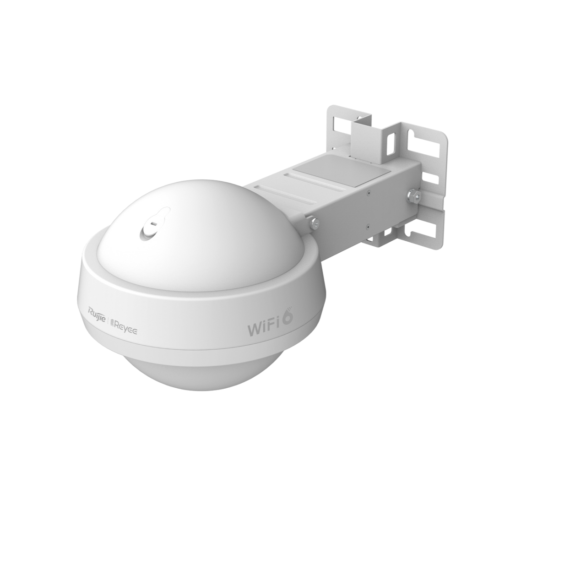

## Mục tiêu
- Biết các model AP đang dùng tại công ty và thông số chính của từng model.
- Chọn đúng loại AP (Ceiling / Wall / Outdoor) cho từng vị trí lắp đặt.
- Hiểu sự khác biệt giữa WiFi 5 và WiFi 6 để tư vấn khách hàng.

---

## 1. Bảng tổng hợp AP đang sử dụng

### AP gắn trần (Ceiling)

| Model | Chuẩn WiFi | Tốc độ tối đa | MIMO | Uplink | PoE | Khuyến nghị client | Vị trí lắp |
|---|---|---|---|---|---|---|---|
| **RG-RAP2200(F)** | WiFi 5 (802.11ac Wave 2) | 1.267 Gbps | 2×2 | 1×GbE | 802.3af | 50 | Phòng nhỏ, WC lớn, kho |
| **RG-RAP2260(G)** | WiFi 6 (802.11ax) | 1.775 Gbps | 2×2 | 1×GbE | 802.3af/at | 110 | Phòng khách, phòng ngủ, bếp — model chính cho nhà ở |
| **RG-RAP2260** | WiFi 6 (802.11ax) | 2.976 Gbps | 2×2 | 1×2.5GbE | 802.3at | 110 | Văn phòng, phòng họp — cần tốc độ cao, uplink 2.5G |
| **RG-RAP2260(E)** | WiFi 6 (802.11ax) | 3.200 Gbps | 4×4 | 1×2.5GbE | 802.3at | 110 | Sảnh, khu vực đông người — 4 stream cho throughput cao |

**Model mặc định cho dự án nhà ở: RG-RAP2260(G)**. Lý do: WiFi 6, giá tốt, 802.3af đủ dùng (không cần switch PoE+ đắt tiền), phủ sóng 15-20m bán kính.

### AP gắn tường (Wall-mount)

| Model | Chuẩn WiFi | Tốc độ tối đa | Port LAN | PoE | Vị trí lắp |
|---|---|---|---|---|---|
| **RG-RAP1200(F)** | WiFi 5 (802.11ac) | 1.267 Gbps | 4×GbE | 802.3af | Phòng khách sạn, phòng nhỏ cần cổng LAN |
| **RG-RAP1260** | WiFi 6 (802.11ax) | 2.976 Gbps | 4×GbE + 1 uplink | 802.3af/at | Phòng ngủ cần cổng LAN cho TV/PC, hộp 86mm |

Wall AP phù hợp khi khách hàng cần thêm cổng mạng có dây trong phòng (TV, máy tính bàn, console game). RG-RAP1260 lắp vừa hộp âm tường 86mm tiêu chuẩn, có 4 cổng LAN phía dưới — thay thế được ổ cắm mạng thông thường.

AP Outdoor RG-RAP6262 — thiết kế UFO, IP68, phủ sóng bán kính 100-300m ngoài trời.

### AP ngoài trời (Outdoor)

| Model | Chuẩn WiFi | Tốc độ tối đa | Phủ sóng | Chuẩn chống nước | PoE | Vị trí lắp |
|---|---|---|---|---|---|---|
| **RG-RAP6262(G)** | WiFi 6 (802.11ax) | 1.775 Gbps | 100m (2.4G), 300m (5G) | IP68 | 802.3at | Sân vườn, hồ bơi, bãi xe |
| **RG-RAP6262** | WiFi 6 (802.11ax) | 2.976 Gbps | 100m (2.4G), 300m (5G) | IP68, chống sét 4kV | 802.3at | Khu vực rộng, cần SFP fiber |

**Model mặc định cho outdoor: RG-RAP6262(G)**. IP68 chống nước hoàn toàn, anten omnidirectional phủ 360°, thiết kế "UFO" gắn cột hoặc tường. Dòng RAP6262 (không có G) thêm cổng SFP quang — chỉ cần khi khoảng cách trên 100m cần fiber.

---

## 2. Cách chọn AP cho từng vị trí

| Vị trí | Model khuyến nghị | Ghi chú |
|---|---|---|
| Phòng khách, bếp, hành lang | RG-RAP2260(G) | Gắn trần trung tâm phòng |
| Phòng ngủ cần cổng LAN | RG-RAP1260 | Gắn tường thay ổ cắm mạng |
| Phòng ngủ không cần LAN | RG-RAP2260(G) | Gắn trần |
| Sân vườn, ban công, hồ bơi | RG-RAP6262(G) | Gắn cột hoặc tường ngoài trời |
| Tầng hầm xe | RG-RAP2260(G) | Chú ý tường bê tông dày — có thể cần 2 AP |
| Văn phòng > 20 người | RG-RAP2260(E) | 4×4 MIMO, uplink 2.5G |
| Khu vực tạm, chưa kéo cáp | Reyee Mesh | Chỉ dùng tạm, khi có cáp thì chuyển sang có dây |

---

## 3. WiFi 5 hay WiFi 6?

| Tiêu chí | WiFi 5 (802.11ac) | WiFi 6 (802.11ax) |
|---|---|---|
| Tốc độ lý thuyết | ~1.3 Gbps | ~1.8-3.0 Gbps |
| OFDMA | Không | Có — phục vụ nhiều thiết bị cùng lúc hiệu quả hơn |
| MU-MIMO | Chỉ downlink | Cả uplink và downlink |
| TWT (Target Wake Time) | Không | Có — tiết kiệm pin cho thiết bị IoT |
| Giá AP | Rẻ hơn ~20-30% | Đắt hơn nhưng đáng đầu tư |

**Khuyến nghị**: Dự án mới luôn chọn WiFi 6. WiFi 5 chỉ dùng khi khách hàng giới hạn ngân sách hoặc bổ sung AP phụ cho khu vực phụ (kho, WC).

---

## 4. Thông số cần kiểm tra trước khi đặt hàng

- **Hậu tố model**: (G) là bản tiết kiệm (1×GbE uplink), (E) là bản cao cấp (2.5GbE uplink), (F) là bản nhỏ gọn.
- **PoE chuẩn**: 802.3af (15.4W) hay 802.3at (30W) — ảnh hưởng đến việc chọn Switch PoE.
- **Số client khuyến nghị**: RAP2200 chỉ 50 client, RAP2260 lên 110 client — quan trọng với khu vực đông người.
- **Firmware**: Kiểm tra firmware mới nhất trên Ruijie Cloud trước khi triển khai, tránh lỗi đã biết.

---

## 5. Switch PoE đi kèm

AP Ruijie cần Switch PoE để cấp nguồn. Các model Switch PoE Reyee phổ biến:

| Model | Số port PoE | PoE Budget | Uplink | Dùng cho |
|---|---|---|---|---|
| **RG-ES205GC-P** | 4 | 54W | 1×GbE | Nhà nhỏ 3-4 AP |
| **RG-ES209GC-P** | 8 | 120W | 1×GbE combo SFP | Nhà 2-3 tầng, 5-8 AP |
| **RG-ES210GS-P** | 8 | 120W | 2×SFP | Nhà + camera |
| **RG-ES218GC-P** | 16 | 240W | 2×SFP | Biệt thự lớn, tòa nhà nhỏ |
| **RG-ES226GC-P** | 24 | 370W | 2×SFP | Công trình > 15 AP |

**Cách tính PoE budget**: Cộng tổng công suất tiêu thụ của tất cả AP. Ví dụ: 6× RAP2260(G) ≈ 6×13W = 78W → chọn RG-ES209GC-P (budget 120W) là đủ, còn dư cho peak.

Tất cả Switch Reyee dòng ES200 đều hỗ trợ Cloud Management — thêm vào Ruijie Cloud cùng project với AP để quản lý tập trung.
