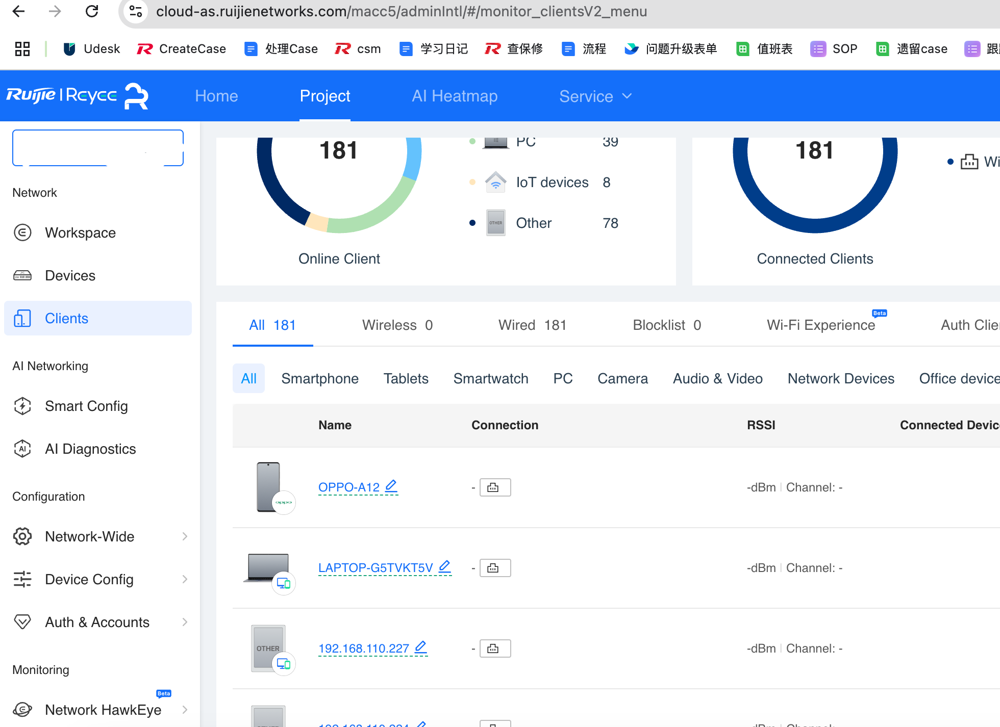
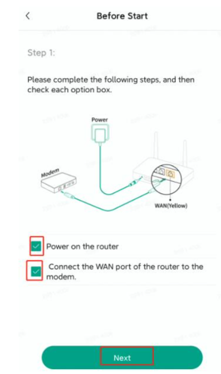

## Mục tiêu
- Đăng ký và sử dụng Ruijie Cloud để quản lý tập trung tất cả AP/Switch trong công trình.
- Thêm thiết bị, tạo SSID, đẩy cấu hình xuống AP.
- Bàn giao quyền quản lý cho khách hàng sau khi hoàn thành.

---

## 1. Ruijie Cloud là gì?

Ruijie Cloud là nền tảng quản lý thiết bị mạng qua Internet, tương tự UniFi Controller nhưng hoàn toàn cloud-based — không cần phần cứng controller riêng (không cần CloudKey hay Dream Machine).

Truy cập tại: **https://cloud.ruijienetworks.com** hoặc qua app **Reyee** (iOS/Android).

Tính năng chính:
- Quản lý nhiều Project (mỗi công trình = 1 Project).
- Cấu hình SSID, VLAN, mật khẩu WiFi tập trung.
- Monitor: số client đang kết nối, băng thông, tình trạng từng AP.
- Firmware update từ xa.
- Tính năng Wireless Optimization (WIO): tối ưu kênh, công suất phát tự động.

**Miễn phí hoàn toàn**, không giới hạn số thiết bị hay số Project.

---

## 2. Đăng ký tài khoản

### Tài khoản công ty (cho kỹ thuật viên)

1. Truy cập https://cloud.ruijienetworks.com → **Sign Up**.
2. Đăng ký bằng email công ty (dùng chung 1 tài khoản cho cả team kỹ thuật).
3. Xác nhận email → đăng nhập.
4. Tài khoản này sẽ là **Owner** của tất cả Project.

### Tài khoản khách hàng

Sau khi triển khai xong, tạo tài khoản riêng cho khách hàng và gán quyền **Member** hoặc **Viewer** vào Project của họ. Khách hàng dùng app Reyee trên điện thoại để xem trạng thái WiFi, không cần can thiệp cấu hình.

---


<p class="hero-image-caption">Giao diện Ruijie Cloud — quản lý AP, Switch và monitor client từ một dashboard duy nhất.</p>

## 3. Tạo Project mới

Mỗi công trình/khách hàng tạo 1 Project riêng để dễ quản lý.

1. Đăng nhập Ruijie Cloud → **Add Project**.
2. Điền thông tin:
   - **Project Name**: tên công trình (ví dụ: "Villa Ông Hùng Q7", "CH2101-Vinhomes-GP").
   - **Country**: Vietnam.
   - **Scenario**: chọn "Residence" cho nhà ở, "Office" cho văn phòng.
3. Nhấn **Create**.

Quy tắc đặt tên Project ở công ty:
```
[Loại công trình]-[Tên KH]-[Khu vực]
Ví dụ: Villa-OngHung-Q7
       CH2101-Vinhomes-GP
       VP-ABC-ThuDuc
```

---

## 4. Thêm thiết bị vào Project

### Cách 1: Thêm bằng Serial Number (khuyến nghị)

1. Trong Project → **Devices** → **Add Device**.
2. Nhập **Serial Number (S/N)** — in trên nhãn dán mặt sau thiết bị.
3. Đặt **Alias** cho thiết bị: `AP-T1-PK`, `AP-T2-HL`, `SW-POE-TU`.
4. Nhấn **OK**.

Mỗi AP/Switch chỉ thuộc 1 Project tại một thời điểm. Nếu thiết bị đã được add vào Project khác, cần remove trước khi add lại.

### Cách 2: Quét QR bằng app Reyee (nhanh khi ở hiện trường)

1. Mở app Reyee → chọn Project → **Add Device**.
2. Quét mã QR trên vỏ hộp hoặc nhãn thiết bị.
3. Thiết bị tự động thêm vào Project.

### Cách 3: Batch import (cho công trình lớn)

1. Tải template Excel từ Ruijie Cloud → **Download Template**.
2. Điền S/N và Alias vào file.
3. Import file → tất cả thiết bị được thêm cùng lúc.

---

## 5. Cấu hình SSID cơ bản

Sau khi thêm thiết bị, tạo SSID (tên WiFi):

1. Trong Project → **Configuration** → **Wi-Fi** → **Add SSID**.
2. Điền thông tin:
   - **SSID Name**: tên mạng WiFi (ví dụ: `VillaHung_Private`).
   - **Security**: WPA2-PSK hoặc WPA2/WPA3-PSK.
   - **Password**: tối thiểu 12 ký tự, kết hợp chữ + số.
   - **Band**: 2.4GHz + 5GHz (dual-band) hoặc chỉ 2.4GHz cho IoT.
   - **VLAN**: gán VLAN ID nếu đã chia VLAN trên Router (chi tiết bài B6.04).
3. Nhấn **Save** → cấu hình tự động đẩy xuống tất cả AP trong Project.

Thời gian đẩy cấu hình: khoảng 15-30 giây. AP sẽ restart WiFi radio — client mất kết nối tạm khoảng 5 giây.

---

## 6. Cấu hình bổ sung quan trọng

### Bật roaming (802.11k/v)

1. **Configuration** → **Networkwide Optimization** → **Client Association**.
2. Bật **Intelligent Optimization** → chọn **Signal First** (ưu tiên tín hiệu mạnh).
3. Đặt **RSSI Threshold**: -70 dBm (AP sẽ đẩy client sang AP gần hơn khi tín hiệu yếu hơn ngưỡng này).

### Cấu hình kênh WiFi

1. **Configuration** → **Radio** → **Channel**.
2. Khuyến nghị:
   - 2.4GHz: kênh 1, 6, hoặc 11 (3 kênh không chồng lấn). Mỗi AP chọn kênh khác nhau.
   - 5GHz: kênh 36, 40, 44, 48 (hoặc Auto nếu ít nhiễu).
   - Bandwidth: 2.4GHz = 20MHz, 5GHz = 40MHz hoặc 80MHz.
3. Hoặc bật **Auto Channel** — Ruijie Cloud tự chọn kênh tối ưu.

### Band Steering

- Bật **5G-Prior Access** để thiết bị hỗ trợ 5GHz tự kết nối 5GHz (nhanh hơn, ít nhiễu hơn).
- Tắt Band Steering cho SSID IoT (vì nhiều thiết bị IoT chỉ hỗ trợ 2.4GHz).

### Country Code

- Đặt **Country Code = Vietnam** hoặc **US** — ảnh hưởng đến danh sách kênh và công suất phát cho phép.
- Nếu chọn US: được dùng thêm kênh 5GHz và công suất cao hơn, nhưng có thể không đúng quy định.

---

## 7. Firmware Update

1. Ruijie Cloud → **Devices** → chọn thiết bị → **Firmware**.
2. Nếu có bản mới → **Upgrade** → đợi 3-5 phút.
3. AP tự restart sau khi update — client mất kết nối khoảng 1-2 phút.

**Lưu ý**: Chỉ update firmware khi hệ thống đang ổn định. Không update giữa giờ cao điểm sử dụng. Nếu bản mới mắc lỗi, không downgrade được trên Cloud — phải reset factory và nạp lại bản cũ qua web local.

---


<p class="hero-image-caption">App Reyee trên điện thoại — quét QR thêm thiết bị và quản lý WiFi từ xa.</p>

## 8. Bàn giao cho khách hàng

Sau khi cấu hình xong và test phủ sóng đạt yêu cầu:

1. Tạo tài khoản Ruijie Cloud cho khách hàng (bằng email của họ).
2. Trong Project → **Members** → **Invite** → nhập email khách hàng.
3. Gán quyền **Viewer** (chỉ xem) hoặc **Member** (xem + sửa cơ bản).
4. Ghi lại thông tin bàn giao:

```
THÔNG TIN WIFI - [TÊN CÔNG TRÌNH]
━━━━━━━━━━━━━━━━━━━━━━━━━━━━━━━━
WiFi nhà:      [TenNha]_Private / mật khẩu: ********
WiFi khách:    [TenNha]_Guest / mật khẩu: ********
WiFi IoT:      [TenNha]_IoT / mật khẩu: ********
Ruijie Cloud:  cloud.ruijienetworks.com
Tài khoản:     [email KH]
App Reyee:     iOS/Android
Số AP:         X cái (vị trí: ...)
━━━━━━━━━━━━━━━━━━━━━━━━━━━━━━━━
```

5. Hướng dẫn khách cài app Reyee → đăng nhập → kiểm tra trạng thái thiết bị.

---

## 9. Checklist cấu hình

- [ ] Account Ruijie Cloud đã tạo và đăng nhập được.
- [ ] Project đã tạo, đặt tên theo quy tắc.
- [ ] Tất cả AP/Switch đã add vào Project (kiểm tra trạng thái Online).
- [ ] SSID Private, Guest, IoT đã tạo với mật khẩu mạnh.
- [ ] VLAN đã gán đúng cho từng SSID (nếu áp dụng).
- [ ] Roaming (802.11k/v) đã bật, RSSI threshold = -70 dBm.
- [ ] Kênh WiFi đã cấu hình hoặc bật Auto.
- [ ] Band Steering đã bật cho Private/Guest, tắt cho IoT.
- [ ] Firmware AP đã update bản ổn định nhất.
- [ ] Tài khoản khách hàng đã tạo và gán quyền Viewer.
