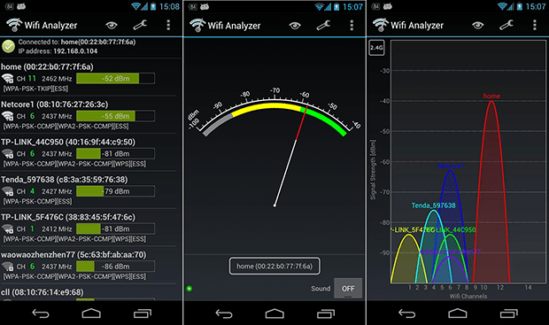

## Mục tiêu
- Đảm bảo RSSI ≥ -65 dBm tại mọi khu vực khách hàng sử dụng thường xuyên.
- Biết cách đo và ghi nhận kết quả phủ sóng một cách có hệ thống.
- Xử lý vùng chết (dead zone) trước khi bàn giao.

---

## 1. RSSI là gì?

RSSI (Received Signal Strength Indicator) là chỉ số đo cường độ tín hiệu WiFi mà thiết bị nhận được từ AP. Đơn vị: dBm (decibel-milliwatts).

**Lưu ý**: RSSI là số âm — số càng gần 0 thì tín hiệu càng mạnh.

| RSSI | Mức chất lượng | Trải nghiệm thực tế |
|---|---|---|
| -30 đến -50 dBm | Rất tốt | Ngay cạnh AP, tốc độ tối đa |
| -50 đến -60 dBm | Tốt | Dùng bình thường: video call, streaming 4K |
| -60 đến -65 dBm | Khá | Đủ dùng cho web, email, IoT |
| -65 đến -70 dBm | Yếu | Bắt đầu giảm tốc độ, video call có thể giật |
| -70 đến -80 dBm | Rất yếu | Kết nối không ổn định, IoT hay rớt |
| < -80 dBm | Không dùng được | Mất kết nối liên tục |

### Tiêu chuẩn tại công ty

- **Khu vực sinh hoạt chính** (phòng khách, phòng ngủ, bếp): ≥ **-60 dBm** (Tốt).
- **Khu vực phụ** (hành lang, cầu thang, ban công): ≥ **-65 dBm** (Khá).
- **Khu vực rìa** (WC, phòng kỹ thuật, kho): ≥ **-70 dBm** (chấp nhận được).
- **Vùng chết (Dead zone)**: < -75 dBm tại khu vực sinh hoạt → **Không chấp nhận**, phải bổ sung AP hoặc điều chỉnh vị trí.

---

## 2. Công cụ kiểm tra

### WiFi Analyzer (Android) — Khuyến nghị

- Tải miễn phí từ Google Play (app "WiFi Analyzer" của farproc).
- Hiển thị: RSSI, kênh, SSID, biểu đồ tín hiệu real-time.
- Cách dùng: kết nối vào SSID cần đo → xem RSSI khi di chuyển đến từng phòng.

WiFi Analyzer trên Android — hiển thị RSSI, kênh và biểu đồ tín hiệu real-time.

### WiFi Explorer (macOS/Windows) — Chuyên sâu

- Hiển thị chi tiết: noise floor, SNR (Signal-to-Noise Ratio), channel overlap.
- Phù hợp cho site survey bài bản, xuất báo cáo.

### Ruijie Cloud — Kiểm tra từ xa

- **Devices** → chọn AP → **Client List**: xem RSSI của từng client đang kết nối.
- Nếu client nào RSSI < -70 dBm thì client đó đang ở xa AP hoặc có vật cản.

### App trên điện thoại (cách nhanh)

- iOS: Vào **Settings** → **Wi-Fi** → nhấn vào mạng đang kết nối → không hiện RSSI trực tiếp, cần dùng app Airport Utility (bật WiFi Scanner trong Settings).
- Android: WiFi Analyzer hoặc NetSpot.

---

## 3. Quy trình kiểm tra phủ sóng

### Bước 1: Chuẩn bị

- Điện thoại Android đã cài WiFi Analyzer.
- Bản vẽ mặt bằng (in ra hoặc trên tablet) để đánh dấu kết quả.
- Kết nối vào SSID cần đo (thường đo Private vì dùng 5GHz).

### Bước 2: Đo tại các điểm kiểm tra

Di chuyển đến từng vị trí sau và ghi nhận RSSI:

| Vị trí kiểm tra | Lý do |
|---|---|
| Giữa mỗi phòng | Đo cường độ trung bình |
| Góc xa nhất của phòng | Đo worst-case |
| Cầu thang giữa các tầng | Kiểm tra overlap giữa AP các tầng |
| Cửa WC, cửa kho | Khu vực hay bị vùng chết |
| Sân vườn (nếu có AP outdoor) | Kiểm tra phạm vi outdoor |
| Vị trí đặt thiết bị IoT quan trọng | Robot hút bụi, khóa cửa, hub LifeSmart |

Tại mỗi điểm, đứng yên 5-10 giây rồi ghi nhận RSSI trung bình (tránh ghi peak tức thời).

### Bước 3: Ghi kết quả vào bảng nghiệm thu

---

## 4. Bảng nghiệm thu mẫu

| # | Vị trí | AP gần nhất | Band | RSSI (dBm) | Đạt? |
|---|---|---|---|---|:---:|
| 1 | Phòng khách T1 - giữa phòng | AP-T1-PK | 5GHz | -45 | ✅ |
| 2 | Phòng khách T1 - góc bếp | AP-T1-PK | 5GHz | -58 | ✅ |
| 3 | Phòng ngủ Master T2 | AP-T2-HL | 5GHz | -52 | ✅ |
| 4 | Phòng ngủ con T2 | AP-T2-HL | 5GHz | -63 | ✅ |
| 5 | WC Tầng 2 | AP-T2-HL | 2.4GHz | -68 | ⚠️ |
| 6 | Cầu thang T1-T2 | AP-T1/T2 | 5GHz | -60 | ✅ |
| 7 | Sân vườn - giữa | AP-OD-SV | 5GHz | -55 | ✅ |
| 8 | Sân vườn - góc xa | AP-OD-SV | 2.4GHz | -72 | ⚠️ |

Ghi chú: ⚠️ = cần cân nhắc cải thiện nếu khách hàng dùng WiFi thường xuyên tại vị trí đó.

---

## 5. Kiểm tra roaming

Roaming mượt là điểm khác biệt lớn nhất giữa hệ AP chuyên dụng và WiFi thường. Kiểm tra:

1. Kết nối điện thoại vào SSID Private (5GHz).
2. Mở một cuộc gọi video (Zalo, FaceTime) hoặc stream YouTube.
3. Di chuyển từ tầng 1 lên tầng 2, rồi lên tầng 3.
4. Quan sát:
   - Video/gọi có bị ngắt quãng không?
   - RSSI trên WiFi Analyzer có chuyển sang AP mới khi lên tầng?
   - Thời gian chuyển AP: < 1 giây là tốt, 2-3 giây là chấp nhận được, > 5 giây là cần điều chỉnh.

### Nếu roaming kém:

- Kiểm tra 802.11k/v đã bật trên Ruijie Cloud (bài B6.03).
- Kiểm tra RSSI threshold (nên đặt -70 dBm).
- Kiểm tra tất cả AP cùng SSID, cùng mật khẩu, cùng security mode.
- Giảm công suất phát (Tx Power) của AP nếu vùng phủ sóng quá rộng gây "giữ client" không chịu chuyển.

---

## 6. Xử lý vùng chết

Khi phát hiện vùng chết (RSSI < -75 dBm tại khu vực cần WiFi):

| Giải pháp | Khi nào dùng | Chi phí |
|---|---|---|
| **Dịch chuyển AP** gần hơn | Vùng chết gần AP nhưng bị vật cản | Không tốn |
| **Tăng công suất phát** (Tx Power) | Vùng chết ở rìa, không có vật cản dày | Không tốn |
| **Thêm AP mới** | Vùng chết do khoảng cách xa hoặc tường bê tông dày | Tốn thêm AP + cáp |
| **Reyee Mesh** | Không có cáp Cat6 đến vị trí mới | Tốn AP, kém ổn định hơn có dây |
| **Đổi kênh WiFi** | Nhiễu từ AP hàng xóm hoặc thiết bị khác | Không tốn |

**Ưu tiên**: dịch chuyển AP → tăng công suất → thêm AP có dây → Mesh (lựa chọn cuối cùng).

---

## 7. Lưu ý quan trọng

- **Đo ở 5GHz**: 5GHz cho tốc độ cao hơn nhưng suy hao qua tường mạnh hơn 2.4GHz. Nếu 5GHz đạt -65 dBm thì 2.4GHz sẽ tốt hơn.
- **Đo khi nhà đã có nội thất**: tủ gỗ, sofa, kệ sách ảnh hưởng đến tín hiệu. Nếu đo khi nhà trống thì kết quả sẽ lạc quan hơn thực tế.
- **Nhiễu hàng xóm**: chung cư đông AP xung quanh → RSSI tốt nhưng tốc độ vẫn chậm do nhiễu. Lúc này cần kiểm tra thêm SNR (Signal-to-Noise Ratio).
- **Lưu bảng nghiệm thu**: chụp ảnh hoặc scan bảng nghiệm thu kèm chữ ký khách hàng — làm hồ sơ bàn giao.
